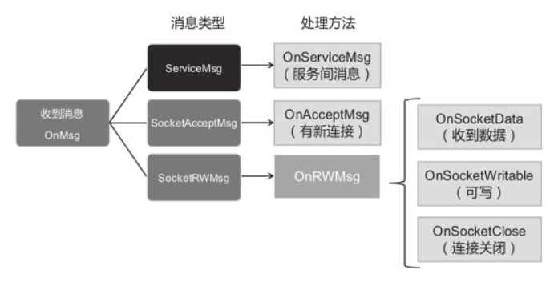
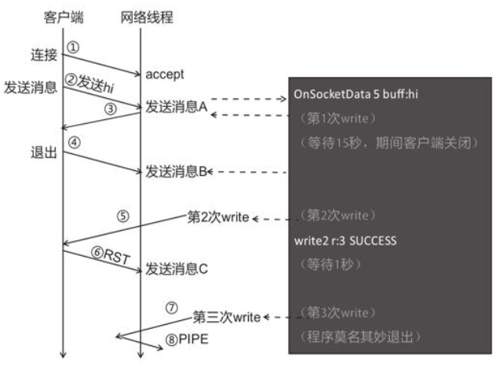
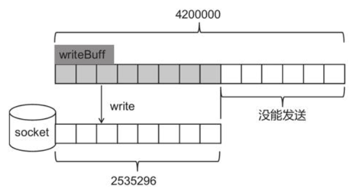

# 🚗 TCP 网络模块

## TCP 网络模块

深究服务端底层，会发现是压榨计算资源的艺术。skynet 是由 c 语言编写，提供一套 actor 模型。

### 网络线程

还是从网络基本的套接字编程说起，自定义 connect、封装自己的 socket 之类的。

### 搞懂 Epoll

这部分也跳过，ECSActor 与系统编程部分有很多 Epoll 的知识，已经够用了。epoll 的基本函数、特别是水平触发与边沿触发，以及系统的综合应用能力要在实际应用中锻炼自己。

### 打开监听端口

基本 api，socket、bind、listen 等等

### 如何安全读写数据

操作系统提供的功能偏底层，操作套接字的 read、write、close 等方法时，若非小心使用，则很容易出错。

### 消息分支

需要服务间通信、客户端通信处理分开处理



对于 write、read 的返回值一定要了解，还有它们返回错误时的 errno 处理

### 处理莫名其妙的退出问题

Linux 系统的机制中包含一个坑，在 TCP 的设计中，发送端向套接字信息不匹配的接收端发送数据时，接收端会回应复位信号(RST)，例如向已经销毁套接字的接收端
发送数据时，发送端会收到复位信号。

在 Linux 系统中，对“收到复位 RST 信号的套接字”调用 write 时，操作系统会向进程发送 SIGPIPE 信号，默认处理动作是终止进程。



调试环境中，PIPE 信号问题不容易暴露出来，但游戏一旦上线，PIPE 信号问题就会成为服务端随时可能挂掉的隐患。

### PIPE 信号处理

所以需要用 signal 函数忽略 SIGPIPE

```cpp
signal(SIGPIPE, SIG_IGN);
```

### 写缓冲区满

套接字写缓冲区容量有限，以至于常常没能完整发送数据。



有两种解决办法

1. 设置 SNDBUFFORCE

最简单直接的方法就是将套接字的缓冲区设置得大一些。在接收（accept）客户端套接字后，使用 Linux 提供的 setsockopt 方法，将套接字 clientFd 的写缓冲区（SO_SNDBUFFORCE）设置成一个很大的值

```cpp
void onAccept(shared_pre<Conn> conn)
{
    //...
    fcntl(clientFd, F_SETFL, O_NONBLOCK);
    //写缓冲区大写
    unsigned long buffSize = 4294967295;
    if(setsockopt(clientFd, SOL_SOCKET, SO_SNDBUFFORCE, &buffsize, sizeof(buffsize)) < 0){
        cout <<"OnAccept setsockopt Fail " << strerror(errno) << endl;
    }
    //...
}
```

使用 setsockopt 设置写缓冲区时，要求进程拥有 CAP_NET_ADMIN（允许执行网络管理任务）权能。默认情况下，
普通 Linux 用户没有，可以使用`cat/proc/[进程PID]/status`查看进程权能，还能用 setcap 指令改进进程的权能。

2. 自写缓冲区

另一种解决方法是自行实现应用层的写缓冲区。在 Sunnet 的设计中，将写缓冲区作为选配模块，不仅有利于简化核心代码，还能为用户提供更大的灵活性。当套接字可写时，会尝试从自写缓冲区读内容写到 socket，当向自写缓冲区写内容后，会触发尝试向 socket 写内容。当 socket 有数据可读时，当将内容读出写道自写 buff 的接收缓冲区。网络游戏可能会用到 TCP、UDP、WebSocket 这几种协议，其中“可靠传输协议”TCP 最为常见，一旦掌握了 TCP 的处理方法，很快就能触类旁通，因此本书以 TCP 为例来讲解网络编程。

这部分不啰嗦了，ECSActor 的内容已经够详细了。
