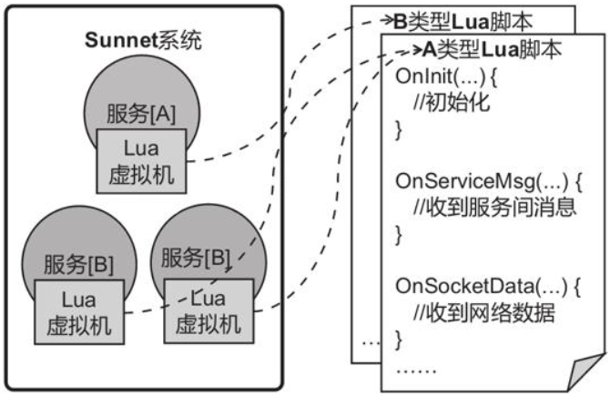
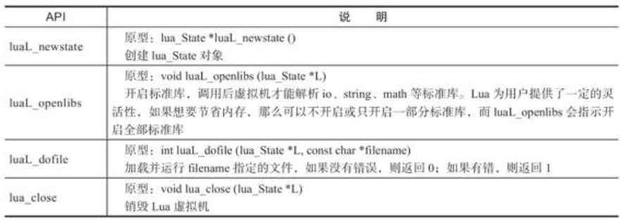
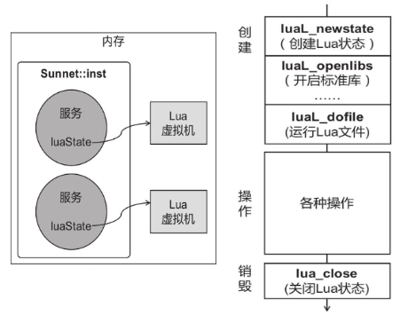

# 🚗 嵌入 Lua 脚本语言

## 嵌入 Lua 脚本语言

Lua 是一种轻量小巧的脚本语言，免费开源，简单易学。C/C++这类“低级语言”胜在能够直接与操作系统打交道，从而能够最大限度地利用系统资源，但写逻辑不太方便。“C++/Lua”是游戏业界比较常用的一种开发解决方案，用 C++做服务端底层，再嵌入 Lua 编写业务逻辑，这种组合能够较好地平衡性能与开发效率。

### 方案设计

C++负责底层调度，Lua 负责业务逻辑 就像 skynet 一样

### 隔离服务

系统可以调度数千个服务，各个 Lua 虚拟机相互独立，符合服务的特性，因此每个服务开启一个 Lua 虚拟机，
各个服务的 Lua 代码相互隔离



服务可以分为很多类型，同一类型的服务对应同一份 Lua 脚本。每份脚本都提供了 OnInit、
OnServiceMsg 等回调方法，在创建服务时，C++底层会调用对应脚本的 OnInit 方法，当收到消息时，C++
底层会调用 OnServiceMsg 方法。

### 嵌入 Lua 虚拟机

嵌入 Lua 脚本，首先要引入 Lua 源码，再调用一些 API，设置编译参数。

### 下载、编译源码

不再详解，可以搜教程，或者 看下我的项目用 CMake 生成 Makefile 构建为静态库的，值得注意的是 lua 静态库依赖 dl 库

```cpp
https://github.com/crust-hub/tubekit/tree/main
target_link_libraries(exe liblua.a dl)
```

### lua_State

lua_State 是 Lua 提供给宿主语言（C/C++）的一种最重要的数据结构，顾名思义，lua_State 代表 Lua 的运行状态。可以创建多个 lua_State 对象，它们之间相互独立，就像创建了多个独立的虚拟机一样。Lua 提供的各种 API，大多都是围绕着 lua_State 进行操作的，比如，运行某个 Lua 文件，就是让 lua_State 去加载代码，然后执行的过程；调用某个 Lua 方法，就是操作 lua_State 的过程。

每个服务对应于一个 Lua 虚拟机

由于 Lua 是由 C 语言编写的，因此 Service.h 在包含 Lua 源码中的头文件时，需要把包含（include）语句放在“extern "C"”块中，lua.h、lauxlib.h 和 lualib.h 这三个头文件中包含了操作 lua_State 的常用方法。

```cpp
// include/Service.h
extern "C" {
  #include "lua.h"
  #include "lauxlib.h"
  #include "lualib.h"
}

class Service {
  //...
private:
  // Lua虚拟机
  lua_State* luaState;
};
```

仅创建了 lua_State 的结构指针，并未真正创建对象，可用 luaL_newstate 创建 lua_State 对象



### 从创建到销毁

虚拟机的生命流程贯穿了服务的整个生命周期，即在服务的初始化回调 OnInit 中创建和初始化虚拟机，在退出回调 OnExit 中销毁虚拟机。

```cpp
// scr/Service.cpp
// 创建服务后触发
void Service::OnInit()
{
  // 新建lua虚拟机
  luaState = luaL_newstate();
  luaL_openlibs(luaState);
  // 执行Lua文件
  string filename = "../service/" + *type + "/init.lua"
  int isok = luaL_dofile(luaState, filename.data());
  // 成功返回0，失败返回1
  if(isok == 1)
  {
    cout<<"err "<<lua_tostring(luaState, -1)<< endl;
  }
}

// 退出服务时触发
void Service::OnExit()
{
  // 关闭Lua虚拟机
  lua_close(luaState);
}
```



### C++调用 Lua 方法

### Lua 调用 C++函数

### Lua 版的 PingPong

### Lua 版聊天室
