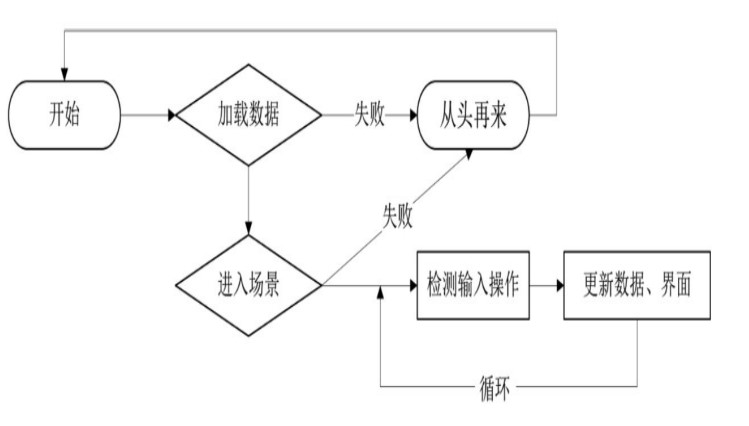
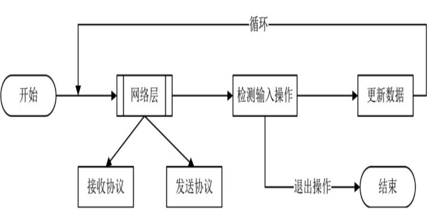
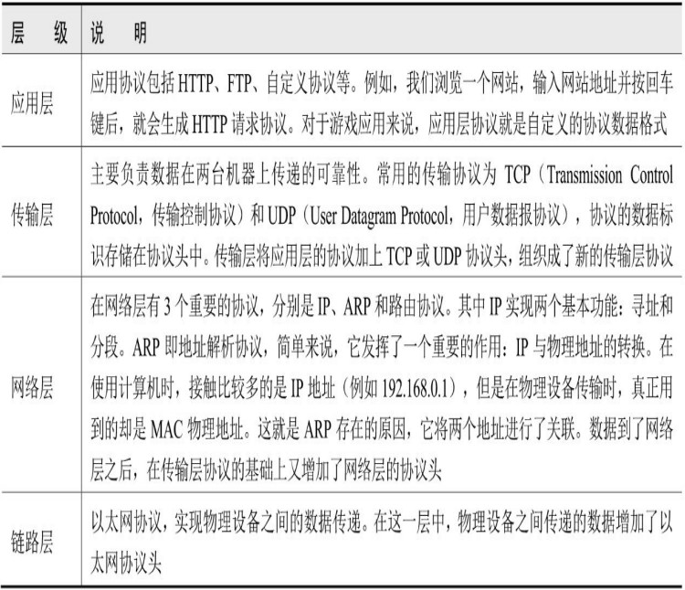
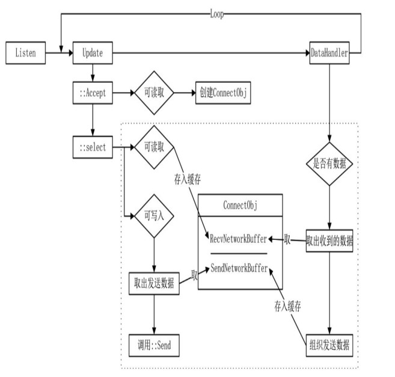
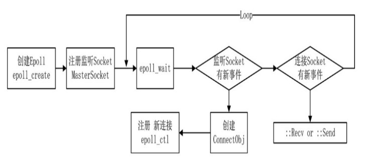

# 🚗 网络编程

相关的代码可以看, https://github.com/gaowanlu/GameBookServer/blob/master,仓库为Fork过来的,也可以看书籍原作者的仓库.
其中 00_XX~02_XX 部分.

## 网络编程

如果你不会基本的计算机网路、基本的网络编程，请先回去好好学 APUE、基本的套接字编程、最好学会 IO 多路复用的时候再来看这些内容。

### 单机游戏与网络游戏的区别

单机游戏逻辑：基本不涉及异步过程

网络游戏逻辑：就得和网络打交道

异步、并行、同步的通俗易懂描述,例如我们要加载 A、B、C 三个资源

- 同步:先加载 A，等待 A 加载完成。加载 B，等待 B 加载完成。加载 C，等待 C 加载完成。
- 并行：A、B、C 同时加载，等待 A、B、C 三者都加载完成。
- 异步：加载 A、B、C，当每一个资源加载完成后都会进行回调，也许是 B 先回调、或者 A 或者 C。你无法知道谁先到来。

### IP 地址

IPV4、IPV6,端口号，公网，局域网，这些肯定要知道。

### TCP/IP

这些都不会，那你的大学估计要白上了。

应用层、传输层、网络层、链路层。计算机网络的基本知识肯定需要懂。

### 高级内容

如网络编程的阻塞模式、非阻塞模式、基本的函数应用 accept、send、recv、connect、bind，不会的话就去读一读《APUE》那本砖头书。

### 网络 IO 多路复用

基本内容不会可走不远，select、poll、epoll 这些肯定要回。

Select 模式下服务端的流程图：

Epoll 模式下服务端的流程图：

libevent 是用 C 写的开源事件通知库，性能优良，可以编译为静态链接库使用，而且在 libevent 中 events 数组实现了自增长，有参考价值。

### 协议

一般都会有协议头，包含 协议号、子协议号、版本号、协议包大小。
先接收协议头，根据提供的“协议号”、“版本号”判断请求是否合法，根据“协议包大小”再读一定字节，得到协议内容包根据协议号版本号进行解析处理。

向字节对齐、网络字节序、主机字节序、错误码，这些肯定要会。

1、拆包：一般单个协议包是有限的，因为 connect obj 的缓冲区有大小限制，缓冲区的空间有限也就根本不能写入超过缓冲区大小的协议包，这就要分成多个包，在协议头加两个字节大小数据

| 总包序号 | 当前包序号 | 含义           |
| -------- | ---------- | -------------- |
| 0        | 0          | 只有一个包     |
| 2        | 1          | 后面还有一个包 |

2、缓冲区自增长：使用缓冲区自增长，避免写入 connec obj 缓冲区因空间不足问题。

### 文件描述符数量限制

一般操作系统本身对进程能打开的文件描述符数量有限制，这一限制是能够修改的。可以阅读 系统编程 部分。数量限制过低，将会影响同时连接服务器的客户端数量。
