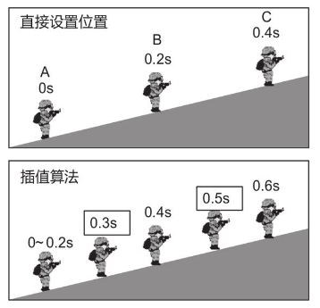

# 同步算法

## 同步算法

同步是网络游戏的核心课题，如《绝地求生》，每局战斗会有 100 名玩家参数，每个角色的位置、动作和属性都要同步给战场中的其他玩家，射击类游戏对同步的要求很高，稍有网络延迟，玩家就很难以瞄准目标，或者莫名其妙被打死，然而网络通信不可避免会存在延迟和抖动的问题，如果没能处理好，就会极大影响玩家的游戏体验。

不同类型的游戏对同步算法有着不同的权衡策略。射击游戏对精确度（如判定是否爆头）的要求很高，每局的玩家数量很多（如《绝地求生》每局有 100 名玩家参战），但好在同屏角色数量较少。而即时战略游戏（也称策略游戏）同屏的单位数量虽然很多（如英雄联盟），但好在每局游戏的玩家数不多。

### 同步难题

为什么同步是网络游戏的一大难题，《球球大作战》都用到了“指令-＞状态”的同步方法。假设射击游戏也使用同样的方法，当玩家 A 按下方向键移动角色时会发生什么？客户端 A 会先向服务端发送操作指令（往哪个方向移动），然后服务端会计算角色 A 的新位置，再广播给所有玩家。服务端每隔一段时间如 0.2 秒调用一次 move_update,计算角色的新坐标，然后广播移动协议。

这样的同步方法是可能产生问题的。

- 顿挫

服务端每隔 0.2 秒计算一次位置，并将新坐标广播给客户端。客户端收到移动协议后，如果简单粗暴地直接设置角色坐标，玩家会有明显的顿挫感。
举例来说，一开始角色处于位置 A，过了 0.2 秒突然变到位置 B，又突然变到位置 C，移动过程很不顺畅。

如果将同步频率提高到 24 帧/秒（即每 0.04 秒调用一次 move_update），利用人眼的残影现象，理论上会让顿挫感消除，直觉上就像播放电影画面一样。然而，提高同步频率不仅会给服务端带来性能压力，而且无法达到预期效果。

- 打不中

网络质量的差异，会使得同一时刻各玩家看到的画面不同。角色 A 向左移动，角色 B 向右移动。由于客户端 A 的网络延迟较低，因此它能较早收到最新的移动协议，在玩家 A 的眼中，角色 A 刚好瞄准角色 B，于是开枪射击；但在玩家 B 的眼中，自己并未被瞄准。无论如何判定，总有玩家会感到不满意，如果判定为 打中，玩家 B 会感觉很奇怪，觉得自己莫名奇妙中了一枪；如果判定没打中，玩家 A 会很生气。

- 抖动和延迟

“顿挫”“打不中”这些问题都可以归结于网络的延迟和抖动，就算服务端的性能再好，设置很高的同步频率，也无法解决该问题。

A 端依次向 B 端发送数据。若使用 UDP，则有些数据会无法传达（图中用 X 标记的数据），有些数据会顺序错乱（图中用 ⊙ 标记的数据）；
TCP 解决了不可靠和无序的问题，但与 UDP 一样的是，TCP 也不可避免地存在延迟，而且无论发送频率多平稳，接收频率也会很不稳定，
比如，A 端按固定间隔发送数据，但 B 端相邻的箭头有些相隔很近、有些则很远，我们把这种不稳定的现象称为抖动。

| 特性                 | UDP | TCP |
| -------------------- | --- | --- |
| 不可靠(数据可能丢失) | 是  | 否  |
| 无序                 | 是  | 否  |
| 延迟                 | 是  | 是  |
| 抖动                 | 是  | 是  |

不同类型的游戏对延迟的要求也有所不同。根据经验，对于大型多人在线角色扮演游戏（Massively Multiplayer Online Role-Playing Game，MMORPG），玩家能容忍 0.1 秒左右的延迟；对于多人在线战术竞技（Multiplayer Online Battle Arena，MOBA）类游戏，玩家对延迟的容忍度通常很低。

由于网络抖动，每个协议包对于服务器可能是每帧都在发，但是客户端可不是每帧都会按时接收到。

### 客户端障眼法

就像魔术，虽然是假的，却能给观众带来快乐一样，尽管网络延迟不可避免，但是在客户端实施点障眼法，玩家就能收获良好的游戏体验。

### 插值算法

客户端收到移动协议后，不会直接设置角色坐标，而是让角色慢慢往目标点移动。服务端在 0 秒、0.2 秒、0.4 秒时分别发送了 3 条移动协议，告诉角色 A、B、C 三个点。当客户端收到 B 点协议时，不直接设置位置，而是让角色慢慢走向 B 点；收到 C 点协议时，再慢慢走向 C 点。使用插值算法，就算是以 0.2 秒一次的低频率同步，玩家也能有较好的游戏体验。

作为障眼法的代价，插值算法比“直接设置位置”存在更大的误差，客户端第 0.4 秒才走到 B 点，0.6 秒才走到 C 点，增加了 0.2 秒的延迟，无论如何，比起来直接设置位置，0.2 秒的延迟是值得付出的。

当 0.2s 时刻接收到需要走到 B 点，走到 B 点需要 0.2s，所以走到 B 的时刻是 0.4s，0.4s 时理应又收到需要走到 C 点，走到 C 点有需要 0.2s，走到 C 点时刻已经 0.6s 了。

### 缓存队列

单纯的插值算法还不能解决顿挫问题，例如 0.4s 发的移动到 C 的消息可能 0.4s 时刻根本不会到达，可能要延迟很久，这么一来移动就不连续。

假设插值算法增加了 0.2 秒的延迟，即收到移动协议后，让角色花 0.2 秒的时间从当前位置移动到新位置。那么角色从 A 点走到 B 点（很短的距离）花费的时间为 0.2 秒，从 B 点走到 C 点（较长的距离）花费的时间也是 0.2 秒，移动速度发生突变，故而会影响玩家体验。

客户端可以通过缓存队列来缓解速度跳变的问题，收到移动协议后，不立即进行处理，而是把协议数据存在队列中，再用固定的频率（比如，每隔 0.2 秒）取出，结合插值算法移动角色。“缓存队列”相当于是在客户端加一层缓存来缓解网络抖动的问题，这样做能够有效提高玩家的游戏体验。

客户端还可以动态调整取出的速度，当队列里积累了较多数据时，可以稍微加快，当队列中的数据很少时，可以稍微减缓，从而可以更好地抵抗网络抖动。但比起单纯使用插值算法，缓存队列付出的代价是误差更大。

结合插值算法和缓存队列，单靠客户端的优化就能够解决大部分同步问题。对于误差敏感的游戏类型如射击类，还可以通过主动方优先的策略提高玩家的游戏体验。也正是如此我们可以看到很多射击类多人对战都有外挂，而向英雄联盟之类的策略性游戏就很少。

### 主动方优先

插值算法、缓存队列会加大不同玩家所见画面的差异，客户端画面差异越大，“打不中”“莫名奇妙被打死”的问题越有可能发生。对于这种问题，一般会采取三种应对策略。

- 第 1 种：不管客户端的误差，一切以服务端的计算为准。例如第 3 章的《球球大作战》，不论玩家看到怎样的画面，小球吃到哪个食物、碰到哪个敌人都由服务端裁决。这是一种最权威也是最难实现的方案，因为该方案要求服务端具备完全的运算能力。

- 第 2 种：信任主动方。客户端 A 发送“我击中了 B”的协议，只要不是偏差太大（例如，角色 A 和 B 隔得太远），服务端就认定 A 真的击中了 B。这种方式会提高玩家 A 的游戏体验，但玩家 B 可能会感到“莫名其妙被打死”。

- 第 3 种：信任被动方。客户端 B 发送“我被 A 击中”的协议。这种方式会提高玩家 B 的游戏体验，但玩家 A 可能会感到“明明瞄准了却打不中”。

有时因为项目期限和开发难度的限制，很多游戏的服务端并不具备完全的运算能力。《球球大作战》的位置、碰撞能由服务端进行运算，是因为游戏很简单，计算量不大，但如果游戏很复杂，那么开发难度就会很大。有些项目会让客户端发送位置坐标，服务端只做转发，这样能减少很多工作量。如果服务端不具备运算能力，那么我们通常会选择第 2 种方案。这是因为“主动方”玩家更具活力，更有价值，要优先照顾他们的感受。“被动方”说不定正处于挂机状态，可能并不在游戏屏幕前。

虽然误差不可避免，但可以通过“主动方优先”的策略来进行应对，提高重要玩家的游戏体验。但搞不好就会开挂的非常多，向 GTAOnline 简直都是挂 B。

### 各类同步方案

状态同步、帧同步，它们都属于同步方案。

### 三种同步方案

根据服务端的输入输出内容，同步方案可以分为三大类，即

- 指令->指令
- 指令->状态
- 状态->状态

游戏中可能会采用其中的一种或几种方案的组合，服务端既可能接收指令或状态的输入，也可能输出指令或状态。
如《球球大作战》中服务端的输入是客户端发来的摇杆方向，输出的是球的位置坐标，这种情况属于`指令->状态`同步。
比如一些射击游戏，客户端直接发送角色的位置坐标，服务端只进行转发，这种情况属于`状态->状态`同步。

| 方案       | 客户端运算能力                                             | 服务端运算能力                             |
| ---------- | ---------------------------------------------------------- | ------------------------------------------ |
| 状态->状态 | 客户端运算，服务端转发有点，即时表现玩家体验好，但容易作弊 | 校验能力                                   |
| 指令->状态 | 先行表现                                                   | 服务端运算，有效杜绝作弊，服务端负载压力大 |
| 指令->指令 | 帧同步，可以同步大量角色，容易错乱                         | 校验能力                                   |

如《球球大作战》的`指令->状态`为例，由于所有的逻辑运算都在服务端，因此可以有效杜绝玩家作弊。
但是，如果玩家按下前进按键后，要等 0.2 秒才能看到效果(假设服务端的运算频率是每秒 5 次)，
那么玩家将会感到游戏体验不佳。`先行表现`也是一种常见的优化方法，在玩家按下前进的同时，
客户端就会让球向前移动，若稍后服务端发来的新位置与`先行移动`到的位置接近，就不管它，
如果相差太远，就在做调整。

### 适用场景

不同的同步方案适用于不同的游戏。

| 游戏类型                 | 最适用的方案                     | 原因                                                                                                                                                           |
| ------------------------ | -------------------------------- | -------------------------------------------------------------------------------------------------------------------------------------------------------------- |
| 射击(FPS)                | 状态->状态                       | 对实时性要求高，玩家打出一枪后期待马上看到效果，用客户端运算的方案，能给玩家即时反馈，由于同一个场景的玩家可能很多，因此不适合用帧同步的方案                   |
| 即时战略(RTS)            | 指令->指令(帧同步)               | 需要同步大量单位，如果使用状态台同步，则意味着需要同步大量数据，而指令->指令 只需要同步小部分的操作指令                                                        |
| 竞技(MOBA)               | 指令->指令(帧同步)               | 对公平性要求较高，即对误差的要求较高，从原理看，帧同步可以保证多个客户端的误差很小                                                                             |
| 角色扮演(MMORPG)         | 指令->状态                       | 同一个场景中的角色较多，不适合帧同步。如果需要较好地防止作弊，需要开发时间充裕，则最好使用指令->状态的方案                                                     |
| 开房间休闲类(球球大作战) | 指令->指令 或 指令->指令(帧同步) | 若对实时性要求较低，但对防作弊的要求较高，则适用 指令->状态 的同步方案。若需要同步大量单位，如球球大作战的基础上加个食物随机飘动的需求，则适合使用帧同步的方案 |

### 天涯明月刀

《天涯明月刀》是一款动作角色扮演类游戏，场景部分采用“状态-＞状态”的同步方案，辅之以服务端强校验

不采用完全的“指令-＞状态”方案，是因为《天涯明月刀》的场景结构、技能触发规则都很复杂，如果完全由服务端运算，则负载太高，所以服务端通过采用低精度的地图数据和较低的运算频率来降低负载。虽然服务端的运算结果不是很精确，但它足以应对作弊行为。“服务端同步运算”也意味着较高的开发成本，为了在服务端处理 3D 大地图，开发团队花费了很多精力。

### 王者荣耀

竞技游戏《王者荣耀》采用了“指令-＞指令”（帧同步）同步方案，一方面是为了保证游戏的公平性，需要选用误差较小的方案；另一方面是需要同步的单位较多，算上小兵，一屏可能会有数十个单位。

《王者荣耀》选用帧同步也是经过了诸多因素的权衡，无论是“指令-＞状态”，还是《天涯明月刀》那样的服务端强校验，都会有较多的服务端开发工作。而《王者荣耀》开发初期工期很紧，选用“指令-＞指令”的同步方案，可以有效减少服务端的工作量，客户端除了底层的“帧同步”模块之外，其他业务逻辑就像做单机游戏一样，较为简便。另外，“帧同步”也较容易实现战场回放的功能，只用把一场战斗的所有指令存储起来，逐一播放即可。

帧同步对网络质量的要求很高，为降低延迟，《王者荣耀》所采用的协议是自研的可靠 UDP，关于可靠 UDP。

### 绝地求生

包括《绝地求生大逃杀》，在内的射击游戏大多采用“状态-＞状态”同步的方案。射击游戏对即时反馈的要求很高，如果采用“指令-＞状态”的方式，那么数据经由服务端运算再传回，就会导致较高的延迟，从而影响玩家的游戏体验。此外，射击游戏对物理碰撞精度的要求较高，需要精准判断子弹是否打到敌人、子弹是否被掩体挡住等问题，出于性能考虑，服务端会采用较低精度的地图，因此这类游戏需要依赖客户端的运算能力。

帧同步方案不适用于这类游戏，因为地图很大，客户端难以完整计算整张地图的逻辑。使用“状态-＞状态”同步，客户端只需要关注玩家周围的事务即可，计算量较小。

依赖客户端运算的游戏一般很难防止外挂作弊，飞天外挂，人物可以很不自然地在天上飞。

### 帧同步

### 帧同步究竟是什么

### 代码范例

### 确定性计算

### 乐观帧同步

### AOI 算法

### 感兴趣区域

### 实体模型

### 九宫格法

### 可靠 UDP

### 三角制约

### 几种现成方案
