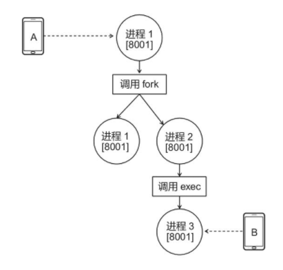
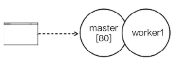
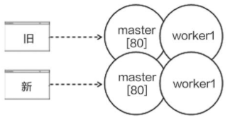
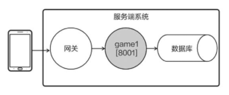
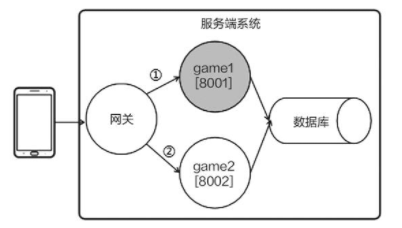
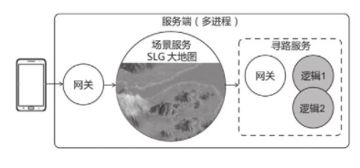
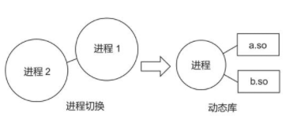
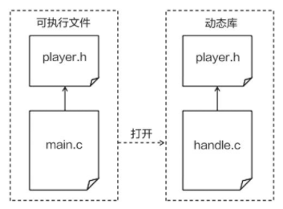
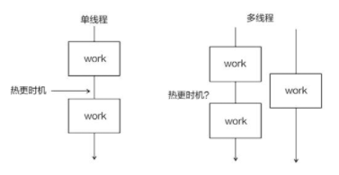

# 热更新

## 热更新

运营期的游戏必须保证能够提供稳定的服务，然而手游的开发节奏很快，难免要修复 Bug，或者线上调整数值。如果每次修改都要重启服务端，把全部玩家踢下线，那么这无疑会加速用户流失，影响营收。

怎样才能实现热更新，有人说

“热更新是结构设计问题，需要做好架构解耦”
“谁说只有脚本语言能热更新的？C 语言写的 Nginx 就能做到”
“做成微服务就行了”

可是，到底怎么做才是解耦，怎样做才能微服务化，它们又有哪些限制。

Skynet 的业务由 Lua 语言编写，可以使用常规的 Lua 热更新方法，Skynet 的 Actor 架构还提供了利用
“独立虚拟机”作为“服务”级别的热更新的能力，以及“注入补丁”的热更新方法。

热更新技术往往与具体的游戏业务相关联，只有充分理解业务才能选取合适的热更新方案。

### 简化版游戏服务端

只有一个进程，包括网关服务与多个 Player 服务。也就是只有一个 Skynet 节点。

例如我们在线上发现了某些 Player 服务的业务错误需要修复，希望在不停服务的情况下进行修改更新。“热更新”与服务端的架构设计息息相关，Skynet 实现了 Actor 模型，还为每个 Lua 服务开启了独立的虚拟机，这种架构为 Skynet 提供了一些热更新的能力。

可以这样理解：开启新的服务时，虚拟机需要重新加载 Lua 代码，所以只要先修改 Lua 代码，再重启（或新建）服务，新开的服务就会基于新代码运行，实现热更新。

### 清除代码缓存

直接修改 Lua 代码并不能起作用，这是因为 Skynet 使用了修改版的 Lua 虚拟机，它会缓存代码，所以在修改 Lua 代码后，要先登录调试控制台。

Skynet 调试控制台的 clearcache 指令虽然称为清缓存，但是并不是真的清理操作而是额外加载一份代码，频繁执行 clearcache 会加大内存开销。

skynet 独立虚拟机热更新的方式适合在“一个客户端对应一个代理服务”的架构下热更新代理服务，以及在“开房间型”游戏中热更新战斗服务。

```lua
                        Skynet
            match battle1 battle2
            agent_mgr agent101 agent102 agent103

client------>gateway1 gateway2 login
```

虽然旧的比赛执行的依旧是旧代码，但新开的比赛就能运行新的版本。由于每个客户端的登录时长有限、每场战斗的持续时间也有限，程序最终会趋向于运行新版本。

### 注入补丁

Skynet 还提供了一种称为 inject 的热更新方案，写一份补丁文件，将其注入某个服务，就可以单独修复这个服务的 bug。例如针对某个玩家的 agent 服务，注入补丁。

### 编写补丁文件

虽然 skynet 提供了注入的热更新方案，却没有给予足够的支持，补丁文件的写法颇具技巧性。

```lua
--hagent.lua
--老代码
local skynet = require(...)
local coin = 0

function onMsg(data)
    //...
end

skynet.start(...)
```

补丁代码

```lua
--skynet/examples/hinject.lua
local oldfun = _P.lua._ENV.onMsg
_P.lua._ENV.onMsg = function(data)
    //引用原来的变量
    local _, skynet = debug.getupvalue(oldfun, 1)
    local _, coin = debug.getupvalue(oldfun, 2)
    skynet.error("agent recv "..data)
    --消息处理
    if data == "workd\r\n" then
        coin = coin + 2
        debug.setupvalue(oldfun, 2, coin)
        return coin.."\r\n"
    end
    return "err cmd\r\n"
end
```

> “\_P”是 Skynet 提供的变量，用于获取旧代码的内容，“\_P.lua.\_ENV.onMsg”即原先的 onMsg 方法，
> 重新为它赋值，即可换成新的方法。因为新、旧方法的运行环境不同，
> 新方法不能直接读取 skynet、coin 等外部变量，所以这里还要依靠一些小技巧，通过 Lua 的调试模块（debug）来获取外部值的。

写完补丁文件，在调式控制台输入 inject a examples/hinject.lua 即可完成热更新。其中，"a"为代理服务的 id，可从服务端的输出日志中获取。"example/hinject.lua"是补丁文件的路径。

### 适用场景

"注入"热更新方案适用于需要紧急修复 Bug 的情况，补丁写法比较诡异，容易出错，需要在开发环境中做严密测试。

Lua 调式模块的运行效率低，还会破坏语言封装的整体性，因此若不是非常危急的情况，则尽量不要使用。

Skynet 只提供了针对某个服务的注入功能，若要热更某类服务，还需自行实现。

### 冷更新

早期的语言并不支持热更新，只能从系统架构的角度出发，通过多个进程配和，来实现热更新。游戏服务端是 web 服务器的特例，互联网诞生至今，
web 开发者一直都在探索服务端的热更新技术，力争做到 7x24 小时不间断提供服务，要理解游戏服务端热更新，就要先理解 web 服务端的热更新。

Web 场景为例，浏览器访问服务端的进程 1，进程 1 返回“Welcome”

```lua
function OnRequest(fd, data){
    Send(fd, "Welcome");
    Close(fd);
}
```

现在需要更改网页内容，将“Welcome”改为“Hello”，该怎么做呢？

Web 的请求（HTTP）大多是无状态的，不要求服务器检索上下文。最简单的方法就是修改代码后重启进程,只要重启得够快基本上影响会很小。
实现重启进程热更新还要满足一个前提，即进程必须是无状态的。

```lua
int count = 100;
function OnRequest(fd, data){
    count = count + 1;
    send(fd, "Welcome" + count);
    close(fd);
}
```

可想而知重启后，count 将被清零，服务端无法回到原来的状态，实现重启进程热更新还要满足一个前提，即进程必须是无状态的。

### 《跳一跳》案例

与《王者荣耀》《天涯明月刀》这类强交互游戏不同的是，休闲、模拟经营类游戏往往是弱交互的，可以采用类似 Web 服务端的架构。具体来说，客户端采用短连接与服务端交互，当一局游戏结束时，发送“游戏结束”的请求会将分数告诉服务端；当玩家打开排行榜界面时，发送“排行榜”的请求会获取分数排行。

由于进程把状态值写入数据库，因此可以认为服务端并不依赖内存的状态值。要想更新游戏功能，只需要重启服务端即可，除了“跨过重启期间的连接会受到影响”的问题之外，相当于实现了热更新。

### 优雅的进程切换

如果游戏在线人数很多，那么跨过“旧进程关闭”的请求数就不容忽略了，这种情况需要采用一种较为优雅的进程切换方式。在热更新期间，新、旧进程会同时运行，旧进程处理旧的请求，等处理完全部的旧请求之后再退出，而新进程则负责处理新的请求。这种方式便能解决“跨过重启期间的连接会受影响”的问题。

### fork 和 exec

fork 和 exec 是类 Unix 系统提供的两个函数。调用 fork 函数的进程可以复刻自己，创建另外一个与自己一模一样的进程，而且是从调用 fork 函数处开始执行；而 exec 函数则提供了一个在进程中启动另一个程序执行的方法。这两个函数可用于实现优雅的进程切换。

ork 和 exec 函数有一个很重要的特性，即可以让复刻后的进程和新开启的进程继承原进程的文件描述符。该特性使优雅进程切换成为可能。



### Nginx 的热更新方法

Nginx 是一款由 C 语言编写的 Web 服务器，具有很高的知名度。它是一个多进程架构的程序，Nginx 会开启一个 master 进程和若干个 worker 进程，其中，master 进程负责监听新连接，当客户端成功连接后，master 会把该连接交给某个 worker 处理。Nginx 支持热更新。



Nginx 采用进程切换的热更新方式，在用户输入热更新指令后，Nginx 内部会调用 fork 和 exec 函数，开启一组新版本进程，旧连接由旧进程负责处理、新连接由新进程负责处理。在旧进程处理完旧连接之后，用户可以输入指令让它退出。



### 利用网关实现热更新

除了使用 fork 和 exec 函数，利用网关也能实现优雅的进程切换，一种带有网关的服务端架构，客户端与网关相关，网关再将消息转发给逻辑进程。



需要热更新时，开启一个新版本的逻辑进程 game2，让网关把旧连接的请求转发给 game1、把新连接的请求转发给 game2。待所有旧连接都处理完毕，再关闭 game1。

由于引入了网关，因此在切换进程的过程中，客户端的连接不会中断，从而实现了热更新。



### 数据与逻辑分离

无论是使用 fork 和 exec 函数、还是使用网关实现的热更新，都需要借助多个进程的配合，进程切换热更新是一种架构级别的方法；而且需要做到进程级别的无状态，或者能够在重启时恢复整个进程的状态。

要想在重启时恢复整个进程的状态，就要做到进程级别的“数据与逻辑分离”。“数据与逻辑分离”意味着数据集中于某几处，更容易完整地收集和保存。下面以代码所示的游戏逻辑进程为例，它的“数据”只有玩家列表 players（用于存放在线玩家的属性），单独列在代码段的前面。只要在热更新前保存 players 列表（代码中的 SaveToDB），重启进程时恢复它（代码中的 LoadFromDB），就有可能实现热更新。

```cpp
unordered_map<int, Player*> players;
// 进程开启时调用
void onStart(Mode mode)
{
    if(mode == MODE.HOTFIX){
        players = LoadFromDB();
    }
}
// 进程退出调用时
void onExit(){
    if(mode == MODE.HOTFIX){
        SaveToDB(players);
    }
}
```

### 微服务

回顾前几节的分析，我们会发现进程切换热更新有个特点：旧连接由旧进程负责处理，新连接由新进程负责处理。这意味着进程切换热更新更适合于短连接的应用，这是因为旧连接很快就会断开，服务端很快就能够全部演化到新版本。短连接适用于非频繁交互的休闲类游戏，不适用于强交互类的游戏，但它依然可以作为强交互游戏架构的一部分。

一款策略游戏（SLG）的服务端架构，游戏只有一张大地图，每位玩家占据一个角落发展自己的军团，且随时会与其他玩家发生战斗。鉴于玩家之间具有强交互性，服务端用一个进程（场景服务器）处理地图逻辑。玩家控制军队行进，需要采用 `A*`寻路算法，但 `A*`寻路算法的计算量较大，为了保证性能，该算法不宜放在场景服务器中计算。于是，开发者把寻路功能做成无状态的微服务，场景服务器向寻路服务器请求“从{100,200}走到{300,400}的路径”，寻路服务器回应路径点。

寻路服务是一个无状态的服务，它可以拆分成微服务的形式，而微服务的请求一般是短连接，可以使用切换进程的热更新方式。



### 动态库案例

进程切换不仅需要多个进程相互配合，还要实现进程级别的无状态(或能完全保存和恢复状态),灵活性很差。如果靠单个进程就能实现热更新，那么程序在开发时就能够灵活很多。使用动态库就能实现单进程的热更新，而且只需要达到“库”级别的无状态。

动态库热更新的方式是指把程序的某些变量和方法编写到外部的动态库文件（.so）中，在程序运行时再动态地加载它们。这种方式可用于热更新动态库中的内容，只需要把动态库替换掉即可。



### 实现动态库热更新

将业务代码编写为函数，放在动态库中，动态库中不要有状态，将状态存在进程代码中。

```cpp
// handle.c
#include "player.h"
void work(struct Player *player)
{
    player->coin = player->coin + 1;
}
```



将 handle 编译为动态库 handle.so 文件，供下一步使用,动态加载动态库重要的方法就是 dlopen、dlsym、dlclose。

```cpp
// main.c
#include <stdio.h>
#include <dlfcn.h>
#include "player.h"
int work_wrap(struct Player *player)
{
    void (*work)(struct Player *player);// 函数指针
    void* handle = dlopen("./handle.so", RTLD_LAZY);
    work = dlsym(handle, "work");
    n = work(player);
    dlclose(handle);
    return n;
}
void main(){
    struct Player player = {0,0,0};
    while(true){
        work_wrap(&player);
        sleep(1);
    }
}
```

其实定期检查动态库是否已经更新才靠谱，不然每次使用时才加载太慢了。

> 用“直接编译覆盖”或“先删除旧文件再改名”的方式替换动态库是一种比较安全的做法。这种处理方式与 Linux 文件系统的实现有关，在程序运行期间，如果用 cp（复制）命令覆盖旧文件，则旧文件的一些信息会暂时保留，这可能会导致程序崩溃。

### 动态库的限制

动态库热更新不仅难度大，而且还很危险。动态库热更新要求开发者在项目前期就做好规划，编码过程中需要时刻保持动态库的无状态。只能热更新 work 方法的实现，而无法更改它的参数和返回值类型，无法新增或删除方法，更无法修改 player 结构体的数据结构(因为 main 与动态库使用的 player 结构需要为同一个);

不小心使得动态库和 main 不是使用的同一份 player 结构，将会造成灾难。

```cpp
struct Player{
    int coin;
    int x;
    int y;
};
struct Player{
    int x;
    int coin;
    int y;
};
```

例如不小心调换了 x 与 coin，Player 内存解析是没问题，但是对内存操作时将会带来巨大的灾难，明明是想操作 x 却操作了 coin。

### 动态库在游戏中的应用

在实际游戏项目开发中，所有的内存数据都可以放到主程序中，大部分处理方法可以放到动态库中，这些方法列举如下。

- 库函数，比如，数学计算的函数、处理字符串的函数等，这些函数一般是无状态的。
- 消息处理方法，用于处理客户端或其他进程发来消息的方法，这部分一般是服务端逻辑的重点所在，迭代较快，容易出现 Bug，热更新的需求较多。
- 模块处理方法，可以把游戏服务端的代码分成多个模块，比如，商城模块、竞技场模块等，每个模块只用于处理单一的游戏功能。这些模块都将分成数据和方法两大部分，其中的数据部分由主程序引用，而方法部分则封装成动态库。

### 多线程与版本管理

每次调用 work_wrap 时，程序都要重新加载动态库和查找 work 方法。实际开发中，我们会将函数指针保存起来，只在需要热更新时才重新加载。

```cpp
// main.c
#include <stdio.h>
#include <dlfcn.h>
#include "player.h"
void* handle
int (*work)(struct Player *player);
// 需要热更新调时间
int reload(){
    // 为work函数指针赋值
}
void main(){
    struct Player player = {0,0,0};
    while(1){
        work(&player);
        sleep(1);
    }
}
```

单线程程序，则很容易就能找到热更新的时机,找到调用方法的间隔即可。但对于多线程程序，很可能会有不同的线程在不停地执行库方法，没有间隔，那么应该何时触发热更新呢？



禁止 work 指针赋值到其他指针 fun 是很重要的。函数指针 work 引用了新动态库的函数，函数指针 fun 引用了已销毁的旧动态库函数地址，由于旧 `handle.so` 已被销毁，因此使用 fun 指针可能导致程序崩溃或其他难以预料的后果。

一种策略是不销毁任何旧的动态库，或者在确保旧动态库不可能再被调用时才销毁它，这样做可以让引用旧动态库的函数指针还能运行，尽管调用的是旧的版本；另一种策略是让程序在调用旧动态库时即刻崩溃，以提醒开发者完善代码。

不销毁旧的动态库，只加载新的为函数指针赋值，是一种还不错的方式。

### 我还知道的共享内存

共享内存只要主机没重启或者没有手动清理，它会一直存在。
关于共享内存的方式可以去看系统编程部分。

### 共享内存样例

哪怕配和 new 也可以有一些骚操作如

```cpp
int i = 0;
int *n = new (&i) int;
```

下面是一个简单的通用组件

```cpp
#include <iostream>
#include <sys/mman.h>
#include <sys/stat.h>
#include <fcntl.h>
#include <unistd.h>
#include <string>
#include <list>
#include <functional>

#define DEBUG cout << "DEBUG " << __LINE__ << endl

using namespace std;

namespace tubekit
{
    namespace ipc
    {
        template <typename T>
        class shm_pool
        {
        public:
            shm_pool(const std::string &name, const size_t &count);
            ~shm_pool();
            bool init();
            bool close();
            bool unlink();
            T *alloc();
            bool back(T *t);
            void foreach (std::function<bool(T *t, bool used)> callback, bool used = true);

        private:
            T *get_by_index(size_t index);

        private:
            size_t count;
            size_t mem_size;
            std::string name;
            T *list{nullptr};
            int mem_fd{-1};
            void *mem_ptr{nullptr};
        };

        template <typename T>
        shm_pool<T>::shm_pool(const std::string &name, const size_t &count) : name(name), count(count)
        {
            mem_size = sizeof(char) * count + sizeof(T) * count;
        }

        template <typename T>
        shm_pool<T>::~shm_pool()
        {
            if (mem_fd != -1)
            {
                close();
            }
        }

        template <typename T>
        bool shm_pool<T>::init()
        {
            int shm_fd = shm_open(name.c_str(), O_RDWR, 0);
            bool recreate = false;
            if (shm_fd == -1) // create
            {
                mem_fd = shm_open(name.c_str(), O_RDWR | O_CREAT, S_IRUSR | S_IWUSR);
                if (mem_fd == -1)
                {
                    return false;
                }
                // shm space size
                if (-1 == ftruncate(mem_fd, mem_size))
                {
                    return false;
                }
                recreate = true;
            }
            else
            {
                mem_fd = shm_fd;
            }
            // mapping
            mem_ptr = mmap(nullptr, mem_size, PROT_READ | PROT_WRITE, MAP_SHARED, mem_fd, 0);
            if (mem_ptr == MAP_FAILED)
            {
                return false;
            }
            char *use_list = (char *)mem_ptr;
            if (recreate)
            {
                for (size_t i = 0; i < count; ++i)
                {
                    use_list[i] = 0;
                }
            }
            return true;
        }

        template <typename T>
        bool shm_pool<T>::close()
        {
            mem_ptr = nullptr;
            int close_res = -1;
            if (mem_fd != -1)
            {
                close_res = ::close(mem_fd);
            }
            return (close_res != -1);
        }

        template <typename T>
        bool shm_pool<T>::unlink()
        {
            close();
            mem_ptr = nullptr;
            return (shm_unlink(name.c_str()) != -1);
        }

        template <typename T>
        T *shm_pool<T>::alloc()
        {
            T *object_ptr = (T *)((char *)mem_ptr + sizeof(char) * count);
            char *use_list = (char *)mem_ptr;
            for (size_t i = 0; i < count; ++i)
            {
                if (use_list[i] == 0) // unused
                {
                    use_list[i] = 1;
                    return &object_ptr[i];
                }
            }
            return nullptr;
        }

        template <typename T>
        bool shm_pool<T>::back(T *t)
        {
            T *start_addr = (T *)((char *)mem_ptr + sizeof(char) * count);
            T *end_addr = start_addr + count;
            if (!(t <= end_addr && t >= start_addr))
            {
                DEBUG;
                return false;
            }
            size_t gap = (char *)t - (char *)start_addr;
            if (gap % sizeof(T) != 0)
            {
                DEBUG;
                return false;
            }
            size_t index = gap / sizeof(T);
            {
                char *use_list = (char *)mem_ptr;
                if (use_list[index] != 1)
                {
                    DEBUG;
                    return false;
                }
                use_list[index] = 0;
            }
            return true;
        }

        template <typename T>
        T *shm_pool<T>::get_by_index(size_t index)
        {
            if (index > count)
            {
                return nullptr;
            }
            T *start_addr = (T *)((char *)mem_ptr + sizeof(char) * count);
            return start_addr + index;
        }

        template <typename T>
        void shm_pool<T>::foreach (std::function<bool(T *t, bool used)> callback, bool used)
        {
            char *use_list = (char *)mem_ptr;
            for (size_t i = 0; i < count; ++i)
            {
                if (used)
                {
                    if (use_list[i])
                    {
                        bool continue_able = callback(get_by_index(i), use_list[i]);
                        if (!continue_able)
                        {
                            break;
                        }
                    }
                }
                else
                {
                    bool continue_able = callback(get_by_index(i), use_list[i]);
                    if (!continue_able)
                    {
                        break;
                    }
                }
            }
        }
    }
}

int main(int argc, char **argv)
{
    tubekit::ipc::shm_pool<int> pool("/m_pool", 10);
    pool.init();
    pool.foreach (
        [](int *obj_ptr, bool used) -> bool
        {
            cout << *obj_ptr << " ";
            return true;
        },
        false);
    cout << endl;

    cout << "alloc start" << endl;

    int *obj1 = pool.alloc();
    if (obj1)
        *obj1 = 1;
    int *obj2 = pool.alloc();
    if (obj2)
        *obj2 = 2;
    int *obj3 = pool.alloc();
    if (obj3)
        *obj3 = 3;
    int *obj4 = pool.alloc();
    if (obj4)
        *obj4 = 4;
    int *obj5 = pool.alloc();
    if (obj5)
        *obj5 = 5;
    int *obj6 = pool.alloc();
    if (obj6)
        *obj6 = 6;
    int *obj7 = pool.alloc();
    if (obj7)
        *obj7 = 7;
    int *obj8 = pool.alloc();
    if (obj8)
        *obj8 = 8;

    cout << "DEBUG " << __LINE__ << endl;

    pool.foreach (
        [](int *obj_ptr, bool used) -> bool
        {
            cout << *obj_ptr << " ";
            return true;
        });
    cout << endl;

    cout << "back res=" << pool.back(obj6) << endl;

    pool.foreach (
        [](int *obj_ptr, bool used) -> bool
        {
            cout << *obj_ptr << " ";
            return true;
        });
    cout << endl;

    pool.unlink();
    return 0;
}

/*
output

0 0 0 0 0 0 0 0 0 0
alloc start
DEBUG 244
1 2 3 4 5 6 7 8
back res=1
1 2 3 4 5 7 8

*/
```

### 脚本语言业务需求

### 实现 Lua 热更新

### 尽量做正确的热更新

### 没有万能药的根源

### 选择何使的热更新范围
