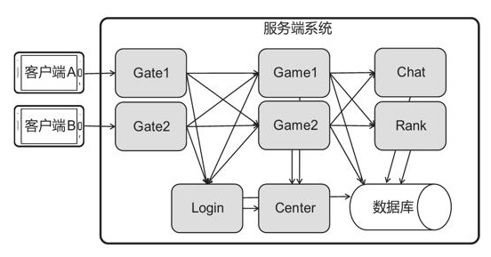
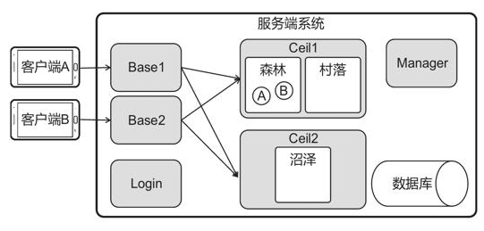
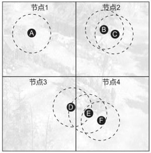
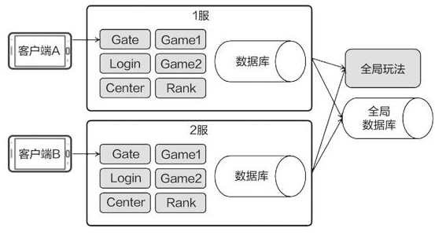
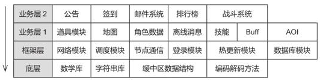
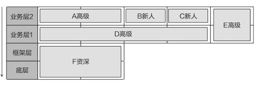
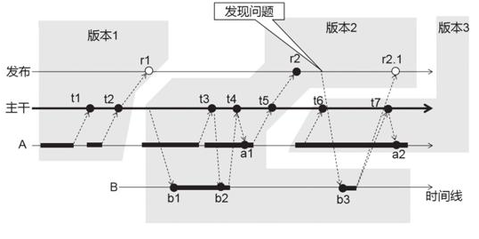

# 未尽之路

## 未尽之路

探索之路永无止境，相关技术也在快速发展，尽之路希望大家继续探索。

### 高并发

略 可看 note 系统编程 和 服务端开发部分

### Actor 模型

略 可以看 note ActorECS 部分

### OneLoopOneThread

略 可看 note 服务器开发部分

### 服务端架构

不同的服务端架构适用于不同类型的游戏，主要介绍的是传统的大世界服务端架构，这种架构较为通用，同时还有很多适用于具体业务的架构方式。

### 大世界架构

介绍了一种传统的大世界服务端架构。
该架构把整个服务端划分成了网关（Gate）、游戏服务（Game）、登录服务（Login）、中心服务（Center）、全局服务（Chat、Rank）等几大部分，各个部分可用一个单独的进程或一个 Actor 来表示。该架构具有较强的通用性，适用于角色扮演类游戏（MMORPG）、卡牌游戏、开房间类型游戏……



除了通用的架构之外，还有专用的架构。

### BigWorld

角色扮演、开房间战斗（部分射击游戏、竞技游戏）等类型的游戏都具有“角色在场景中”的特点，服务端底层可以进一步抽象，把所有事物都归结为实体和空间两大类，并提供“角色行走”“切换场景”“感兴趣区域”等功能，方便开发者使用。

类 BigWorld 的架构，它把所有事物都归结为实体和空间两大类。服务端划分成了 Base、Ceil 等不同类型的进程，Ceil 是一种管理场景的进程，图中 Ceil1 包含森林、村落两个场景（空间），Ceil2 包含沼泽场景；角色（实体）A 和 B 在森林中。由于服务端多做了一层抽象，因此服务端可以提供更多通用功能，例如，角色行走、切换场景、感兴趣区域等，从而使得逻辑开发更加便捷。



```bash
https://github.com/kbengine/kbengine
```

kbengine 是一款模仿 BigWorld 架构的服务端引擎，大家可以参考它的官方文档以理解该结构的原理。

### 无缝大地图

一些游戏拥有又大又复杂的地图，运算量往往超过了一台物理机的极限。对于这种无缝大地图，解决办法是将大地图分块，让不同的物理机（节点）处理地图的不同区域。然而，分区域会让游戏逻辑变得更加复杂，实体的每一个动作（如移动），都要考虑它对本节点的影响、对相邻节点影响，以及是否需要转移节点。

例如，图所示的无缝地图中，该地图分为 4 个节点，每个节点分别部署在不同的物理机上。A、…、F 是场景中的实体，虚线圆圈代表它们的感兴趣区域。A 的动作不会对其他实体产生影响，B 的动作会影响 C，E 会影响 D 和 F。当 E 执行某个动作（如移动）时，它除了要通知本节点中的 F、还要跨节点通知 D。



统一的抽象更有利于业务逻辑的开发，关于这一点，麻省理工学院 Marios Assiotis 和 Velin Tzanov 的论文《A Distributed Architecture for MMORPG》具有很高的参考价值。

```bash
https://pdos.csail.mit.edu/archive/6.824-2005/reports/assiotis.pdf
```

### 滚服架构

大世界架构拥有支撑数十万玩家同时在线的潜力，如果玩家进一步增多，还可以部署多个大世界架构的服务器，支撑百万级玩家同时在线。一个大世界架构的服务端可以开启数千个进程支撑数十万玩家，也可以只开启三五个进程支撑数千名玩家，规模调整非常灵活。

滚服架构是一种开启几百上千个“支撑数千名玩家的服务端”的架构，国内不少 MMORPG 都采用了该架构。滚服架构与游戏业务有关，因为每个服务器相对独立，所以玩家可以在新服务器上重新游玩，所有人都在同一起跑线上，从而可以避免与旧服务器的强大玩家正面交锋。



旧服务器上的玩家会渐渐流失，滚服架构的游戏常常需要“合服”，即把几个旧服务器的玩家合在一起，让他们可以同台竞技。“合服”一般是把某个旧服务器的玩家数据合并到另一个旧服务器中。

在做滚服类服务端的技术规划时，建议参考同类型游戏的合服策略（如《阴阳师》合服规则：

```bash
https://yys.163.com/news/update/20180113/23024_735114.html
```

提前做好 ID 规划、全局名字规划（合服后不可重复），开发好友合并、公会成员合并、排行榜重排等功能。

### 工程管理

游戏开发是一项系统性工程。项目团队首先应清楚定位“要做个什么样的游戏”，然后制定合理的进度目标，安排好人员分工，选用恰当的版本管理方法，在有限的资源下完成开发任务。游戏项目因其市场导向和极快的开发节奏，往往需要独特的工程管理方法。

### 分层架构

随着项目规模的增大，开发难度会越来越高。这是因为开发者每开发一个新模块都要考虑它与其他模块的关联，规模越大关联越多，难度也就越高。分层架构是一种性价比很高的方法，开发者只需要遵循少量的规则，就可以减少模块间的关联。

可以把服务端的所有模块分为几个层，并规定每个层的模块只能调用平级或者下一级的模块。例如，图中的地图模块可以调用角色数据、网络模块的公共接口，但不能调用公告、签到或编码解码方法的接口。采用分层架构可以降低项目的复杂度，因为开发一个功能时，只需要了解与它同层或下一层的少数接口即可。



分层架构能够满足大部分游戏模块的内在逻辑，所以大部分模块都应遵循分层规则。但实际项目中，有些逻辑很复杂，难以百分百遵循分层规则。例如，道具模块中有个道具可以让玩家发送邮件，而邮件可以包含道具奖励，这就意味着道具和邮件两个模块在逻辑上是相互关联的，无法分层，遇到这样的需求无须过分遵循规则。我们需要让项目中的大部分模块符合分层规则，这样做不仅可以降低项目的复杂度，还可以为人员分工提供依据。

### 人员分工

有句话说“一个人可以走得很快，一群人可以走得更远”，用在游戏开发中，我们可以这样理解：在讨论方案时多人合作可以集思广益；在检查代码时多人合作可以避免疏漏；但如果进度很赶就要划清界限，让每个人只关注自己负责的部分。

分层架构为人员分工提供了较好的方案，由于各个层的开发难度和所需知识不同，因此如果开发者固定负责某些层，那么他们就可以只学习少量知识然后快速上手，在某一层上做熟练了也能让他们做得更快。

展示了一个 6 人服务端团队的分工方案。该项目处于中后期，底层相对比较固定，目前正在加紧开发业务逻辑。因此分派资深工程师 F 一人负责底层和框架的完善，其余 5 人负责业务逻辑开发。B、C 是两位入职不久的新人，上层逻辑的上手难度较低，因此将他们安排在这一层。



### 版本管理

想象这样一个场景：某位程序员想要开发一款游戏，他在自己的电脑上创建一个工程，然后日以继夜的编写代码，还发出了很多游戏截图向好友炫耀。某天，有位好友想要看看他的实际成果，于是让该程序员演示游戏，意外发生了，程序根本就运行不起来。这是因为该程序员正在为他的游戏开发新功能，但尚未完成，新功能还有些报错没有处理，导致整个程序无法运行。如果该程序员能够在某些关键节点复制一份工程存档，也许就能在需要的时候拿出来做演示。在单人开发的场景中，版本管理就已经如此重要，在多人合作的项目中，版本管理只会更加重要。


