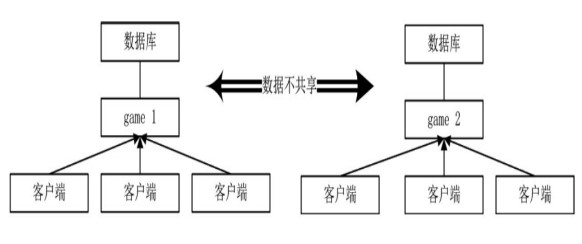
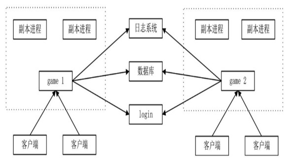
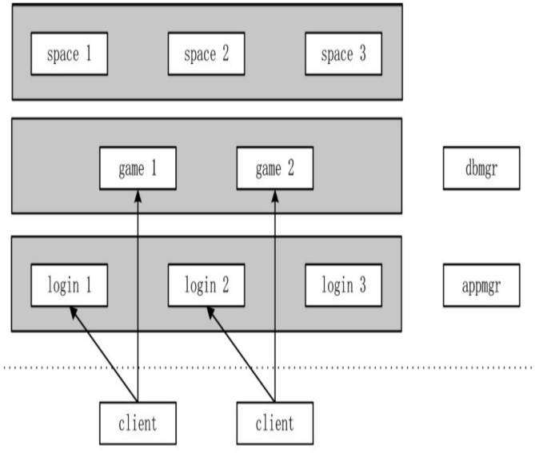
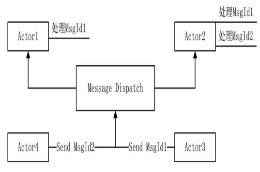
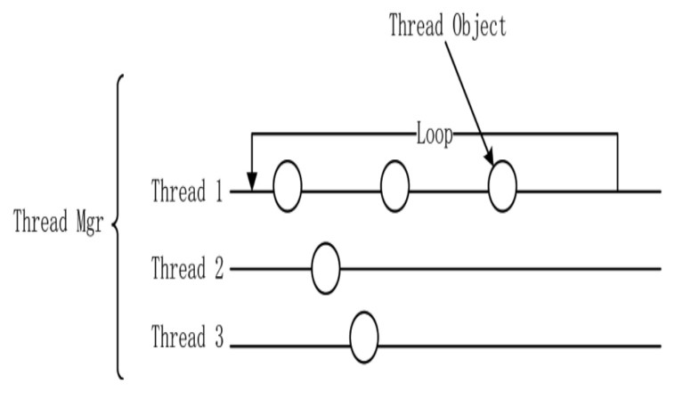
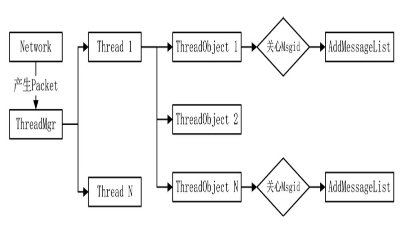

# 🚗 游戏架构

## 游戏架构

### 无服务端游戏

单机游戏没有服务端，所有数据都存储在本地，所有判断也是在本地完成
的，玩家不会与其他玩家进行交互。单机游戏不存在通信，不需要网络编程。

### P2P 架构

在 P2P 架构中，将所有客户端作为终端，是一种点对点的架构。P2P 架构可以是一个完整连接拓扑架构，每个客户端与其他客户端之间都有连接，形成网状节点，信息可以直接在用户之间交换，而不需要通过服务端。所有终端拥有完全一样的全部数据，接收完全一样的协议。

P2P 架构需要制作一个非常强大的客户端。如果每个客户端均要与所有终
端保持连接（例如有 1000 个客户端），那么其效率显然会打折扣。所以，此架构适用于局域网或者少数人的对战游戏。

对于游戏来说，如果存在服务端，服务端可以充当仲裁者。但 P2P 架构没
有一个仲裁者，在某些情况下，逻辑判断会存在争议。例如，两个玩家在 PK
时，其中一个玩家只剩下最后一滴血，在他使用回血技能的同时，另一个玩家对他释放了攻击技能，那么如何在两个终端都保证其判断的结果一致呢？为了解决该问题，P2P 架构需要在以下几个方面做到非常精准，达到所有终端的协议必须一致，包括协议号与协议顺序，另一方面，每个终端上的随机种子需要完全一样等。

### 帧同步

帧同步方案是在极短的一段时间内（例如 200 毫秒之内），服务端收集所有客户端的操作，生成一个操作序列，并将这个操作序列发送到每一个客户端。帧同步解决了两个很重要问题：第一是网络响应延迟问题，第二是服务器压力问题。帧同步将计算放置到了客户端。

### 单进程 CS 架构

大部分游戏为了开发效率不会使用多线程，以单线程配和多进程通信为主，降低了服务端宕机风险。

单进程 CS 架构：



多进程 CS 架构：



### 框架瓶颈

有许多的游戏架构，采用哪一种架构取决于要实现的游戏类型，大致有 3 种。

1、滚服游戏。滚服游戏可以认为是一种平行空间的游戏方式，因为一
个游戏世界容纳不了太多人，过一段时间就新开一个服务器，每个服务器的世界都一样。因为不断地增加新的服务器，用“滚服”来形容非常贴切。有时在某些服中玩家活跃玩家少时，还会进行和服（将多个服的玩家合到一个服中）。

2、副本游戏。在副本游戏中，会为玩家专门开辟一个地图或空间实例。例如棋牌，为每一桌可以开一个副本空间。

3、大图分割空间游戏。将一张大图分割成几个处理块，或者将不同地
图放到不同进程进行处理。这类游戏又分为两种类型：一种类型如《剑侠情缘
网络版叁》，不同的城镇在服务端可能在不同的进程中；另一种类型如《魔兽
世界》，采用了 Big World（大地图）的方式，所有的人看似都在同一个地图
上，但其实这个地图像农田一样被划分成了多个小块，每个小块由不同的地图
实例管理。

### 滚服游戏

滚服游戏也可以理解为空间复制。相同的游戏数据在不同的服务端实例
上。以卡牌类游戏为例，给定一个服务端列表，玩家可以登录任何一个服务
端，每个服务端的数据不相互冲突，每个服务端的游戏逻辑是完全相同的。

这类游戏技术的实现较为简单，只需要多开服务端，用简单的单进程 CS 架
构就可以实现。但它有一个缺点，玩家承载是有限的。如果每个平行空间承载
3000 人，经过一段时间的游戏之后，玩家流失，某个平行空间可能只剩下不到
100 人。这时，我们需要采用的方式就是合服。随着时间的推移，服务器 1 的人
会越来越少，这时需要对服务器 1 和服务器 2 的数据进行合并，即合服。

合服是滚服游戏一定要考虑的问题，一开始就要考虑的问题是合服时的数
据库处理。因为每个服务端的数据不受彼此影响，所以在设计的最初就要想
到，即使不是同一空间，也需要使用不同的角色名字，道具的 ID 生成方式也要
唯一，以便于合服。

滚服游戏中的瓶颈在于每个服务端处理的玩家数量有限，所以需要不停地
开服、合服，使服务端的硬件资源使用达到最佳状态。客户端在服务器列表中选择一个游戏服务器 game 进程进行通信，该服务器支持以下几种功能：与登录服务器通信、与数据库通信以及实现必要的游戏逻辑。滚服游戏一般支持的玩家有限，一台服务器平均支持同时在线 3000 人左右。

在滚服游戏中，服务器两两之间是无须通信的。除非有一些跨服玩法之类的，涉及到不同服之间的服务器进行通信。

### 副本游戏

副本游戏是对同一地图的数据进行复制，生成新的实例，但并不是所有生
成多个实例的游戏都是副本游戏。

有两个需求产生了副本空间，一个是策划层面的需求。产生多个实例空间
减少了地图中资源的争夺，这种情况往往会发生在刚进游戏时，例如游戏有多
个新手村，打怪升级时需要某种 Boss，而 Boss 数量有限，引起玩家争夺资源。
滚服游戏也可以有多个新手村，但它并不是副本游戏。

另一个是策略和技术方面的需求，例如斗地主时的多个房间。推图游戏中
的每个可以探索的战斗关卡在服务端都会生成一个可以探索的实例空间，每个
空间的数据独立，以保证玩家能独立游戏。这里说的“可以探索的实例空
间”是指 3D 场景空间，如果你的推图游戏只是一场简单的战斗，那么可以不用
额外建立副本空间。

像英雄联盟、王者荣耀的每局匹配其实都是一个副本，每局游戏独立，互不干扰。

### 大图分割空间游戏

分割空间是把一个世界的实例分成几部分，放在一个或几个进程中。采用
空间分割方式的游戏一般来说是大型游戏，将一个巨大的游戏世界分割成几个
实例。

在实际制作游戏时，我们很少看到真正只有一张 Big World 地图的游戏。
分割一张地图有一个比较难处理的问题，玩家移动的时候，如果正好处于分割
空间的分界线上，就会产生边界问题。可以用九宫格的方式来处理这个问题，
就是向本地图为中心的九宫格发送一定边界范围内的同步信息，但处理起来依
然很麻烦。为了避免处理这个问题，空间分割就演变成了将某些地图放在 A 服
务器，将另一些地图放在 B 服务器，以此来减轻每个服务器受到的压力。

分割空间类的游戏架构与滚服类的游戏架构完全不同，在分割空间类的游
戏中，不同的地图放在不同的进程，有时可能物理机都不相同，这时单进程的
game 服务器被拆分成了几个 game 服务器，而一组 game 服务器构成了整个架构。
一旦出现瓶颈，可以进行拆分。例如，某个进程管理 A、B、C、D 四张地图，当
物理机产生计算或内存瓶颈时，game 又可以再被分割，A、B 用旧的服务器，
C、D 再组成一个新的 game 服务器。

分割空间类的游戏架构不需要合服，因为它不存在玩家人数的限制，对于
客户端而言，它好像只有一个服务端入口，不需要选服，实则其背后有庞大的
设计。这也就是常说的全球服。

### 设计游戏框架

有这么多服务端架构，应该采用哪一种服务端架构呢？这个问题实际上是由游戏
内容来决定的。从技术层面出发，目标是做一个难度相对较大的全球服。
理解了全球服的思路，其他架构都是全球服的缩影。

全球服架构：



首先需要厘清这个架构之间的进程关系，以及每个进程
需要做些什么：

- 登录验证服务器 login，需要 N 个。
- 用于代理中转的 game 服务器，需要 N 个，玩家与某个 game 进行网络通
  信，每次登录的 game 可能并不一样，这样就保证了 game 的均衡。
- 我们把世界分成若干个空间，所以需要有 N 个 space（空间）进程。space 进程放置着真正的地图实例，确保玩家在 space 服务进程上是均衡的。例如有 10 个玩家，开了 10 个副本，有 5 个 space 进程，那么相当于每个 space 实例上开了两个副本，以达到均衡的目的。
- appmgr 进程，需要 1 个，用于进程的管理。相当于集群管理了。
- dbmgr 进程，需要 1 个，用于数据库的统一存储。dbmgr 进程是否需要独立成为一个单独的进程是不一定的，根据游戏类型的不同而不同，这部分功能也可以归到每个 game 上(如滚服游戏)，滚服游戏有时需要 global db,存储一个大区内玩家的全局数据，如在某个大区那些服有角色。

副本空间的框架也有两种实现方式，`一种是客户端维护一个网络连接，只与 game 进行通信`；另一种是客户端需要维护两个网络连接，同时与
game 和副本进行通信。也可以把副本服务器称为战场服务器，典型的用法是在
《英雄联盟》中，登录、匹配数据在一个进程上，而进入地图之后，它在另一
台服务器上。这两种结构各有其特点，并没有好坏之分，只是需求不相同。

### 网关

在上面`客户端维护一个网络连接，只与 game 进行通信`这种方式 game 服务进程视为网关服务器，网关是用来连接两个网络的，网关服务器是一个中转服务器，它是连接客户端与地图（战场）服务器之间的桥梁。

像棋牌游戏怎么设计，玩家通过 login 服务器进行登录，在 login 服务器上建立一种选择 game 服务器的策略，玩家账号验证成功后，会为其选择一个合适的 game 登录，当玩家需要进入棋牌房间时，向 appmgr 询问房间的 space 进程，space 进程为其创建一个房间实例，而 game 这时相当于一个中间代理服务器，连接了客户端与特定 space 服务进程的通信。

### 聚合

尽可能让一组服务器承载更多的玩家，服务端需要解决的首要问题是“聚合”问题。聚合就是那些让玩家聚在一起，以完成一些需要同步数据与操作的功能。在处理这一问题上，space 服务进程并不是单纯意义上的地图，它要实现的是一种聚合，而地图只是恰好是一个聚合，但聚合不仅仅限于地图。具体一点，帮派、聊天系统也是一种聚合，这种聚合并不是物理地图上的聚合，而是一种逻辑上的聚合，一旦帮派成员有操作发生，需要同步到帮派内每个在线成员的客户端。

### 游戏主循环

不论服务端框架有多少个进程，每个进程一定要有一个游戏主循环。单线
程的游戏服务端结构中，一个主循环中需要实现两个主要功能：

- 数据收集。对于服务端来说，操作是由网络层发送过来的，所以服
  务端需要不断监听网络层是否有新的数据到来。
- 不断更新、计算世界的状态，根据收集来的数据更新游戏世界，并
  把这些更新数据广播给一个或者多个终端。

客户端比服务器要多做一些功能。除了这两个主要功能外，客户端还要监
控设备的输入操作和实现绘制——世界绘制、NPC 绘制、玩家模型绘制、UI 绘
制等。

### 进程与线程

并发编程一定要会，不会的话去学习 C++并发编程部分和 APUE

### Actor 模型

Actor 模型是为了并发而设计出来的。一个纯粹的 Actor 只接收消息，受事件驱
动，然后根据消息执行相应的计算。其最大的特点是，大量 Actor 之间是相互隔
离的，它们不共享内存。Actor 之间有且只有一种通信方式，就是消息传递。在
Actor 模型中，对象的任何数据不对外，所有数据只有它自己可以修改。更为直
白一点的说法就是，两个 Actor 之间不能互调函数。

Actor 模型是基于消息的，单个 Actor 的原型分为 3 部分：：消息队列、行为和
数据。消息队列即存放消息协议的队列，行为可以认为是对每个协议不同的处理函数，Actor 肯定还有一些自己维护的数据。

当我们在使用线程时，因为有资源的竞争，需要加锁。同时，有两个或者
两个以上的线程需要访问某个对象时，为了避免出错必须加锁。如果一个系统
日渐发展壮大，又使用了多线程，那么到了后期，这些锁几乎是一种毁灭性的
灾难，因为其不可维护。为了解决加锁的问题，所有的对象都是基于
Actor 模型进行设计的。采用消息通信的方式来修改数据，避免了加锁。

Actor 对象交互：多个 Actor 协作时需要加一个消息广播的机制。如 Actor1 只处理 MsgId1 消息，Actor2 处理 MsgId1、MsgId2 消息。



### Actor 模型的聊天系统

例如，有一个 ChatSystem 类负责聊天系统。一般的做法可能是这样的：定
义一个聊天协议，包括 3 个基本值：PlayerId、ToPlayerId 和 Context，分别表
示发起聊天的人、发送对象和内容。当聊天协议到来时，通过玩家管理类
PlayerManager 找到发起对象，称为 A 对象，再找到目标对象，称为 B 对象，再给
B 对象的客户端发送一个聊天协议（PlayerId、ToPlayerId 和 Context），客户
端收到这个协议时，界面上就会显示聊天的内容。当然，这个过程还需要这两
个玩家在同一个进程中，要不然从哪里去找目标呢？

在 Actor 模型下，实现方式完全不同。因为 Actor 模型中，ChatSystem 类根
本得不到 PlayerManager 类。一旦 ChatSystem 类可以取得 PlayerManager，就建
立了耦合。为了实现聊天的功能，我们需要分几步：

1. 当玩家上线时，向 ChatSystem 类注册一个消息，这个消息告诉 ChatSystem 类“我上线了”，这时玩家可以在 ChatSystem 类中注册一些需要的信息，例如所在的网关服务器（ChatSytem 需要知道玩家在哪里，有消息时需要通知玩家）。
2. 在通知 ChatSystem 类“我上线了”的同时，ChatSystem 类取得了该玩家的所有好友列表。
3. 进行过前两个步骤后，现在客户端发送一个协议(PlayerID ToPlayerID Context)給 ChatSystem,一般都是发给网关，再由网关发给 ChatSystem,ChatSystem 向玩家发内容时，也是先发给网关，再有网关通知给玩家。Actor 方式会使内存数据增加，但减少了耦合性。

对于 Actor 模型，`ChatSystem 类生成时就决定了它需要关心至少 3 个协
议（这里协议也可以称为事件）：第一个事件是玩家登录事件，第二个事件是
玩家离线事件，第三个事件是聊天事件。`

### 游戏框架中的线程

通常并不是简单的使用线程去执行一个函数、调用一个类，而是要对线程进行比要的扩展。

需要创建一个线程管理类，实现：

1. 初始化游戏线程
2. 关闭所有线程
3. 更新所有线程

线程类：

1. 启动一个线程
2. 关闭、销毁本进程
3. 对线程中的所有对象进行更新，实现 Update 帧函数
4. 管理“线程包裹”

线程包裹(即线程的封装)，实现

1. 更新自身数据，实现 Update 帧函数
2. 销毁自己



Thread 1、Thread 2 和 Thread 3 分别表示 3 个独立线程，其中 Thread 1 维护了 3 个线程包裹对象。线程就像一个流水线一样，每个 ThreadObject 实例就是上面一个个包裹，为了方便理解，就叫它线程包裹类。线程不关心这些“包裹”中的内容是什么，只是每帧调用 Update 函数时，对“包裹”对象进行更新。而线程管理则管理着 Thread 1、Thread 2 和 Thread 3，线程管理器并不关心每个线程中有多少个线程包裹。

包裹类 ThreadObject，每个线程包裹都是一个以 Actor 为原型的类，它们互不影响。

```cpp
class ThreadObject : public IDisposable {
public:
 ...
 virtual bool Init= 0;//初始化函数
 virtual void RegisterMsgFunction( ) = 0;//注册自己感兴趣的协议
 virtual void Update( ) = 0;//帧函数，更新数据
 ...
};
```

IDisposable 是什么鬼,可以所有资源类都继承它，方便在程序退出时对资源进行管理

```cpp
class IDisposable{
public:
  virtual ~IDisposable()=default;
  virtual void Dispose()=0;
};
```

### 线程类 Thread

对 Actor 线程进行封装

```cpp
class Thread:public IDisposable{
public:
  void AddThreadObj(ThreadObject*_obj);
  void Start();
  void Stop();
  void Update();
private:
  bool _isRun;
  std::list<ThreadObject*> _objlist;
  std::thread _thread;
};
```

Actor Thread 的帧函数

```cpp
void Thread::Update(){
  _thread_lock.lock();
  std::copy(_objlist.begin(),_objlist.end(),std::back_insert(_tmpObjs));
  _thread_lock.unlock();
  //遍历执行所有ThreadObject的帧函数
  for(ThreadObject*pTObj:_tmpObjs){
    pTObj->Update();
    //...
  }
  _tmpObjs.clear();
  std::this_thread::sleep_for(std::chrono::milliseconds(1));
}
```

### 线程管理类 ThreadMgr

主要有两个任务：

1. 每帧检查以下每个线程是否还在工作，若线程全部退出，则进程退出。
2. 管理多个线程对象，当有新的 ThreadObject 加入线程时，会丢给 ThreadMgr 处理，会将 ThreadObj 放入一个合适的线程中，ThreadObject 本身并不知道自己会加入哪个线程中。

```cpp
class ThreadMgr :public Singleton<ThreadMgr>{
public:
  void StartAllThread();
  bool IsGameLoop();//所有线程是否还在运行中
  void NewThread();
  void AddObjToThread(ThreadObject* obj);
  //...
private:
  std::mutex _thread_lock;
  std::list<Thread*> _threads;
};
```

### 消息定义原则

在使用 protobuf 时，定义一个消息有两个步骤：

1. 在 proto 文件中对协议内容进行定义。
2. 使用 protoc.exe 将定义生成 C++或 C#需要的文件。

- 原则 1：使用 proto 文件定义的 enum 为协议号
- 原则 2：同一协议号不做两种用途
- 原则 3：协议编号与协议体同一命名

```proto
//msg.proto
syntax = "proto3";
package Proto;
message TestMsg{
  string msg = 1;
  int32 index = 2;
}
//proto_id.proto
enum MsgId{
  MI_None = 0;//proto3的枚举，第一个必为0
  MI_TestMsg = 1;
}
```

当框架功能越来越多时，如果不按这种一对一的命名原则，那么可能搞不
清楚 MI_TestMsg 协议号到底对应哪个结构体，现在我们强制要求它们的名字一
样，只要看到了协议号就知道协议体的名字，不需要记忆。

封装 Packet 类，更好的让协议在程序代码中传递

```cpp
class Packet : public Buffer
{
public:
    //...
    template <class ProtoClass>
    ProtoClass ParseToProto()
    {
        ProtoClass proto;
        proto.ParsePartialFromArray(GetBuffer(), GetDateLength());
        return proto;
    }
    template <class ProtoClass>
    void SerializeToBuffer(ProtoClass &protoClase)
    {
        auto total = protoClase.ByteSizeLong();
        while (GetEmptySize() < total)
        {
            ReAllocBuffer();
        }
        protoClase.SerializePartialToArray(GetBuffer(), total);
        FillData(total);
    }
};
```

### 消息队列机制

#### MessageList 类

线程之间需要互通消息，我们以消息队列的方式来实现消息的存储，即给 ThreadObject 加一个 MessageList 类，该
类管理着当前 ThreadObject 需要处理的所有消息。

为每个 ThreadObject 配一个 MessageList

```cpp
typedef std::function<void(Packet*)> HandleFunction;
class MessageList{
public:
  void RegisterFunction(int msgId,HandleFunction function);
  bool IsFollowMsgId(int msgId);
  void ProcessPacket();
  void AddPacket(Packet* pPacket);
  static void DispatchPacket(Packet* pPacket);
  static void SendPacket(Packet* pPacket);
protected:
  std::mutex _msgMutex;
  std::list<Packet*> _msgList;
  std::map<int,HandleFunction> _callbackHandle;
};
void MessageList::DispatchPacket(Packet* pPacket)
{
    ThreadMgr::GetInstance()->DispatchPacket(pPacket);
}
void MessageList::SendPacket(Packet* pPacket)
{
    ThreadMgr::GetInstance()->SendPacket(pPacket);
}
```

可以让 ThreadObject 继承 MessageList

1. 在 MessageList 类初始化时需要调用 RegisterFunction 函数，主动注册协议号，并为该协议号指定一个处理函数。
2. 当有协议到达时，调用 IsFollowMsgId 函数判断一个协议号是否是自己关心的，如果是则调用 AddPacket 函数将 Packet 类缓存，以便处理。
3. 在帧函数中调用 ProcessPacket 来处理缓存的 Packet 协议。

#### 消息分发

在当某个网络 Socket 描述符上有读取事件发生时，调用 Socket 对应的 ConnectObj 对象，执行 Recv 读取操作，将数据从文件描述符读到 ConnectObj 接收缓冲区。

```cpp
bool ConnectObj::Recv() const{
  bool isRs = false;
  while(true){
    // socket 2 buf
    // 取出消息部分，有消息时isRs被赋值为true
  }
  if(isRs){
    while(true){
      const auto pPacket = _recvBuffer->GetPacket();
      if(pPacket == nullptr)
        break;
      ThreadMgr::GetInstance()->AddPacket(pPacket);
    }
  }
  return isRs;
}
```

有包则使用 ThreadMgr::AddPacket 进行广播，向自己管理下的所有线程发送 Packet 数据

```cpp
void ThreadMgr::AddPacket(Packet* pPacket){
  std::lock_guard<std::mutex> guard(_thread_lock);
  for(auto iter = _threads.begin();iter!=_threads.end();++iter){
    Thread* pThread = iter->second;
    pThread->AddPacket(pPacket);
  }
}
```

在 Thread 的 AddPacket 中，需要将消息广播给自己下的所有 ThreadObj

```cpp
void Thread::AddPacket(Packet* pPacket){
  std::lock_guard<std::mutex> guard(_thread_lock);
  for(auto iter = _objlist.begin();iter!=_objlist.end();++iter){
    ThreadObject* pObj = *iter;
    if(pObj->IsFollowMsgId(pPacket->GetMsgId())){
      pObj->AddPacket(pPacket);
    }
  }
}
```

如果 ThreadObject 关心该协议，就将该协议传递到 MessageList，MessageList 收到协议之后，将协
议加入待处理的队列中。

```cpp
void MessageList::AddPacket(Packet* pPacket){
  std::lock_guard<std::mutex> guard(_msgMutex);
  _msgList.push_back(pPacket);
}
```



#### 消息过滤

关键问题来了，如何判断当前这个 Packet 是 ThreadObject 所需要的呢？这就需要谈到另一个机制：消息过滤。

在 MessageList 中定义了 RegisterFunction，为协议号注册处理函数

```cpp
void MessageList::RegisterFunction(int msgId,HandleFunction function){
  std::lock_guard<std::mutex> guard(_msgMutex);
  _callbackHandle[msgId] = function;
}
```

则在 IsFollowMsgId 判断是否有注册相关协议号的 Handler

```cpp
bool MessageList::IsFollowMsgId(int msgId){
  std::lock_guard<std::mutex> guard(_msgMutex);
  return _callbackHandle.find(msg) != _callbackHandle.end();
}
```

#### 消息处理

通过消息过滤的消息一定在 MessageList 中，在 MessageList 中的消息一定义 ThreadObj 关注的消息。

```cpp
void MessageList::ProcessPacket(){
  std::list<Packet*> tmpList;
  _msgMutex.lock();
  std::copy(_msgList.begin(),_msgList.end(),std::back_insert(tmpList));
  _msgList.clear();
  _msgMutex.unlock();
  for(auto packet:tmpList){
    const auto handleIter = _callbackHandle.find(packet->GetMsgId());
    if(handleIter==_callbackHandle.end()){
      //出错
    }else{
      handleIter->second(packet);
    }
  }
  tmpList.clear();
}
```

#### 自定义消息 Handler

消息 Handler 继承 ThreadObject,并加入到某个 Actor Thread 中

```cpp
class TestMsgHandler :public ThreadObject{
public:
  bool Init() override;
  void RegisterMsgFunction() override;
  void Update() override;
private:
  void HandleMsg(Packet* pPacket);
};
void TestMsgHandler::RegisterMsgFunction(){
  RegisterFunction(Proto::MsgId::MI_TestMsg,std::bind(this,&TestMsgHandler::HandleMsg));
  //...注册其他函数
  //...
}
void TestMsgHandler::HandleMsg(Packet* pPacket){
  auto protoObj = pPacket->ParseToProto<Proto::TestMsg>();
  std::cout<<protoObj.msg().c_str()<<std::endl;
}
```
