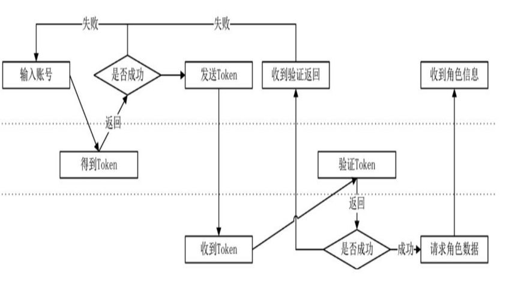
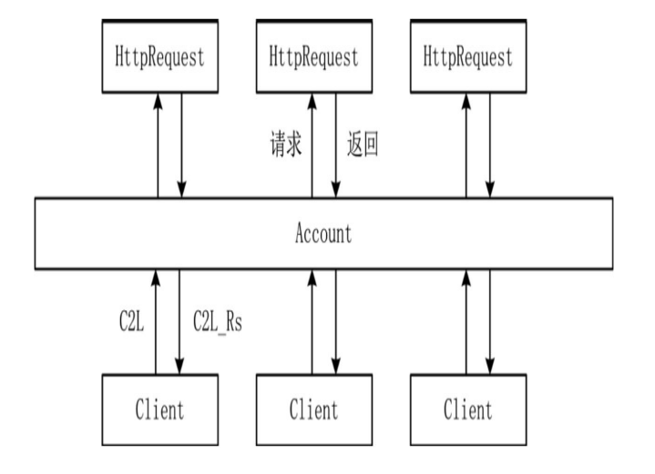
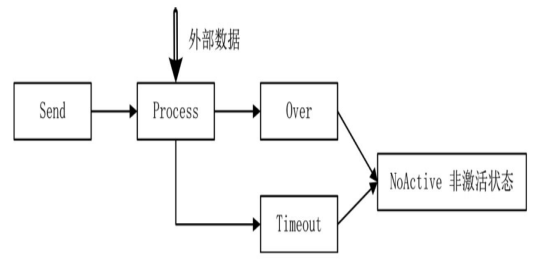
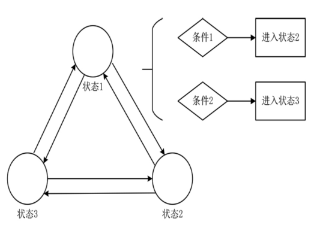
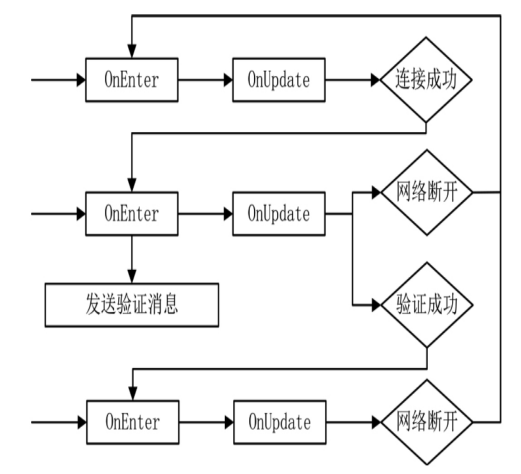

# 🚗 账号登录与验证

## 账号登录与验证

登录是游戏开发中非常重要的一个功能，设计得不好会出大问题。不要认为登录只是简单的账号验证，其中包括的细节与异步非常多。如果同一个账号同时在两个 Socket 上发起登录协议该如何处理，如果有大于 1000 个玩家同时登录怎么办。

### 登录流程图

游戏一般都会发布到各大平台，除非自己开发自己的 SDK



上面的一层是客户端、中间的一层是第三方平台、底部一层是游戏服务端

1. 客户端通过平台给定的 SDK 取到该账号的 token 和账号 ID，生成的
   token 是有时效性的。
2. 客户端将 token 发送到服务端，服务端通过平台提供的 HTTP 将 token 和
   账号 ID 传给平台进行验证。
3. 服务端收到平台的反馈结果，如果失败就通知客户端，如果成功就加
   载玩家数据。

每个平台接入的 API 各有不同，但大部分采用了 HTTP。

### 账号验证

按照之前的框架设计，验证账号功能，只需要做一个 ThreadObject 即可，在这个类中，处理关于账号验证相关的协议。

1. 定义登录协议号

```proto
//proto_id.proto
enum MsgId{
  MI_None = 0;//proto3的枚举，第一个必为0
  MI_TestMsg = 1;
  C2L_AccountCheck = 1001;//验证账号 C2L表示 Client to Login
  C2L_AccountCheckRes = 1002;//验证返回结果
  MI_AccountCheckToHttpRs = 1005;//HTTP请求的返回协议
}
//C2L_AccountCheck
message AccountCheck{
    string account = 1;
    string password = 2;
    string token = 3;
}
```

向第三方进行 Token 验证，发起 Http 请求，Http 请求有结果返回时，就定义一个协议包发到 ThreadObject 的消息队列，进行处理

```proto
//MI_AccountCheckToHttpRs
message AccountCheckToHttpRs{
    int32 return_code = 1;
    string account = 2;
}
```

通知客户端,在返回协议结构中定义了一个枚举，用来标识返回值的类型，以方便客户端界面显示文字。

```proto
//C2L_AccountCheckRs
message AccountCheckRs{
    enum RetuenCode{
        ARC_OK = 0;
        ARC_UNKONWN = 1;
        ARC_NOT_FOUND_ACCOUNT = 2;
        ARC_PASSWORD_WRONG = 3;
        ...
    }
    int32 return_code = 1;
}
```

### 处理协议的 Account 类

定义完协议后，服务端需要注册 ThreadObject 处理这些协议。

```cpp
class Account:public ThreadObject{
public:
    bool Init() override;
    void RegisterMsgFunction() override;
    void Update() override;
private:
    void HandleAccountCheck(Packet* pPacket);
    void HandleAccountCheckToHttpRs(Packet* pPacket);
private:
    PlayerMgr _playerMgr;
};
```

Account 类是 login 进程特有的类，目的是处理客户端发来的账号验证请求，Account 类维护了 PlayerMgr 实例，
其作用是维护所有 Account 类中正在登录的账号对象。

基类 ThreadObject 是运行在线程之上的对象，如果把线程比喻成一条流水线，那么 ThreadObject 类就像运行在其上的包裹。ThreadObject 类
必须实现 3 个虚函数：Init、RegisterMsgFunction 和 Update，分别用于初始化、注册自己感兴趣的协议以及执行更新操作。

将 Account 类放置在线程中

```cpp
void LoginApp::InitApp(){
    AddListenerToThread("127.0.0.1",2233);
    ...
    Account* pAccount = new Account();
    _pThreadMgr->AddObjToThread(pAccount);
    //ThreadMgr 将Account丢进线程前，会首先调用Account类的Init和RegisterMsgFunction两个函数
}
```

注册关注的协议

```cpp
void Account::RegisterMsgFunction(){
    RegisterFunction(Proto::MsgId::C2L_AccountCheck,std::bind(this,&Account::HandleAccountCheck));
    RegisterFunction(Proto::MsgId::MI_AccountCheckToHttpRs,std::bind(this,&Account::HandleAccountCheckToHttpRs));
}
```

HandleAccountCheck 处理细节

```cpp
void Account::HandleAccountCheck(Packet *pPacket)
{
    // 从网络层传来的Packet
    auto protoCheck = pPacket->ParseToProto<Proto::AccountCheck>();
    const auto socket = pPacket->GetSocket();
    auto pPlayer = _playerMgr.GetPlayer(protoCheck.account());
    if (pPlayer != nullptr)
    {
        // 如果有相同账号正在登录，就返回客户端消息，同时关闭网络
        Proto::AccountCheckRs protoResult;
        protoResult.set_return_code(Proto::AccountCheckRs::ARC_LOGGING);
        auto pRsPacket = new Packet(Proto::MsgId::C2L_AccountCheckRs, socket);
        pRsPacket->SerializeToBuffer(protoResult);
        SendPacket(pRsPacket);
        // 关闭网络
        const auto pPacketDis = new Packet(Proto::MsgId::MI_NetworkDisconnectToNet, socket);
        DispatchPacket(pPacketDis);
        return;
    }
    // 更新信息
    _playerMgr.AddPlayer(socket, protoCheck.account(), protoCheck.password());
    // 验证账号(向第三方发送http请求)
    HttpRequestAccount *pHttp = new HttpRequestAccount(protoCheck.account(), protoCheck.password());
    ThreadMgr::GetInstance()->AddObjToThread(pHttp);
}
```

### 处理验证的 HttpRequestAccount

为了异步账号验证，创建一个处理 HTTP 的 ThreadObject HttpRequest



客户端向 Account 发送请求，Account 根据判断创建新的 HttpRequest 对象(是 ThreadObject)加入到 Actor 线程中，同时 HttpRequest 的 Update 可以检查请求状态等，当判断请求返回后可以将消息派发给 ThreadMgr，ThreadMgr 进行广播到 Account。再由 Account 判断并向 Client 进行返回。整体下来几乎所有都是异步过程。

怎样非阻塞的进行 HTTP 请求，请求一个 HTTP 数据时，从请求到返回阶段

```cpp
enum HttpRequestState{
    HRS_Send,//发送数据
    HRS_Process,//等待数据
    HRS_Over,//完成
    HRS_NoActive,//完成后的非激活状态，等待线程删除,以为ThreadObject不使用后因从ActorThread删除
    HRS_Timeout,//请求超时
};
```

真正的核心在于 Update 函数，每一帧都在检查自己的状态，一旦收到数据就要更新自己的状态，还可以处理请求超时判断。

```cpp
void HttpRequest::Update()
{
    switch (State)
    {
    case HRS_Send:
    {
        if (ProcessSend())
        {
            State = HRS_Process;
        }
    }
    break;
    case HRS_Process:
    {
        if (Process())
        {
            State = HRS_Over;
        }
    }
    break;
    case HRS_Over:
    {
        ProcessOver();
        State = HRS_NoActive;
        _active = false;
    }
    break;
        //...
    }
}
```



需要特别注意的是，要保证 Update 的每一帧都不能阻塞

### HttpRequestAccount

让 HttpRequestAccount 继承 HttpRequest 类

```cpp
class HttpRequestAccount:public HttpRequest{
public:
    HttpRequestAccount(std::string account, std::string password);
protected:
    void ProcessMsg(Json::Value value) override;
};

//初始化请求数据
HttpRequestAccount::HttpRequestAccount(std::string account,std::string password):HttpRequest(account){
    _password = password;
    _curlRs = CRS_None;
    _method = HttpRequestMethod::HRM_Post;
    _url = "192.168.0.120/member_login_t.php";
    _params.append("account=").append(_account);
    _params.append("&password=").append(_password);
}

//处理HTTP返回JSON数据
void HttpRequestAccount::ProcessMsg(Json::Value value){
    auto code = Proto::AccountCheckRs::ARC_UNKONWN;
    int httpCode = value["returncode"].asInt();
    if(httpcode == 0){
        code = Proto::AccountCheckRs::ARC_OK;
    }else if(httpcode == 2){
        code = Proro::AccountCheckRs::ARC_NOT_FOUND_ACCOUNT;
    }else if(httpcode == 3){
        code = Proto::AccountCheckRs::ARC_PASSWORD_WRONG;
    }
    //广播MI_AccountCheckToHttpRs包
    Proto::AccountCheckToHttpRs checkProto;
    checkProto.set_account(_account);
    checkProto.set_return_code(code);
    auto pCheckPacket = new Packet(Proto:MsgId::MI_AccountCheckToHttpRs, 0);
    pCheckPacket->SerializeToBuffer(checkProto);
    DispatchPacket(pCheckPacket);
}
```

然后在 Account 接收到 MI_AccountCheckToHttpRs 包后，进行相应处理。

一个独立的 ThreadObject 的信息是闭塞的，它只处理从消息队列收到的协议，其结果再通过协议发送出去。发送协议的
类并不知道接收协议的类如何处理，也不关心谁去处理。这是低耦合产生的根本原因。Account 类并不知道是谁在处理
HTTP 请求，也不知道谁会将返回结果给它。HttpRequest 类处理完数据之后不知道这些数据谁会需要，只要发送出去就
好了。

### 消息过滤机制

现在还是存在一些问题的。举个例子，如果有两张地图，每张地图上有无数个玩家，地图是线程包裹类(ThreadObject),玩家是地图类中的数据，如果玩家发出一个 move 指令，两个地图都注册了要接受 move 指令协议包，但是发出指令的玩家只可能在其中一个地图上，这要如何处理。

需要设计，某个特定的 Socket 发出的协议只能由某个特定的类来处理。

这一问题其实来自于 MessageList,在 ThreadObject 接收到协议包后，判断是否关注相应的 MsgId 后就将协议包丢进了 MessageList 内，并没有做其他判断。

用新的结构 MessageCallBackFunctionInfo 容纳之前 MessageList 中的函数与数据

```cpp
//抽象
class MessageCallBackFunctionInfo{
public:
    virtual bool IsFollowMsgId(Packet* packet) = 0;
    virtual void ProcessPacket() = 0;
    void AddPacket(Packet* pPacket);
protected:
    std::mutex _msgMutex;
    std::list<Packet*> _msgList;
};

class MessageList : public IDisposable
{
public:
    void AttachCallBackHandler(MessageCallBackFunctionInfo *pCallback)
    {
        _pCallBackFuns = pCallback;
    }
    void Disposr() override;
    bool IsFollowMsgId(Packet* packet)const;
    void ProcessPacket() const;
    void AddPacket(Packet* pPacket)const;
    static void DispatchPacket(Packet* pPacket);
    static void SendPacket(Packet* pPacket);

protected:
    MessageCallBackFunctionInfo *_pCallBackFuns{nullptr};
};

//实现MessageCallBackFunctionInfo不会进行过滤的
class MessageCallBackFunction: public MessageCallBackFunctionInfo{
public:
    using HandleFunction = std::function<void(Packet*)>;
    void RegisterFunction(int msgId, HandleFunction function);
    bool IsFollowMsgId(Packet* packet) override;
    void ProcessPacket() override;
    std::map<int,HandleFunction>& GetCallBackHandler(){return _callbackHandle;}
protected:
    std::map<int,HandleFunction> _callbackHandle;
};

//实现MessageCallBackFunctionInfo会进行过滤的
template <class T>
class MessageCallBackFunctionFilterObj : public MessageCallBackFunction
{
public:
    using HandleFunctionWithObj = std::function<void(T *, Packet *)>;
    using HandleGetObject = std::function<T *(SOCKET)>;

    void RegisterFunctionWithObj(int msgId,HandleFunctionWithObj function){
        _callbackHandleWithObj[msgId] = function;
    }
    bool IsFollowMsgId(Packet *packet) override;
    void ProcessPacket() override;
    HandleGetObject GetPacketObject{nullptr};

    void CopyFrom(MessageCallBackFunction* pInfo);

private:
    std::map<int, HandleFunctionWithObj> _callbackHandleWithObj;
};
```

重点其实在于 MessageCallBackFunctionFilterObj::IsFollowMsgId 其决定着是否将协议包放入 MessageList

```cpp
template <class T>
bool MessageCallBackFunctionFilterObj<T>::IsFollowMsgId(Packet *packet)
{
    // 判断没有过滤机制的Handler是否注册，注册了则返回
    if (MessageCallBackFunction::IsFollowMsgId(packet))
    {
        return true;
    }
    // 有过滤机制
    if (_callbackHandleWithObj.find(packet->GetMsgId()) != _callbackHandleWithObj.end())
    {
        if (GetPacketObject != nullptr)
        {
            // 执行过滤机制
            T *pObj = GetPacketObject(packet->GetSocket());
            if (pObj != nullptr)
            {
                return true;
            }
        }
    }
    return false;
}
```

在 MessageCallBackFunctionFilterObj 的 ProcessPacket 也要特殊处理，因为有无过滤机制的 Handler 与有过滤机制的。

```cpp
template<class T>
void MessageCallBackFunctionFilterObj<T>::ProcessPacket()
{
    std::list<Packet*> tmpList;
    _msgMutex.lock();
    std::copy(_msgList.begin(),_msgList.end(),std::back_inserter(tmpList));
    _msgList.clear();
    _msgMutex.unlock();
    //处理所有包
    for(auto packet:tmpList){
        //无过滤机制的挂载
        const auto handleFilter = _callbackHandle.find(packet->GetMsgId());
        if(handleIter != _callbackHandle.end())
        {
            handleIter->second(packet);
            continue;
        }
        //有过滤机制的挂载
        auto iter = _callbackHandleWithObj.find(packet->GetMsgId());
        if(iter!=_callbackHandleWithObj.end())
        {
            if(GetPacketObject!=nullptr)
            {
                T* pObj = GetPacketObject(packet->GetSocket());
                if(pObj!=nullptr)
                {
                    iter->second(pObj,packet);
                }
            }
        }
    }
    tmpList.clear();
}

//将MessageCallBackFunction拷贝到MessageCallBackFunctionFilterObj的基类部分
template<classT>
void MessageCallBackFunctionFilterObj<T>::CopyFrom(MessageCallBackFunction* pInfo){
    auto copyFromData = pInfo->GetCallBackHandler();
    std::transform(copyFromData.begin(),copyFromData.end(),std::back_inserter(_callbackHandle,[](const std::pair<int,HandleFunction>&p){
        return p;
    }));
}
```

### 在 ThreadObj 中是使用有过滤机制的 MessageList

ThreadObj 是 MessageList 的派生类,例如有一个 Robot 是一个 ThreadObj

```cpp
void Robot::RegisterMsgFunction(){
    auto pMsgCallBack = new MessageCallBackFunctionFilterObj<Robot>();
    pMsgCallBack->GetPacketObject = [this](SOCKET socket)->Robot*{
        if(this->GetSocket() == socket)
        {
            return this;
        }
        return nullptr;
    };
    AttachCallBackHandler(pMsgCallBack);
    pMsgCallBack->RegisterFunctionWithObj(Proto::MsgId::C2L_AccountCheckRs,BindFunP2(this, &Robot::HandleAccountCheckRs));
}
```

这样在 Actor Thread 中即时，有许多的 Robot，但对于每个 Robot 对象其只会关注是自己本身的 Proto::MsgId::C2L_AccountCheckRs 协议包，而不会处理其他 Socket 的此协议。

这样一来，每个 ThreadObject 使用 MessageList,可以使用无过滤机制的 MessageCallBackFunction 或者有过滤机制的 MessageCallBackFunctionFilterObj，非常的灵活，面向对象设计。

### 状态机

例如游戏中的 NPC 就可以用状态机来做，Boss 的 AI 就比较复杂，通常一个层次可以打开另一个层次，每一层次的 AI 调用技能都不相同。Boss 可以做出不同的攻击和回血操作，或者在需要时可以改变自己的行走速度。这不是仅用 switch、if else 能解决的，否则代码会又臭又长可维护性极差。

为了让处理变得一目了然，需要做状态机模板，做通用的状态机组件。



对状态机状态节点进行抽象出基本的操作

```cpp
template <typename enumType, class T>
class StateTemplate
{
public:
    StateTemplate()
    {
    }
    void SetParentObj(T *pPobj)
    {
        _pParentObj = pObj;
    }
    virtual ~StateTemplate() {}
    virtual enumType GetState() = 0; // 得到当前的状态类型
    virtual enumType Update() = 0; // 状态机内部的更新
    virtual void EnterState() = 0; // 进入本状态
    virtual void LeaveState() = 0; // 离开本状态

protected:
    T *_pParentObj;
};
```

### 状态机管理类

1. 状态管理类定义

```cpp
template <typename enumType, class T>
class StateTemplate
{
public:
    StateTemplate(){}
    void SetParentObj(T* pObj){
        _pParentObj = pObj;
    }
public:
    virtual ~StateTemplate(){}
    virtual enumType GetState() = 0; // 得到当前的状态类型
    virtual enumType Update() = 0;   // 状态机内部的更新
    virtual void EnterState() = 0;   // 进入本状态
    virtual void LeaveState() = 0;   // 离开本状态
};

template <typename enumType, class StateClass, class T>
class StateTemplateMgr
{
public:
    virtual ~StateTemplateMgr()
    {
        if (_pState != nullptr)
        {
            delete _pState;
        }
    }
    void InitStateTemplateMgr(enumType defaultState)
    {
        _defaultState = defaultState;
        RegisterState();
    }
    void ChangeState(enumType stateType)
    {
        StateClass *pNewState = CreateStateObj(stateType);
        if (pNewState == nullptr)
        {
            return;
        }
        // 当前处于某节点，则需要先退出
        if (_pState != nullptr)
        {
            _pState->LeaveState();
            delete _pState;
        }
        // 进入新状态节点
        _pState = pNewState;
        _pState->EnterState();
    }
    //每帧更换，先执行当前节点的Update根据Update决定状态要不要更换
    void UpdateState()
    {
        if (_pState == nullptr)
        {
            ChangeState(_defaultState);
        }
        // 当前状态节点表示需要进行状态改变
        enumType curState = _pState->Update();
        if (curState != _pState->GetState())
        {
            ChangeState(curState);
        }
    }

protected:
    // 实现RegisterState 注册节点类型的对象创建的函数到_dynCreateMap
    // 使用RegisterStateClass将函数指针加入到map
    virtual void RegisterState() = 0;

public:
    // 为函数指针起别名 参数为空返回类型为StateClass指针的函数
    // 这样的函数指针类型 起别名为 CreateIstancePt
    typedef StateClass *(*CreateIstancePt)();

    StateClass *CreateStateObj(enumType enumValue)
    {
        auto iter = _dyCreateMap.find(enumValue);
        if (iter == _dynCreateMap.end())
        {
            return nullptr;
        }
        CreateIstancePt np = iter->second;
        StateClass *pState = np();
        pState->SetParentObj(static_cast<T *>(this));
        return pState;
    }

    void RegisterStateClass(enumType enumValue, CreateIstancePt np)
    {
        _dynCreateMap[enumValue] = np;
    }

protected:
    std::map<enumType, CreateIstancePt> _dynCreateMap;
    StateClass *_pState{nullptr}; // 现在的状态节点
    enumType _defaultState;       // 默认的状态节点类型
};
```

### 基于状态机的 Robot

其实在 ActorThread 不仅可以加入处理 Client 协议包的 ThreadObj,其实还可以做一些模拟 Client 的 ThreadObj,ThreadObj 连接服务器本身，可以向服务端发送请求，并接受服务端的返回，而且这是异步过程，充分体现 Actor Thread Object 的优势。

在游戏制作中有一个很重要的数据结构---状态机

前面如，HttpRequest::Update 中，我们只是使用 switch 来模拟状态机的运行。

```cpp
void HttpRequest::Update(){
    switch(State){
        case HRS_Send:...break;
        case HRS_Process:...break;
    }
}
```

使用上面的状态机模板应该怎么做呢

1. 定义一个状态枚举
2. 为枚举写状态类，每个状态类都基于 StateTemplate 模板类。
3. 选定管理类，并让管理类继承 StateTemplateMgr,在适当的时机调用 ChangeState 函数进行状态切换。

对于管理状态的类，有几个必要的处理

1. 初始化时，调用 InitStateTemplateMgr 初始化状态
2. 实现 RegisterState 虚函数，注册状态与状态类
3. 每帧都调用 UpdateState 函数，更新状态类中的数据

例如做一个进行登录测试的 Robot

定义状态枚举

```cpp
enum RobotStateType{
    RobotState_Login_Connecting, //正在连接Login
    RobotState_Login_Connected,  //连接成功
    RobotState_Login_Logined,    //登录成功,即账号验证成功
    //...
};
```

写 Robot 状态类，还是抽象类，需要每个具体的 RobotState 继承 RobotState

```cpp
class RobotState:public StateTemplate<RobotStateType,Robot>
{
public:
    RobotStateType Update() override;
    virtual RobotStateType OnUpdate()
    {
        return GetState();
    }

    void EnterState() override{};
    virtual void OnEnterState()
    {
    }

    void LeaveState() override;
    virtual void OnEnterState()
    {
    }

    void LeaveState() override;
    virtual void OnLeaveState()
    {
    }
};
```



更详细的 Robot 内容可以看

https://github.com/gaowanlu/GameBookServer/tree/master/04_02_engine_robots/src/tools/robots
