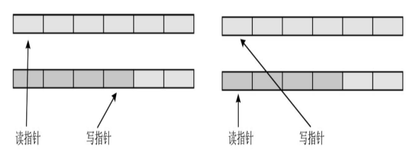
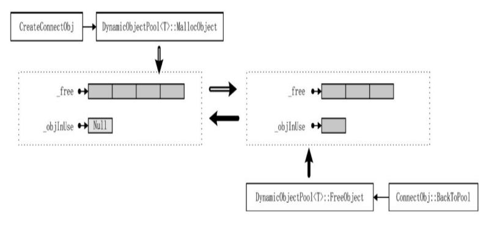

# 性能优化与对象池

## 性能优化与对象池

其中 05\_XX 部分.

学习嘛，要稳扎稳打，学习使用工具对程序性能检查，思考怎样让程序更加高效很重要。

### Vistual Studio 性能工具

Visual Stdudio 性能工具，就先不学了，暂时用不到

在多线程编程中，注意谨防并行编程串行

```cpp
void ThreadMgr::DispatchPacket(Packet *pPacket)
{
    // 主线程
    AddPacketToList(pPacket);
    // 子线程
    std::lock_guard<std::mutex> guard(_thread_lock);
    for (auto iter = _threads.begin(); iter != _threads.end(); ++iter)
    {
        Thread *pThread = iter->second;
        pThread->AddPacketToList(pPacket);
    }
}
void ThreadObjectList::AddPacketToList(Packet *pPacket)
{
    std::lock_guard<std::mutex> guard(_obj_lock);
    for (auto iter = _objlist.begin(); iter != _objlist.end(); ++iter)
    {
        ThreadObject *pObj = *iter;
        if (pObj->IsFollowMsgId(pPacket))
        {
            pObj->AddPacket(pPacket);
        }
    }
}
```

上面的代码中有哪些不足之处，要知道 ThreadMgr 只有一个，其管理多个线程，每个线程的 ThreadObjectList 下管理大量的 ThreadObject。 这样调用 DispatchPacket 明明只是需要将 Packet 交给每个线程就行了，其实并不需要关注每个线程怎么做。交给每个线程，每个线程自己在 Update 时再处理将 Packet 派发给 ThreadObject 就好了。 能够有效 ThreadMgr::DispatchPacket 从调用到返回的间隔。

在上一章节中，看到了使用 std::copy 开拷贝 std::list 中的 Packet 的操作，显然这是非常耗费事件的，所以对内存中的数据结构进行优化也非常的重要。

### 内存中的数据结构

数据结构是计算机组织数据的方式，精心选择的数据结构可以带来更高的 运行或者存储效率。下面会了解交换型数据结构与刷新型数据结构。

### 交换性数据结构

下面的样例就是一个典型的可以优化的

```cpp
void Network::SendPacket(Packet* pPacket){
    std::lock_guard<std::mutex> guard(_sendMsgMutex);
    _sendMsgList.push_back(pPacket);
}
//如果要处理这些放在List中的包
void Network::Update(){
    std::list<Packet*> _tmpSendMsgList;
    _sendMsgMutex.lock();
    std::copy(_sendMsgList.begin(),_sendMsgList.end(),std::back_inserter(_tmpSendMsgList));
    _sendMsgList.clear();
    _sendMsgMutex.unlock();
    for(auto pPacket:_tmpSendMsgList){
        //SendPacket
    }
    _tmpSendMsgList.clear();
}
```

这样虽然可以免去，在遍历包的时候持有锁，但是现在存在将指针数据进行 copy 的操作，这并不是一个高效的操作，进行 copy 会将持有锁的时间较长。在并发编程中造成效率低下。有没有一种空间换时间的可行方案呢？



其实可以采用两个 List，将原来的 copy 操作换为简单的将两个 List 指针变量存储的地址交换就好了。两个 List 指针变量存储的地址根据场景来换交换就能解决许多问题。

```cpp
template <class T>
class CacheSwap
{
public:
    std::list<T *> *GetWriterCache();
    std::list<T *> *GetReaderCache();
    void Swap();
    bool CanSwap();
    //...
private:
    std::list<T *> _caches1;
    std::list<T *> _caches2;
    std::list<T *> _readerCache;
    std::list<T *> *_writerCache;
};

template <class T>
void CacheSwap<T>::Swap()
{
    auto tmp = _readerCache;
    _readerCache = _writerCache;
    _writerCache = tmp;
}

// 当写数据队列中有数据时，需要对调
template <class T>
bool CacheSwap<T>::CanSwap()
{
    return _writerCache->size() > 0;
}
```

这些都是实战技巧。但是也应该注意线程安全问题，当有正在写正在读操作时，是不能进行指针交换操作的。

在以前的 ThreadObjectList 中存储线程需要为自己管理的 ThreadObject 进行 Packet 广播，在 ThreadObjectList 中可以使用 `CacheSwap<Packet>_cachePackets` ThreadMgr 将包发到`_cachePakcets`

```cpp
//ThreadMgr为ThreadObjectList添加包
void ThreadObjectList::AddPacketToList(Packet *pPacket)
{
    std::lock_guard<std::mutex> guard(_packet_lock);
    _cachePackets.GetWriterCache()->emplace_back(pPacket);
}
```

读数据则在 ThreadObjectList 进行 Update 的时候进行操作,现在优化前后 AddPacketToList 的效率会高很多。

```cpp
void ThreadObjectList::Update()
{
    //...
    _packet_lock.lock();
    if (_cachePackets.CanSwap())
    {
        _cachePackets.Swap();
    }
    _packet_lock.unlock();
    auto pList = _objlist.GetReaderCache();//ThreadObject存储在对象池
    auto pMsgList = _cachePackets.GetReaderCache();
    // 遍历线程管理的所有ThreadObject
    for (auto iter = pList->begin(); iter != pList->end(); ++iter)
    {
        auto pObj = (*iter);
        for (auto itMsg = pMsgList->begin(); itMsg != pMsgList->end(); ++itMsg)
        {
            auto pPacket = (*itMsg);
            if (pObj->IsFollowMsgId(pPacket))
                pObj->ProcessPacket(pPacket);
        }
        pObj->Update();
        ...
    }
    pMsgList->clear();
}
```

### 刷新性数据结构

在上面的 ThreadObjectList::Update 中，可以看见在进行 ThreadObject 遍历时，是调用了一个 GetReaderCache 方法。其实使用了 CacheRefresh 方式来存储。

```cpp
template<class T>
class CacheRefresh :public IDisposable
{
public:
	std::vector<T*>* GetAddCache();
	std::vector<T*>* GetRemoveCache();
	std::vector<T*>* GetReaderCache();

	std::list<T*> Swap();
	bool CanSwap();
    void Dispose() override;

protected:
	std::vector<T*> _reader;
	std::vector<T*> _add;
	std::vector<T*> _remove;
};

template <class T>
inline std::vector<T*>* CacheRefresh<T>::GetAddCache()
{
	return &_add;
}

template <class T>
inline std::vector<T*>* CacheRefresh<T>::GetRemoveCache()
{
	return &_remove;
}

template <class T>
inline std::vector<T*>* CacheRefresh<T>::GetReaderCache()
{
	return &_reader;
}

template <class T>
inline std::list<T*> CacheRefresh<T>::Swap()
{
	std::list<T*> rs;
    //添加要添加的
	for (auto one : _add)
	{
		_reader.push_back(one);
	}
	_add.clear();
    //删除要删除的
	for (auto one : _remove)
	{
		auto iterReader = std::find_if(_reader.begin(), _reader.end(), [one](auto x)
		{
			return x == one;
		});

		if (iterReader == _reader.end())
		{
            std::cout << "CacheRefresh Swap error. not find obj to remove. sn:" << one->GetSN() << std::endl;
		}
		else
		{
			rs.push_back(one);
			_reader.erase(iterReader);
		}
	}
	_remove.clear();
	return rs;//返回要删除的
}

template <class T>
inline bool CacheRefresh<T>::CanSwap()
{
	return _add.size() > 0 || _remove.size() > 0;
}

template<class T>
inline void CacheRefresh<T>::Dispose()
{
    for (auto iter = _add.begin(); iter != _add.end(); ++iter)
    {
        (*iter)->Dispose();
        delete (*iter);
    }
    _add.clear();

    for (auto iter = _remove.begin(); iter != _remove.end(); ++iter)
    {
        (*iter)->Dispose();
        delete (*iter);
    }
    _remove.clear();

    for (auto iter = _reader.begin(); iter != _reader.end(); ++iter)
    {
        (*iter)->Dispose();
        delete (*iter);
    }
    _reader.clear();
}
```

上面的代码其实写的针不错，这样的话大大减消了性能瓶颈，不然多个线程对同一个 list 进行删减增操作，抢锁激烈，性能也将堪忧。

```cpp
class ThreadObjectList: public IDisposable{
public:
    void AddObject(ThreadObject* _obj);
    ...
protected:
    std::mutex _obj_lock;
    CacheRefresh<ThreadObject> _objlist;
};
```

添加 ThreadObject 到 ThreadObjectList

```cpp
void ThreadObjectList::AddObject(ThreadObject* obj){
    std::lock_guard<std::mutex> guard(_obj_lock);
    ...
    _objlist.GetAddCache()->emplace_back(obj);
}
```

`CacheRefresh<ThreadObject> _objlist的Swap` 则需要在`ThreadObjectList::Update`内执行,这样效率更高。

```cpp
void ThreadObjectList::Update(){
    _obj_lock.lock();
    if(_objlist.CanSwap()){
        auto pDelList = _objlist.Swap();
        for(auto pOne:pDelList){
            pOne->Dispose();
            delete pOne;
        }
    }
    _obj_lock.unlock();
    //...
    auto pList = _objlist.GetReaderCache();
    //...
}
```

看来`多加一层缓冲`会发生很多神奇的操作。

### gprof

在 Linux 上也有很多简单好用的性能分析工具，其中之一就是 gprof，它是 GNU 套件中的一个工具。如每个函数的调用次数、调用时 长，可以方便找到系统的瓶颈。

```bash
root@drecbb4udzdboiei-0626900:/mes/tubekit/bin# gprof -v
GNU gprof (GNU Binutils for Ubuntu) 2.38
Based on BSD gprof, copyright 1983 Regents of the University of California.
This program is free software.  This program has absolutely no warranty.
```

使用 gprof 的时候需要注意一点，生成可执行文件时需要加参数“-pg”,执行可执行文件之后，在同目录下就会多出一个分析结果 gmon.out 文件。 如果同一个目录下有多个可执行文件都会生成 gmon.out 文件。但是 gmon.out 文件只有一个文件，所以不要在同一目录测试不同的可执行文件。

```bash
$gprof 可执行文件名称 gmon.out
#gprof导出txt文件
$gprof -b 可执行文件 gmon.out > output.txt
```

甚至还可以画出堆栈图,可以更直观在每个函数执行的效率。

```bash
$python
$yum -y update
$yum install graphviz
$yum-y install python-setuptools
#安装gprof2dot https://github.com/jrfonseca/gprof2dot
$tar xf gprof2dot-2017.09.19.tar.gz
$python setup.py install
#生成PHG文件
$gprof2dot output.txt > output.dot
$dot -Grankdir=LR -Tpng output.dot > output.png
#或者
$gprof2dot -n30 output.txt | dot -Grankdir=LR -Tpng > output.png
```

### 让进程安全退出

一般来说分为两种情况：一种情况是捕捉系统发出的退出信号；另一种是从第三方进程发来退出协议，例如 GM 管理工具。

但一般有以下几点：

1. 以信号的方式退出进程
2. 停止所有线程，释放相关资源

### valgrind

在 Linux 上除了 pgrof 外，还有内存检测工具 valgrind,在编译时需要“-O0 -g”参数，把代码优化等级降低即可

```bash
$tar xf valgrind-3.15.0.tar.bz2
$cd valgrind-3.15.0
$./configure
$make
$make install
$valgrind --version
```

使用 valgrind 检测可执行文件

```bash
$valgrind ./test_exe
```

其甚至可以找出，像数组访问出界的 bug。在使用 valgrind 时默认的选项是 memcheck，即内存检查，但除了内存检查之外，valgrind 也提供一些其他的功能，可以通过“--tool=tool name”指定其他的工具。

valgrind 也可以生成堆栈

```bash
valgrind --tool=callgrind ./test_pd
```

完成之后会发现目录中多了一个名为 callgrind.out.`pid` 的文件，其中 `pid` 是进程 ID，每次执行时的进程 ID 是不 一样的，所以每次生成的文件都不一样。生成 PNG 堆栈图的命令如下：

```bash
$gprof2dot -f callgrind -n10 -s callgrind.out.`pid` > valgrind.dot
$dot -Grankdir=LR -Tpng valgrind.dot > valgrind.png
```

如果需要查看子线程的调用，在生成 callgrind.out 分析文件时就需要加一个特别的参数“--separate-threads”。

```bash
$valgrind --tool=callgrind --separate-threads=yes ./exe
```

每个线程都会生成 callgrind.out

```bash
-rw------- 1 root root 0 Dec 19 09:44 callgrind.out.3226
-rw------- 1 root root 807341 Dec 19 09:45 callgrind.out.3226-01
-rw------- 1 root root 460828 Dec 19 09:45 callgrind.out.3226-02
-rw------- 1 root root 24664 Dec 19 09:45 callgrind.out.3226-03
-rw------- 1 root root 227029 Dec 19 09:45 callgrind.out.3226-04
-rw------- 1 root root 227029 Dec 19 09:45 callgrind.out.3226-05
```

valgrind 还可以检查内存泄露。

```bash
$valgrind --tool=memcheck --leak-check=full ./exe
```

关于 gprof 与 valgrind，这些我也没了解过，但也正常这是大佬用的东西，我只是个写业务代码的菜鸡而已。

### 对象池

所谓池，一定是众多的。可以这样理解对象池，就是提前生成若干个对象实例并放在池中，在需要时提出，不需要时重新回到池中。对象池的好处在于不需要频繁地创建和销毁对象。



在设计对象池池，也需要思想刷新性数据结构这种设计，可以有效削减对象池各方法的调用瓶颈。可以使用 queue 存储\_free，用 CacheRefresh 存储\_objInUse。

\_objInUse 则有 GetReaderCache、GetAddCache、GetRemoveCache.

对象池 FreeObject 时将指针存入\_objInUse 的 RemoveCache.

对象池 MallocObject 时，检查\_free 内有没有空余的,没有则 new 一个加入\_free,再从\_free 中取出一个空闲的，并将指针加入\_objInUse 的 AddCache。

对象池 Update 时，检测\_objInUse 是否可 Swap 可以则进行 Swap 得到要归还给\_free 的指针，然后将返回的指针加入到\_free.

对象池这种东西，可以查一下相关的大佬解答或者开源方案等，肯定比自己想的要到位。
