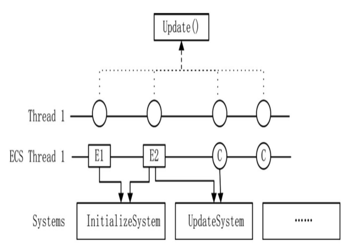
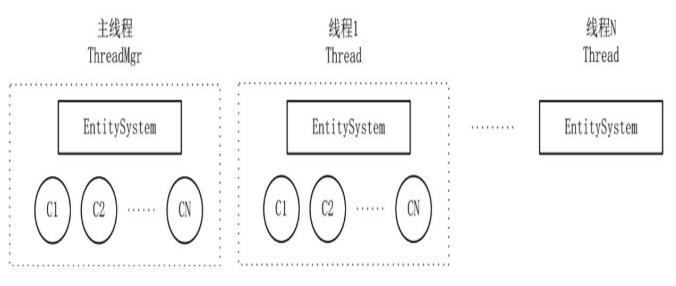
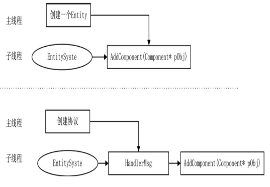
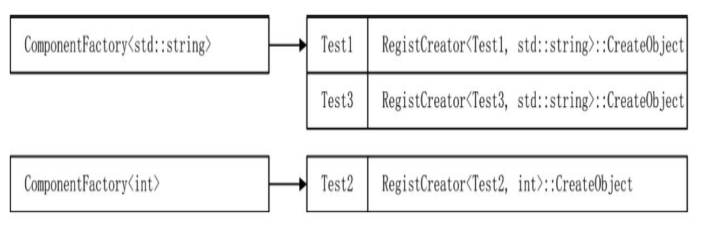
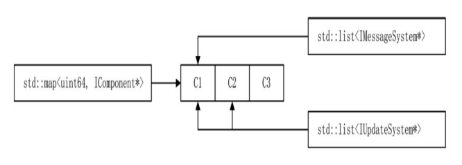

# 🚗 ECS 框架

## ECS 框架

其中 06_XX 部分.

简单来说，不论是多线程还是单线程，不断更新逻辑，对每个对象执行
Update 操作，是目前比较常用的一种框架体系。但这个框架中有一些问题，例
如需要每一个对象都继承自 ThreadObject 类，如果功能复杂，就可能出现虚继
承的情况。代码越写越多，其复杂度越来越高，继承的层数也会变得更深，这
给编码带来了不小的麻烦。在此基础上，要引入一个新的架构思路——ECS 框架。

### 什么是 ECS 工程

ECS 的全称为 Entity Component System，Entity 是实体，Component 是组
件，System 则指系统。Entity 中可以包括无数个 Component，具备某组件便具有
某功能，而 System 是控制这些组件的动作。

所有的 Object 都继承 ThreadObject，但是并不是实现的所有 Object 都需要定义自己的 Initialize、与 update。
可能只是写了个空的函数。

为了解决空函数的问题，提出了一个 System 框架，在 System 中定义了几种类型的动作。例如 InitializeSystem 是初始化动作，UpdateSystem 是更新系统，每一个动作都是一个接口。这意味着一个对象可以实现按需定义，如果需要初始化就实现 InitializeSystem 接口，如果需要 Update 就实现 UpdateSystem 接口。



每个实体可以根据自己的需求来选择，是否需要有这个动作来决定是否实现这些接口。

下面我们将从以前的面向对象编程，慢慢探索组件式编程的奇妙之旅。

### Component 与 Entity

1. 构建组件 Component 类,每一个组件都有唯一的 SN 标识，和一个父对象指针。

```cpp
class Entity;
class Component
{
public:
    virtual ~Component() = default;
    virtual void Dispose() = 0;
    void SetParent(Entity *pObj);
    Entity *GetParent() const;
    long GetSN() const;
    void SetSN(const long sn);

private:
    Entity *_parent{nullptr};
    long _sn{0};
};
void Component::SetParent(Entity *pObj)
{
    _parent = pObj;
}
Entity *Component::GetParent() const
{
    return _parent;
}
long Component::GetSN() const
{
    return _sn;
}
void Component::SetSN(const long sn)
{
    _sn = sn;
}
```

2. 实体 Entity 类

Entity 继承于 Component, 也就是 Entity 本身也是个 Component,Entity 下可以挂载多个 Component。被挂载的 Component 的\_parent 指向挂载自己的 Entity 对象地址。

```cpp
class Entity : public Component
{
public:
    void Dispose() override;
    void AddComponent(Component *obj);
    template <class T>
    T *GetComponent();

protected:
    std::map<long, Component *> _components;
};

template <class T>
T *Entity::GetComponent()
{
    auto iter = std::find_if(_components.begin(), _component.end(), [](std::pair < long, Component *) one)
    {
        //不能动态转换地址对应对象与T没有基类派生类关系
        if (dynamic_cast<T>(one.second) != nullptr)
        {
            return true;
        }
        return false;
    });
    if (iter == _components.end())
    {
        return nullptr;
    }
    return dynamic_cast<T>(iter->second)
}
```

再看下 AddComponent 与 Dispose 的实现

```cpp
void Entity::AddComponent(Component *pObj)
{
    pObj->SetParent(this);//这样每个Component本身就可以获取自己在那个Entity
    _components.insert(std::make_pair(pObj->GetSN(), pObj));
}

void Entity::Dispose()
{
    for (const auto &one : _components)
    {
        one.second->Dispse();
    }
}
```

### 系统类 System

定义 System 的接口，不同的 Object 可以根据自身的业务需求，按需实现。

```cpp
class ISystem
{
protected:
    ISystem() = default;

public:
    virtual ~ISystem() = default;
};

// Init接口 实现初始化操作
class IInitializeSystem : virtual public ISystem
{
protected:
    IInitializeSystem() = default;

public:
    virtual ~IInitializeSystem() = default;
    virtual void Initialize() = 0;
};

// Update接口 实现更新操作
class IUpdateSystem : virtual public ISystem
{
protected:
    IUpdateSystem() = default;

public:
    virtual ~IUpdateSystem() = default;
    virtual void Update();
};

// 为什么要用虚继承，因为同一个类可能同时实现IInitializeSystem与IUpdateSystem
// 不用虚继承就会产生ISystem的二义性
```

### 管理类 EntitySystem

管理类 EntitySystem 用于维护 Entity 和 Component 类,通俗的来讲就是将 Entity 与 Component 按照 System 接口的实现类型进行分类管理.

```cpp
class EntitySystem
{
public:
    virtual ~EntitySystem() = default;
    // 创建Component
    template <class T, typename... TArgs>
    T *CreateComponent(TArgs &&...args);
    virtual bool Update();
    void Dispose();

protected:
    std::list<IInitializeSystem *> _initializeSystems;
    std::list<IUpdateSystem> _updateSystem;
};
template <class T, typename... TArgs>
T *EntitySystem::CreateComponent(TArgs &&...args)
{
    std::cout << "create obj:" << typeid(T).name() << std::endl;
    auto component = new T(std::forward<TArgs>(args)...);
    const auto objInit = dynamic_cast<IInitializeSystem *>(component);
    if (objInit != nullptr)
    {
        _initializeSystems.push_back(objInit);
        return component;
    }
    const auto objUpdate = dynamic_cast<IUpdateSystem *>(component);
    if (objUpdate != nullptr)
    {
        _updateSystems.push_back(objUpdate);
        return component;
    }
    return component;
}
```

EntitySystem 有自己的 Update 与 Dispose,对需要 Init 的处理后,还会判断其是否实现了 Update,如果实现了 Update 则加入 Update 列表.

```cpp
bool EntitySystem::Update()
{
    while (_initializeSystems.size() > 0)
    {
        auto pComponent = _initializeSystems.front();
        pComponent->Initialize();
        _initializeSystems.pop_front();
        const auto objUpdate = dynamic_cast<IUpdateSystem *>(pComponent);
        if (objUpdate != nullptr)
        {
            _updateSystems.push_back(objUpdate);
        }
    }
    for (auto &iter : _updateSystems)
    {
        iter->Update();
    }
    return true;
}

void EntitySystem::Dispose()
{
    while (_initializeSystems.size() > 0)
    {
        auto pComponent = dynamic_cast<Component *>(_initializeSystems.font());
        pComponent->Dispose();
        _initializeSystems.pop_front();
    }
    for (auto &iter : _updateSystems)
    {
        auto pComponent = dynamic_cast<Component *>(iter);
        pComponent->Dispose();
    }
    _updateSystems.clear();
}
```

### ECS 大致效果

使用起来的实际效果大概是怎样的呢?

1. 实现 Entity

```cpp
class TestEntityWithUpdate : public Entity, public IUpdateSystem
{
public:
    virtual void Update() override;

private:
    bool _isShow{false};
};
class TestEntityWithInitAndUpdate : public Entity, public IInitializeSystem, public IUpdateSystem
{
public:
    virtual void Initialize() override;
    virtual void Update() override;

private:
    bool _isShow{false};
};
void TestEntityWithInitAndUpdate::Initialize()
{
    std::cout << typeid(this).name() << "::" << "Initialize" << std::endl;
}
void TestEntityWithInitAndUpdate::Update()
{
    if (_isShow)
        return;

    std::cout << typeid(this).name() << "::" << "Update" << std::endl;
    _isShow = true;
}
void TestEntityWithUpdate::Update()
{
    if (_isShow)
        return;
    std::cout << typeid(this).name() << "::" << "Update" << std::endl;
    _isShow = true;
}
```

2. 实现 Component

```cpp
class TestCUpdate : public Component, public IUpdateSystem
{
public:
    void Dispose() override;
    void Update() override;

private:
    bool _isShow{false};
};
void TestCUpdate::Dispose()
{
}
void TestCUpdate::Update()
{
    if (_isShow)
        return;
    std::cout << typeid(this).name() << "::" << "Update" << std::endl;
    _isShow = true;
}
```

```cpp
class TestCInit :public Component, public IInitializeSystem
{
public:
	void Initialize() override;
	void Dispose() override;
};
void TestCInit::Initialize()
{
    std::cout << typeid(this).name() << "::" << "Initialize" << std::endl;
}
void TestCInit::Dispose()
{
}
```

使用效果

```cpp
int main()
{
    EntitySystem eSys;
    auto pEntity1 = eSys.CreateComponent<TestEntityWithInitAndUpdate>();
    auto pEntity2 = eSys.CreateComponent<TestEntityWithUpdate>();

    const auto pCInit = eSys.CreateComponent<TestCInit>();
    pEntity1->AddComponent(pCInit);

    const auto pCUpdate = eSys.CreateComponent<TestCUpdate>();
    pEntity2->AddComponent(pCUpdate);

    //进行AddComponent后,pCInit与pCUpdate内部就可以去到自己所挂载在的Entity

    while (true)
    {
        eSys.Update();
    }
}
```

现在其实还是存在些问题的,其实如 TestEntityWithInitAndUpdate 应该自己所挂载在的 Entity 来执行自己的 Initial 与 Update,而不是由 EntitySytem 直接管理.

### 这种骚操作真的好吗

像这样的代码简直晦涩难懂,但是向顶层提供了简介的使用方式,这样的设计还是不错的.

### 基于 ECS 的 Server



现在每个 Thread 都应有一个 EntitySystem,这与以前的设计不同的大致有:

1. 不需要基类 ThreadObject,由 Entity 或者 Component 代替.
2. ThreadMgr 作为主线程的对象,除了进行线程管理之外,也需要继承 EntitySystem,在主线程中也有全局的 Entity 或 Component 需要管理.
3. 线程类 Thread 需要集合 EntitySystem 类的功能,Thread 管理 std::thread 对象,而基类 EntitySystem 打理线程中的 Entity 或 Component(相当于原来的 ThreadObject).
4. 增加一些基础的 System 类,如 UpdateSystem 和 MessageSystem.

这样一来,在新的框架设计中,生成对象是由 EntitySystem 对象统一生成的,生成对象的同时需要对这些对象特征进行分析,放置到不同的系统中,如新对象是否实现了 IMessageSystem 接口,决定了它是否需要进行消息处理,实现了 IUpdateSystem 接口决定了它需要每帧更新.

### 通过字符串动态创建类

现在首先要解决一个问题,在原来是将创建的 ThreadObject 发给 ThreadMgr,然后由 ThreadMgr 决定放入到哪一个 Thread 中.
现在创建对象是由每个线程中的 EntitySystem 来进行 Entity 或者 Component 创建的.

以前的 ThreadObject 例如 Account 处理登录 Message 的 ThreadObject

```cpp
void LoginApp::InitApp(){
  ...
  Account* pAccount = new Account();
  _pThreadMgr->AddObjToThread(pAccount);
}
```

新框架中有了 EntitySystem，用于维护和创建对象，所有的类都在这里被创建和销毁，以方便管理。首先，我们不希望这条规则被破坏，其次，如果需要跨线程创建对象，就存在加锁的问题。实际上，跨线程创建的对象非常有限，为了一些有限的类，每帧都要加锁，显然是一个不值得的事情。



所以 Actor 中能用协议解决的,就用收发协议解决.

例如我们想要生成两个 Component 到 EntitySystem 中.

```cpp
class Test1 : public Component
{
public:
    Test1(const std::string p1)
    {
        std::cout << "create test p1:" << p1.c_str() << std::endl;
    }
};

class Test2 : public Component
{
public:
    Test2(const int p1)
    {
        std::cout << "create test2 p2" << p1 << std::endl;
    }
};
```

会发现,虽然两个类都继承 Component,但是 Test1 和 Test2 的构造函数参数完全不同,对于对象的生成方式还要详细设计.

### 类工厂 ComponentFactory

类工厂的作用是为需要生成的类注册其生成函数,并在适当的时机调用以生成实例.

```cpp
template <typename... Targs>
class ComponentFactory
{
public:
    static ComponentFactory *Instance()
    {
        if (nullptr == _instance)
        {
            _instance = new ComponentFactory();
        }
        return _instance;
    }
    // 为Component注册创建对象的函数
    bool Regist(const std::string &strTypeName, std::function<Component *(Targs &&...args)> pFunc);
    // 创建Component对象,指定typeName,与构造函数参数
    Component *Create(const std::string &strTypeName, Targs &&...args);

private:
    ComponentFactory(){};
    static ComponentFactory<Targs...> *_instance;
    std::unordered_map<std::string, std::function<Component *(Targs &&...)>> _map;
};

template <typename... Targs>
ComponentFactory<Targs...> *ComponentFactory<Targs...>::_instance = nullptr;

template <typename... Targs>
bool ComponentFactory<Targs...>::Regist(const std::string &strTypeName, std::function<Component *(Targs &&...args)> pFunc)
{
    if (nullptr == pFunc)
    {
        return false;
    }
    const bool bReg = _map.insert(std::make_pair(strTypeName, pFunc)).second;
    return bReg;
}

template <typename... Targs>
Component *ComponentFactory<Targs...>::Create(const std::string &strTypeName, Targs &&...args)
{
    auto iter = _map.find(strTypeName);
    if (iter == _map.end())
    {
        return nullptr;
    }
    else
    {
        return iter->second(std::forward<Targs>(args)...);
    }
}
```

这样一来,相同构造函数参数的类生成函数将会在同一个 ComponentFactory 里面.

### 注册类 RegistCreator

现在问题就是,我们不可能为每个类手写对象生成函数.使用模板类解决.

```cpp
template <typename T, typename... Targs>
class RegistCreator
{
public:
    RegistCreator()
    {
        std::string strTypeName = typeid(T).name();
        ComponentFactory<Targs...>::Instance()->Regist(strTypeName, CreateObjcet);
    }
    static T *CreateObject(Targs &&...args)
    {
        return new T(std::forward<Targs>(args)...);
    }
};
```

这样的话只需要去创建相应的 RegistCreator 对象,就会自动的将生成函数挂载到 ComponentFactory.

现在就可以使用工厂创建类了.

```cpp
template <typename... Targs>
Component *CreateComponent(const std::string &strTypeName, Targs &&...args)
{
    Component *p = ComponentFactory<Targs...>::Instance()->Create(strTypeName, std::forward<Targs>(args)...);
    return p;
}
int main()
{
    // 注册生成函数
    RegistCreator<Test1, std::string>();
    RegistCreator<Test2, int>();
    Component *pCTest1 = CreateComponent(typeid(Test1).name(), std::string("Test1"));
    Component *pCTest2 = CreateComponent(typeid(Test2).name(), 2);
    Component *pCTest3 = CreateComponent(typeid(Test3).name(), std::string("Test3"));
}
```

不得不说看了这些代码也是打开简介,模板编程玩出了一定的高度,分析以下现在模板类生成的类与内存结构.



生成了两个 ComponentFactory 对象,三个 RegistCreator 对象,其实还可以不适用 RegistCreator

```cpp
RegistCreator<Test1, std::string>();
ComponentFactory<std::string>::Instance()->Regist(typeid(Test1).name(),Test1::CreateObject);
```

直接在相应类里面写静态方法,两者各有利弊吧,一个是使用方便,一个是节省空间.

### 提供多参变量来创建实例

现在还是存在问题的,也就是在我们发送消息进行创建对象时是怎样传递参数的,不可能像`CreateComponent(typeid(Test1).name(), std::string("Test1"));`这样,因为参数不是动态参数,很难做到通用传递参数.

可以使用 protobuf

```proto
message CreateComponentParam{
  enum ParamType{
    Int = 0;
    String = 1;
  }
  ParamType type = 1;
  int32 int_param = 2;
  string string_param = 3;
}
message CreateComponent{
  string class_name = 1;
  repeated CreateComponentParam params = 2;
}
```

加入下面的 DataInfo 就是从 protobuf 消息中反序列化得来的.

```cpp
struct DataInfo
{
	bool IsInt;
	int IntVal;
	std::string StrVal;
	DataInfo(const int value)
	{
		IsInt = true;
		IntVal = value;
		StrVal = "";
	}
	DataInfo(const std::string value)
	{
		IsInt = false;
		IntVal = 0;
		StrVal = value;
	}
};
```

### DynamicCall 模板

这段代码将 `std::list<DataInfo>`所有的数据展开，最终会传入
`ComponentFactoryEx` 模板函数中。这段代码看似短小，但却难以理解，它使用了 C++14 的一个语法——`std::index_sequence`。
首先来看 DynamicCall 这个结构，在结构中有一个模板函数，该模板函数有一个递归操作，操作的目
的是根据传入的 params 将数据一个一个转到 `std::tuple` 类型中。`std::tuple` 是一个可以包括所有类型的容器。在
每一个递归调用中，从 params 取出第一个数据，再将这个数据增加到 `std::tuple<TArgs...>t1` 数据的后面，不断循
环，直到 params 没有数据为止。当 params 大小等于 0 时，`std::tuple<TArgs...>t1` 就有了所需的所有参数。这时，调
用模板 ComponentFactoryEx 生成实例类。

```cpp
template<int ICount>
struct DynamicCall
{
	template<typename...TArgs>
	static void Invoke(std::string className, std::tuple<TArgs...> t1, std::list<DataInfo>& params)
	{
		if (params.size() == 0)
		{
			ComponentFactoryEx(className, t1, std::make_index_sequence<sizeof...(TArgs)>());
			return;
		}
		const DataInfo info = (*params.begin());
		params.pop_front();
		if (info.IsInt)
		{
			auto t2 = std::tuple_cat(t1, std::make_tuple(info.IntVal));
			DynamicCall<ICount - 1>::Invoke(className, t2, params);
		}
		else
		{
			auto t2 = std::tuple_cat(t1, std::make_tuple(info.StrVal));
			DynamicCall<ICount - 1>::Invoke(className, t2, params);
		}
	}
};
template<>
struct DynamicCall<0>
{
	template<typename...TArgs>
	static void Invoke(std::string className, std::tuple<TArgs...> t1, std::list<DataInfo>& params)
	{
	}
};

template <typename... TArgs, size_t... Index>
void ComponentFactoryEx(std::string className, const std::tuple<TArgs...>& args, std::index_sequence<Index...>)
{
	auto c1 = ComponentFactory<TArgs...>::GetInstance()->Create(className, std::get<Index>(args)...);
}
```

现在使用的样例如下面所示,C++虽然是静态语言,但是可以做到像动态一样灵活,只恨自己太菜了啊.

```cpp
int main()
{
    RegistToFactory<C1, std::string, std::string>();
    std::list<DataInfo> params;
    params.push_back(DataInfo("v1"));
    params.push_back(DataInfo("test c1"));
    DynamicCall<5>::Invoke(typeid(C1).name(), std::make_tuple(), params);
    RegistToFactory<C2, int, std::string>();
    params.clear();
    params.push_back(DataInfo(1));
    params.push_back(DataInfo("test c2"));
    DynamicCall<5>::Invoke(typeid(C2).name(), std::make_tuple(), params);
    return 0;
}
```

### 将 ECS 融入 Actor

后面的内容暂时只是顺便记录，因为读书尽量在短时间内过一遍，然后读两遍，笔记后面慢慢补充。

1. 基础类 Component 与 Entity

首先需要定义 Component，内部需要记录其父 Entity 指针、所在 EntitySystem、以及其对象池指针，将 Component 归还到
对象池的方法等。

而 Entity 继承 Component,也有归还到对象池的操作，此外 Entity 管理多个 Component,具有 AddComponent、GetComponent 方法。
内部使用`std::map<uint64,IComponent*> _components`存储 Component 指针。

2. EntitySystem

在之前，线程 Thread 类有两个重要的任务：一是用来管理线程中的对象；二是处理消息。线程管理类
ThreadMgr 有 3 个任务：一是管理线程；二是处理消息；三是管理主线程中的全局对象。现在，我们需要将线程类和
线程管理类中关于对象以及消息管理的部分提炼出来，这一部分的功能交由新的 EntitySystem 类来完成。

```cpp
class EntitySystem : virtual public SnObject, public IDisposable
{
public:
    //...
protected:
    std::list<IUpdateSystem *> _updateSystems;
    std::list<IMessageSystem *> _messageSystems;
    std::map<uint64, IComponent *> _objSystems; // 所有对象
    CacheSwap<Packet> _cachePackets;            // 本线程中的所有待处理协议包
};
```

作为基类 ThreadObject 承担了初始化、消息注册、更新的所有操作。现在这些操作被提取出来了，变成了一个
又一个接口。



3. 创建 Entity 与 Component

在 EntitySystem 中定义,从对象池中进行 MallocObject,然后将 Component 使用 AddToSystem 加入到 EntitySystem.

```cpp
template<class T, typename ...TArgs>
T* EntitySystem::AddComponent(TArgs... args);
```

判断 Component 实现了哪些接口，而选择加入到哪些 list 中,如 Component 实现了 IMessageSystem 则需调用接口的 RegisterMsgFunction,然后加入到\_messageSysytems。

```cpp
void EntitySystem::AddToSystem(IComponent* pComponent);
```

对于 Entity 也有自己的`AddComponent`与 `AddToSystem`,其`AddComponent`同理从对象池 Malloc 对象，然后调用
`AddToSystem`，其中`AddToSystem`只是进行 SetParent、`_component.insert`操作，还要进行`GetEntitySystem()->AddToSystem(pComponent)`
总之 Component 是被 EntitySystem 总管的。

4. 实体更新操作

直接让封装的 Thread 继承 EntitySystem,`Thread::Start()`只需用`std::thread`配和 lambda 表达式开个新线程，内部循环加一些线程
退出的设计，循环内进行`Update()`与 Sleep。

`EntitySystem::Update`内会进行将协议包分给旗下 Component(使用`EntitySystem::UpdateMessage`实现)，同时会执行所有 Component 的 Update。

在`EntitySystem::UpdateMessage`内，会对`_cachePackets`进行 Swap,GetReaderCache 操作。然后会进行对 Packets 遍历
每次循环内会遍历其下\_messageSystems 内的所有接口，调用其 IsFollowMsgId 等进行判断，根据策略决定是否调用接口的
`ProcessPacket`将协议包发给 Component。

### 用 ESC 模式看 Login

1. Account 类

原本是处理登录请求协议的 ThreadObject,现在的 Account 继承 Component，实现 MessageSystem 与 AwakeFromPoolSystem 接口

```cpp
class Account : public Component<Account>, public IMessageSystem, public IAwakeFromPoolSystem<>
{
public:
    void AwakeFromPool() override {}
    void RegisterMsgFunction() override;
    virtual void BackToPool() override;
    //...
private:
    LoginObjMgr _playerMgr;
};
```

其中 IAwakeFromPoolSystem 接口，是为了设计一种当从对象池 Malloc 的是否，需要对对象进行一定的操作，实现这种接口，并在对象池内判断是否实现了此接口，如果有就在 MallocObject 返回前先执行对象的 AwakeFromPool 方法，这样一来就很好的设计了这么一种机制。

在 ESC 现在，发起 Http 请求的 ThreadObject 也应该用 Component 来实现了。

2. 动态创建组件或实例

在 ESC 中，创建一个实体，不再直接进行创建操作，而是在 InitApp 时，使用协议创建。

```cpp
void LoginApp::InitApp() {
 _pThreadMgr->CreateComponent<NetworkListen>(std::string("127.0.0.1"), 2233)
 _pThreadMgr->CreateComponent<RobotTest>();
 _pThreadMgr->CreateComponent<Account>();
}
template <class T, typename... TArgs>
inline void ThreadMgr::CreateComponent(TArgs... args)
{
    std::lock_guard<std::mutex> guard(_create_lock);
    const std::string className = typeid(T).name();
    if (!ComponentFactory<TArgs...>::GetInstance()->IsRegisted(className))
    {
        RegistToFactory<T, TArgs...>();
    }
    Proto::CreateComponent proto;
    proto.set_class_name(className.c_str());
    AnalyseParam(proto, std::forward<TArgs>(args)...); // 参数分析
    auto pCreatePacket = new Packet(Proto::MsgId::MI_CreateComponent, 0);
    pCreatePacket->SerializeToBuffer(proto);
    _createPackets.GetWriterCache()->emplace_back(pCreatePacket);
}
```

注册 Component 的工厂函数，创建 Component 创建协议加入到\_createPackets 中，在 Update 的时候进行处理。

`ThreadMgr::AnalyseParam`是个很重要的方法。

4. ThreadMgr 本身也是个 EntitySystem

对于 Component 被创建到那个线程，这需要一定的负载均衡设计。

```cpp
class ThreadMgr : public Singleton<ThreadMgr>, public EntitySystem
{
public:
    //...
private:
    size_t _threadIndex{0}; // 实现线程对象均衡
    // 创建组件消息
    std::mutex _create_lock;
    CacheSwap<Packet> _createPackets;
};
void ThreadMgr::Update()
{
    _create_lock.lock();
    if (_createPackets.CanSwap())
    {
        _createPackets.Swap();
    }
    _create_lock.unlock();
    auto pList = _createPackets.GetReaderCache();
    for (auto iter = pList->begin(); iter != pList->end(); ++iter)
    {
        const auto packet = (*iter);
        if (_threadIndex >= _threads.size())
            _threadIndex = 0;
        _threads[_threadIndex]->AddPacketToList(packet);
        _threadIndex++;
    }
    pList->clear();
    EntitySystem::Update();
}
```

3. CreateComponentC 组件

其作用是在每个线程内进行 Component 创建协议的处理，并创建相应的 Component 到 EntitySystem

```cpp
class CreateComponentC : public Entity<CreateComponentC>, public IMessageSystem, public IAwakeFromPoolSystem
{
public:
    void AwakeFromPool() override{};
    void RegisterMsgFunction() override;
    void BackToPool() override;

private:
    void HandleCreateComponent(Packet *pPacket) const;
    //...
};
```

对于 CreateComponent 的创建则需要在`EntitySystem::InitComponent`内就要将组件加入到 EntitySystem

```cpp
void EntitySystem::InitComponent() {
 AddComponent<CreateComponentC>();
}
void CreateComponentC::RegisterMsgFunction()
{
    auto pMsg = new MessageCallBackFunction();
    this->AttachCallBackHandler(pMsg);
    // 注册MI_CreateComponent的处理函数
    pMsg->RegisterFunction(Proto::MsgId::MI_CreateComponent, BindFunP1(this, &CreateComponentC::HandleCreateComponent));
}
void CreateComponentC::HandleCreateComponent(Packet *pPacket) const
{
    Proto::CreateComponent proto = pPacket->ParseToProto<Proto::CreateComponent>();
    const std::string className = proto.class_name();
    if (proto.params_size() >= 5)
    {
        return;
    }
    auto params = proto.params();
    const auto pObj = DynamicCall<5>::Invoke(GetEntitySystem(), className, std::make_tuple(), params);
    if (pObj == nullptr)
    {
        std::cout << " !!!! CreateComponent failed. className:" << className.c_str() << std::endl;
    }
}
```

### ECS 框架下的网络通信

网络通信需要客户端与服务端，两种同时考虑进去。

1. Network 类

Network 也是一个组件

```cpp
class Network : public ThreadObject, public ISocketObject { ... }
class Network : public Entity<Network>, public IMessageSystem, public INetwork { ... }
class INetwork :public ISocketObject {
public:
 virtual ~INetwork() = default;
 virtual void SendPacket(Packet*& pPacket) = 0;
};
```

不论何时都可以向一个 Network 调用 SendPacket 函数发送 Packet 数据，这一流程是做了加锁处理的,因为是跨线程使用的。

2. NetworkListen 与 NetworkConnector

```cpp
class NetworkListen : public Network, public IUpdateSystem, public IAwakeFromPoolSystem<std::string, int>
{
public:
    void AwakeFromPool(std::string ip, int port);
    void Update() override;

protected:
    virtual int Accept();
};

void NetworkListen::AwakeFromPool(std::string ip, int port)
{
    if (::listen(_masterSocket, SOMAXCONN) < 0)
    {
        std::cout << "::listen failed." << _sock_err() << std::endl;
        return;
    }
    //    ...
}
```

其中 NetworkConnector 则要在 AwakeFromPool 时进行目标主机的 Connect,其实 Connect 都可以做成非阻塞 Connect,在 Update 时进行状态检查。

```cpp
void NetworkConnector::AwakeFromPool(std::string ip, int port)
{
    //...
    Connect(ip, port);
}
```

每个在对象池中的对象都在 AwakeFromPool 函数中实现了自身特点的编码，这使得所有类具有一致性，底层不关心
类的真正作用，只需要调用 AwakeFromPool 函数即可。

3. NetworkLocator 组件

为了便于发送协议，新增名为 NetworkLocator 的组件，该组件是一个全局组件。这是一个网络层的定位组件，因
为在某个进程中可能存在多个 Network 网络实例，这些网络对象可能是对外连接的 NetworkConnector，也可能是一个监
听对象 NetworkListen。NetworkLocator 组件的作用是为了快速找到 NetworkListen 或 NetworkConnector 的实例，用于
发送数据。

```cpp
class NetworkLocator : public Component<NetworkLocator>, public IAwakeFromPoolSystem<>
{
public:
    void AwakeFromPool() override{};
    void BackToPool() override;
    void AddListenLocator(INetwork *pNetwork, NetworkType networkType);
    INetwork *GetListen(NetworkType networkType);
    ... private : std::mutex _lock;
    std::map<APP_TYPE, std::map<int, INetwork *>> _connectors;
    // 可能存在两个listen, 即tcp和http同时存在
    std::map<NetworkType, INetwork *> _listens;
};
```

在 ServerApp 类的构造函数中，这个组件就被创建出来了，放在了主线程中。

```cpp
ServerApp::ServerApp(APP_TYPE appType)
{
    //...
    _pThreadMgr->AddComponent<NetworkLocator>();
}
```

当 NetworkListen 类被唤醒时，调用了 NetworkLocator：：AddListenLocator 函数，将其注册到 Locator 组件中。
根据类型将创建的 NetworkListen 指针放在 std：：map<NetworkType，INetwork\*>字典中以备使用。

```cpp
void NetworkListen::AwakeFromPool(std::string ip, int port)
{
    auto pNetworkLocator = ThreadMgr::GetInstance()->GetComponent<NetworkLocator>();
    pNetworkLocator->AddListenLocator(this, NetworkTcpListen);
    ...
}
void NetworkLocator::AddListenLocator(INetwork *pNetwork, NetworkType networkType)
{
    std::lock_guard<std::mutex> guard(_lock);
    _listens[networkType] = pNetwork;
}
```

需要发送数据时，IMessageSystem 中提供了一个静态函数 SendPacket，在 SendPacket 中使用到了 NetworkLocator
组件。

```cpp
void IMessageSystem::SendPacket(Packet *pPacket)
{
    auto pNetworkLocator = ThreadMgr::GetInstance()->GetComponent<NetworkLocator>();
    auto pNetwork = pNetworkLocator->GetNetworkConnector(pPacket->GetSocket());
    if (pNetwork != nullptr)
    {
        pNetwork->SendPacket(pPacket);
        return;
    }
    // 最后试着向listen发送数据
    pNetwork = pNetworkLocator->GetListen(NetworkTcpListen);
    pNetwork->SendPacket(pPacket);
}
```

这里其实不是很完善，在发送 Packet 数据时，根据 Packet 中的 Socket 值可以找到一个对应的 INetwork 实例，这个 INetwork 实例可能是
NetworkConnector，也可能是 NetworkListen 中的一个 Socket 通道。先找一找有没有对应的 NetworkConnector 实
例，如果没有找到，就转到 NetworkListen 中进行处理。

### YAML

用 YAML 来配置服务器配置很好，对于游戏开发来说有两种配置：策划文档的配置、程序运行时的配置。

策划文档与游戏逻辑息息相关。例如，有多少张地图，有多少个 NPC，每
个 NPC 有什么样的属性，每个角色有多少技能，每个技能有什么效果。策划文
档的配置方案在程序端的实现非常多样，可以用 CSV，可以用 TXT，可以挂 Lua
脚本，也可以使用 Python，方法多种多样，没有好坏之分。

cpp 使用 yaml 可以用 [https://github.com/jbeder/yaml-cpp](https://github.com/jbeder/yaml-cpp)

可以发封装自己的 YamlConfig 类，用一个单例模式的 Yaml 对象进行管理。Yaml 类提供`GetConfig` `LoadConfig`、以及用 map 维护 key 与 加载到的 Config。

Yaml 的加载与初始化，在 App 进行 InitApp 时就进行处理。

### 合并线程

在 yaml 配置文件中应该支持设置线程数量，如果设置为单线程，代码需要一定的处理，特殊化处理单线程。

```cpp
ServerApp::ServerApp(APP_TYPE appType)
{
    //...
    const auto pLoginConfig = dynamic_cast<AppConfig *>(Yaml::GetInstance()->GetConfig(_appType));
    for (int i = 0; i < pLoginConfig->ThreadNum; i++)
    {
        _pThreadMgr->CreateThread();
    }
    //...
}
```

如果是单线程，则由`ThreadMgr::Update`处理时加入到`ThreadMgr`的`AddPacketToList`

```cpp
void ThreadMgr::Update()
{
    _create_lock.lock();
    if (_createPackets.CanSwap())
    {
        _createPackets.Swap();
    }
    _create_lock.unlock();
    auto pList = _createPackets.GetReaderCache();
    for (auto iter = pList->begin(); iter != pList->end(); ++iter)
    {
        const auto packet = (*iter);
        if (_threads.size() > 0)
        {
            if (_threadIndex >= _threads.size())
                _threadIndex = 0;
            _threads[_threadIndex]->AddPacketToList(packet);
            _threadIndex++;
        }
        else
        {
            // 单线程
            AddPacketToList(packet);
        }
    }
    pList->clear();
    EntitySystem::Update();
}
```

### log4cpuls

服务端有两种日志：一种是常规日志，用于后台的打印输出，以便在需要时查看；另一种是对游戏逻辑内的物品进行跟踪的日志，这类日志需要存入数据，以方便进行物品跟踪，其数据也可为分析策划所用。
前者为运行时日志，采用文件系统，后者采用数据库存储。

[https://github.com/log4cplus/log4cplus/releases](https://github.com/log4cplus/log4cplus/releases)

log4 有自己的配置文件，日志等级、记录方式(控制台或文件)、日志文件大小限制。

可以看仓库的介绍之类的，进行学习。如果要深入学习，可以参考大佬们写的日志系统，自己用 cpp 写一个锻炼自己。进行造轮子。
