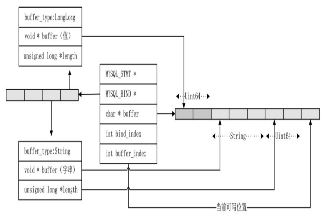
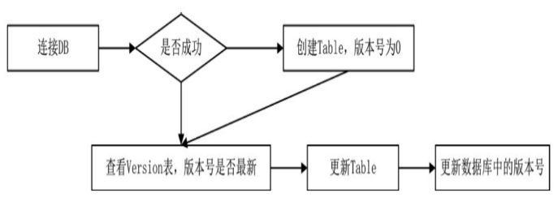
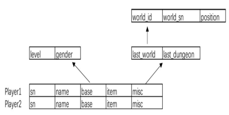
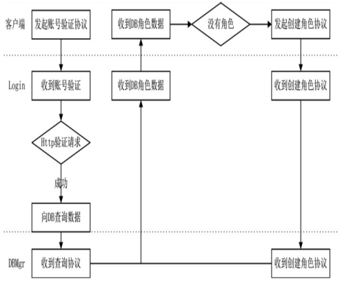

# 🚗 MYSQL 数据库

## MYSQL 数据库

存储是网络游戏开发中不可缺少的部分。在存储方面，不同的游戏公司采用不同的数据库，有使用 MySQL 的，也有使用 MongoDB 的。游戏数据库版本迭代加快，直接在数据库中存储 Blob 数据，
是与 Web 较为不同有特色的点。

### MySQL Connector/C

调用 MySQL 时，使用的第三方库为 MySQL 的 Connector/C。一般不使用 Connector/C++。Connector/C++与
Connector/C 的区别在于 C++版本采用了类的方式操作数据库，而 C 语言版本只提供 API，根据框架的自身特点，C 语言版
本可能更适合一些，而且它更方便、高效。

### 初始化库

```cpp
int mysql_library_init(int argc, char **argv, char **groups)
void mysql_library_end(void)
```

函数 mysql_library_init 和 mysql_library_end 是一对用于初始化和释放的函数。
mysql_library_init 需要在调用其他函数之前调用，用来初始化 MySQL 库。而 mysql_library_end 调用可以释放内
存，在调用 mysql_close 之后调用，以帮助释放内存数据。

### 创建数据库对象指针

```cpp
MYSQL *mysql_init(MYSQL *mysql)
```

该函数有两种用法：一种是传入 MySQL 对象；另一种是传入 nullptr 参数。两种调用都会返回 MySQL 对象指针，如果
有传入值，传入返回的对象就是同一个；如果传入的参数为 nullptr，就会返回一个实例。这两者的差别在于谁来管理
MySQL 对象的实例，如果是在外部创建的对象，在调用 mysql_close 之后就需要手动释放该对象，以免造成内存泄漏。
如果是由 mysql_init 创建的对象，就只需要关闭连接。

### 销毁现有对象指针

```cpp
void mysql_close(MYSQL *mysql)
```

该函数用于关闭一个连接，如果 MySQL 实例是库生成的，该函数就会同时释放该对象。

### 连接函数

```cpp
MYSQL *mysql_real_connect(MYSQL *mysql, const char *host, const char *user, const char *passwd, const char *db, unsigned int port, const char *unix_socket, unsigned long client_flag);
```

第 5 个参数为想要连接的数据库的名字，可以为 nullptr，表示只是想产生一个连接，但不选择具
体数据库，后续调用其他函数选定具体的数据库。

连接一个给定名字的数据库时，如果这个数据库不存在，就会出现错误，而 MySQL 对象也不可再用，需要关
闭。鉴于这种情况，在第一次连接时就可以将数据库名设为 nullptr，让它进行一个默认的连接，再调用
mysql_select_db 函数进行数据库的选择，若选择失败，则说明所需的数据库不存在，这时可以创建需要的数据库。

### 设置属性

```cpp
int mysql_options(MYSQL *mysql, enum mysql_option option, const void *arg)
```

该函数是在 mysql_init 之后、mysql_real_connect 之前调用的，对 MySQL 对象进行一些属性设置  
常用属性：

- MYSQL_OPT_CONNECT_TIMEOUT: 设置连接超时
- MYSQL_OPT_RECONNECT: 是否自动连接

### 选择数据库

```cpp
int mysql_select_db(MYSQL *mysql, const char *db)
```

该函数输入一个需要连接的数据库名。返回值 0 表示成功，非 0 即为出错编号。该函数指定一个数据库作为当前选
中的数据库。在调用该函数时，如果用户没有指定数据库的权限就会出错。

### 错误代码

```cpp
unsigned int mysql_errno(MYSQL *mysql)
```

在每一个函数调用之后，如果出现错误，就可以通过调用函数 mysql_errno 得到当前错误的编号。

### ping 函数

```cpp
int mysql_ping(MYSQL *mysql)
```

该函数检查连接是否处于正常工作中。在函数 mysql_options 的设置中，可以打开自动连接的开关，当网络断开时，调用 mysql_ping 会自动重新连接。

### MysqlConnector 组件

MysqlConnector 类基于 MysqlBase 类，该类中实现了 IMessageSystem 接口，
处理诸如查询角色或创建角色这样的协议，MysqlBase 类则提供了连接 MySQL 以及读取和查询的基本功能。

```cpp
class MysqlConnector : public MysqlBase, public Entity<MysqlConnector>, public IMessageSystem, public IAwakeFromPoolSystem<>{}
```

```cpp
class MysqlBase
{
public:
    bool ConnectInit();
    virtual void Disconnect();
    //...
protected:
    DBConfig* _pDbCfg{ nullptr };
    MYSQL* _pMysql{ nullptr };
    MYSQL_RES* _pMysqlRes{ nullptr };
    int _numFields{ 0 };
    MYSQL_FIELD* _pMysqlFields{ nullptr };
};
```

连接数据库,在`MysqlConnector::AwakeFromPool`进行

```cpp
void MysqlConnector::AwakeFromPool(){
  auto pYaml = Yaml::GetInstance();
  auto pConfig = pYaml->GetConfig(APP_DB_MGR);
  auto pDbConfig = dynamic_case<DBMgrConfig*>(pConfig);
  _pDbCfg = pDbConfig->GetDBConfig(DBMgrConfig::DBTypeMysql);
  if(_pDbCfg == nullptr){
    LOG_ERROR("Failed to get mysql config");
    return;
  }
  Connect();
}
```

初始化函数最后调用了函数 Connect 进行连接，调用了基
类的连接函数 MysqlBase：：ConnectInit。该函数进行了一些连接前的基本操作，初始
化操作成功之后，调用 mysql_real_connect 函数发起一个连接。如果经检查没有错误，
就认为连接成功。

```cpp
bool MysqlBase::ConnectInit()
{
    DisConnect();
    _pMysql = mysql_init(nullptr);
    if (_pMysql == nullptr)
    {
        CheckMysqlError();
        LOG_ERROR("mysql_init == nullptr");
        return false;
    }
    // 设置连接等待时间，10s
    int outtime = 10;
    mysql_options(_pMysql, MYSQL_OPT_CONNECT_TIMEOUT, &outtime);
    bool reConnect = false; // 不自动重连
    mysql_options(_pMysql, MYSQL_OPT_RECONNECT, &reConnect);
    return true;
}
```

关闭连接，在 MysqlConnector 与 MysqlBase 中都有 Disconnect 方法

```cpp
void MysqlConnector::Disconnect()
{
    CleanStmts();
    MysqlBase::Disconnect();
}

void MysqlBase::Disconnect()
{
    //...
    if (_pMysql != nullptr)
    {
        mysql_close(_pMysql);
        _pMysql = nullptr;
    }
}
```

在关闭连接时调用了库函数 mysql_close 以释放内存。虽然在游戏框架上
使用了多线程，但是对于一个 MysqlConnector 对象而言，它遵照 Actor 原则，
代码没有耦合性，因而线程是安全的。如果需要，那么可以启动多个线程来执
行数据库操作，每一个线程都生成一个独立的 MysqlConnector 实例，每一个线
程都相当于一个 MySQL 客户端，互不影响。

### 预处理

对于需要多次执行的语句，预处理是一种非常高效的方式，其原理是一次生成语句，每次
执行时传入参数，以减少数据的传递。一次生成语句的好处是不用每次对 SQL 语句进行解析，极
大地提高了效率。预处理就像一个函数，每次执行时只需要填入不同的参数，就能得到不同的
结果。

### 创建一个预处理

```cpp
MYSQL_STMT *mysql_stmt_init(MYSQL *mysql)
```

MySQL 库的预处理使用一个名为 MYSQL_STMT 的结构，调用该函数即可创建一个 MYSQL_STMT 指
针，返回值不是 nullptr 时则为成功。

### 销毁一个预处理

```cpp
my_bool mysql_stmt_close(MYSQL_STMT *stmt)
```

该函数销毁传入的 MYSQL_STMT 指针。

### 初始化预处理

```cpp
int mysql_stmt_prepare(MYSQL_STMT *stmt, const char *stmt_str, unsigned long length)
```

该函数将一个 SQL 语句写入预处理结构中，第二个参数即为 SQL 语句，该语句不需要有结束
符分号，即不需要符号“；”。传入的 SQL 语句在参数的位置用“？”代替。
返回值为非 0 时，表示有错误，可以用 mysql_stmt_error 函数查看错误编码。

### 出错检查

```cpp
const char *mysql_stmt_error(MYSQL_STMT *stmt)
```

一旦发现某个预处理函数有异常或出错，就可以通过调用该函数来获取错误描述。

### 绑定参数

```cpp
my_bool mysql_stmt_bind_param(MYSQL_STMT *stmt, MYSQL_BIND *bind)
```

前面传入的 SQL 语句中，关于动态参数的部分是用“？”来代替的。而函数
`mysql_stmt_bind_param` 是专门为这些“？”准备的，利用 MYSQL_BIND 结构提供参数。像函数一
样，一个预处理在实际执行阶段需要绑定实际的参数。

### 执行

```cpp
int mysql_stmt_execute(MYSQL_STMT *stmt)
```

绑定完参数之后的预处理指针就可以调用执行函数来执行。如果返回结果不为 0，就表示有
错误。

### 获取执行结果个数

```cpp
my_ulonglong mysql_stmt_affected_rows(MYSQL_STMT *stmt)
```

预处理执行之后，我们可以通过该函数来获取结果行的个数，即当前执行的预处理结果中
有多少行数据。

### 写入数据

以创建角色为例，先创建“创建角色的预处理”，并将这个预处理实例存
入一个字典中，便于每次使用时快速调用。当创建角色的协议发送到 dbmgr 进
程时，调用预处理实例并传入参数，这些参数是玩家名字和玩家的初始数据。
最后，调用执行函数写入数据库中。

### 创建预处理

在 MysqlConnector 类创建之初就初始化两个预处理：一个是插入玩家数据的预处理；另一个用于更新玩家数据。

```cpp
void MysqlConnector::InitStmts()
{
    DatabaseStmt* stmt = CreateStmt("insert into player ( sn, account, name, savetime, createtime ) value ( ?, ?, ?, now(), now() )");
    _mapStmt.insert(std::make_pair(DatabaseStmtKey::StmtCreate, stmt));
    stmt = CreateStmt("update player set base=?, misc=?,savetime=now() where sn = ?");
    _mapStmt.insert(std::make_pair(DatabaseStmtKey::StmtSave, stmt));
    LOG_DEBUG("\tMysqlConnector::InitStmts successfully!");
}
```

DatabaseStmt 数据结构原型为

```cpp
struct DatabaseStmt
{
    //MYSQL_STMT指针
    MYSQL_STMT *stmt{nullptr};
    //MYSQL_BIND指针数组
    MYSQL_BIND *bind{nullptr};
    //一个内存地址块，这个内存地址块为了存储绑定数据，可以给它一个40960的长度。
    //绑定的数据，即使是二进制数据，总大小也不会超过40960
    char *bind_buffer{nullptr};
    int bind_index;//内存块当前读写地址位置偏移值
    //bind_index为当前bind的位置偏移值，bind数组每加一个数据，bind_index自增一次
    int bind_buffer_index;
};
```

生成 DatabaseStmt 在`MysqlConnector::CreateStmt`方法内

```cpp
DatabaseStmt *MysqlConnector::CreateStmt(const char *sql) const
{
    int str_len = strlen(sql);
    DatabaseStmt *stmt = new DatabaseStmt();
    int param_count = 0;
    // 从MySQL库中创建MYSQL_STMT指针
    stmt->stmt = mysql_stmt_init(_pMysql);
    if (mysql_stmt_prepare(stmt->stmt, sql, str_len) != 0)
    {
        return nullptr; // 失败
    }
    for (int i = 0; i < str_len; i++)
    {
        if ((sql[i] == '?') || (sql[i] == '@'))
            param_count++; // 统计参数个数
    }
    if (param_count > 0)
    {
        // 为每个参数创建MYSQL_BIND空间
        stmt->bind = new MYSQL_BIND[param_count];
        memset(stmt->bind, 0, sizeof(MYSQL_BIND) * param_count);
        // 数据备用空间
        stmt->bind_buffer = new char[MAX_BIND_BUFFER];
    }
    else
    {
        stmt->bind = nullptr;
        stmt->bind_buffer = nullptr;
    }
    return stmt;
}
```

### 用预处理创建角色

创建角色时，创建角色的协议被 MysqlConnector 类捕捉到，它的处理函数为
HandleCreatePlayer。

```cpp
void MysqlConnector::HandleCreatePlayer(Packet *pPacket)
{
    auto protoCreate = pPacket->ParseToProto<Proto::CreatePlayerToDB>();
    auto protoPlayer = protoCreate.player();
    DatabaseStmt *stmt = GetStmt(DatabaseStmtKey::StmtCreate);
    if (stmt == nullptr)
        return;
    //    ...
    // create
    ClearStmtParam(stmt);
    AddParamUint64(stmt, protoPlayer.sn());
    AddParamStr(stmt, protoCreate.account().c_str());
    AddParamStr(stmt, protoPlayer.name().c_str());
    //...
    if (ExecuteStmt(stmt))
    {
        protoRs.set_return_code(Proto::CreatePlayerReturnCode::CPR_Create_OK);
    }
    //...
}
```

收到创建协议之后，从预处理字典中取出了已经准备好的 DatabaseStmt。随后调用了
ClearStmtParam、AddParamUint64 和 AddParamStr 三个函数，分别是为了清理旧数据、压入一个 uint64
参数和压入一个字符串到预处理结构中。

```cpp
//让缓存回到初始状态
void MysqlConnector::ClearStmtParam(DatabaseStmt *stmt)
{
    stmt->bind_index = 0;
    stmt->bind_buffer_index = 0;
}
```

创建角色的 SQL 语句`insert into player（sn，account，name，savetime，createtime）
value（？，？，？，now（），now（））`有 3 个参数，分别是 uint64 和两个 string。

```cpp
void MysqlConnector::AddParamUint64(DatabaseStmt *stmt, uint64 val)
{
    MYSQL_BIND *pBind = &stmt->bind[stmt->bind_index];
    pBind->buffer_type = MYSQL_TYPE_LONGLONG;
    pBind->buffer = &stmt->bind_buffer[stmt->bind_buffer_index];
    pBind->is_unsigned = true;
    *static_cast<uint64 *>(pBind->buffer) = val;
    stmt->bind_index++;
    stmt->bind_buffer_index += sizeof(uint64);
}
void MysqlConnector::AddParamStr(DatabaseStmt *stmt, const char *val)
{
    MYSQL_BIND *pBind = &stmt->bind[stmt->bind_index];
    int len = strlen(val);
    pBind->buffer_type = MYSQL_TYPE_STRING;
    pBind->buffer = &stmt->bind_buffer[stmt->bind_buffer_index];
    pBind->length = (unsigned long *)&stmt->bind_buffer[stmt->bind_buffer_index + len + 1];
    engine_strncpy((char *)pBind->buffer, len + 1, val, len + 1);
    *(pBind->length) = len;
    pBind->buffer_length = len;
    stmt->bind_index++;
    stmt->bind_buffer_index += (len + 1 + sizeof(unsigned long *));
}
```

上面的代码并不难理解，如果使用过 mysql c 的话



### 查询函数

```cpp
int mysql_query(MYSQL *mysql, const char *stmt_str);
int mysql_real_query(MYSQL *mysql, const char *stmt_str, unsigned long length);
```

库中提供了两个查询函数。函数 mysql_query 执行指定的 SQL 语句，参数 stmt_str 可
以不带 SQL 语句的结束符“；”，但必须是有结束符的字符串，即最后以'\0'字符结尾。
mysql_query 函数使用的 SQL 语句不能带二进制数据，如果需要带二进制数据，就需要使用函数 mysql_real_query。从函数定义上能看得出来，mysql_real_query 函数执行 SQL 语句的时候，使用的参数是 `char*`和它的长度。这个 `char*`的字符串是允许存在'\0'这种结束符的。这就是这两个函数本质上的区别。

可以在 mysql_query 调用之后调用函数 mysql_field_count 查看有多少列数据。如果执行的语句不是一个 select，那么 mysql_field_count 调用的结果可能为 0。

### 读取结果

```cpp
MYSQL_RES *mysql_store_result(MYSQL *mysql)
```

调用 mysql_query 函数之后可以用 mysql_store_result 得到结果，该函数将全部结果缓存到 MYSQL_RES 结构中并返回，MYSQL_RES 用完之后需要使用 mysql_free_result 释放数
据。函数 mysql_store_result 返回为空时，不意味着失败。如果执行语句是 insert 语
句，mysql_store_result 就会返回空，因为 insert 语句并没有集合可以返回。

### 获取结果中有多少列

```cpp
unsigned int mysql_num_fields(MYSQL_RES *result)
```

调用函数 mysql_store_result 的结果不为空时，可以调用 mysql_num_fields 来判断
有多少列。

### 读取字段

```cpp
MYSQL_FIELD *mysql_fetch_field(MYSQL_RES *result)
```

该函数的使用相当于一个迭代器，对 MYSQL_RES 的列数据进行一个迭代，当返回值为
空时表示没有更多的列了。

### 获取行

```cpp
MYSQL_ROW mysql_fetch_row(MYSQL_RES *result)
```

函数 mysql_fetch_row 也是一个迭代器，迭代的是 MYSQL_RES 集合，也就是
mysql_store_result 得到的集合

### 查询数据步骤

首先组织一条 SQL 语句，调用 mysql_query 得到一个结果集，再通过调用 mysql_fetch_row 函数得到 MYSQL_ROW 行数据。而每一行的具体数据则是由 MYSQL_ROW 类的操作函数读取数据的。

### MysqlBase::Query

在 MysqlBase 类中，函数 Query 封装 mysql_query 函数。

```cpp
bool MysqlBase::Query(const char *sql, my_ulonglong &affected_rows)
{
    if (nullptr != _pMysqlRes)
    {
        mysql_free_result(_pMysqlRes);
        _pMysqlRes = nullptr;
    }
    if (mysql_query(_pMysql, sql) != 0)
    {
        LOG_ERROR("Query error:" << mysql_error(_pMysql) << " sql:" << sql);
        return false;
    }
    // maybe query is not a select
    _pMysqlRes = mysql_store_result(_pMysql);
    if (_pMysqlRes != nullptr)
    {
        _numFields = mysql_num_fields(_pMysqlRes);
        _pMysqlFields = mysql_fetch_fields(_pMysqlRes);
    }
    affected_rows = mysql_affected_rows(_pMysql);
    return true;
}
```

### 查询玩家数据

当收到查询玩家协议 L2DB_QueryPlayerList 时，MysqlConnector 类的处理函数 HandleQueryPlayerList 的实现如下。

```cpp
void MysqlConnector::HandleQueryPlayerList(Packet *pPacket)
{
    auto protoQuery = pPacket->ParseToProto<Proto::QueryPlayerList>();
    QueryPlayerList(protoQuery.account(), pPacket->GetSocket());
}

void MysqlConnector::QueryPlayerList(std::string account, SOCKET socket)
{
    my_ulonglong affected_rows;
    std::string sql = strutil::format("select sn, name, base, item, misc from player where account = '%s'", account.c_str());
    if (!Query(sql.c_str(), affected_rows))
    {
        LOG_ERROR("!!! Failed. MysqlConnector::HandleQueryPlayerList. sql:" << sql.c_str());
        return;
    }

    Proto::PlayerList protoRs;
    protoRs.set_account(account.c_str());

    Proto::PlayerBase protoBase;
    if (affected_rows > 0)
    {
        std::string tempStr;
        MYSQL_ROW row;
        while ((row = Fetch()))
        {
            auto pProtoPlayer = protoRs.add_player();
            pProtoPlayer->set_sn(GetUint64(row, 0));
            pProtoPlayer->set_name(GetString(row, 1));

            GetBlob(row, 2, tempStr);
            protoBase.ParseFromString(tempStr);
            pProtoPlayer->set_level(protoBase.level());
            pProtoPlayer->set_gender(protoBase.gender());
        }
    }

    LOG_DEBUG("player list. account:" << account.c_str() << " player list size:" << protoRs.player_size() << " socket:" << socket);

    // 没有找到也需要返回pResultPacket
    SendPacket(Proto::MsgId::L2DB_QueryPlayerListRs, socket, protoRs);
}
```

在 MysqlBase 中定义了获取行以及字段的方法

```cpp
MYSQL_ROW MysqlBase::Fetch() const
{
    if (_pMysqlRes == nullptr)
        return nullptr;
    return mysql_fetch_row(_pMysqlRes);
}
uint64 MysqlBase::GetUint64(MYSQL_ROW row, int index)
{
    if (row[index] == nullptr)
    {
        LOG_ERROR("!!! Failed. MysqlConnector::GetUint64");
        return 0;
    }
    return atoll(row[index]);
}
// MYSQL_ROW的定义其实是 typedef char **MYSQL_ROW; /* return data as array of strings */
```

特别注意的是取二进制数据,需要先获取返回列数据的长度。

```cpp
void MysqlBase::GetBlob(MYSQL_ROW row, int index, std::string &protoStr) const
{
    unsigned long *pLengths = mysql_fetch_lengths(_pMysqlRes);
    long blobLength = pLengths[index];
    if (blobLength <= 0)
    {
        protoStr = "";
        return;
    }
    char *blobByte = new char[blobLength + 1];
    GetBlob(row, index, blobByte, blobLength);
    blobByte[blobLength] = '\0';
    protoStr = blobByte;
    delete[] blobByte;
}
int MysqlBase::GetBlob(MYSQL_ROW row, int index, char *buf, unsigned long size) const
{
    unsigned int l = size > 0 ? size : 0;
    if (row[index] == nullptr)
    {
        LOG_ERROR("!!! Failed. MysqlConnector::GetBlob");
        return 0;
    }
    unsigned long *lengths = mysql_fetch_lengths(_pMysqlRes);
    if (lengths[index] < l)
        l = lengths[index];
    memcpy(buf, row[index], l);
    return l;
}
```

### 表的创建与更新

一般来说，服务端每一个版本的代码都对应一个相应的 SQL 文件。导入 SQL 文件到数据库之后，服务器才可以正常地使用数据库。但这项功能要求在编译源代码的同时维护一系列 SQL 文件。长期来讲，这是一件非常令人恼火的事情，代码版本与 SQL 版本不一致
时就会出错。可以写一套用代码更新数据库的设计。



```cpp
class MysqlTableUpdate : public MysqlBase, public Singleton<MysqlTableUpdate>
{
public:
    void Check();
private:
    bool CreateDatabaseIfNotExist();
    bool UpdateToVersion(); // 检查DB数据，更新到最新版本
    bool Update00();        // 00版本的数据修改
private:
    typedef std::function<bool(void)> OnUpdate;
    std::vector<OnUpdate> _update_func;
    int const _version = 0;
};
```

为每个本版的修改加一个方法，在服务器 main 函数启动时，现进行数据库检查。

```cpp
int main(int argc, char *argv[])
{
    mysql_library_init(0, nullptr, nullptr);
    //...
    auto pTableUpdateObj = MysqlTableUpdate::Instance();
    pTableUpdateObj->Check();
    pTableUpdateObj->DestroyInstance();
    //...
    return 0;
}
```

在启动线程之前，调用 MysqlTableUpdate：：Check 检查当前数据库版本是否为最新版本。

```cpp

void MysqlTableUpdate::Check()
{
    if (!ConnectInit())
        return;

    auto pYaml = Yaml::GetInstance();
    auto pDbMgrCfig = dynamic_cast<DBMgrConfig*>(pYaml->GetConfig(APP_DB_MGR));
    _pDbCfg = pDbMgrCfig->GetDBConfig(DBMgrConfig::DBTypeMysql);
    if (_pDbCfg == nullptr)
    {
        LOG_ERROR("Init failed. get mysql config is failed.");
        return;
    }

    LOG_DEBUG("Mysql update connect. " << _pDbCfg->Ip.c_str() << ":" << _pDbCfg->Port << " starting... id:" << std::this_thread::get_id());

    if (mysql_real_connect(_pMysql, _pDbCfg->Ip.c_str(), _pDbCfg->User.c_str(), _pDbCfg->Password.c_str(), nullptr, _pDbCfg->Port, nullptr, CLIENT_FOUND_ROWS))
    {
        mysql_select_db(_pMysql, _pDbCfg->DatabaseName.c_str());
    }

    int mysqlerrno = CheckMysqlError();
    if (mysqlerrno == ER_BAD_DB_ERROR)
    {
        LOG_DEBUG("Mysql. try create database:" << _pDbCfg->DatabaseName.c_str());

        // 1049: Unknown database。 没有找到数据库，就新建一个
        if (!CreateDatabaseIfNotExist())
        {
            Disconnect();
            return;
        }

        mysql_select_db(_pMysql, _pDbCfg->DatabaseName.c_str());
        mysqlerrno = CheckMysqlError();
    }

    if (mysqlerrno > 0)
    {
        Disconnect();
        return;
    }

    // 检查版本，自动更新
    if (!UpdateToVersion())
    {
        LOG_ERROR("!!!Failed. Mysql update. UpdateToVersion");
        return;
    }

    mysql_ping(_pMysql);
    mysqlerrno = CheckMysqlError();
    if (mysqlerrno > 0)
    {
        Disconnect();
        return;
    }

    LOG_DEBUG("Mysql Update successfully! addr:" << _pDbCfg->Ip.c_str() << ":" << _pDbCfg->Port);
}
```

### 创建表

在检查数据库时，首先创建一个 MySQL 连接，此时并没有选择数据库，函数 mysql_real_connect 中关于数据库名的参数值为 nullptr。连接成功之后，调用 mysql_select_db 函数试探数据库是否存在，如果返回错误码为 ER_BAD_DB_ERROR（1049），就认为可以创建一个数据库。

```cpp
bool MysqlTableUpdate::CreateDatabaseIfNotExist()
{
    // 是否存在数据库，如果不存在，则创建
    std::string querycmd = strutil::format("CREATE DATABASE IF NOT EXISTS %s;", \_pDbCfg->DatabaseName.c_str());

    my_ulonglong affected_rows;
    if (!Query(querycmd.c_str(), affected_rows))
    {
        LOG_ERROR("!!! Failed. MysqlConnector::CreateDatabaseIfNotExist. cmd:" << querycmd.c_str());
        return false;
    }

    // 链接上的DB之后，选择指定的数据库
    if (mysql_select_db(_pMysql, _pDbCfg->DatabaseName.c_str()) != 0)
    {
        LOG_ERROR("!!! Failed. MysqlConnector::CreateDatabaseIfNotExist: mysql_select_db:" << LOG4CPLUS_STRING_TO_TSTRING(_pDbCfg->DatabaseName));
        return false;
    }

    // 设置数据为的字符集，从yaml中配置中读取我们需要的字符集
    if (mysql_set_character_set(_pMysql, _pDbCfg->CharacterSet.c_str()) != 0)
    {
        LOG_ERROR("!!! Failed. MysqlConnector::CreateDatabaseIfNotExist: Could not set client connection character set to " << LOG4CPLUS_STRING_TO_TSTRING(_pDbCfg->CharacterSet));
        return false;
    }

    // 设置了数据库大小写敏感，配置文件中为 utf8_general_ci
    querycmd = strutil::format("ALTER DATABASE CHARACTER SET %s COLLATE %s", _pDbCfg->CharacterSet.c_str(), _pDbCfg->Collation.c_str());
    if (!Query(querycmd.c_str(), affected_rows))
    {
        LOG_ERROR("!!! Failed. MysqlConnector::CreateDatabaseIfNotExist. cmd:" << LOG4CPLUS_STRING_TO_TSTRING(querycmd.c_str()));
        return false;
    }

    // 创建一个version 表，使用了 InnoDB 方式
    std::string create_version =
        "CREATE TABLE IF NOT EXISTS `version` ("
        "`version` int(11) NOT NULL,"
        "PRIMARY KEY (`version`)"
        ") ENGINE=%s DEFAULT CHARSET=%s;";

    std::string cmd = strutil::format(create_version.c_str(), "InnoDB", _pDbCfg->CharacterSet.c_str());
    if (!Query(cmd.c_str(), affected_rows))
    {
        LOG_ERROR("!!! Failed. MysqlConnector::CreateTable. " << LOG4CPLUS_STRING_TO_TSTRING(cmd));
        return false;
    }

    // 创建一个 player 表
    std::string create_player =
        "CREATE TABLE IF NOT EXISTS `player` ("
        "`sn` bigint(20) NOT NULL,"
        "`name` char(32) NOT NULL,"
        "`account` char(64) NOT NULL,"
        "`base` blob,"
        "`item` blob,"
        "`misc` blob,"
        "`savetime` datetime default NULL,"
        "`createtime` datetime default NULL,"
        "PRIMARY KEY  (`sn`),"
        "UNIQUE KEY `NAME` (`name`),"
        "KEY `ACCOUNT` (`account`)"
        ") ENGINE=%s DEFAULT CHARSET=%s;";

    cmd = strutil::format(create_player.c_str(), "InnoDB", _pDbCfg->CharacterSet.c_str());
    if (!Query(cmd.c_str(), affected_rows))
    {
        LOG_ERROR("!!! Failed. MysqlConnector::CreateTable" << LOG4CPLUS_STRING_TO_TSTRING(cmd));
        return false;
    }

    // 最后创建完了，修改 version表的中version 字段，设为初始的0号版本
    cmd = "insert into `version` VALUES ('0')";
    if (!Query(cmd.c_str(), affected_rows))
    {
        LOG_ERROR("!!! Failed. MysqlConnector::CreateTable." << LOG4CPLUS_STRING_TO_TSTRING(cmd));
        return false;
    }

    return true;
}
```

### 更新表

在整个开发或上线的过程中，数据表不可能是一成不变的。有需要时，需要对表结构进行更新。
创建表完成之后调用了 UpdateToVersionDB 进行升级,可以将函数指针放入一个数组，用版本号作为下标，数据库版本升级时依次调用。

```cpp
bool MysqlTableUpdate::UpdateToVersion()
{
    my_ulonglong affected_rows;
    std::string sql = "select version from `version`";
    if (!Query(sql.c_str(), affected_rows))
        return false;

    MYSQL_ROW row = Fetch();
    if (row == nullptr)
        return false;

    int version = GetInt(row, 0);
    if (version == _version)
        return true;

    // 如果DB版本不匹配，升级DB
    for (int i = version + 1; i <= _version; i++) {
        if (_update_func[i] == nullptr)
            continue;

        if (!_update_func[i]()) {
            LOG_ERROR("UpdateToVersion failed!!!!!, version=" << i);
            return false;
        }

        LOG_INFO("update db to version:" << i);

        // 成功之后，更改DB的version
        std::string cmd = strutil::format("update `version` set version = %d", i);
        if (!Query(cmd.c_str(), affected_rows)) {
            LOG_ERROR("UpdateToVersion failed!!!!!, change version failed. version=" << i);
            return false;
        }
    }

    return true;
}
```

### 数据库存储 Protobuf 数据

其实游戏数据库，在数据库中存储二进制数据是很常见的，因为需求频繁改动。

不需要更改列就可以实现数据的删除与新增。更新数据时不需要再编写更新函数，也就是使用 protobuf 定义的结构作为存储数据结构。作为协议使用时，protobuf 方便的序列化特性被广泛使用。除此之外，它还有一个非常给力的特性就是兼容性，这个特性用于存储时也非常给力。

因为 protobuf 是 TLV，Tag Length Value，根据 Tag 判断字段 Length 判断字段数据类型长度 Value 为存储数据值。
在一个协议中删除一个字段(但是删去字段的 tag 不能再用)、或者新增字段(新增 tag 必须是新的)，这样的 protobuf 是前后兼容的。

```cpp
syntax = "proto3";
package Proto;
enum Gender
{
    none = 0;
    male = 1;
    female = 2;
}
message PlayerBase
{
    Gender gender = 1;
    int32 level = 2;
}
message LastWorld
{
    int32 world_id = 1;
    int64 world_sn = 2;
    Vector3 position = 3;
}
message PlayerMisc
{
    LastWorld last_world = 1;   // 公共地图
    LastWorld last_dungeon = 2; // 副本地图
                                //...
}
message Player
{
    uint64 sn = 1;
    string name = 2;
    PlayerBase base = 3;
    PlayerMisc misc = 4;
}
```

PlayerBase 可以直接用二进制字段存储。



### 角色查询与创建流程

在进程 login 中验证完成之后，需要向 dgmgr 进程发起查询角色的协议，如果返回数据没有角色，就由客户端发起创建角色的协议。



### 如何建立进程通信

如果 dbmgr 与 login 是不同的进程应该怎样通信。
可以建立 NetworkConnector 组件解决，只需让乙方连接到对象的 NetworkListen 就行了，两者之间就可以发送通信协议，但是需要保证之间的通信安全，因为两个进程跑在不同的物理地点、不同的物理主机都有可能。

```cpp
int main(int argc, char *argv[])
{
    const APP_TYPE curAppType = APP_TYPE::APP_LOGIN;
    ServerApp app(curAppType, argc, argv);
    app.Initialize();
    //...
    auto pYaml = Yaml::GetInstance();
    auto pCommonConfig = pYaml->GetIPEndPoint(curAppType);
    pThreadMgr->CreateComponent<NetworkListen>(pCommonConfig->Ip, pCommonConfig->Port);
    pThreadMgr->CreateComponent<NetworkConnector>((int)APP_TYPE::APP_DB_MGR, 0);
    //...
}

void NetworkConnector::AwakeFromPool(int appType, int appId)
{
    auto pYaml = Yaml::GetInstance();
    auto pComponent = pYaml->GetIPEndPoint((APP_TYPE)appType, appId);
    if (pComponent == nullptr)
    {
        LOG_ERROR("can't find yaml config.");
        return;
    }
    Connect(pComponent->Ip, pComponent->Port);
    auto pNetworkLocator = ThreadMgr::GetInstance()->GetComponent<NetworkLocator>();
    pNetworkLocator->AddConnectorLocator(this, (APP_TYPE)appType, appId);
}
```

在初始化的同时，将这个网络类放到了 NetworkLocator 组件中，方便发送数据时的定位。这样，login 进程就与 dbmgr 进程有了一个网络连接。

如现在 Account 接收到第三方账号验证的返回后，则进行提交角色查询协议到 dbmgr

```cpp
void Account::HandleAccountCheckToHttpRs(Packet *pPacket)
{
    auto proto = pPacket->ParseToProto<Proto::AccountCheckToHttpRs>();
    auto pPlayer = _playerMgr.GetPlayer(proto.account());
    if (pPlayer == nullptr)
    {
        std::cout << "can't find player. account:" << proto.account().c_str() << std::endl;
        return;
    }
    Proto::AccountCheckRs protoResult;
    protoResult.set_return_code(proto.return_code());
    SendPacket(Proto::MsgId::C2L_AccountCheckRs, pPlayer->GetSocket(), protoResult);
    // 验证成功，向DB发起查询
    if (proto.return_code() == Proto::AccountCheckReturnCode::ARC_OK)
    {
        Proto::QueryPlayerList protoQuery;
        protoQuery.set_account(pPlayer->GetAccount().c_str());
        SendPacket(Proto::MsgId::L2DB_QueryPlayerList, protoQuery, APP_DB_MGR);
    }
}
```

则 IMessageSystem 则需要定义多种形式，以应对多种情况.

```cpp
void IMessageSystem::SendPacket(const Proto::MsgId msgId, const SOCKET socket, google::protobuf::Message &proto)
{
    const auto pPacket = CreatePacket(msgId, socket);
    pPacket->SerializeToBuffer(proto);
    SendPacket(pPacket);
}

void IMessageSystem::SendPacket(const Proto::MsgId msgId, google::protobuf::Message &proto, APP_TYPE appType, int appId)
{
    auto packet = CreatePacket(msgId, 0);
    packet->SerializeToBuffer(proto);
    SendPacket(packet, appType, appId);
}

void IMessageSystem::SendPacket(Packet *packet, APP_TYPE appType, int appId)
{
    auto pNetworkLocator = ThreadMgr::GetInstance()->GetComponent<NetworkLocator>();
    auto pNetwork = pNetworkLocator->GetNetworkConnector(appType, appId);
    if (pNetwork != nullptr)
    {
        packet->SetSocket(pNetwork->GetSocket());
        pNetwork->SendPacket(packet);
        return;
    }

    if ((Global::GetInstance()->GetCurAppType() & appType) != 0)
    {
        // 正好在当前进程中，直接转发
        // 例如 curapptype == all 的时候
        DispatchPacket(packet);
    }
    else
    {
        LOG_ERROR("can't find network. appType:" << AppTypeMgr::GetInstance()->GetAppName(appType).c_str() << " appId:" << appId);
    }
}

void IMessageSystem::SendPacket(Packet *pPacket)
{
    auto pNetworkLocator = ThreadMgr::GetInstance()->GetComponent<NetworkLocator>();
    auto pNetwork = pNetworkLocator->GetNetworkConnector(pPacket->GetSocket());
    if (pNetwork != nullptr)
    {
        pNetwork->SendPacket(pPacket);
        return;
    }

    // all in one 时，找不到Network，就向所有线程发送协议
    if (Global::GetInstance()->GetCurAppType() == APP_ALL && pPacket->GetSocket() == 0)
    {
        DispatchPacket(pPacket);
        return;
    }

    // 最后试着向listen发送数据
    pNetwork = pNetworkLocator->GetListen(NetworkTcpListen);
    pNetwork->SendPacket(pPacket);
}
```
