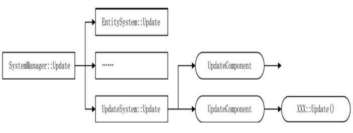

# 🚗 深入学习组件式编程

## 深入学习组件式编程

到目前其实，UpdateSystem、MessageSystem，以及对象池都有可优化之处，在此还会引入定时器方案。

### 系统管理类 SystemManager

原来的系统中，都是为每个线程创建一个 EntitySystem 实例来管理 Component 与 Entity 的。
System 可以理解为游戏逻辑的动作部分，如 Update 更新操作就是一个动作，以前驱动 Update 的方式是给 EntitySystem 增加`std::list<IUpdateSystem*>`队列。

```cpp
//伪代码
void EntitySystem::Update()
{
  for(auto one : updateObjs)
  {
    one->Update();
  }
}
```

假设除了 IUpdateSystem 之外，还有其他的如 IStartSystem 用于组件的首次调用，就要再 EntitySystem 类中增加一个`std::list<IStartSystem*>`随着功能越来越多，要加的动作越来越多，这使得 EntitySystem 变得越来越不可维护。为每个 System 独立维护一个 list 显然有数据冗余。

需要做的是，丢掉面向对象的接口，以组件的方式实现系统功能，不再使用 IUpdateSystem 这类接口，而是使用 UpdateComponent 组件代替，拥有这个组件就拥有这个功能，每个类都可以为自己创建一个 UpdateComponent 组件，不再需要继承特定的基类，在特殊情况下，甚至某些时间可以给 Entity 加上 UpdateComponent 组件。

```cpp
class SystemManager : virtual public IDisposable
{
public:
    SystemManager();
    virtual void Update();
    //...
protected:
    MessageSystem *_pMessageSystem;
    EntitySystem *_pEntitySystem;
    std::list<ISystem *> _system;
    //...
};

```

让 SystemManager 替代原来 EntitySystem 的地位。

```cpp
SystemManager::SystemManager()
{
    _pEntitySystem = new EntitySystem(this);
    _pMessageSystem = new MessageSystem(this);
    _systems.emplace_back(new UpdateSystem());
    //...
}
```

- EntitySystem，负责所有组件和实体的管理，所有组件实例在其中都能找到，如果是多线程，EntitySystem 只负责维护本线程中的组件。
- MessageSystem，负责处理从网络层或从别的线程中发来的 Packet 消息。
- UpdateSystem, 处理需要不断更新的数据的组件。

除了 EntitySystem 之外，所有系统都继承自 ISystem 基类。前面介绍过 EntitySystem 类，严格来说它不算是一个系统，它没有动作，是所有系统的基础，因为它管理着所有实体与组件。

### 实体系统 EntitySystem

EntitySystem,作为数据管理类，是所有系统的基础。

```cpp
class EntitySystem : public IDisposable{
public:
  template<class T, typename... TArgs>
  T* AddComponent(TArgs... args);

  template<typename... TArgs>
  IComponent* AddComponentByName(std::string className, TArgs.. args);

  template<class T>
  ComponentCollections* GetComponentCollections();

  void Update();
  //...
private:
  //所有对象
  std::map<uint64, ComponentCollections*> _objSystems;
  //...
};
```

现在的 EntitySystem 中没有任何动作接口，是一个纯数据类，在类中新增了一种
ComponentCollections 数据，用来保存实体或组件，其作用是将一系列相似的组件放在
一起，所有更新组件 UpdateComponent 实例都放在一个 ComponentCollection 实例中，
当需要取更新组件时，取到对应的 ComponentCollections 实例即可。

```cpp
class ComponentCollections : public IDisposable
{
public:
  void Add(IComponent* pObj);
  void Remove(uint64 sn);
  //...
private:
  //uint64为其父类Entity的sn，一个sn不可能存在多个同一个类型的组件
  std::map<uint64, IComponent*> _objs;
  std::map<uint64, IComponent*> _addObjs;
  std::list<uint64> _removeObjs;
};
```

ComponentCollections 利用了之前 CacheRefresh 的相似之处，避免死锁，
增加数据或删除数据时都会提前缓存，而后在下一帧处理。

```cpp
template<class T, typename ... TArgs>
T* EntitySystem::AddComponent(TArgs... args){
  auto pComponent = DynamicObjectPool<T>::GetInstance()->MallocObject(_systemManager, std::forward<TArgs>(args)...);
  AddComponent(pComponent);
  return pComponent;
}

template<class T>
inline void EntitySystem::AddComponent(T* pComponent){
  const auto typeHashCode = pComponent->GetTypeHashCode();
  auto iter = _objSystem.find(typeHashCode);
  if(iter == _objSystem.end()){
    _objSystems[typeHashCode] = new ComponentCollections(pComponent->GetTypeName());
  }
  auto pEntities = _objSystems[typeHashCode];
  pEntities->Add(dynamic_cast<IComponent*>(pComponent));
}
```

之前有提到，有 3 个可以创建组件的途径，无论哪种情况，生成组件的函数都是由 EntitySystem 提供，也就是上面的 AddComponent 或 AddComponentByName 函数，它们调用类工厂函数。

现在的 EntitySystem 的 Update 意义和之前完全不一样,现在的 Update 只维护每个 ComponentCollections 的 Cache Swap.

```cpp
void EntitySystem::Update()
{
  for(auto iter: _objSystems)
  {
    iter.second->Swap();
  }
}
```

在某一帧对所有拥有 UpdateComponent 组件的实体进行遍历更新操作时，其中一个实体 A 触发了某种特殊情况，生成一个新实体 B,
而生成的新实体 B 也有一个 UpdateComponent 组件，这时，整个管理 UpdateComponent 集合的 ComponentCollections 类就会发生改变，显然这不是应该改变的时机，因为它还在循环遍历执行更新操作。

不论是增加，还是删除组件都放到下一帧去执行，这样可以有效避免冲突。

### 组件 UpdateComponent

一个是组件类 UpdateComponent，另一个是系统类 UpdateSystem,二者关系为，UpdateComponent 相当于一个标记，它在某个实体上打上了一个需要更新的标记，
而 UpdateSystem 是通过 EntitySystem 找到这些有标记的实体进行更新操作，对实体进行更新操作时，其实没有去找实体，而是通过实体绑定的 UpdateComponent 简介操作 Entity 的更新操作。

例如 NetworkListen 现在应该怎样做。

```cpp
class Network : public Entity<Network>, public INetwork{}
class NetworkListen : public Network, public IAwakeFromPoolSystem<std::string, int>{}
```

实体会在 AwakeFromPool 时进行相关 Component 的挂载

```cpp
void NetworkListen::AwakeFromPool(std::string ip, int port)
{
  //update
  auto pUpdateComponent = AddComponent<UpdateComponent>();
  pUpdateComponent->UpdateFunction = BindFunP0(this, &NetworkListen::Update);
  //...
  return;
}
```

根据这种思路，可以对任何一个类添加 UpdateComponent 组件，而不破坏这个类本身的数据，也不再需要过多的继承，所有类是扁平的，没有层次关系。

```cpp
class UpdateComponent : public Component<UpdateComponent>, public IAwakeFromPoolSystem<>{
public:
  void AwakeFromPool() override;
  void BackToPool() override;
  std::function<void()> UpdateFunction { nullptr };
}
```

UpdateComponent 组件，有一个`std::function`用于回调实体的更新函数，如上面的 NetworkListen 类初始化的代码，将 NetworkListen::Update 函数绑定到了
UpdateComponent 组件的`std::function`变量上，这个函数会在更新系统 UpdateSystem 中被执行。

### 系统 UpdateSystem

```cpp
class UpdateSystem: virtual public ISystem{
public:
  void Update(EntitySystem* pEntities) override;
};
```

所有的 System 都继承自 ISystem 类，都必须实现自己的 Update,UpdateSystem 的 Update 实现如下面这样。

```cpp
void UpdateSystem::Update(EntitySystem* pEntities){
  auto pCollections = pEntities->GetComponentCollections<UpdateComponent>();
  if(pCollections == nullptr)
    return;
  pCollections->Swap();
  auto lists = pCollections->GetAll();
  for(const auto one : lists){
    const auto pComponent = one.second;
    const auto pUpdateComponent = static_case<UpdateComponent*>(pComponent);
    pUpdateComponent->UpdateFunction();
  }
}
```

在 SystemManager 中，每一帧都会调用所有系统的 Update 函数，而对于 UpdateSystem 而言，UpdateSystem::Update 的作用就是遍历所有 UpdateComponent 组件绑定的更新函数，NetworkListen 类的更新函数 Update 只是其中之一。



这样系统整体是松耦合的，虽然 EntitySystem 实体和 UpdateComponent 相互拥有对方的指针，
但是从本质上来说，它们是两个独立的类。EntitySystem 实体提供了一个绑定函数，而 UpdateComponent 组件负责执行该绑定函数，对于每个 UpdateComponent 实例，它不了解也不关心
更新函数内部到底做了什么。

### 组件 MessageComponent

一个基本的框架除了基本的更新操作之外，重要的还有协议的收发，在之前这两个功能融合在 ThreadObject 基类中，之后有了 EntitySystem，协议的收发变成了继承 IMessageSystem 接口。

```cpp
class MessageComponent : public Component<MessageComponent>, public IAwakeFromPoolSystem<IMessageCallBackFunction*>
{
public:
  ~MessageComponent();
  void AwakeFromPool(IMessageCallBackFunction* pCallback) override;
  void BackToPool() override;
  bool IsFollowMsgId(Packet* packet) const;
  void ProcessPacket(Packet* packet) const;
protected:
  IMessageCallBackFunction* _pCallBackFuns{nullptr};
};
```

先回顾之前的消息系统

- 从网络底层读数据上来，将这些数据组织成一个 Packet 类，然后将这些类放到各个线程中，线程中的每个对象继承自基类 ThreadObject,每个对象都要实现处理消息的基础函数。
- 在深入编码后，发现并不是所有组件都要处理消息，然后设计了 IMessageSystem 接口，继承了该接口的组件可以收到 Packet 消息。

现在，要将消息系统改造为，只要有了 MessageComponent 组件就可以处理消息，例如，在某些条件下，实体 A 可以处理 1、2 号协议，当它的状态发生改变时，可以删除这个 MessageComponent 组件，增加一个新的 MessageComponent 组件，这时可以处理 3、4 号协议。整个消息系统会非常灵活。

### 系统 MessageSystem

现在，当 Packet 到来之后，需要将数据转到 MessageSystem 系统中，任何时候调用`MessageSystem::AddPacketToList`都可以将一个 Packet 缓存到 MessageSystem 系统中。

```cpp
class MessageSystem : virtual public ISystem{
public:
  void Update(EntitySystem* pEntities) override;
  void AddPacketList(Packet* pPacket);
  //...
private:
  static void Process(Packet* pPacket, std::map<uint64, IComponent*>& lists);
private:
  std::mutex _packet_lock;
  CacheSwap<Packet> _cachePackets;
  //...
};
```

MessageSystem 的 Update 则与改造后的`UpdateSystem::Update`类似。

例如原来的 Account 实体，使用改造后的框架逻辑，其定义应该为

```cpp
//现在定义
class Account : public Entity<Account>, public IAwakeFromPoolSystem<>{}
//之前定义
class Account : public Component<Account>, public IMessageSystem, public IAwakeFromPoolSystem<>{}
```

### 线程分类

之前其实 NetworkListen 组件被随机放置到了某个线程中，我们希望 NetworkListen 类可以独占一个线程，除此之外可能还希望启动多个 MysqlConnector 组件达到数据库连接池效果。

但是现在有一个问题，假设有两个线程，每个线程中都有 MysqlConnector 实例，那么查询玩家的协议是否会被执行两次，毕竟现在所有协议是分发给所有线程的。

现在有必要对线程类型做一个规划，有些线程对于协议的处理是互斥的。所谓互斥，就像 MysqlConnector 组件一样，只需在多个线程中挑一个放进去即可，而另一些线程是完全平等的。

```cpp
enum ThreadType{
  MainThread = 1 << 0,
  ListenThread = 1 << 1,//监听线程
  ConnectThread = 1 << 2, //client连接
  LogicThread = 1 << 3, //逻辑线程
  MysqlThread = 1 << 4, //数据库线程
  AllThreadType = MainThread | ListenThread | LogicThread | ConnectThread | MysqlThread,
};
```

那么 ThreadMgr 也需要修改

```cpp
//继承SystemManager原因是ThreadMgr是主线程，主线程也有自己的SystemManager
class ThreadMgr : public Singleton<ThreadMgr>, public SystemManager{
  //...
private:
  std::map<ThreadType, ThreadCollector*> _threads;
};
```

同一种类型的线程放在同一个 ThreadCollector 中

```cpp
class ThreadCollector : public IDisposable{
public:
  //...
  virtual void HandlerMessage(Packet* pPacket);
  virtual void HandlerCreateMessage(Packet* pPacket);
protected:
  ThreadType _threadType;
  CacheRefresh<Thread> _threads;
  size_t _index{0};
};

//发给所有同类型线程
void ThreadCollector::HandlerMessage(Packet* pPacket){
  auto pList = _threads.GetReaderCache();
  for(auto iter = pList->begin(); iter != pList->end(); ++iter){
    (*iter)->GetMessageSystem()->AddPacketToList(pPacket);
  }
}
```

除此之外还需要一种扩展的 ThreadCollector,可用于 MySQL 线程上，逻辑线程和数据库线程最大的区别在于协议的处理，当一个协议到来时，数据库线程只需要挑选一个线程实例处理协议即可，而逻辑线程需要将协议发送到所有线程实例中。

```cpp
class ThreadCollectorExclusive:public ThreadCollector{
public:
  //...
  virtual void HandlerMessage(Packet* pPacket) override;
  virtual void HandlerCreateMessage(Packet* pPacket) override;
private:
  size_t _index;
};

//只发给一个线程处理即可
void ThreadCollectorExclusive::HandlerMessage(Packet* pPacket){
  auto vectors = *(_threads.GetReaderCache());
  vectors[_index]->GetMessageSystem()->AddPacketToList(pPacket);
  _index++;
  _index = _index >= vectors.size() ? 0 : _index;
}
```

在逻辑线程集合中收到一个协议，一定是广播出去的。例如，收到网络断开协议，因为不知道
在整个线程中有哪些组件关心这些协议，所以一定是对逻辑进程集合整个广播。而对于一个存储协
议来说，处理流程则不相同，为了让数据库操作分散，每一个数据库线程都是完全一样的，它们有
同样的组件。这时 ThreadCollectorExclusive 类的执行方式是采用轮询的方式，以达到均衡的目
的。

### IAwakeSystem 接口与对象池

### 主动销毁对象

### 时间堆
