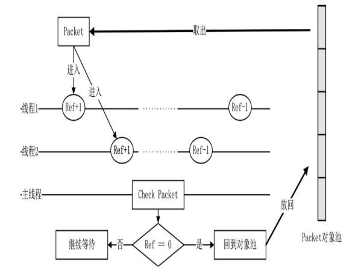

# 深入学习组件式编程

## 深入学习组件式编程

到目前其实，UpdateSystem、MessageSystem，以及对象池都有可优化之处，在此还会引入定时器方案。

### 系统管理类 SystemManager

原来的系统中，都是为每个线程创建一个 EntitySystem 实例来管理 Component 与 Entity 的。 System 可以理解为游戏逻辑的动作部分，如 Update 更新操作就是一个动作，以前驱动 Update 的方式是给 EntitySystem 增加`std::list<IUpdateSystem*>`队列。

```cpp
//伪代码
void EntitySystem::Update()
{
  for(auto one : updateObjs)
  {
    one->Update();
  }
}
```

假设除了 IUpdateSystem 之外，还有其他的如 IStartSystem 用于组件的首次调用，就要再 EntitySystem 类中增加一个`std::list<IStartSystem*>`随着功能越来越多，要加的动作越来越多，这使得 EntitySystem 变得越来越不可维护。为每个 System 独立维护一个 list 显然有数据冗余。

需要做的是，丢掉面向对象的接口，以组件的方式实现系统功能，不再使用 IUpdateSystem 这类接口，而是使用 UpdateComponent 组件代替，拥有这个组件就拥有这个功能，每个类都可以为自己创建一个 UpdateComponent 组件，不再需要继承特定的基类，在特殊情况下，甚至某些时间可以给 Entity 加上 UpdateComponent 组件。

```cpp
class SystemManager : virtual public IDisposable
{
public:
    SystemManager();
    virtual void Update();
    //...
protected:
    MessageSystem *_pMessageSystem;
    EntitySystem *_pEntitySystem;
    std::list<ISystem *> _system;
    //...
};

```

让 SystemManager 替代原来 EntitySystem 的地位。

```cpp
SystemManager::SystemManager()
{
    _pEntitySystem = new EntitySystem(this);
    _pMessageSystem = new MessageSystem(this);
    _systems.emplace_back(new UpdateSystem());
    //...
}
```

* EntitySystem，负责所有组件和实体的管理，所有组件实例在其中都能找到，如果是多线程，EntitySystem 只负责维护本线程中的组件。
* MessageSystem，负责处理从网络层或从别的线程中发来的 Packet 消息。
* UpdateSystem, 处理需要不断更新的数据的组件。

除了 EntitySystem 之外，所有系统都继承自 ISystem 基类。前面介绍过 EntitySystem 类，严格来说它不算是一个系统，它没有动作，是所有系统的基础，因为它管理着所有实体与组件。

### 实体系统 EntitySystem

EntitySystem,作为数据管理类，是所有系统的基础。

```cpp
class EntitySystem : public IDisposable{
public:
  template<class T, typename... TArgs>
  T* AddComponent(TArgs... args);

  template<typename... TArgs>
  IComponent* AddComponentByName(std::string className, TArgs.. args);

  template<class T>
  ComponentCollections* GetComponentCollections();

  void Update();
  //...
private:
  //所有对象
  std::map<uint64, ComponentCollections*> _objSystems;
  //...
};
```

现在的 EntitySystem 中没有任何动作接口，是一个纯数据类，在类中新增了一种 ComponentCollections 数据，用来保存实体或组件，其作用是将一系列相似的组件放在 一起，所有更新组件 UpdateComponent 实例都放在一个 ComponentCollection 实例中， 当需要取更新组件时，取到对应的 ComponentCollections 实例即可。

```cpp
class ComponentCollections : public IDisposable
{
public:
  void Add(IComponent* pObj);
  void Remove(uint64 sn);
  //...
private:
  //uint64为其父类Entity的sn，一个sn不可能存在多个同一个类型的组件
  std::map<uint64, IComponent*> _objs;
  std::map<uint64, IComponent*> _addObjs;
  std::list<uint64> _removeObjs;
};
```

ComponentCollections 利用了之前 CacheRefresh 的相似之处，避免死锁， 增加数据或删除数据时都会提前缓存，而后在下一帧处理。

```cpp
template<class T, typename ... TArgs>
T* EntitySystem::AddComponent(TArgs... args){
  auto pComponent = DynamicObjectPool<T>::GetInstance()->MallocObject(_systemManager, std::forward<TArgs>(args)...);
  AddComponent(pComponent);
  return pComponent;
}

template<class T>
inline void EntitySystem::AddComponent(T* pComponent){
  const auto typeHashCode = pComponent->GetTypeHashCode();
  auto iter = _objSystem.find(typeHashCode);
  if(iter == _objSystem.end()){
    _objSystems[typeHashCode] = new ComponentCollections(pComponent->GetTypeName());
  }
  auto pEntities = _objSystems[typeHashCode];
  pEntities->Add(dynamic_cast<IComponent*>(pComponent));
}
```

之前有提到，有 3 个可以创建组件的途径，无论哪种情况，生成组件的函数都是由 EntitySystem 提供，也就是上面的 AddComponent 或 AddComponentByName 函数，它们调用类工厂函数。

现在的 EntitySystem 的 Update 意义和之前完全不一样,现在的 Update 只维护每个 ComponentCollections 的 Cache Swap.

```cpp
void EntitySystem::Update()
{
  for(auto iter: _objSystems)
  {
    iter.second->Swap();
  }
}
```

在某一帧对所有拥有 UpdateComponent 组件的实体进行遍历更新操作时，其中一个实体 A 触发了某种特殊情况，生成一个新实体 B, 而生成的新实体 B 也有一个 UpdateComponent 组件，这时，整个管理 UpdateComponent 集合的 ComponentCollections 类就会发生改变，显然这不是应该改变的时机，因为它还在循环遍历执行更新操作。

不论是增加，还是删除组件都放到下一帧去执行，这样可以有效避免冲突。

### 组件 UpdateComponent

一个是组件类 UpdateComponent，另一个是系统类 UpdateSystem,二者关系为，UpdateComponent 相当于一个标记，它在某个实体上打上了一个需要更新的标记， 而 UpdateSystem 是通过 EntitySystem 找到这些有标记的实体进行更新操作，对实体进行更新操作时，其实没有去找实体，而是通过实体绑定的 UpdateComponent 简介操作 Entity 的更新操作。

例如 NetworkListen 现在应该怎样做。

```cpp
class Network : public Entity<Network>, public INetwork{}
class NetworkListen : public Network, public IAwakeFromPoolSystem<std::string, int>{}
```

实体会在 AwakeFromPool 时进行相关 Component 的挂载

```cpp
void NetworkListen::AwakeFromPool(std::string ip, int port)
{
  //update
  auto pUpdateComponent = AddComponent<UpdateComponent>();
  pUpdateComponent->UpdateFunction = BindFunP0(this, &NetworkListen::Update);
  //...
  return;
}
```

根据这种思路，可以对任何一个类添加 UpdateComponent 组件，而不破坏这个类本身的数据，也不再需要过多的继承，所有类是扁平的，没有层次关系。

```cpp
class UpdateComponent : public Component<UpdateComponent>, public IAwakeFromPoolSystem<>{
public:
  void AwakeFromPool() override;
  void BackToPool() override;
  std::function<void()> UpdateFunction { nullptr };
}
```

UpdateComponent 组件，有一个`std::function`用于回调实体的更新函数，如上面的 NetworkListen 类初始化的代码，将 NetworkListen::Update 函数绑定到了 UpdateComponent 组件的`std::function`变量上，这个函数会在更新系统 UpdateSystem 中被执行。

### 系统 UpdateSystem

```cpp
class UpdateSystem: virtual public ISystem{
public:
  void Update(EntitySystem* pEntities) override;
};
```

所有的 System 都继承自 ISystem 类，都必须实现自己的 Update,UpdateSystem 的 Update 实现如下面这样。

```cpp
void UpdateSystem::Update(EntitySystem* pEntities){
  auto pCollections = pEntities->GetComponentCollections<UpdateComponent>();
  if(pCollections == nullptr)
    return;
  pCollections->Swap();
  auto lists = pCollections->GetAll();
  for(const auto one : lists){
    const auto pComponent = one.second;
    const auto pUpdateComponent = static_case<UpdateComponent*>(pComponent);
    pUpdateComponent->UpdateFunction();
  }
}
```

在 SystemManager 中，每一帧都会调用所有系统的 Update 函数，而对于 UpdateSystem 而言，UpdateSystem::Update 的作用就是遍历所有 UpdateComponent 组件绑定的更新函数，NetworkListen 类的更新函数 Update 只是其中之一。


这样系统整体是松耦合的，虽然 EntitySystem 实体和 UpdateComponent 相互拥有对方的指针， 但是从本质上来说，它们是两个独立的类。EntitySystem 实体提供了一个绑定函数，而 UpdateComponent 组件负责执行该绑定函数，对于每个 UpdateComponent 实例，它不了解也不关心 更新函数内部到底做了什么。

### 组件 MessageComponent

一个基本的框架除了基本的更新操作之外，重要的还有协议的收发，在之前这两个功能融合在 ThreadObject 基类中，之后有了 EntitySystem，协议的收发变成了继承 IMessageSystem 接口。

```cpp
class MessageComponent : public Component<MessageComponent>, public IAwakeFromPoolSystem<IMessageCallBackFunction*>
{
public:
  ~MessageComponent();
  void AwakeFromPool(IMessageCallBackFunction* pCallback) override;
  void BackToPool() override;
  bool IsFollowMsgId(Packet* packet) const;
  void ProcessPacket(Packet* packet) const;
protected:
  IMessageCallBackFunction* _pCallBackFuns{nullptr};
};
```

先回顾之前的消息系统

* 从网络底层读数据上来，将这些数据组织成一个 Packet 类，然后将这些类放到各个线程中，线程中的每个对象继承自基类 ThreadObject,每个对象都要实现处理消息的基础函数。
* 在深入编码后，发现并不是所有组件都要处理消息，然后设计了 IMessageSystem 接口，继承了该接口的组件可以收到 Packet 消息。

现在，要将消息系统改造为，只要有了 MessageComponent 组件就可以处理消息，例如，在某些条件下，实体 A 可以处理 1、2 号协议，当它的状态发生改变时，可以删除这个 MessageComponent 组件，增加一个新的 MessageComponent 组件，这时可以处理 3、4 号协议。整个消息系统会非常灵活。

### 系统 MessageSystem

现在，当 Packet 到来之后，需要将数据转到 MessageSystem 系统中，任何时候调用`MessageSystem::AddPacketToList`都可以将一个 Packet 缓存到 MessageSystem 系统中。

```cpp
class MessageSystem : virtual public ISystem{
public:
  void Update(EntitySystem* pEntities) override;
  void AddPacketList(Packet* pPacket);
  //...
private:
  static void Process(Packet* pPacket, std::map<uint64, IComponent*>& lists);
private:
  std::mutex _packet_lock;
  CacheSwap<Packet> _cachePackets;
  //...
};
```

MessageSystem 的 Update 则与改造后的`UpdateSystem::Update`类似。

例如原来的 Account 实体，使用改造后的框架逻辑，其定义应该为

```cpp
//现在定义
class Account : public Entity<Account>, public IAwakeFromPoolSystem<>{}
//之前定义
class Account : public Component<Account>, public IMessageSystem, public IAwakeFromPoolSystem<>{}
```

### 线程分类

之前其实 NetworkListen 组件被随机放置到了某个线程中，我们希望 NetworkListen 类可以独占一个线程，除此之外可能还希望启动多个 MysqlConnector 组件达到数据库连接池效果。

但是现在有一个问题，假设有两个线程，每个线程中都有 MysqlConnector 实例，那么查询玩家的协议是否会被执行两次，毕竟现在所有协议是分发给所有线程的。

现在有必要对线程类型做一个规划，有些线程对于协议的处理是互斥的。所谓互斥，就像 MysqlConnector 组件一样，只需在多个线程中挑一个放进去即可，而另一些线程是完全平等的。

```cpp
enum ThreadType{
  MainThread = 1 << 0,
  ListenThread = 1 << 1,//监听线程
  ConnectThread = 1 << 2, //client连接
  LogicThread = 1 << 3, //逻辑线程
  MysqlThread = 1 << 4, //数据库线程
  AllThreadType = MainThread | ListenThread | LogicThread | ConnectThread | MysqlThread,
};
```

那么 ThreadMgr 也需要修改

```cpp
//继承SystemManager原因是ThreadMgr是主线程，主线程也有自己的SystemManager
class ThreadMgr : public Singleton<ThreadMgr>, public SystemManager{
  //...
private:
  std::map<ThreadType, ThreadCollector*> _threads;
};
```

同一种类型的线程放在同一个 ThreadCollector 中

```cpp
class ThreadCollector : public IDisposable{
public:
  //...
  virtual void HandlerMessage(Packet* pPacket);
  virtual void HandlerCreateMessage(Packet* pPacket);
protected:
  ThreadType _threadType;
  CacheRefresh<Thread> _threads;
  size_t _index{0};
};

//发给所有同类型线程
void ThreadCollector::HandlerMessage(Packet* pPacket){
  auto pList = _threads.GetReaderCache();
  for(auto iter = pList->begin(); iter != pList->end(); ++iter){
    (*iter)->GetMessageSystem()->AddPacketToList(pPacket);
  }
}
```

除此之外还需要一种扩展的 ThreadCollector,可用于 MySQL 线程上，逻辑线程和数据库线程最大的区别在于协议的处理，当一个协议到来时，数据库线程只需要挑选一个线程实例处理协议即可，而逻辑线程需要将协议发送到所有线程实例中。

```cpp
class ThreadCollectorExclusive:public ThreadCollector{
public:
  //...
  virtual void HandlerMessage(Packet* pPacket) override;
  virtual void HandlerCreateMessage(Packet* pPacket) override;
private:
  size_t _index;
};

//只发给一个线程处理即可
void ThreadCollectorExclusive::HandlerMessage(Packet* pPacket){
  auto vectors = *(_threads.GetReaderCache());
  vectors[_index]->GetMessageSystem()->AddPacketToList(pPacket);
  _index++;
  _index = _index >= vectors.size() ? 0 : _index;
}
```

在逻辑线程集合中收到一个协议，一定是广播出去的。例如，收到网络断开协议，因为不知道 在整个线程中有哪些组件关心这些协议，所以一定是对逻辑进程集合整个广播。而对于一个存储协 议来说，处理流程则不相同，为了让数据库操作分散，每一个数据库线程都是完全一样的，它们有 同样的组件。这时 ThreadCollectorExclusive 类的执行方式是采用轮询的方式，以达到均衡的目 的。

### IAwakeSystem 接口与对象池

在之前，采用的是全局对象池，即一种类型的对象池只有一个实例。在多线程中使用对象池，操作已使用、未使用的集合时进行了加锁操 作。

将全局对象池变更为线程对象池。一般来说，线程中创建的对象都在线程内使用，这些对象是不需要加锁的。

### DynamicObjectPoolCollector 对象池集合

以前是使用以下方式获取对象池实例

```cpp
DynamicObjectPool<Class>::GetInstance();
```

如果有多个不同的类对象池，就有多个 DynamicObjectPool 实例，为了便 于管理，引入一个新类 DynamicObjectPoolCollector，其作用是维护 DynamicObjectPool 集合。这个新类用 SystemManager 管理，相当于每个 ECS 体系都有一个对象池管理类。

```cpp
class DynamicObjectPoolCollector : public IDisposable{
public:
  DynamicObjectPoolCollector(SystemManager* pSys);
  void Dispose();
  template<class T>
  IDynamicObjectPool* GetPool();
  void Update();
private:
  std::map<uint64, IDynamicObjectPool*> _pools;
  SystemManager* _pSystemManager{nullptr};
};
```

GetPool 用于提取合适的对象池实例

```cpp
template<class T>
IDynamicObjectPool* DynamicObjectPoolCollector::GetPool(){
  const auto typeHashCode = typeid(T).hash_code();
  auto iter = _pools.find(typeHashCode);
  if(iter != _pools.end()){
    return iter->second;
  }
  auto pPool = new DynamicObjectPool<T>();
  pPool->SetSystemManager(_pSystemManager);
  _pools.insert(std::make_pair(typeHashCode, pPool));
  return pPool;
}
```

DynamicObjectPoolCollector 类实例是在 SystemManager 类创建时产生的。

```cpp
SystemManager::SystemManager(){
  _pEntitySystem = new EntitySystem(this);
  _pMessageSystem = new MessageSystem(this);
  //...
  _pPoolCollector = new DynamicObjectPoolCollector(this);
}
```

一个对象池实例不会对所有线程共用，它一定属于某个特定的线程，每个 线程有自己的对象池实例。当我们对进程和线程进行合并时，合并到最后，整 个变成单进程、单线程，此时全局只有一个 SystemManager，而对象池管理类 也只有一个。

以前，对象池分配对象是要加锁的

```cpp
DynamicObjectPool<T>::GetInstance()->MallocObject();
```

现在不论在哪个组件中创建对象，都可以像以下调用,内外部都不用加锁了，因为每个线程都有自己的 PoolCollector

```cpp
auto pCollector = pSysMgr->GetPoolCollector();
auto pPool = (DynamicObjectPool<T>*)pCollector->GetPool<T>();
T* pComponent = pPool->MallocObject();
```

### 全局单例对象

除了 ThreadMgr 类之外，几乎去掉了所有全局单例对象。主要原因是单例太难管理，单例使用前要调用生成函数，退出程序时也需要调用销毁函数。在实际编码中，在生 成单例类时，要么忘记调用 Instance 函数来生成它，要么忘记编写 DestroyInstance 函数来销毁它。

可以使用对象池来管理单例类。

```cpp
void ThreadMgr::InitializeGlobalComponent(APP_TYPE ppType, int appId){
  //全局component
  GetEntitySystem()->AddComponent<ResPath>();
  GetEntitySystem()->AddComponent<Log4>(ppType);
  GetEntitySystem()->AddComponent<Yaml>();
  GetEntitySystem()->AddComponent<NetworkLocator>();
  //...
}
```

为了解决单例，将 IAwakeSystem 接口改造下，改为两种

```cpp
template<typename... TArgs>
class IAwakeSystem:virtual public ISystem{
public:
  IAwakeSystem() = default;
  virtual ~IAwakeSystem() = default;
  virtual void Awake(TArgs... args) = 0;
  static bool IsSingle() {return true;}
};

template<typename... TArgs>
class IAwakeFromPoolSystem :virtual public ISystem{
public:
  IAwakeFromPoolSystem() = default;
  virtual ~IAwakeFromPoolSystem() = default;
  virtual void Awake(TArgs... args) = 0;
  static bool IsSingle(){return false;};
};
```

例如单例对象

```cpp
class Yaml : public Component<Yaml>, public IAwakeSystem<>{}
```

非单例

```cpp
class ConnectObj : public Entity<ConnectObj>, public IAwakeFromPoolSystem<SOCKET>{}
```

单例情况则要在对象池的 MallocObject 方法处理

```cpp
template<typename T>
template<typename ... Targs>
T* DynamicObjectPool<T>::MallocObject(Targs... args){
  if(_free.size() == 0){
    if(T::IsSingle()){
      T* pObj = new T();
      pObj->SetPool(this);
      _free.push(pObj);
    }else{
      for (int index = 0; index < 50 ; index++){
        T* pObj = new T();
        pObj->SetPool(this);
        _free.push(pObj);
      }
    }
  }
}
```

如 NetworkListen

```cpp
class NetworkListen : public Network, public IAwakeSystem<std::string, int>{}
```

### 查看线程中的所有对象

最好设计一个命令行工具，或者监控，利用好 Actor 设计就好了。

### 主动销毁对象

销毁组件或实例有两种需求，一种是在本线程中销毁，适合一般的对象。另一种是像 Packet 类这种跨线程实例。

### 一般组件销毁

当不再需要一个组件时，有两种可以销毁的方式：

* 如果组件是通过实体 AddComponent 途径增加的，可以调用用`Entity::RemoveComponent`销毁。
* 如果是没有实体的组件如(HttpRequest),可以直接调用该线程中的`EntitySystem::RemoveComponent`函数销毁。

```cpp
void HttpRequest::Update(){
  switch(_state){
    //...
    case HttpRequestState::HRS_Over:{
      ProcessOver();
      _state = HttpRequestState::HRS_NoActive;
      GetSystemManager()->GetEntitySystem()->RemoveComponent(this);
    }break;
    case HttpRequestState::HRS_Timeout:{
      ProcessTimeout();
      _state = HttpRequestState::HRS_NoActive;
      GetSystemManager()->GetEntitySystem()->RemoveComponent(this);
    }
    //...
  }
}
```

下面为`EntitySystem::RemoveComponent`实现。

```cpp
void EntitySystem::RemoveComponent(IComponent* pObj){
  const auto entitySn = pObj->GetSN();
  const auto typeHashCode = pObj->GetTypeHashCode();
  auto iterObj = _objSystems.find(typeHashCode);
  if(iterObj == _objSystems.end()){
    return;
  }
  ComponentCollections* pCollector = iterObj->second;
  pCollector->Remove(entitySn);
}
void ComponentCollections::Remove(uint64 sn){
  _removeObjs.emplace_back(sn);
}
```

在每个线程中，EntitySystem 都拥有所有的对象实例，这些实例是按照类型不同放到 ComponentCollections 中的。 当要销毁一个组件时，将组件从 ComponentCollections 中以除，重新放回对象池即可。

ComponentCollections 将需要删除的对象进行了缓冲，放到了删除列表中，在下一帧才会真正删除。

### 引用计数销毁对象

Packet 对象的销毁比较复杂，因为它会穿越多个线程，Packet 对象的销毁可以采用引用计数的方式。



在 Packet 类中定义计数

```cpp
class Packet : public Entity<Packet>, public Buffer, public IAwakeFromPoolSystem<Proto::MsgId, SOCKET>{
public:
  void AddRef();
  void RemoveRef();
  void OpenRef();
  bool CanBack2Pool();
  //...
private:
  std::atomic<int> _ref{0};
  bool _isRefOpen{false};
}
```

对 Packet 类增加了 AddRef、RemoveRef 函数，用来进行计数。计数是在多线程中进行的，所以变量采用了 std：： atomic 类型来处理。std：：atomic 是一个原子操作，底层已经加锁，不需要额外加锁。函数 AddRef 对引用计数加 1， 而函数 RemoveRef 对引用计数减 1，当我们使用对象时，它的引用计数加 1；当引用计数重新变为 0 时，表示所有使用已 结束，可以销毁了。

对于每个线程来说必然有一个 MessageSystem 系统处理协议，Packet 进入 MessageSystem 类处理队列，则计数加 1，处理完成之后计数减 1.

```cpp
void MessageSystem::AddPacketToList(Packet* pPacket){
  std::lock_guard<std::mutex> guard(_packet_lock);
  _cachePackets.GetWriterCache()->emplace_back(pPacket);
  pPacket->AddRef();
}
void MessageSystem::Update(EntitySystem* pEntities){
  //...
  auto lists = pCollections->GetAll();
  auto packetLists = _cachePackets.GetReaderCache();
  for(auto iter = packetLists->begin(); iter != packetLists->end(); ++iter){
    auto pPacket = (*iter);
    Process(pPacket, lists);
    pPacket->RemoveRef();
  }
  _cachePackets.GetReaderCache()->clear();
}
```

主线程分发协议的代码，是 Packet 进入各线程中的必经函数

```cpp
void ThreadMgr::UpdateDispatchPacket(){
  //...
  auto pList = _packets.GetReaderCache();
  for(auto iter = pList->begin(); iter != pList->end(); ++iter){
    auto pPacket = (*iter);
    //...
    for(auto iter = _threads.begin(); iter != _threads.end(); ++iter){
      iter->second->HandlerMessage(pPacket);
    }
    pPacket->OpenRef();
  }
  pList->clear();
}
void ThreadCollector::HandlerMessage(Packet* pPacket){
  auto pLisr = _threads.GetReaderCache();
  for(auto iter = pList->begin(); iter != pList->end(); ++iter){
    iter->second->GetMessageSystem()->AddPacketToList(pPacket);
  }
}
```

处理 Packet 时将 Packet 通知到各个线程集合，而线程集合再将 Packet 加入各个线程中。该加入操作完成之后调用 了 OpenRef 函数，这个函数开始了 Packet 的检查。在 Packet 生成到加入线程之前，引用计数都是 0，显然这时检查计数是不合适的。只有当 OpenRef 这个开关打开之后，也就是说 Packet 已经放置到线程中才是检查的时机。

```cpp
void Packet::OpenRef(){
  _isRefOpen = true;
}
bool Packet::CanBack2Pool(){
  if(!_isRefOpen)
    return false;
  if(_ref == 0)
    return true;
  return false;
}
```

如果 CanBack2Pool 函数返回 true，这个 Packet 就认为被用完了，恢复到对象池中，等下次使用。

### 时间堆

当调用一个 HttpRequest 向外请求一个 HTTP 时，由于某些原因请求没有回应，登录就会一直卡在这里，客户端发送了 C2L\_AccountCheck 协议，但是一直没有得到回应，它只有等待下去。login 进程中的 Account 类也很无奈，HttpRequest 没有给它反馈，Account 类自然也没有办法给客户端反馈数据。分析一下产生这个问题的原因，是因为没有对 HttpRequest 定时检查，如果开始时就设置一个 10 秒期限，在 10 秒之后还没有反馈，就认为请求失败了，即使后面请求来了，也认为是失败的，这个问题就迎刃而解了。

```cpp
void RobotMgr::Update(){
  //...
  auto pGlobal = Global::GetInstance();
  if(_nextShowInfoTime > pGlobal->TimeTick)
    return;
  _nextShowInfoTime = timeutil::AddSeconds(pGlobal->TimeTick, 2);
  ShowInfo();
}
```

定时打印采用的逻辑是记录下一次的打印时间，如果时间到来，就调用 ShowInfo 函数打印信息。同时，在当前时间的基础上增加两秒，设为下一次的打印时间。

Update 函数是每帧调用的，每一帧的循环中都会判断一次是否到了触发时间。假如进程每秒调用 100 次，也就是说在两秒内有 200 次 if 判断。如果在整个框架中存在大量这种时间判断，其实也在消耗性能，而且这段代码看上去也不够优雅。所以，我们需要采用一种新的机制，以最少的判断来执行时间函数调用，也就是下面要讲到的时间堆。

要制作的定时器就是基于二叉树的原理，名为时间堆。时间堆包括最大时间堆和最小时间堆。将整个二叉树进行排序，顶点是最小时间间隔，为最小时间堆；最下层的叶子节点为最大时间间隔，为最大时间堆。

在一个线程中有这样一个时间堆，那么每一帧只需要有限的判断，判断当前时间与顶点时间的大小，即可得知是否要触发这个定时器的调用。如果最近的一个调用时间都没有到来，那么这个堆中的其他时间节点肯定不会触发。假设有 100 个定时器，按照之前的代码逻辑，需要编写 100 个触发判断函数，而现在被压缩在了顶点上，只需要一次判断。

### 堆代码实现

```cpp
int main()
{
    std::vector<int> data{9, 1, 6, 3, 8, 9};
    make_heap(data.begin(), data.end(), std::greater<int>());
    PopData(data);
    PopData(data);
    PushData(data, 5);
    PushData(data, 1);
    return 0;
}
void PopData(std::vector<int>& data){
  //弹出heap顶元素，将其放置于区间末尾
  pop_heap(data.begin(), data.end(), std::greater<int>());
  //末尾数据
  data.back();
  //弹出末尾数据
  data.pop_back();
}
void PushData(std::vector<int>& data, const int value){
  data.push_back(value);
  push_heap(data.begin(), data.end(), std::greater<int>());
}
```

* make\_heap 函数的作用是重新排列给定范围内的元素，使它们形成 堆。
* pop\_heap 函数的作用是弹出堆顶元素，将堆顶元素移动到集合的最 后，并重新排列剩下的元素。值得注意的是，之前的顶元素被放在了最后，并 从堆数据中删除，相当于堆数据减 1。
* push\_heap 函数的作用是对最后一个元素进行插入，插入堆中的适当 位置。也就是说，在调用 push\_heap 之前，插入的新元素一定是在数据的最尾 端。

在 std 标准库中，对于堆有两种已实现的计算，默认是最大堆 `less<T>` 和最 小堆 `greater<T>`，当然也可以自己定义排序算法，std 支持自定义算法的定义。

### 时间堆组件

使用最小堆的概念写一个定时器

```cpp
using TimerHandleFunction = std::function<void(void)>;
struct Timer
{
    timeutil::Time NextTime;     // 下次调用时间
    TimerHandleFunction Handler; // 调用函数
    int DelaySecond;             // 首次执行时延迟秒
    int DurationSecond;          // 间隔时间(秒）
    int CallCountTotal;          // 总调用次数（0为无限）
    int CallCountCur;            // 当前调用次数
    uint64 SN;                   // 方便删除数据时找到Timer
};
```

在时间堆中每个节点都是 Timer 结构，这种结构包括总调用次数、调用时间间隔、当前调用次数、调用函数和下次调用时间等。如果总调用次数为 0，这个节点就是一个无限次数的循环定时器。属性 DelaySecond 是首次执行时延时，这个属性和时间间隔有一定的区别。

定时器组件 TimerComponent

```cpp
class TimerComponent : public Entity<TimerComponent>, public IAwakeSystem<>
{
public:
    void Awake() override;
    uint64 Add(int total, int durations, bool immediateDo, int immediateDoDelaySecond, TimerHandleFunction func);
    void Remove(std::list<uint64> &timers);
    bool CheckTime();
    Timer PopTimeHeap();
    void Update();
    //...
private:
    std::vector<Timer> _heap;
};
```

从组件 TimerComponent 的定义中可以看出，它是一个单例，对于一个线程来说，只需要有一个 TimerComponent 组件。在初始化时为该组件增加 UpdateComponent 组件，以方便每一帧检查是否有到了时间的函数需要执行。

TimerComponent 组件的初始化与更新函数如下:

```cpp
void TimerComponent::Awake()
{
    auto pUpdateComponent = AddComponent<UpdateComponent>();
    pUpdateComponent->UpdataFunction = BindFunP0(this, &TimerComponent::Update);
}

void TimerComponent::Update()
{
    while (CheckTime())
    {
        Timer data = PopTimeHeap();
        data.Handler();
        if (data.CallCountTotal != 0)
            data.CallCountCur++;
        if (data.CallCountTotal != 0 && data.CallCountCur >= data.CallCountTotal)
        {
            // delete pNode; 取出之后，不再加入堆中
        }
        else
        {
            // 重新加入堆中
            data.NextTime = timeutil::AddSeconds(Global::GetInstance()->TimeTick, data.DurationSecond);
            Add(data);
        }
    }
}
```

在更新函数中，首先检查是否有需要执行的节点

```cpp
bool TimerComponent::CheckTime()
{
    if (_heap.empty())
        return false;
    const auto data = _heap.front();
    return data.NextTime <= Global::GetInstance()->TimeTick;
}
```

在每个线程中都有一个 TimerComponent 组件实例，每个 EntitySystem 中都有一个独立的 TimerComponent 组件负责 该进程所有需要按时间调用的事件。在线程启动时，该组件就被创建出来了。每个组件都有可能需要定时器，为了方便组件调用定时器，修改了 IComponent 组件，增加了一个关于定时器的函数。

```cpp
class IComponent : virtual public SnObject
{
protected:
    void AddTimer(const int total, const int durations, const bool immediateDo, const int immediateDoDelaySecond, TimerHandleFunction handler);
    std::list<uint64> _timers;
    //...
};
void IComponent::AddTimer(const int total, const int durations, const bool immediateDo, const int immediateDoDelaySecond, TimerHandleFunction handler)
{
    auto obj = GetSystemManager()->GetEntitySystem()->GetComponent<TimerComponent>();
    const auto timer = obj->Add(total, durations, immediateDo, immediateDoDelaySecond, std::move(handler));
    _timers.push_back(timer);
}
```

当组件被销毁时，这些定时器也会被销毁。

```cpp
void IComponent::ComponentBackToPool()
{
    BackToPool();
    if (!_timers.empty())
    {
        auto pTimer = _pSystemManager->GetEntitySystem()->GetComponent<TimerComponent>();
        if (pTimer != nullptr)
            pTimer->Remove(_timers);
        _timers.clear();
    }
    //...
}
```

例如 RobotMgr

```cpp
void RobotMgr::Awake(){
  //...
  AddTimer(0, 2, false, 0 ,BindFunP0(this,&RobotMgr::ShowInfo));
}
```

`TimerComponent::Add`的实现

```cpp
void TimerComponent::Add(Timer &data)
{
    _heap.emplace_back(data);
    if (_heap.size() == 1)
    {
        make_heap(_heap.begin(), _heap.end(), CompareTimer());
    }
    else
    {
        push_heap(_heap.begin(), _heap.end(), CompareTimer());
    }
}

uint64 TimerComponent::Add(const int total, const int durations, const bool immediateDo, const int immediateDoDelaySecond, TimerHandleFunction handler)
{
    // durations 执行间隔秒
    // immediateDo 是否马上执行
    // immediateDoDelaySecond 首次执行与当前时间的间隔时间
    Timer data;
    data.SN = Global::GetInstance()->GenerateSN();
    data.CallCountCur = 0;
    data.CallCountTotal = total;
    data.DurationSecond = durations;
    data.Handler = std::move(handler);
    data.NextTime = timeutil::AddSeconds(Global::GetInstance()->TimeTick, durations);
    if (immediateDo)
    {
        data.NextTime = timeutil::AddSeconds(Global::GetInstance()->TimeTick, immediateDoDelaySecond);
    }
    Add(data);
    return data.SN;
}
```

为了堆的正常排序，需要自定义 Timer 的排序类

```cpp
struct CompareTimer{
  constexper bool operator()(const Timer& _Left, const Timer& _Right) const{
    return (_Left.NextTime > _Right.NextTime);
  }
};
```

组件中只需要调用一个 AddTimer 函数就可以生成一个定时器。除了时间堆之外，还有一种定时器的模式叫时间轮。时间轮比时间堆效率更高，因为插入和取出时，时间轮都没有时间成本，但时间轮的数据结构更为复杂。

### 复杂的定时器真的好吗

不一定，写业务代码时用定时器其实也不是很方便，容易出错。还不如简单的在 Update 做时间间隔判断。
