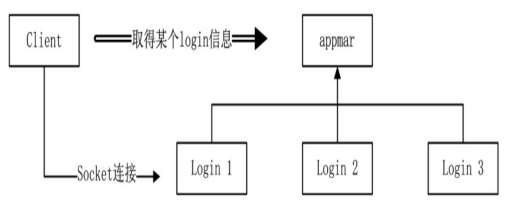
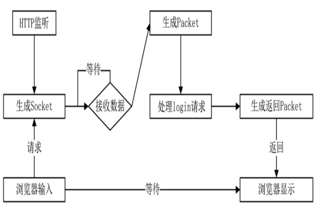
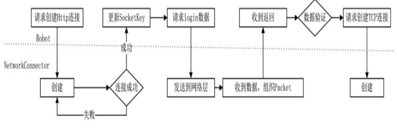

# 服务器管理进程与 HTTP

## 服务器管理进程与 HTTP

如果有多个 login 进程，它是服务器的第一道屏障，玩家只有登录成功才可能进入游戏。当有多个 login 的时候就涉及一个问 题，客户端到底该从哪个 login 登录呢？

### 启用多个 Login 进程

只有一个 login 进程，容易形成瓶颈，所以需要为整个架构设置多个 login 进程。 对于客户端来说，登录游戏时应该使用哪一个 login 呢，解决这个问题有两种方案：一种方案是运维的角度来解决，利用 Nginx 的功能，另一种方案是通过游戏的逻辑数据来解决，做一个简单的登录策略，每个玩家登录时，可以通过某种方式得知玩家在线最少的 login 的 IP 和端口。

这样一来，登录问题进一步演变为如何得到最小负载的 login，为了解决此问题，建立一个新工程，用来维护所有的 login，将其称为 appmgr，除了当前 的 login 进程之外，appmgr 来会维护 game 进程。

### appmgr 进程

客户端需要从 appmgr 进程获取某个 login 信息，然后客户端对指定的 login 进行登录请求。



login 进程启动之后会定期向 appmgr 发送自己当前的状态，这样 appmgr 可以被动收集到 所有 login 数据，客户端登陆时，只需要向 appmgr 询问即可得到最小负载的 login 信息。

在 appmgr 进程中定义 LoginSyncComponent,用于收集所有 login 进程的同步信息。

```cpp
class LoginSyncComponent : public SyncComponent, public IAwakeSystem<>{
public:
  void Awake() override;
  void BackToPool() override;
};
class SyncComponent : public Entity<SyncComponent>{
public:
  void AppInfoSyncHandle(Packet* pPacket);
  bool GetOneApp(APP_TYPE appType, AppInfo& info);
  //...
protected:
  std::map<int, AppInfo> _apps;
};
```

基类组件 SyncComponent 将收集到的数据保存在字典 std：：map\<int，AppInfo>中，Key 值为 AppId，Value 值为结构 AppInfo.

```cpp
struct AppInfo{
  APP_TYPE AppType;
  int AppId;
  std::string Ip;
  int Port;
  int Online;//用于记录AppId对应进程有多少玩家在线
  SOCKET Socket;
};
```

`LoginSyncComponent::Awake`初始化函数中注册了 login 同步消息 MI\_AppInfoSync 的 处理函数，对于 LoginSyncComponent 组件来说，它并不关心谁发送了数据， 只关心 MI\_AppInfoSync 协议本身的内容，谁发来的并不重要。

```cpp
void SyncComponent::AppInfoSyncHandle(Packet* pPacket){
  auto proto = pPacket->ParseToProto<Proto::AppInfoSync>();
  const auto iter = _apps.find(proto.app_id());
  if(iter == _apps.end()){
    AppInfo syncAppInfo;
    syncAppInfo.Socket = pPacket->GetSocket();
    _apps[syncAppInfo.AppId] = syncAppInfo;
  }else{
    const int appId = proto.app_id();
    _apps[appId].Online = proto.online();
    _apps[appId].Socket = pPacket->GetSocket();
  }
}
```

对于 Login 进程，MI\_AppInfoSync 协议需要发送至 appmgr，在 Login 的 Account 组件增加定时器， 每隔几秒就将自己的信息发送出去。

```cpp
void Account::Awake(){
  AddTimer(0, 10, true, 2, BindFunP0(this, &Account::SyncAppInfoToAppMgr));
  //...
}
void Account::SyncAppInfoToAppMgr(){
  Proto::AppInfoSync protoSync;
  protoSync.set_app_id(Global::GetInstance()->GetCurAppId());
  protoSync.set_app_type((int)Global::GetInstance()->GetCurAppType());
  protoSync.set_online(_playerMgr.Count());
  MessageSystenHelp::SendPacket(Proto::MsgId::MI_AppInfoSync, protoSync, APP_APPMGR);
}
```

完成了数据的收集工作，接下来要解决的问题是：客户端通过什么方式从 appmgr 中知道 login 的这些状态呢？鉴于客户端与 appmgr 进程只有一次性的通信，这里我们采用 HTTP 弱连接方式。具体方法是，appmgr 进程提供一个 HTTP 端口——例如 appmgr 的 IP 为 `192.168.0.100`，开放一个 HTTP 服务——端口为 8081，提供一个 `192.168.0.100：8081/login` 请求，该请求返回一个 JSON 数据，类似`{"ip"："192.168.0.100"，"port"：5002}`，让调用者知道当前在 `192.168.0.100` 的 5002 端口上有一个可以进行连接的 login 进程。

则现在需要在框架中加入 HTTP 的处理，提供 HTTP 服务。

### HTTP

不再过多记录，HTTP 是一个开发必了解的吧，无论你是做 web 的还是其他产品。

### Mongoose 分析 HTTP

Mongoose 是一个第三方开源的 HTTP 工程，其中的 mongoose.h 与 mongoose.c 可以用来分析 HTTP 请求协议的格式。 你也可以简单学习一个 http-parser，nodejs 一开始就是用的这个，其也是 nodejs 官方的仓库。

要开放 HTTP 服务，必然需要一个监听类，依然还是使用 NetworkListen 类。为了区分游戏逻辑层和 HTTP 监听的不同，在 network\_type.h 文 件中新定义了一个枚举：

```cpp
enum class NetworkType{
  None = 0,
  TcpListen  = 1 << 0,
  TcpConnector = 1 << 1,
  HttpListen = 1 << 2,
  HttpConnector = 1 << 3,
};
```

NetworkListen 类定义

```cpp
class NetworkListen : public IAwakeSystem<std::string, int>, public IAwakeSystem<int, int>{
public:
  void Awake(std::string ip, int port) override;
  void Awake(int appType, int appId) override;
  //...
}
```

NetworkListen 类有两种创建方式：当以`<int，int>`参数创建时，表示输入两个 int 类型的数 据，分析的是 AppType 与 AppId，创建出来的 NetworkListen 实例是 TCP 监听，即游戏逻辑需要使用的监 听。当以`<string，int>`参数创建时，表示输入的是 IP 与端口，创建出来的 NetworkListen 实例用于 HTTP 的监听。

### HTTP 类型

不论是游戏的端口监听还是 HTTP 的端口监听，要接收数据都需要创建一个 Socket

```cpp
SOCKET Network::CreateSocket() const{
  _sock_init();
  SOCKET socket;
  if(_networkType == NetworkType::HttpListen || _networkType == NetworkType::HttpConnector)
  {
    socket = ::socket(AF_INET, SOCK_STREAM, IPPROTO_IP);
  }else{
    socket = ::socket(AF_INET, SOCK_STREAM, IPPROTO_TCP);
  }
  //...
  return socket;
}
```

使用 IPPROTO\_TCP 时，TCP 底层有一套机制保证传递到网络上的数据是有序的且不遗漏，但 IPPROTO\_IP 不是这样，IPPROTO\_IP 没有 TCP 的 3 次握手，但这种方式更快,HTTP 数据丢了，那就重发就好了。

### 接收 HTTP 数据

创建好监听之后，当收到 HTTP 请求时，首先会在网络层产生一个 Socket 描述符，这和 TCP 监听没有什么两样。当底 层有数据需要读取，封装为 Packet 时，分析数据写了一个 GetHttpPacket 的分支：

```cpp
//尝试解包
Packet *RecvNetworkBuffer::GetPacket()
{
    auto pNetwork = _pConnectObj->GetParent<Network>();
    auto iType = pNetwork->GetNetworkType();
    if (iType == NetworkType::HttpConnector || iType == NetworkType::HttpListen)
        return GetHttpPacket();
    return GetTcpPacket();
}
```

GetHttpPacket 函数内主要做，进行 HTTP 协议的分析，解析。

```cpp
Packet* RecvNetworkBuffer::GetHttpPacket()
{
    if (_endIndex < _beginIndex)
    {
        // 有异常，关闭网络
        _pConnectObj->Close();
        LOG_ERROR("http recv invalid.");
        return nullptr;
    }

    const unsigned int recvBufLength = _endIndex - _beginIndex;
    const auto pNetwork = _pConnectObj->GetParent<Network>();
    const auto iType = pNetwork->GetNetworkType();
    const bool isConnector = iType == NetworkType::HttpConnector;

    http_message hm;
    const unsigned int headerLen = mg_parse_http(_buffer + _beginIndex, _endIndex - _beginIndex, &hm, !isConnector);
    if (headerLen <= 0)
        return nullptr;

    unsigned int bodyLen = 0;
    const auto mgBody = mg_get_http_header(&hm, "Content-Length");
    if (mgBody != nullptr)
    {
        bodyLen = atoi(mgBody->p);

        // 整个包的长度不够，再等一等
        if (bodyLen > 0 && (recvBufLength < (bodyLen + headerLen)))
            return nullptr;
    }

    bool isChunked = false;
    const auto mgTransferEncoding = mg_get_http_header(&hm, "Transfer-Encoding");
    if (mgTransferEncoding != nullptr && mg_vcasecmp(mgTransferEncoding, "chunked") == 0)
    {
        isChunked = true;

        // 后面的数据还没有到达
        if (recvBufLength == headerLen)
            return nullptr;

        bodyLen = mg_http_get_request_len(_buffer + _beginIndex + headerLen, recvBufLength - headerLen);
        if (bodyLen <= 0)
            return nullptr;

        bodyLen = _endIndex - _beginIndex - headerLen;
    }

    // 打印一下数据看看
    std::stringstream allBuffer;
    allBuffer.write(_buffer + _beginIndex, (bodyLen + headerLen));
    LOG_HTTP("\r\n" << allBuffer.str().c_str());

    Packet* pPacket = MessageSystemHelp::ParseHttp(_pConnectObj,_buffer + _beginIndex + headerLen, bodyLen, isChunked, &hm);
    RemoveDate(bodyLen + headerLen);
    return pPacket;
}
```

而且为了充分融合到 Actor 系统设计中，将 HTTP 请求协议封装为 Packet。产生的 Packet 则会进入 ThreadMgr DispatchPacket 函数对协议进行分发。

```proto
message Http{
  string body = 1;
  int32 status_code = 2;
}
```

### 处理 HTTP 数据的协议号

将 HTTP 数据打包成了 Packet 数据，那么这些 HTTP 的 Packet 必然有协议号。

```cpp
// HTTP listen的请求（外部请求）
MI_HttpBegin = 10000;
MI_HttpInnerResponse = 10001; // 响应数据
MI_HttpRequestBad = 10002;
MI_HttpRequestLogin = 10003;
MI_HttpEnd = 10499;
// HTTP connector 的消息（内部请求，外部返回）
MI_HttpOuterRequest = 10500; // 内部向外请求
MI_HttpOuterResponse = 10501; // 外部响应数据
```

工程中将协议号分成了两种：

1. 情况 1：从框架外部向框架发起请求，例如收到 127.0.0.1：7071/login 消息时，它对应的协议号为 MI\_HttpRequestLogin，除此之外，没有处理的都 是 MI\_HttpRequestBad 消息，返回 404 编码。当有请求被框架捕捉到时，处理完 成之后会向网络层发送一个返回数据，这时返回包的 Packet 协议号为 MI\_HttpInnerResponse，所有的请求返回的消息协议号都是 MI\_HttpInnerResponse。
2. 情况 2：框架向外部 HTTP 服务发起请求，例如 Nginx 上有一个验证用户的 请求，这时使用 MI\_HttpOuterRequest 和 MI\_HttpOuterResponse 分别作为请求 与返回协议编号。只有一个协议号，一旦我们有多个请求同时发送，它们会冲 突吗？答案是不会。即使只有一个协议号，但是 Socket 却不同，所以处理的 ConnectObj 也是不同的。

### 收到 HTTP 请求是如何响应的

当收到外部发起的 login 请求时，这个请求被封装成 Packet，其 MsgId 为 MI\_HttpRequestLogin。处理组件类是 LoginSyncComponent。

```cpp
void LoginSyncComponent::Awake(){
  //...
  pMsgCallBack->RegisterFunction(Proto::MsgId::MI_HttpRequestLogin, BindFuncP1(this, &LoginSyncComponent));
}
void LoginSyncComponent::HandleHttpRequestLogin(Packet *pPacket)
{
    Json::Value responseObj;
    AppInfo info;
    if (!GetOneApp(APP_LOGIN, info))
    {
        responseObj["returncode"] = 4;
        responseObj["ip"] = "";
        responseObj["port"] = 0;
    }
    else
    {
        responseObj["returncode"] = 0;
        responseObj["ip"] = info.Ip;
        responseObj["port"] = info.Port;
    }
    std::stringstream jsonStream;
    _jsonWriter->write(responseObj, &jsonStream);
    MessageSystemHelp::SendHttpResponse(pPacket, jsonStream.str().c_str(), jsonStream.str().length());
}
bool SyncComponent::GetOneApp(APP_TYPE appType, AppInfo &info)
{
    if (_apps.size() == 0)
    {
        LOG_ERROR("GetApp failed. no more. appType:" << GetAppName(appType));
        return false;
    }
    // 找到第一个同类型数据
    auto iter = std::find_if(_apps.begin(), _apps.end(), [&appType](auto pair)
                             { return (pair.second.AppType & appType) != 0; });
    if (iter == _apps.end())
    {
        LOG_ERROR("GetApp failed. no more. appType:" << appType);
        return false;
    }
    // 遍历后面的数据，找到最小值
    auto min = iter->second.Online;
    int appId = iter->first;
    for (; iter != _apps.end(); ++iter)
    {
        if (min == 0)
            break;
        if ((iter->second.AppType & appType) == 0)
            continue;
        if (iter->second.Online < min)
        {
            min = iter->second.Online;
            appId = iter->first;
        }
    }
    // 数据加1，以避免瞬间落在同一个App上，下次同步数据会将其覆盖为真实值
    _apps[appId].Online += 1;
    info = _apps[appId];
    return true;
}
```

从基类的 GetOneApp 函数中取到一个真实的 login 进程的数据，将数据压入 `Json::Value` 结构中，封装为 JSON 并转换为串，最后调用 `MessageSystemHelp::SendHttpResponse` 函数向网络层发送数据。

```cpp
void MessageSystemHelp::SendHttpResponse(NetworkIdentify *pIdentify, const char *content, int size)
{
    SendHttpResponseBase(pIdentify, 200, content, size);
}
void MessageSystemHelp::SendHttpResponseBase(NetworkIdentify *pIdentify, int status_code, const char *content, int size)
{
    auto pNetworkLocator = ThreadMgr::GetInstance()->GetEntitySystem()->GetComponent<NetworkLocator>();
    auto pNetwork = pNetworkLocator->GetListen(NetworkType::HttpListen);
    if (pNetwork == nullptr)
    {
        LOG_ERROR("can't find network. http send failed.");
        return;
    }
    Packet *pPacket = CreatePacket(Proto::MsgId::MI_HttpInnerResponse, pIdentify);
    std::stringstream buffer;
    buffer << "http/1.1 " << status_code << " " << mg_status_message(status_code) << "\r\n";
    buffer << "Connection: close\r\n";
    buffer << "Content-Type: application/json; charset=utf-8\r\n";
    buffer << "Content-Length:" << size << "\r\n\r\n";
    if (size > 0)
    {
        buffer.write(content, size);
    }
    pPacket->SerializeToBuffer(buffer.str().c_str(), buffer.tellp());
    pNetwork->SendPacket(pPacket);
}
```

其实这些代码并不重要，我们在此只是学习这种思想，而不是在此浪费时间钻牛角尖。

### 发送 HTTP 返回数据流程

在发送返回数据时，依然是将返回数据写入一个 Packet 中，其 MsgId 为 MI\_HttpInnerResponse， 但这个 Packet 中的 Buffer 数据与之前的所有 Buffer 数据不同，以往向其中写入的是一个 protobuf 的 结构，但在 HTTP 返回中写的是一个字符串。Packet 最终会发送到网络底层的缓冲区中。

```cpp
void SendNetworkBuffer::AddPacket(Packet *pPacket)
{
    const auto dataLength = pPacket->GetDataLength();
    TotalSizeType totalSize = dataLength + sizeof(PacketHead) + sizeof(TotalSizeType);
    // 长度不够，扩容
    while (GetEmptySize() < totalSize)
    {
        ReAllocBuffer();
        // std::cout << "send buffer::Realloc. _bufferSize:" << _bufferSize << std::endl;
    }
    // 对于HTTP来说没有自定义头
    const auto msgId = pPacket->GetMsgId();
    if (!NetworkHelp::IsHttpMsg(msgId))//非HTTP
    {
        // 1.整体长度
        MemcpyToBuffer(reinterpret_cast<char *>(&totalSize), sizeof(TotalSizeType));
        // 2.头部
        PacketHead head;
        head.MsgId = pPacket->GetMsgId();
        MemcpyToBuffer(reinterpret_cast<char *>(&head), sizeof(PacketHead));
    }
    // 3.数据
    MemcpyToBuffer(pPacket->GetBuffer(), pPacket->GetDataLength());
}
```



### socket 同值问题

仅采用 Socket 值来标识一个网络这种方式其实并不靠谱，它的不确定性主要归于异步，当我们使用多线程一瞬间密集向一个端口发起连接请求时，socket 值可能会重用。当上千个连接同时发送向某个端口时，创建 socket 会有一个报错，在 linux 下是 35，对于这个错误，大部分情况下认为不是错误，而是端口处理不过来了，对于发来的请求没有回应，但这个通道并没有关闭，是一个等待状态。当对端处理完成时，会向连接端发送一个写指令，这时通道就打开了。

在我们的框架中，当大量机器人密集向服务器发起 Socket 连接，又是多线程连接时，在 Windows 下非常容易出现 Socket 同值的情况，因为 Windows 下的 Socket 值是随机的。也就是说，两个 Robot 类可能共用了一个 Socket 值，听上去似乎不可能，可以做一个实验，用 2000 个线程同时连接一个端口，就会发现有概率创建相同值的 Socket。

假设有一个 Socket 值为 1001，被两个 Robot 类分配到了。对于网络层来说，当第一个对象连接时，服务器处理不过来，返回了 35 错误，这个请求在服务端可能已经被抛弃了，但 Robot A 认为可以等待，并没有关闭这个 Socket，第二个 Robot B 刚好又分配到了 1001，它向服务器发起了一个连接请求，这时服务器同意了，这样 Robot A 和 Robot B 都拿到了这个号码牌，它们都认为自己已经连接成功。A 和 B 轮询了同一个 Socket 值，注意通道只有一个。这是一种逻辑上的错误，这种情况在 Linux 和 Windows 上都可能出现。

即使没有出现上述情况，还有另一种情况。假设 Robot A 使用值为 1001 的 Socket 进行登录，在这个过程中，某些原因导致底层网络中断，这时底层网络会向逻辑层发送一个断开消息，在这个消息还在消息队列中等待下一帧处理的时候，逻辑层在同一帧对 1001 发送了一条数据，这条数据放在了发送队列中待发送。好巧不巧，这时有一个新来的玩家 Robot B 登录了，正好重用了 1001。这将产生什么样的后果呢？很有可能在下一帧，这个新上线的 Robot B 将莫明其妙地收到一条数据，这条数据原本是想发给 Robot A 的。发送 Packet 包中，标记的 Socket 为 1001，发送给 Robot B 并没有错。因为值为 1001 的 Socket 已经重新被分配给 Robot B 了，但实际上我们想要的效果并不是这样的。

### 为 Packet 定义新的网络标识

综上所述，单纯依靠 socket 来标识一个玩家是行不通的，需要使用一种新的网络身份法则， 使用 NetworkIdentify 结构，有两个关键值 socketkey 和 objectkey，一边绑定 socket 标识，另一边绑定逻辑层对象标识，一个 packet 到达网络层需要对这两个值进行判断。

```cpp
struct NetworkIdentify{
public:
  NetworkIdentify() = default;
  NetworkIdentify(SocketKey socketKey, ObjectKey objKey);
  SocketKey GetSocketKey() const { return _socketKey; }
  ObjectKey GetObjectKey() const { return _objKey; }
protected:
  SocketKey _socketKey { INVALID_SOCKET, NetworkType::None };
  ObjectKey _objKey { ObjectKeyType::None, {0, ""}}
};
struct SocketKey{
  SOCKET Socket;
  NetworkType NetType;
  //...
};
struct ObjectKey{
  ObjectKeyType keyType { ObjectKeyType::None};
  ObjectKeyValue KeyValue { 0，""};
  //...
};
```

### 改造 NetworkConnector

之前对于每个 NetworkConnector 都需要负责自己的 socket 连接数据的处理，这就很低效，可以将 NetworkConnector 改成一个 IO 多路复用的。像 NetworkListen 一样，即使有 1000 个对象，每次 Update 也只会执行一次::select 或者::epoll，这就要将其改成一容器，而不是一个 NetworkConnector 对应一个网络连接。在这个容器内，每个 ConnectObj 都是一个连接通道，进程内所有的对外连接都由 NetworkConnector 维护。

可以为 ConnectThread 独立开个线程，使用 ThreadMgr 的 CreateComponent 创建 NetworkConnector 到指定线程去。

对于 NetworkConnector 组件则接收 MI\_NetworkConnect 协议，即接收主动连接请求处理协议。

```cpp
message NetworkConnect{
  int32 network_type = 1;//区分进行TCP连接还是HTTP
  NetworkObjectKey key = 2;
  string ip = 3;
  int32 port = 4;
};
```

组件对协议处理

```cpp
void NetworkConnector::HandleNetworkConnect(Packet* pPacket){
  auto proto = pPacket->ParseToProto<Proto::NetworkConnect>();
  if(proto.network_type()!=(int)_networkType)
    return;
  ObjectKey key;
  key.ParseFromProto(proto.key());
  ConnectDetail* pDetail = new ConnectDetail(key, proto.ip(), proto.port());
  _connecting.AddObj(pDetail);//等待下一帧处理
}
```

组件的 Update

```cpp
void NetworkConnector::Update(){
  //有新的请求要做
  if(_connecting.CanSwap())
    _connecting.Swap(nullptr);
  //建立新连接
  if(!_connecting.GetReaderCache()->empty()){
    auto pReader = _connecting.GetReaderCache();
    for(auto iter = pReader->begin(); iter != pReader->end(); ++iter){
      //让一个请求转换成一个处于Connecting状态的ConnectObj。
      if(Connect(iter->second)){
        _connecting.RemoveObj(iter->first);
      }
    }
  }
  Epoll();
  OnNetworkUpdate();
}
enum class ConnectStatType{
  None,
  Connecting,
  Connected,
};
```

不论是 NetworkListen 还是 NetworkConnector，如果产生了断线，这个 ConnectObj 就被删除了。一个 ConnectObj 被销毁之后，断线协议一定会发送到逻辑上层。如果它是一个玩家，就有相应的下线处理。如果这个连接的 ObjectType 表明它是一个服务端进程之间的连接，那么一个重连接协议将被发起，协议号依然是 MI\_NetworkConnect。

### 使用网络标识发送数据

ConnectObj 继承`Entity<ConnectObj>`,NetworkIdentify,IAwakeFromPoolSystem 接口。是一个 NetworkIdentify，拥有网络标识，一头绑定了网络，另一头绑定了一个逻辑层的对象。在创建 ConnectObj 时需要输入 NetworkIdentify 相关数据。

```cpp
void Awake(SOCKET socket, NetworkTYpe networkType, ObjectKey key,ConnectStatType state) override;
```

还为 ConnectObj 准备了一个状态。这一点不难理解，连接是一个异步过程，只有确认已经连接成功了，才认为这个通道是可用的。当网络层传来可读或可写时，这个通道就成功创建了，这时会调用函数 ChangeStateToConnected 来改变 ConnectObj 的状态。

```cpp
void ConnectObj::ChangeStateToConnected()
{
    _state = ConnectStateType::Connected;
    if (GetObjectKey().KeyType == ObjectKeyType::App)
    {
        auto pLocator = ThreadMgr::GetInstance()->GetEntitySystem()->GetComponent<NetworkLocator>();
        pLocator->AddNetworkIdentify(GetObjectKey().KeyValue.KeyInt64, GetSocketKey(), GetObjectKey());
    }
    else
    {
        // 通知逻辑层连接成功了
        MessageSystemHelp::DispatchPacket(Proto::MsgId::MI_NetworkConnected, this);
    }
}
```



其实 C++轮子搞 HTTP，费力不讨好，真不如搞个代理服务器，比如选 Go，Go 与 C++之间用 protobuf 数据交互。Go 发送 HTTP 请求就很简单了。

### 连接标识重点

总之记住，用 socketfd 来比标识一个连接这种方式不靠谱。socketfd+对象数据标识才行。 就像上面说的，一个 client1 发出许多数据包到服务器，然后将这些包发出现存在了某个线程待处理的队列中，但是此时 client1 断开连接，一个新的 client2 连接过来使用了 client1 当时使用的 fd,然后线程处理后，回包，如果只根据 socket 来找 connectobj，那么原来要发给 client1 的数据就会发给 client2。这就会出现大问题。

### HTTP 分块

HTTP 的东西，自己去了解吧，不知道也不影响学习。
