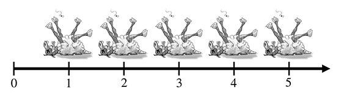
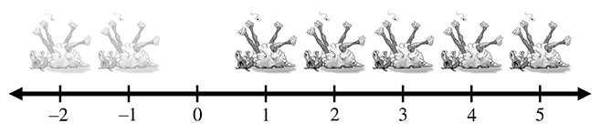
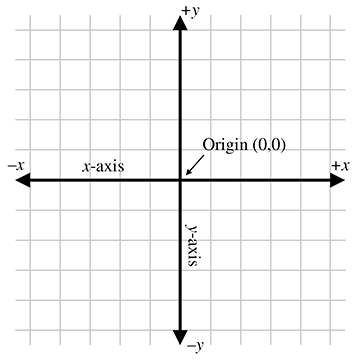
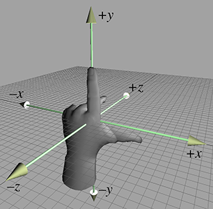
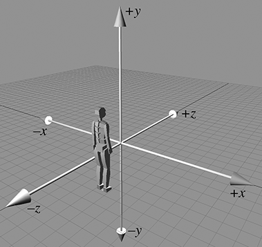
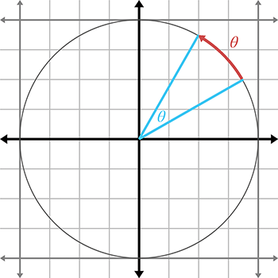
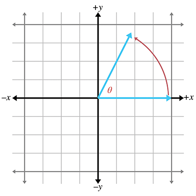

# 笛卡尔坐标系

## Cartesian Coordinate Systems

[https://gamemath.com/book/cartesianspace.html](https://gamemath.com/book/cartesianspace.html)

认识基本的 2D 和 3D 中的笛卡尔坐标系，讨论如何使用笛卡尔坐标系来定位空间中的点，还包括对三角函数和求和符号等。

### 开始

3D 数学就是在 3D 空间中以数学方式精确测量位置、距离和角度。使用计算机执行此类计算最常用的框架称为笛卡尔坐标系。笛卡尔数学是由一位杰出的法国哲学家、物理学家、生理学家和数学家勒内·笛卡尔 (René Descartes) 发明（并以他的名字命名），他生活在 1596 年至 1650 年。勒内·笛卡尔不仅因发明笛卡尔数学而闻名，笛卡尔数学在当时是代数和几何的惊人统一。

本章会分为四个主要部分：

- 1.1 回顾下数字系统的一些基本原理和计算机图形学第一定律
- 1.2 介绍了二维笛卡尔数学，即平面数学，它展示了如何描述二维笛卡尔坐标空间以及如何使用空间定位点
- 1.3 将这些想法扩展到三个维度，解释了左手和右手坐标空间并建立了本书中使用的一些约定
- 1.4 回顾本章内容

### 1D 数学

在讨论 3D 之前，需要解决一些关于数字系统和计数的问题。



将羊排成一排以便于数数的习惯引出了数轴的概念，即一条以规则间隔标记数字的线，如图所示。原则上，这条线可以继续下去，只要我们愿意，但为了避免无聊，我们在五只羊处停下来，并使用箭头让您知道这条线可以继续。更清晰的思想家可以想象它会走向无限，但历史上死羊的供应商可能除了他们的梦想和狂热的想象之外很少考虑这个概念。

在历史的某个时刻，人们可能意识到，有时，说话特别快的人可以出售他们实际上并不拥有的羊，从而同时发明了债务和负数的重要概念。卖掉这只假定的羊后，快说者实际上将拥有“负一”羊，从而导致整数的发现，整数由自然数及其负数组成。整数对应的数轴如图所示。



贫困的概念可能早于债务的概念出现，导致越来越多的人只能购买半只或四分之一的死羊。这导致了由一个整数除以另一个整数组成的分数的迅速使用，例如 2/3 或 111/27。数学家称这些数为有理数，它们位于数轴中整数之间明显的位置。在某些时候，人们变得懒惰并发明了十进制记数法，例如写“3.1415”而不是更长、更乏味的 31415/10000。

一段时间后，人们注意到日常生活中出现的一些数字不能用有理数来表示。典型的例子是圆的周长与其直径的比率，通常表示为（希腊字母 pi，发音为“pie”）是无线不循环小数。这些就是所谓的实数，包括有理数和数字，例如如果用十进制表示，则需要无限个小数位。实数数学被许多人认为是数学中最重要的领域——事实上，它是大多数工程形式的基础，因此它可以被认为是现代文明的创造者。实数的酷之处在于，虽然有理数是可数的（即可以与自然数一一对应），但实数是不可数的。研究自然数和整数的称为离散数学，研究实数的称为连续数学。

> 计算机图形学第一定律：如果看起来正确，那就是正确的。

### 2D 笛卡尔空间

本节介绍的二维笛卡尔数学，即平面的数学。



二维笛卡尔坐标空间由两条信息定义：

- 每个二维笛卡尔坐标空间都有一个特殊的位置，称为原点，它是坐标系的“中心”。
- 每个二维笛卡尔坐标空间都有两条通过原点的直线。每条线称为轴，并在两个相反的方向上无限延伸。两个轴彼此垂直。

常见所说的屏幕坐标空间


### 使用笛卡尔坐标定位二维位置

这就不用说了吧，对于中国小学数学这都已经学了，对于国外的书籍，特别怕读者什么都不懂，会从小事做起讲解。


一些点的描述样例


### 3D 笛卡尔空间

3D 像引进 z 轴 和 xy、xz、yz 平面。额外维度，额外轴 z。


### 3D 中指定位置

使用`(x,y,z)`坐标确定位置


### 左手右手坐标空间

左手坐标空间



右手坐标空间


两个坐标系无论怎么旋转都不可能使得三个轴方向对应重合的。

对于坐标系的旋转，左手坐标系和右手坐标系在“正旋转”的定义上也有所不同。假设我们在空间中有一条线，我们需要绕这条线旋转指定的角度。我们称这条线为旋转轴，但不要认为轴这个词意味着我们只讨论其中一个基本轴 x,y,z，旋转轴可以任意定向。


左右手坐标系可以转换，将两个坐标轴交换然后绕着某轴旋转就可以了。

### 一些约定

在设计 3D 虚拟世界时，必须事先做出几个设计决策，例如左手坐标系还是右手坐标系，哪个方向是+y，等等。

在此我们使用左手坐标系：



### 求和与累积符号

求和表示法也称为 sigma 表示法，因为那个看起来很酷的 E 符号是希腊字母 sigma 的大写版本。


当我们取一系列值的乘积时，会使用类似的表示法，只是我们使用符号 Π，这是字母的大写版本。


### 间隔符号

`[a,b]` 表示 `a<=x<=b`。
`(a,b)` 表示 `a<x<b`。

看起来和坐标有点像，他们是什么还是要根据语境进行识别的。

### 角度、度数和弧度

角度测量平面内的旋转量。代表角度的变量通常用希腊字母，用于规定角度的最重要的测量单位是度（°）和弧度（rad）。

弧度测量单位圆上的弧长



单位圆的周长为 2𝜋。

```bash
360° = 2𝜋 rad
180° = 𝜋 rad
180°/𝜋 = 57.29578° = 1rad
1° = (𝜋/180)rad = 0.01745329rad
```

### 三角函数

标准位置的角度,其中点头终点距离原点长度为 1



余弦和正弦三角函数：


正割、正切、余割、余切 有时也是有用的：


斜边、邻边、对边(The hypotenuse and the adjacent and opposite legs)


hyp(斜边)、opp(对边)、adj(邻边)


因为有钝角的情况：


常见三角函数值：


### 三角恒等式

问题不大毕竟都是些初中和高中知识。

与对称性相关的基本恒等式:


The Pythagorean theorem(勾股定理)

```bash
a、b:直角边 c:斜边
a^2+b^2=c^2
```

可以间接推出三角函数恒等式:


以下恒等式涉及对两个角度的和或差取三角函数：


### 普通三角形中求未知边

我们经常需要根据已知的边长或角度来求解三角形中未知的边长或角度。对于这些类型的问题，正弦定理和余弦定理很有帮助。使用的公式取决于哪些值是已知的以及哪些值是未知的。这些恒等式适用于任何三角形，而不仅仅是直角三角形：


三角形求未知边公式


