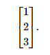
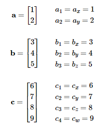

# 向量

## Vector

### 向量的数学定义

对于数学家来说，向量是一个数字列表。程序员将认识到同义词术语“数组”。请注意，C++ 中的 STL 模板数组类名为 vector，而基本的 Java 数组容器类是 `java.util.Vector`。所以从数学上来说，向量只不过是一个数字数组。

数学家区分矢量和标量（发音为“SKAY-lur”）。您已经是标量方面的专家了——标量是普通数字的技术术语。当我们希望强调特定量不是向量时，我们专门使用这个术语。例如，正如我们稍后将讨论的，“velocity”和“displacement”是矢量，而“speed”和“distance”是标量。

向量的维数表示向量包含多少个数字。向量可以是任何正维度，包括一维。事实上，标量可以被视为一维向量。我们主要对 2D、3D 和（后来的）4D 向量感兴趣。

在编写向量时,数学家会列出用方括号括起来的数字，如`[1,2,3]`.当我们将它写成方程式时，都好经常被省略，水平数学的向量都称为行向量。向量也经常垂直书写。

为更好的描述向量数值位置，通常会使用索引和下标标注

在数学中用字母描述变量也有些规范

- 标量变量用斜体小写罗马或希腊字母表示
- 任何维度的向量变量都用粗体小写字母表示
- 矩阵变量使用粗体大写字母表示

手写向量时经常使用一种常见约定是在向量上绘制箭头。

主要处理向量和矩阵的数学分支称为线性代数，该学科假设前面给出的抽象定义:向量是数字数组，这种高度通用的方法可以探索大量的数学问题。在线性代数中，向量和维数矩阵用于解决一个系统 线性方程组未知数，而不知道或关心任何数字具有什么物理意义。而对于 3D 数学，我们最关心的是向量和向量运算的几何解释。

### 向量的几何定义

### 使用笛卡尔坐标指定向量

### 作为位移序列的向量

### 零向量

### 向量与点

### 相对位置

### 点与向量的关系

### 一切都是相对的

### 对向量求负

#### 官方线性代数规则

#### 几何解释

### 标量向量乘法

#### 官方线性代数规则

#### 几何解释

### 向量加法和减法

#### 官方线性代数规则

#### 几何解释

### 从一点到另一点的位移矢量

### 矢量大小(长度)

#### 官方线性代数规则

#### 几何解释

### 单位向量

#### 官方线性代数规则

#### 几何解释

### 距离公式

### 矢量点积

#### 官方线性代数规则

#### 几何解释

### 向量叉积

#### 官方线性代数规则

#### 几何解释

### 线性代数恒等式
