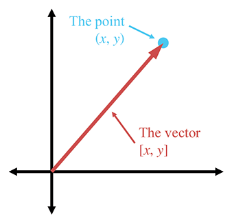

# 向量

## Vector

[https://gamemath.com/book/vectors.html](https://gamemath.com/book/vectors.html)

### 向量的数学定义

对于数学家来说，向量是一个数字列表。程序员将认识到同义词术语“数组”。请注意，C++ 中的 STL 模板数组类名为 vector，而基本的 Java 数组容器类是 `java.util.Vector`。所以从数学上来说，向量只不过是一个数字数组。

数学家区分矢量和标量（发音为“SKAY-lur”）。您已经是标量方面的专家了——标量是普通数字的技术术语。当我们希望强调特定量不是向量时，我们专门使用这个术语。例如，正如我们稍后将讨论的，“velocity”和“displacement”是矢量，而“speed”和“distance”是标量。

向量的维数表示向量包含多少个数字。向量可以是任何正维度，包括一维。事实上，标量可以被视为一维向量。我们主要对 2D、3D 和（后来的）4D 向量感兴趣。

在编写向量时,数学家会列出用方括号括起来的数字，如`[1,2,3]`.当我们将它写成方程式时，都好经常被省略，水平数学的向量都称为行向量。向量也经常垂直书写。


为更好的描述向量数值位置，通常会使用索引和下标标注


在数学中用字母描述变量也有些规范

- 标量变量用斜体小写罗马或希腊字母表示
- 任何维度的向量变量都用粗体小写字母表示
- 矩阵变量使用粗体大写字母表示

手写向量时经常使用一种常见约定是在向量上绘制箭头。

主要处理向量和矩阵的数学分支称为线性代数，该学科假设前面给出的抽象定义:向量是数字数组，这种高度通用的方法可以探索大量的数学问题。在线性代数中，向量和维数矩阵用于解决一个系统 线性方程组未知数，而不知道或关心任何数字具有什么物理意义。而对于 3D 数学，我们最关心的是向量和向量运算的几何解释。

### 向量的几何定义

下面显示了 2D 向量的图示


其看起来像一个箭头，这是以图形方式表示矢量图的标准方法，因为捕获了矢量的两个定义特征：其大小和方向。

这个向量在哪里？事实上，这不是一个合适的问题。向量没有位置，只有大小和方向。这听起来似乎不可能，但我们每天处理的许多数量都有大小和方向，但没有位置。考虑一下下面的两个语句如何有意义，无论它们应用在什么位置

- 移位。 “前进三步。”这句话看上去都是关于位置的，但是这句话中实际使用的量是相对位移，并没有绝对位置。这个相对位移由大小（3 步）和方向（向前）组成，因此可以用向量来表示。
- 速度。 “我正以 50 英里/小时的速度向东北行驶。”这句话描述了一个具有大小 (50 mph) 和方向（东北）但没有位置的量。 “以 50 mph 的速度向东北”的概念可以用向量来表示。

请记住，该箭头的长度和方向很重要，但位置并不重要。

### 使用笛卡尔坐标指定向量

二维向量及其值的示例


3D 矢量是 2D 矢量的简单扩展。

### 作为位移序列的向量

考虑矢量描述的位移的一种有用方法是将矢量分解为其轴向对齐的分量。当这些轴向对齐的位移组合起来时，它们累积地定义了由整个矢量定义的位移。

也就是高中知识就有的矢量分解。


例如，3D 向量`[1,-3,4]`表示单个位移，但我们可以将此位移想象为向右移动 1 个单位，向下移动 3 个单位，然后向前移动 4 个单位。 （假设我们的惯例是
+x,+y,+z 分别指向右、上、前。

执行这些步骤的顺序并不重要；重要的是。我们可以向前移动 4 个单位，向下移动 3 个单位，然后向右移动 1 个单位，那么我们将移动相同的总量。不同的排序对应于沿着包含矢量的轴向对齐边界框的不同路线。

### 零向量

对于任何给定的向量维度，都有一个特殊的向量，称为零向量，它的每个位置都有零。例如，3D 零向量是`[0,0,0]`。我们使用粗体零表示任意维度的零向量：**0** 。

零向量很特殊，因为它是唯一量值为零的向量。所有其他向量均具有正值。零向量也是唯一的，因为它是唯一没有方向的向量。

由于零向量没有方向或长度，因此我们不会像其他向量那样将其绘制为箭头。相反，我们将零向量描绘为一个点。但不要让这让您将零向量视为一个“点”，因为向量不定义位置。相反，将零向量视为表达“无位移”概念的一种方式，就像标量零代表“无数量”的概念一样。

向量 x + 零向量 仍然等于 x;

### 向量与点

“点”和“向量”在概念上有不同的用途：“点”指定位置，“向量”指定位移。


### 相对位置

因为矢量可以描述位移，所以它们可以描述相对位置。相对位置的概念相当简单：某物的位置是通过描述它相对于其他已知位置的位置来指定的。

位置没有绝对的，基本都是见参考系，定原点。

### 点与向量的关系

向量用于描述位移，因此它们可以描述相对位置。点用于指定位置。任何指定位置的方法都必须是相对的。点也是相对的——它们相对于用于指定其坐标的坐标系原点。这引出了点和向量之间的关系。



### 一切都是相对的

空间位置并不是我们世界中唯一难以建立“绝对”参考的方面，因此我们使用相对测量。还有温度、响度和速度。甚至你有没有钱，电脑性能好不好这都是相对的。

### 对向量求负

```cpp
x + (y) = 0
```

则 x 的负为

```cpp
y = -x
```

虽然有些弱智，the additive inverse，加法逆元。

#### 官方线性代数规则


要对任意维度的向量取反，我们只需对向量的每个分量取反即可。


#### 几何解释

对向量求反会得到大小相同但方向相反的向量,请记住，矢量在图表上的位置无关紧要，只有大小和方向很重要。

### 标量向量乘法

虽然我们不能将向量和标量相加，但我们可以将向量乘以标量。结果是一个与原始向量平行的向量，具有不同的长度并且可能具有相反的方向。

#### 官方线性代数规则

矢量乘标量乘法很简单；我们只需将向量的每个分量乘以标量即可。


其中的 k 完全可以为分数，为负数。


#### 几何解释

几何上，将向量乘以标量具有将长度缩放为一个因子的效果,如果乘以负值则表示反转方向长度进行伸缩。

### 向量加法和减法

对两个向量进行加法和减法，只要它们具有相同的维度。结果是与向量操作数具有相同维数的向量。我们对向量加法和减法使用与标量加法和减法相同的表示法。

#### 官方线性代数规则


还有些加法交换律,减法反交换。

```cpp
a+b=b+a
a-b=-(b-a)
```

#### 几何解释


减法:共起点指被减

扩展到 3D 其实也同理，这些都是初中高中知识不再过多探讨。

### 从一点到另一点的位移矢量


```cpp
b(x1,y1)-a(x2,y2)=v
让a+向量v就能到b点
```

### 矢量大小(长度)

矢量具有大小和方向，`[3,4]`的长度为 5，向量的大小也称为向量的长度或范数。

#### 官方线性代数规则

在线性代数中，矢量的大小通过使用矢量周围的双竖线来表示。这类似于用于标量绝对值运算的单竖线表示法。用于计算任意维度向量的大小的符号和方程如:


#### 几何解释


对于任何正值，有无数个具有该值的向量


### 单位向量

单位向量是大小为 1 的向量。单位向量也称为归一化向量。

> In summary, a “normalized” vector always has unit length, but a “normal” vector is a vector that is perpendicular to something and by convention usually has unit length.

总之，“归一化”向量始终具有单位长度，但“法向”向量是垂直于某物的向量，并且按照惯例通常具有单位长度。

#### 官方线性代数规则

向量归一化


#### 几何解释

在二维中，如果我们绘制一个尾部位于原点的单位向量，则向量的头部将接触以原点为中心的单位圆。在 3D 中，单位矢量接触单位球体的表面。

### 距离公式

距离公式。该公式用于计算两点之间的距离。

```cpp
d = b - a = [b1-a1,b2-a2,...,bn-an]
distance(a,b)=||d||
即向量d的长度，就是两点之间之间直线距离
```

### 矢量点积

点积也成为内积。

矢量点积是可交换的

```cpp
a * b = b * a
```

#### 官方线性代数规则


#### 几何解释

### 向量叉积

#### 官方线性代数规则

#### 几何解释

### 线性代数恒等式
