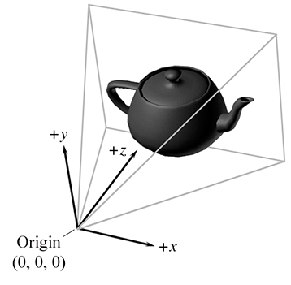
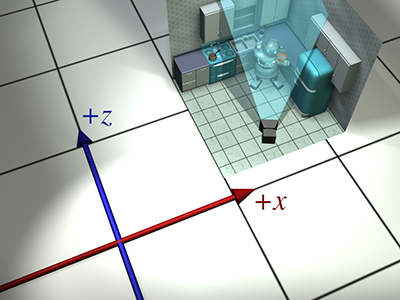

# 多个坐标空间

## Multiple Coordinate Spaces

[https://gamemath.com/book/multiplespaces.html](https://gamemath.com/book/multiplespaces.html)

### 为什么要考虑多个坐标空间？

为什么我们需要多个坐标空间？毕竟，任何一个 3D 坐标系都无限延伸，因此包含空间中的所有点。所以我们可以选择一个坐标空间，声明它是“世界”坐标空间
并且可以使用该坐标空间来定位所有点。那不是更容易吗？实际上，这个问题的答案是“不”。大多数人发现在不同情况下使用不同的坐标空间更方便。

使用多个坐标空间的原因是某些信息仅在特定参考系的上下文中才已知。理论上所有点都可以使用单个“世界”坐标系来表达，这可能是正确的。
然而对于某一点a，我们可能不知道坐标a在"世界"坐标系中，但是可以表达相对其他一些坐标系表示出a。

本质上涉及一些线性代数的基变换知识。

### 一些有用的坐标空间

需要不同的坐标空间，因为某些信息仅在特定上下文中才有意义或可用。

#### 世界空间(World Space)

```cpp
Author    City    Latitude      Longitude
Fletcher  Chicago 41°57' North  87°39' West
Ian       Denton  33°11' North  97° West
```

这些纬度和经度值表达了我们在世界上的“绝对”位置。您不需要知道丹顿、芝加哥、德克萨斯州、伊利诺伊州甚至美国的哪里可以使用此信息，因为位置是绝对的。
(0,0)由于历史原因，世界上的这一点被决定位于赤道上，与英国格林威治镇的皇家天文台处于同一经度。

我们生活在一个包裹在球体周围的平坦 2D 世界中，这个概念据说大多数人都没有意识到这一点，直到克里斯托弗·哥伦布通过实验证实了这一点。

世界坐标系是一种特殊的坐标系，它为所有要指定的其他坐标系建立“全局”参考系。换句话说，我们可以用世界坐标空间来表达其他坐标空间的位置，但我们不能用任何更大的外部坐标空间来表达世界坐标空间。

世界坐标空间(world corrdinate space)也称为全局或通用坐标空间(global or universal coordinate space.)。

#### 对象空间(Object Space)

对象空间是与特定对象关联的坐标空间。每个对象都有自己独立的对象空间。当对象移动或改变方向时，与该对象关联的对象坐标空间也随之移动，因此它也会移动或改变方向。
例如让一个人向左转(这是在对象空间中表达的概念)，向左(“向东”是在世界空间中表达的概念。)

可以在对象空间中指定位置和方向。例如，如果我问你车上的消声器在哪里，即使你是 Tom 或 Ray Magliozzi
并且你的车实际上在剑桥，你也不会告诉我“剑桥，1 MA”。在这种情况下，像这样用全局视角表达的答案是完全没有用的；
我希望你表达你的消声器在你汽车的对象空间中的位置。

在图形学内容，对象空间也称为模型空间，因为模型顶点的坐标在模型空间中表示。对象空间也称为主体空间，
尤其是在物理背景下。使用“相对于身体轴”之类的短语也很常见，这与“使用身体空间坐标表达”的含义相同。

#### 相机空间(Camera Space)

对象空间的一个特别重要的示例是相机空间，它是与用于渲染的视点相关联的对象空间。在相机空间中，相机位于原点右边为+x,向前为+z,向上为+y。



而OpenGL的传统时，-z朝向屏幕里面，+z朝向屏幕外即朝向观看屏幕的人。相机空间(3D空间)和屏幕空间(2D空间)之间的差异，相机空间
坐标到屏幕空间坐标的映射涉及成为投影的操作。

#### 直立空间

从某种意义上说，物体的直立空间是世界空间与其物体空间之间的“中间”。正立空间的轴与世界空间的轴平行，但正立空间的原点与物体空间的原点重合。


为什么直立空间很有趣？在物体空间和直立空间之间变换点只需要旋转，在直立空间和世界空间之间变换点只需要改变位置，这通常称为平移。独立思考这两件事比同时处理这两件事要容易。

### 基向量和坐标空间转换

我们说过，存在多个坐标空间的一个主要理由是因为某些位置或方向仅在特定坐标空间中已知。同样，有时某些问题只能在特定的坐标空间中得到回答。当问题最好在一个空间中提出，而我们回答该问题所需的信息在另一个空间中已知时，我们就有一个需要解决的问题。

例如，假设我们的机器人正在尝试在虚拟世界中拿起鲱鱼三明治。我们最初知道三明治的位置和机器人在世界坐标中的位置。世界坐标可用于回答诸如“三明治在我的北边还是南边？”之类的问题。如果我们知道三明治在机器人物体空间中的位置，则可以回答一系列不同的问题，例如，“三明治是在我前面还是在我后面？” “我应该转向哪个方向来面对三明治？” “我该如何移动我的鲱鱼三明治勺才能到达拿起三明治的位置？”请注意，要决定如何操纵齿轮和电路，对象空间坐标是相关的。此外，传感器提供的任何数据都将在对象空间中表达。当然，我们自己的身体也遵循类似的原理工作。我们所有人都有能力看到面前的美味食物并将其放入嘴中，但不知道哪个方向是“北”。 （也谢天谢地，否则我们很多人都会饿死。）

此外，假设我们希望渲染机器人拿起三明治的图像，并且场景由安装在她肩膀上的灯照亮。我们知道灯光在机器人的物体空间中的位置，但为了正确照亮场景，我们必须知道灯光在世界空间中的位置。

我们知道如何在一个坐标空间中表达一个点，并且我们需要在另一个坐标空间中表达该点。此计算的技术术语是坐标空间变换。我们需要将位置从世界空间转换到对象空间（在三明治的示例中）或从对象空间转换到世界空间（在光的示例中）。请注意，在这个例子中，三明治和灯光都没有真正移动，我们只是在不同的坐标空间中表达它们的位置。

#### 双重视角

我们并没有变换点，其实只是找出一个坐标空间到另一个坐标空间的映射关系。

在世界坐标的原点建造我们的机器人。


虽然这基本上是一个 2D 示例，但我们将使用 3D 约定，忽略y轴。+z为北，+x为东。


目前，由于模型处于其原始位置，因此根据定义，对象空间和世界空间（以及直立空间）都是相同的。


这里，请允许我们稍微题外话来回答一些读者可能会问的问题：“我们是否必须先旋转，然后再平移？”
这个问题的答案基本上是“是”。虽然在旋转之前平移似乎更自然，但通常先旋转更容易。
原因如下。当我们先旋转物体时，旋转中心就是原点。关于原点的旋转和平移是我们可以使用的两种原始工具，
而且每种工具都很简单。 如果我们第二次旋转，那么旋转将围绕不是原点的点发生。

绕原点的旋转是线性变换，但绕任何其他点的旋转是仿射变换。为了执行仿射变换，我们组成了一系列原始操作。
对于绕任意点的旋转，我们将旋转中心平移到原点，绕原点旋转，然后平移回来。
换句话说，如果我们想通过先平移、再旋转的方式将机器人移动到位，我们可能会经历以下过程：

1. 平移
2. 旋转，因为我们围绕一个不是原点的点旋转，所以这是一个三步过程：
  a. 将旋转中心平移至原点。 （这会撤消步骤 1。）  
  b. 执行绕原点的旋转。
  c. 平移以将旋转中心放置到位。

请注意，步骤 1 和 2a 相互抵消，我们只剩下两个步骤：先旋转，然后平移。



场景中摄像机和机器人的布局


所以我们已经成功地将机器人模型放到了世界上正确的位置。但为了渲染它，我们需要将模型的顶点转换到相机空间。换句话说，我们需要表达顶点相对于相机的坐标。

但是我们如何从世界空间转换到相机空间？对象都已经“就位”，那么我们将它们“移动”到哪里呢？对于这种情况，考虑变换坐标空间而不是变换对象会很有帮助.

当我们从物体空间转换到世界空间时，我们之所以能够这样做，是因为我们想象机器人从世界空间的原点开始。当然，机器人从未真正到达过世界空间的某个位置，但它是我们想象出来的。既然我们通过移动物体从物体空间变换到世界空间，也许我们可以通过移动世界从世界空间变换到相机空间！想象一下整个世界，包括机器人、相机和厨房，并移动所有东西。显然，此类操作不会影响相机“看到”的内容，因为它们不会改变相机与世界中物体之间的相对关系。如果我们将世界和相机一起移动，使相机移动到原点，那么世界空间坐标和相机空间坐标将是相同的。图 3.9 显示了我们用来实现这一目标的两步流程。

1. 最初的场景，坐标轴是世界坐标系


2. 将整个世界平移，移成相机恰好到原点位置


3. 旋转整个世界，使得相机的物体坐标系与与世界坐标系重合


举例，最初相机的坐标大约为`(13.5,4,2)`，一个网格十个单位，为了将相机移动到原点，我们将所有内容平移 为所有物体
进行`(-13.5,-4,-2)`.相机大致面向东北，因此与北方相比具有顺时针方向；需要逆时针旋转才能将相机空间轴与世界空间轴对齐。

相机怎么旋转，世界中的物体也跟着怎么旋转。

第一步拾取并移动整个机器人，然后第二步拾取整个世界6，我们终于得到了相机空间中顶点的坐标，并可以继续渲染。

首先，世界到摄像机的变换通常在顶点着色器中完成；如果您的工作级别较高并且不编写自己的着色器，则可以将其留给图形 API。其次，就图形管道而言，相机空间并不是“终点线”。顶点从相机空间转换到剪辑空间，最后投影到屏幕空间。


#### 指定坐标空间

原点+轴方向

#### 基向量

主要了解

* 线性组合
* 秩
* 正交基
* 标准正交基

都是些线性代数的基本知识，了解即可，不知道不理解就去看看MIT老爷子的线性代数课程

### 嵌套坐标空间

大概就是，比如世界空间是一个大的三维空间，有世界坐标系原点 坐标轴。
世界空间内的每个对象都有自己的坐标空间，它自己的原点和轴，比如美术设计师在设计三维人物模型时，就会在模型的身上定义一个原点与坐标轴，模型的每个点都能在对象坐标系中确定。

这样一来我们可以将对象按照其自己坐标系的原点放进世界空间的某个点，例如要设计动画我们只需要关注对象坐标系本身，例如一个人肚子处为原点，向上为y轴，人的耳朵上下动动画，就只针对对象坐标系就好了，关于在世界空间中是怎样的并不关系，这就留给坐标系转换去做了。

可以很方便地将世界空间视为“父”空间，将对象空间视为“子”空间，还可以方便地将对象分解为子对象并单独为其设置动画，这样的层次结构的模型有事被称为关节模型。

子坐标空间嵌套在父坐标空间中，坐标空间之间的父子关系定义坐标空间的层次结构或树，世界坐标空间是这棵树的根，嵌套的坐标空间树可以在虚拟世界的生命周期中动态改变。例如，绵阳的羊毛可以被剪并从羊身上带走，因此绵羊的羊毛坐标空间从绵羊身体坐标空间的子空间变成了世界空间的子空间，嵌套坐标空间的层次结构是动态的，并且可以按信息的重要程度进行排列。
