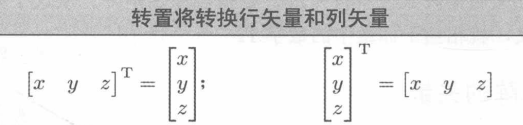

# 矩阵简介

## Introduction to Matrices

[https://gamemath.com/book/matrixintro.html](https://gamemath.com/book/matrixintro.html)

### 矩阵的数学定义

在线性代数中，矩阵是排列成行和列的矩形数字网格。

### 矩阵维度和表示法

对于r行c列的矩阵，称为 r x c (读作r乘c)矩阵。


### 方形矩阵

具有相同行数和列数的矩阵称为`方形矩阵`(Square Matrice)。

方阵的对角元素(Diagonal Elements)是行和列索引相同的元素。


矩阵中的所有非对角元素都为零，则该矩阵为`对角矩阵`（Diagonal Matrix）。


对角元素全为1的对角矩阵是`单位矩阵`(Identity Matrix)。

```cpp
      1  0  1
I3  = 0  1  0
      0  0  1
```

### 作为矩阵的矢量

矩阵可以包含任何正数的行和列，一行或一列的矩阵：矢量！
维数n的矢量可以被视为1 x n矩阵，或者被视为n x 1矩阵。
1 x n矩阵称为行矢量(Row Vector), n x 1矩阵称为列矢量(Column Vector)。


### 矩阵转置

给定 r x c矩阵M，M的转置(Transpose)表示为 M<sup>T</sup>,是c x r矩阵。

即 M<sup>T</sup><sub>ij</sub> = M<sub>ji</sub>


对于矢量，转置会将行矢量转换为列矢量。



* 对于任何维度的矩阵M，则(M<sup>T</sup>)<sup>T</sup> = M。
* 任何对角矩阵D等于其转置,D<sup>T</sup> = D。

### 矩阵与标量相乘

矩阵M可以与标量k相乘，得到与M相同维度的矩阵。中间不需要乘法符号，乘法以直接的方式进行：
结果矩阵kM中的每个元素是k与M中相应元素的乘积。


### 两个矩阵相乘

矩阵相乘怎么理解呢，其实左边矩阵的每一列都是一个列矢量，右边的每一列都是相对于左边矩阵列矢量的量大小。
可以形象的把左边的列向量当做坐标系基，但是这些列向量不一定是互相垂直的。

```cpp
AB = a11 a12    b11  b12
     a21 a22    b21  b22

|a11| b11 + |a12| b21 = |a11b11 + a12b21|
|a21|       |a22|       |a21b11 + a22b21|

|a11| b12 + |a12| b22 = |a11b12 + a12b22|
|a21|       |a22|       |a21b12 + a22b22|

AB = |a11b11 + a12b21  a11b12 + a12b22|
     |a21b11 + a22b21  a21b12 + a22b22|
```


* 矩阵M乘以相同行与列数的单位矩阵I 结果为M
* 矩阵乘法不是可交换的，一般来说 `AB != BA`
* 矩阵乘法是可结合的 `(AB)C = A(BC)`,手推一次就记得一清二楚。
* 矩阵乘法可以与标量或矢量乘法结合：(kA)B = k(AB) = A(kB),(vA)B = v(AB)
* 转置两个矩阵的乘积: (AB)<sup>T</sup> = B<sup>T</sup>A<sup>T</sup>

扩展到两个以上的矩阵：

(M<sub>1</sub>...M<sub>n-1</sub>M<sub>n</sub>)<sup>T</sup> = M<sub>n</sub><sup>T</sup> M<sub>n-1</sub><sup>T</sup> ... M<sub>1</sub><sup>T</sup>

### 矢量和矩阵相乘

和矩阵相乘部分代码框中类似，这属于大学线代基本中的基本知识了


对于矢量与矩阵乘法分布在矢量加法上有

```cpp
(v + w) M = vM + wM
```

### 行与列矢量

行矢量v : vM = 行矢量 每个元素都是v与矩阵M列矢量的点积，本质还是左边的为权重 作用于M的行空间 也就是M行矢量张成空间里的一个矢量
列矢量v : Mv = 列矢量 结果列矢量由M每个列矢量加v每个元素的权重得到而成， 右边的为权重 作用于M的列空间 M列矢量张成空间的一个矢量

许多图形书籍和应用程序编程接口(Application Programming Interface API),如DirectX都是用行向量。
但其他API，如OpenGL和各种控制台上的OpenGL自定义端口，都是用列向量。几乎所有使用线性代数的其他学科都喜欢
列向量。用别人的代码或公式要注意，必须知道采用的是行矢量还是列矢量。

### 矩阵的几何解释

方形矩阵可以描述任何线性变换(Linear Transformation)。线性变换可以”拉伸“坐标空间，但不会”弯曲“或
”扭曲“，常用的有

* 旋转（Rotation）
* 比例缩放（Scale）
* 正交投影（Orthographic Projection）
* 反射（Reflection）
* 错切（Shearing）

### 线性代数的宏大图景

本书几乎只关注线性代数领域中的 矢量和矩阵几何应用。

在国内大学课程 线代很多时候用于操纵和求解线性方程组。如

```cpp
-5*x1 + x2 + x3 = -10
2*x1  +2x2 +4x3 = 12
x1  - 3*x3 = 9
```

解为

```cpp
x1 = 3 x2 = 7 x3 = -2
```

利用矩阵计算

```cpp
| -5 1 1  |  |x1|   |-10|
| 2  2 4  |  |x2| = |12 |
| 1  0 -3 |  |x3|   |9  |
Ax=b
```

可以求矩阵A的逆 A<sup>-1</sup>

A<sup>-1</sup>Ax=A<sup>-1</sup>b  
Ix = A<sup>-1</sup>b  即可得 X = A<sup>-1</sup>b

> Gilbert Strang老爷子确实nb，本书也推荐了其线性代数课程，可以从ocw.mit.edu得MIT OpenCourseWare（麻省理工学院公开课）免费下载。提供了本科阶段基础线性代数课程以及计算科学和工程专业的研究胜课程，他的写作风格是一种速记式的，如果没有听课，可能理解会比较困难。
