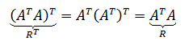

# 😆 矩阵的基本运算

简单来说，矩阵是充满数字的表格。

**A**和**B**是两个典型的矩阵，**A**有2行2列，是2×2矩阵；**B**有2行3列，是2×3矩阵；**A**中的元素可用小写字母加行列下标表示，如a1,2 = 2, a2,2 = 4

## 矩阵加减法

两个矩阵相加或相减，需要满足两个矩阵的列数和行数一致。

加法交换律：**A** + **B** = **B** + **A**

## 矩阵乘法

两个矩阵**A**和**B**相乘，需要满足**A**的列数等于**B**的行数。

矩阵乘法很容易出错，尤其是两个高阶矩阵相乘时。

矩阵乘法不满足交换律，但仍然满足结合律和分配律：

## 单位矩阵

单位矩阵是一个n×n矩阵，从左到右的对角线上的元素是1，其余元素都为0。下面是三个单位矩阵：

如果**A**是n×n矩阵，**I**是单位矩阵，则**AI**= **A**, **IA** = **A**

单位矩阵在矩阵乘法中的作用相当于数字1。

## 逆矩阵

矩阵**A**的逆矩阵记作**A**-1， **A A**-1=**A**-1**A**= **I**，I是单位矩阵。

对高于2阶的矩阵求逆是一件很崩溃的事情，下面是一种求3阶矩阵的方法：

## 奇异矩阵

当一个矩阵没有逆矩阵的时候，称该矩阵为奇异矩阵。当且仅当一个矩阵的行列式为零时，该矩阵是奇异矩阵。

　当ad-bc=0时|**A**|没有定义，**A**-1不存在，**A**是奇异矩阵。

　如是奇异矩阵。

## 矩阵的转置

简单地说，矩阵的转置就是行列互换，用AT表示A的转置矩阵。

转置运算公式：\

## 对称矩阵

如果一个矩阵转置后等于原矩阵，那么这个矩阵称为对称矩阵。由定义可知，对称矩阵一定是方阵。对称矩阵很常见，实际上，一个矩阵转置和这个矩阵的乘积就是一个对称矩阵：

证明很简单：

两个对称矩阵相加，仍然得到对称矩阵：

.png>)
