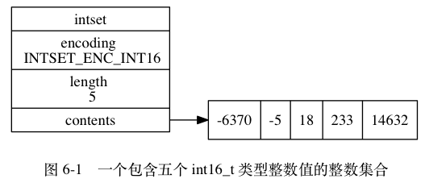
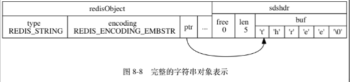

# Redis设计与实现

## Redis设计与实现

《Redis设计与实现第二版》

## 简介

- 数据结构与对象 （已读）

## 简单动态字符串

主要介绍了redis中的字符串类型实现原理，以及redis哪些内容是使用字符串类型存储的。内存空间，扩容，内存大小，已使用大小等等规则。


SDS有一套自己的扩容与内存释放规则。

- SDS的定义 （已读）
- SDS与C字符串的区别 （已读）
- SDS API （已读）

## 链表

主要介绍了redis中的链表类型实现原理list,背后是双向链表实现，且带有头节点指针和尾节点指针，节点数量等。

```cpp
// 每个链表节点使用一个adlist.h/listNode结构来表示
typedef struct listNode {
    // 前置节点
    struct listNode *prev;
    // 后置节点
    struct listNode *next;
    // 节点的值
    void *value;
} listNode;
```

```cpp
// 链表结构 adlist.h/list
typedef struct list {
    // 表头节点
    listNode *head;
    // 表尾节点
    listNode *tail;
    // 链表所包含的节点数量
    unsigned long len;
    // 节点值复制函数
    void *(*dup)(void *ptr);
    // 节点值释放函数
    void (*free)(void *ptr);
    // 节点值对比函数
    int (*match)(void *ptr, void *key);
} list;
```


- 链表和链表节点的实现 （已读）
- 链表和链表节点的API （已读）

## 字典

key-value结构，Redis 的字典使用哈希表作为底层实现， 一个哈希表里面可以有2个哈希表节点， 而每个哈希表节点就保存了字典中的一个键值对。

结构有哈希表数组（一个二维指针，数组每个元素存储的是内存地址）、哈希表大小、大小掩码总是等于哈希表大小减去1、哈希表已有的节点数量。

```cpp
// redis字典所使用的哈希表由dict.h/dictht结构定义
typedef struct dictht {
    // 哈希表数组
    dictEntry **table;
    // 哈希表大小
    unsigned long size;
    // 哈希表大小掩码，用于计算索引值
    // 总是等于 size - 1
    unsigned long sizemask;
    // 该哈希表已有节点的数量
    unsigned long used;
} dictht;
```


每个节点有key、union类型value、还有一个存储下一个节点地址的指针next，可以形成链表（解决键冲突问题）。

```cpp
typedef struct dictEntry {
    // 键
    void *key;
    // 值
    union {
        void *val;
        uint64_t u64;
        int64_t s64;
    } v;
    // 指向下个哈希表节点，形成链表
    struct dictEntry *next;
} dictEntry;
```


redis中一个字典内置有多个哈希表（可以缓解哈希冲突与单个哈希表过大的问题），dictType类型指针，私有数据void类型指针privdata,rehash索引int rehashidx，dictType内部存储了许多key相关的函数指针，如计算哈希值函数、复制键的函数、复制值得函数、对比键得函数、销毁键销毁值得函数等。

```cpp
// redis中的字典由dict.h/dict结构表示
typedef struct dict {
    // 类型特定函数
    dictType *type;
    // 私有数据
    void *privdata;
    // 哈希表
    dictht ht[2];
    // rehash 索引
    // 当 rehash 不在进行时，值为 -1
    int rehashidx; /* rehashing not in progress if rehashidx == -1 */
} dict;
typedef struct dictType {
    // 计算哈希值的函数
    unsigned int (*hashFunction)(const void *key);
    // 复制键的函数
    void *(*keyDup)(void *privdata, const void *key);
    // 复制值的函数
    void *(*valDup)(void *privdata, const void *obj);
    // 对比键的函数
    int (*keyCompare)(void *privdata, const void *key1, const void *key2);
    // 销毁键的函数
    void (*keyDestructor)(void *privdata, void *key);
    // 销毁值的函数
    void (*valDestructor)(void *privdata, void *obj);
} dictType;
```

第2个哈希表只在第一个哈希表进行rehash时使用。rehashidx记录了rehash目前得进度，目前没有进行rehash则其值为-1。


哈希算法,redis用了MurmurHash2算法来计算键得哈希值，其优点是即使输入得键是有规律的，算法仍可以给出一个很好得随机分布性。

```cpp
hash = dict->type->hashFunction(key);
index = hash & dict->ht[x].sizemask;
```

解决键冲突，两个或两个以上被分配到哈希表数组的同一个索引上面时，称这些键发生了冲突。每个哈希表节点都有一个next指针，使用单向链表连接起来解决冲突。
为了效率高，程序使用的是链表前插法。


rehash,当单个哈希表保存的键值数量太多或太少时，程序需要对哈希表的大小进行扩展或者收缩，使得负载因子维持在一个合理的范围之内。
为ht1哈希表分配空间，进行一定程度的扩展收缩策略确定ht1大小,将ht0已有的键值rehash到ht1，然后把ht1设置为ht0。


哈希表的扩展与收缩，当满足任意一个条件，程序会自动开始对哈希表执行扩展操作：

1. 服务器没有在执行BGSAVE（RDB过程）或BGREWRITEAOF（AOF过程），并且哈希表负载因子大于等于1
2. 服务器正在执行BGSAVE或BGREWRITEAOF，并且哈希表的负载因子大于等于5

哈希表的负载因子公式

```bash
# 负载因子 = 哈希表已经保存节点数量 / 哈希表大小
load_factor = ht[0].used / ht[0].size
```

当负载因子小于0.1时，程序自动开始对哈希表执行收缩操作。

在BGSAVE或BGREWRITEAOF过程中，Redis需要创建服务器进程的子进程，大多数操作系统采用写时赋值优化子进程的使用效率，所以在子进程存在
期间，服务器会提高所需的负载因子，从而避免在子进程存在期间进行哈希表的扩展操作，避免不必要的内存写入操作。

渐进式rehash，为什么，rehash过程是从ht0 中的键值rehash到ht1中去，如果ht0中的键值比较少还好这个过程需要的时间比较短，但是
如果有几十万的键值需要处理呢，可能服务都会被迫中断一会。redis中的字典rehash是循序渐进进行的。

哈希表渐进式rehash的步骤：

1. 为ht1分配空间，让字典同时持有ht0和ht1两个哈希表。
2. 在字典中维持一个索引计数器变量rehashidx，将其值设为0,标识rehash工作正式开始。
3. 在rehash进行期间，每次对字典执行添加、删除、查找、或者更新时，程序出了执行指定操作以外，会顺带将ht0哈希表在rehashidx索引上的所有键值对rehash到ht1,rehash完成后将rehashidx值加1。
4. 随着字典操作不断执行，最终在某个时间点，ht0所有键值对都会被rehash到ht1,此时将rehashidx设置为-1表示rehash操作已完成。

渐进式rehash执行期间的哈希表操作：在进行渐进式rehash过程中，字典同时有ht0和ht1两个哈希表，在此期间字典的删除 查找 更新等操作会在
两个哈希表上进行，比如说，要在字典里面查找一个键会现在ht0中查找，没找到再在ht1里面查找。
在渐进式 rehash 执行期间， 新添加到字典的键值对一律会被保存到 ht1 里面， 而 ht0 则不再进行任何添加操作：
这一措施保证了 ht0 包含的键值对数量会只减不增， 并随着 rehash 操作的执行而最终变成空表。

- 字典的实现 （已读）
- 哈希表 （已读）
- 哈希表节点 （已读）
- 字典 （已读）
- 哈希算法 （已读）
- 解决键冲突 （已读）
- rehash（已读）
- 哈希表的扩展与收缩（已读）
- 渐进式rehash（已读）
- 渐进式rehash执行期间的哈希表操作（已读）

## 跳跃表

跳跃表skiplist是一种有序数据结构，它通过在每个节点中维持多个指向其他节点的指针，从而达到快速访问节点的目的。
跳跃表支持平均 O(log N) 最坏 O(N) 复杂度的节点查找， 还可以通过顺序性操作来批量处理节点。


Redis 只在两个地方用到了跳跃表， 一个是实现有序集合键， 另一个是在集群节点中用作内部数据结构。
维护跳跃表相关基础信息的结构为zskiplist结构，其包含属性:

```cpp
// 跳跃表节点的实现由redis.h/zskiplistNode
typedef struct zskiplistNode {
    // 后退指针
    struct zskiplistNode *backward;
    // 分值
    double score;
    // 成员对象
    robj *obj;
    // 层
    struct zskiplistLevel {
        // 前进指针
        struct zskiplistNode *forward;
        // 跨度
        unsigned int span;
    } level[];
} zskiplistNode;
```

1. header 指向跳跃表的表头节点
2. tail 指向跳跃表的表尾节点
3. level 记录目前跳跃表内，层数最大的那个节点的层数（表头节点的层数不计算在内）
4. length 跳跃表的长度，跳跃表当前包含节点的数量（表头节点不计算在内）

zkiplistNode结构

1. 层 level,节点中有很多层，每层都带有两个属性，（前进指针）和（跨度），前进指针用于访问位于表尾方向的其他节点，跨度则记录前进指针所指节点和
当前节点的距离。
2. 后退指针，它指向位于当前节点的前一个节点。
3. 分值，在跳跃表中，节点按各自所保存的分值从小到大排列。
4. 成员对象，每个节点保存一个成员对象（表头节点没有成员对象）

表头节点也有后退指针、分值和成员对象，不过表头节点的这些属性都不会被用到。

层：跳跃表节点的level数组可以包含多个元素，每个元素都包含一个指向其他节点的指针，程序可以使用这些层加快访问其他节点的速度，一般来说层的数量越多，访问
其他节点的速度就越快(空间换时间没有免费的午餐)。


每次创建一个新跳跃表节点的时候， 程序都根据幂次定律 （power law，越大的数出现的概率越小）
随机生成一个介于 1 和 32 之间的值作为 level 数组的大小， 这个大小就是层的“高度”。

遍历操作只是用前进指针就可以完成了，跨度实际上是用来计算排位rank的，在查找某个节点的过程中，将沿途访问过的所有层的跨度累计
起来，得到的结果就是目标节点在跳跃表中的排位。


节点的后退指针（backward 属性）用于从表尾向表头方向访问节点： 跟可以一次跳过多个节点的前进指针不同，
因为每个节点只有一个后退指针， 所以每次只能后退至前一个节点。

节点的成员对象是一个指针，指向一个字符串对象，而字符串对象则保存着一个SDS值。


- 跳跃表（已读）
- 跳跃表的实现（已读）
- 跳跃表节点（已读）

## 整数集合

整数集合intset 是集合键底层实现之一：当一个集合只包含整数值元素，并且这个集合的元素数量不多时，redis就会使用整数集合作为集合
键的底层实现。

整数集合的实现：整数集合intset是redis用于保存整数值的集合抽象数据结构，可以保存int16_t int32_t int64_t的整数，并保证
集合中不会出现重复元素。

```cpp
typedef struct intset
{
 // 编码方式
 uint32_t encoding;
 // 集合包含的元素数量
 uint32_t length;
 // 保存元素的数组
 int8_t contents[];
} intset;
```



元素存在contents数组中，元素按值大小从小到大有序排列，并不会包含任何重复项。
contents元素类型取决于encoding属性的值

1. INTSET_ENC_INT16 int16_t -32768 ~ 32767
2. INTSET_ENC_INT32 int32_t -2147483648 ~ 2147483647
3. INTSET_ENC_INT64 int64_t -9223372036854775808 ~ 9223372036854775807

升级：将一个新元素添加到整数集合里面，并且新元素的类型比整数集合现有元素类型都要长时，整数集合需要先进行升级，然后才能
将新元素添加到整数集合里面。先申请目标大小的空间，末尾预留一个位置，然后从原有末尾一个个将元素升级处理放置到正确位置。最后将新元素
放到数组的末尾。然后更改encoding、将length属性值修改。

因为引发升级的新元素的长度总是比整数集合现有所有元素的长度都大， 所以这个新元素的值要么就大于所有现有元素， 要么就小于所有现有元素：

1. 在新元素小于所有现有元素的情况下， 新元素会被放置在底层数组的最开头（索引 0 ）；
2. 在新元素大于所有现有元素的情况下， 新元素会被放置在底层数组的最末尾（索引 length-1 ）。

升级的好处： 一个是提升整数集合的灵活性， 另一个是尽可能地节约内存。

降级：整数集合不支持降级操作，一旦对数组进行了升级，编码就会一直保持升级后的状态。

- 整数集合（已读）
- 整数集合的实现（已读）
- 升级（已读）
- 升级的好处（已读）
- 降级（已读）

## 压缩列表

压缩列表ziplist 是列表键和哈希键的底层实现之一。

当一个列表键只包含少量列表项，并且每个列表项要么是小整数值，要么是长度比较短的字符串，redis就会使用压缩列表
来做列表键的底层实现。

```cpp
redis> RPUSH lst 1 3 5 10086 "hello" "world"
(integer) 6
redis> OBJECT ENCODING lst
"ziplist"
```

另外，当一个哈希键只包含少量键值对，并且每个键值对的键和值要么就是小整数值，要么就是长度比较短的字符串，
要么redis就会使用压缩列表来做哈希键的底层实现。

```cpp
redis》 HMSET profile "name" "Jack" "age" 28 "job" "Programmer"
OK
redis> OBJECT ENCODING profile
"ziplist"
```

压缩列表的构成：

压缩列表是redis为了节约内存开发的，由一系列特殊编码的连续内存块组成的顺序型(sequential)数据结构。
一个压缩列表可以包含任意多个节点(entry),每个节点可以保存一个字节数组或者一个整数值。


```bash
属性 类型 长度 用途

zlbytes uint32_t 4 字节 记录整个压缩列表占用的内存字节数：在对压缩列表进行内存重分配， 或者计算 zlend 的位置时使用。

zltail uint32_t 4 字节 记录压缩列表表尾节点距离压缩列表的起始地址有多少字节：通过这个偏移量，程序无须遍历整个压缩列表就可以确定表尾节点的地址。

zllen uint16_t 2 字节 记录了压缩列表包含的节点数量： 当这个属性的值小于 UINT16_MAX （65535）时， 这个属性的值就是压缩列表包含节点的数量； 当这个值等于 UINT16_MAX 时， 节点的真实数量需要遍历整个压缩列表才能计算得出。

entryX 列表节点 不定 压缩列表包含的各个节点，节点的长度由节点保存的内容决定。

zlend uint8_t 1 字节 特殊值 0xFF （十进制 255 ），用于标记压缩列表的末端。
```


压缩列表节点的构成：

每个压缩列表节点可以保存一个字节数组或者一个整数值，其中字节数组可以是以下三种长度的其中一种

1. 长度小于等于63 （2^{6}-1）字节的字节数组；
2. 长度小于等于 16383 （2^{14}-1） 字节的字节数组；
3. 长度小于等于 4294967295 （2^{32}-1）字节的字节数组；

整数值则可以是以下六种长度的其中一种：

1. 4位长，介于 0 至 12 之间的无符号整数；  
2. 1 字节长的有符号整数；
3. 3 字节长的有符号整数；
4. int16_t 类型整数；
5. int32_t 类型整数；
6. int32_t 类型整数；

每个压缩列表节点都由以下三部分组成


previous_entry_length

previous_entry_length属性以字节为单位，记录了压缩列表中前一个节点的长度。previous_entry_length属性的长度可以是1字节或者5字节。

1. 前一个节点的长度小于254字节，那么previous_entry_length属性长度为1字节；前一个节点的长度存在这一字节里面。
2. 如果前一节点的长度大于等于254字节，那么previous_entry_length属性的长度为5字节：其中属性的第一字节会被设置为 0xFE（十进制值 254）， 而之后的四个字节则用于保存前一节点的长度。


程序可以通过指针运算，根据当前节点的起始地址来计算出前一个节点的起始地址。

encoding

节点的encoding属性记录了节点的content属性所保存数据的类型以及长度：

1. 一字节、两字节、五字节，值的最高位为00，01或者10的是字节数组编码：这种编码表示节点的content属性保存着字节数组，数组的长度由编码除去最高两位之后的其他位记录。
2. 一字节长，值得最高位以11开头的是整数编码：这种编码表示节点的content属性保存着整数值，整数值的类型和长度由编码除去最高两位之后的其他位记录。

content

content属性负责保存节点的值，节点值可以是一个字节数组或者整数，值的类型和长度由节点的encoding属性决定。


连锁更新

每个节点的previous_entry_length属性都记录了前一个节点的长度：前一个节点的长度小于254节点，那么previous_entry_length属性占用1字节，否则占用5字节。

如果有一个压缩列表中，有多个连续的、长度介于250字节到253字节之间的节点，如果我们将一个长度大于等于254字节的新节点new设置为压缩列表的表头节点，则需要后面扩容previous_entry_length,因为扩容导致节点又达到254及以上，这样下去后面都需要进行更新。Redis将这种在特殊情况下产生的连续多次空间扩展操作称之为 连锁更新。

除了添加新节点可能引发连锁更新之外，删除节点也可能会引发连锁更新。


因为连锁更新在最坏情况下需要对压缩列表执行 N 次空间重分配操作， 而每次空间重分配的最坏复杂度为 O(N) ， 所以连锁更新的最坏复杂度为 O(N^2) 。

尽管连锁更新的复杂度较高， 但它真正造成性能问题的几率是很低的

1. 首先，压缩列表里要恰好有多个连续的，长度介于250字节至253字节之间的节点，连锁更新才有可能被引发，在实际中，这种情况并不多见。
2. 其次，即使出现连锁更新，但只要被更新的节点数量不多，就不会对性能造成任何影响。比如 三五个节点进行连锁更新是绝对不会影响性能的。

因为以上原因,ziplistPush命令的平均复杂度为O(N)。

- 压缩列表（已读）
- 压缩列表的构成（已读）
- 压缩列表节点的构成（已读）
- 连锁更新（已读）

## 对象

对象：

前面介绍了redis中所用主要数据结构，如简单动态字符串SDS、双端链表、字典、压缩列表、整数集合，等等。

redis并没有直接使用这些数据结构实现键值对数据库，而是基于这些数据结构创建了一个对象系统，对象系统包含了5种类型的对象。

1. 字符串对象
2. 列表对象
3. 哈希对象
4. 集合对象
5. 有序集合对象

redis的对象系统还实现了基于引用技术技术的内存回收机制；还通过引用计数技术实现了对象共享机制，通过让多个数据库键共享同一个对象来节约内存。

redis的对象带有访问时间记录信息，该信息可以用于计算数据库键的空转时长，在服务器启用了maxmemory功能情况下，空转时长较大
的哪些键可能会被优先被服务器删除。

对象的类型与编码：

redis使用对象来表示数据库种的键和值，至少会创建两个对象，一个对象用作键值对的键（键对象），另一个对象用作键值对的值（值对象）。

```bash
redis> SET msg "hello world"
OK
```

每个对象都由一个redisObject结构表示，结构中有三个属性分别是type属性、encoding属性和ptr属性。

```cpp
typedef struct redisObject
{
 // 类型
 unsigned type:4;
 // 编码
 unsigned encoding:4;
 // 指向底层实现数据结构的指针
 void *ptr;
 // ...
} robj;
```

类型

```cpp
类型常量 对象的名称
REDIS_STRING 字符串对象
REDIS_LIST 列表对象
REDIS_HASH 哈希对象
REDIS_SET 集合对象
REDIS_ZSET 有序集合对象
```

type查看键对应的值对象的类型，键对象类型永远是string类型

```bash
# 字符串对象
127.0.0.1:6379> set msg "hello world"
OK
127.0.0.1:6379> keys *
1) "msg"
127.0.0.1:6379> type msg
string
# 列表对象
127.0.0.1:6379> rpush numbers 1 3 5
(integer) 3
127.0.0.1:6379> type numbers
list
# 哈希对象
127.0.0.1:6379> hmset profile name Tome age 25 career Programmer
OK
127.0.0.1:6379> type profile
hash
# 集合对象
127.0.0.1:6379> sadd fruits apple banana cherry
(integer) 3
127.0.0.1:6379> type fruits
set
# 有序集合对象
127.0.0.1:6379> zadd price 8.5 apple 5.0 banana 6.0 cherry
(integer) 3
127.0.0.1:6379> type price
zset
```

编码和底层实现：

对象的ptr指针指向对象的底层数据结构，数据结构由对象的encoding属性决定，encoding属性记录了对象使用了什么数据结构作为对象的底层实现。

```cpp
编码常量      编码所对应的底层数据结构
REDIS_ENCODING_INT   long 类型的整数 int
REDIS_ENCODING_EMBSTR  embstr 编码的简单动态字符串 embstr
REDIS_ENCODING_RAW   简单动态字符串 raw
REDIS_ENCODING_HT   字典 hashtable
REDIS_ENCODING_LINKEDLIST 双端链表 linkedlist
REDIS_ENCODING_ZIPLIST  压缩列表 ziplist
REDIS_ENCODING_INTSET  整数集合 intset
REDIS_ENCODING_SKIPLIST  跳跃表和字典 skiplist
```

每种类型的对象至少使用了两种不同的编码。下面列出了每种类型的对象可以使用的编码。

```cpp
类型 编码 对象
REDIS_STRING REDIS_ENCODING_INT   使用整数值实现的字符串对象。
REDIS_STRING REDIS_ENCODING_EMBSTR  使用 embstr 编码的简单动态字符串实现的字符串对象。
REDIS_STRING REDIS_ENCODING_RAW   使用简单动态字符串实现的字符串对象。
REDIS_LIST  REDIS_ENCODING_ZIPLIST  使用压缩列表实现的列表对象。
REDIS_LIST  REDIS_ENCODING_LINKEDLIST 使用双端链表实现的列表对象。
REDIS_HASH  REDIS_ENCODING_ZIPLIST  使用压缩列表实现的哈希对象。
REDIS_HASH  REDIS_ENCODING_HT   使用字典实现的哈希对象。
REDIS_SET  REDIS_ENCODING_INTSET  使用整数集合实现的集合对象。
REDIS_SET  REDIS_ENCODING_HT   使用字典实现的集合对象。
REDIS_ZSET  REDIS_ENCODING_ZIPLIST  使用压缩列表实现的有序集合对象。
REDIS_ZSET  REDIS_ENCODING_SKIPLIST  使用跳跃表和字典实现的有序集合对象。
```

object encoding命令查看一个数据库键的值对象的编码

```bash
# embstr
127.0.0.1:6379> set msg "hello world"
OK
127.0.0.1:6379> object encoding msg
"embstr"

# raw
127.0.0.1:6379> set story "long long brfuierbvdjfkkcdnsdcnwoejowifjoirejfoeoreggtghtruuibrivndlfnvkdfnvndfkncskdjcnkdcscdscvdbgfbfgbffew"
OK
127.0.0.1:6379> object encoding story
"raw"

# intset
127.0.0.1:6379> sadd numbers 1 3 5
(integer) 3
127.0.0.1:6379> object encoding numbers
"intset"

# hashtable
127.0.0.1:6379> sadd numbers "seven"
(integer) 1
127.0.0.1:6379> object encoding numbers
"hashtable"
```

redis可以根据不同的使用场景为一个对象设置不同的编码，从而优化对象在某一个场景下的效率。如
在列表对象包含的元素比较少时，使用压缩列表作为列表对象的底层实现：

1. 因为压缩列表比双端链表更节约内存， 并且在元素数量较少时， 在内存中以连续块方式保存的压缩列表比起双端链表可以更快被载入到缓存中；
2. 随着列表对象包含的元素越来越多， 使用压缩列表来保存元素的优势逐渐消失时， 对象就会将底层实现从压缩列表转向功能更强、也更适合保存大量元素的双端链表上面；

字符串对象：

字符串编码可以是int、raw、embstr，一个字符串对象保存的是整数值， 并且这个整数值可以用 long 类型来表示，
那么字符串对象会将整数值保存在字符串对象结构的 ptr属性里面（将 void* 转换成 long ）， 并将字符串对象的编码设置为 int 。

```cpp
127.0.0.1:6379> set number 10086
OK
127.0.0.1:6379> object encoding number
"int"

127.0.0.1:6379> set num 32948398498938493849384934394
OK
127.0.0.1:6379> object encoding num
"embstr"
```

如果字符串对象保存的是一个字符串值，并且这个字符串值的长度大于39字节，那么将使用一个`简单动态字符串SDS`保存这个字符串值，并将对象编码设置为raw。

```cpp
127.0.0.1:6379> set jack "cnf12345678901234567890123456789012345678901234567890"
OK
127.0.0.1:6379> strlen jack
(integer) 53
127.0.0.1:6379> object encoding jack
"raw"
```


如果字符串对象保存的是一个字符串值， 并且这个字符串值的长度小于等于 39 字节， 那么字符串对象将使用 `embstr` 编码的方式来保存这个字符串值。

embstr 编码是专门用于保存短字符串的一种优化编码方式， 这种编码和 raw 编码一样，
都使用 redisObject 结构和 sdshdr 结构来表示字符串对象，
但 raw 编码会调用两次内存分配函数来分别创建 redisObject 结构和 sdshdr 结构，
而 embstr 编码则通过调用一次内存分配函数来分配一块连续的空间，
空间中依次包含 redisObject 和 sdshdr 两个结构。


emstr的好处

1. embstr 编码将创建字符串对象所需的内存分配次数从 raw 编码的两次降低为一次。
2. 释放 embstr 编码的字符串对象只需要调用一次内存释放函数， 而释放 raw 编码的字符串对象需要调用两次内存释放函数。
3. 因为 embstr 编码的字符串对象的所有数据都保存在一块连续的内存里面， 所以这种编码的字符串对象比起 raw 编码的字符串对象能够更好地利用缓存带来的优势。


long double类型表示的浮点数在redis种也是作为字符串值来保存的， 如果我们要保存一个浮点数到字符串对象里面，
那么程序会先将这个浮点数转换成字符串值， 然后再保存起转换所得的字符串值。

```bash
127.0.0.1:6379> set pi 3.14
OK
127.0.0.1:6379> object encoding pi
"embstr"
```

在有需要的时候，程序会将字符串对象里的字符串值转换回浮点数值，执行某些操作，然后再将执行操作所得的浮点数值转换回字符串值，并继续保存在字符串对象里面。

```cpp
127.0.0.1:6379> incrbyfloat pi 2.0
"5.14"
127.0.0.1:6379> object encoding pi
"embstr"
```

字符串对象保存各类型值的编码方式

```cpp
值         编码

可以用 long 类型保存的整数。    int

可以用 long double 类型保存的浮点数。 embstr 或者 raw

字符串值， 或者因为长度太大而没办法用
long 类型表示的整数， 又或者因为长度
太大而没办法用long double 类型表示的 embstr 或者 raw
浮点数。 
```

编码的转换：

int编码的字符串对象和embstr编码的字符串对象在满足条件的情况下，会被转换为raw编码的字符串对象。

对于 int 编码的字符串对象来说， 如果我们向对象执行了一些命令， 使得这个对象保存的不再是整数值， 而是一个字符串值， 那么字符串对象的编码将从 int 变为 raw 。

```bash
127.0.0.1:6379> set number 10086
OK
127.0.0.1:6379> object encoding number
"int"
127.0.0.1:6379> append number " is a good number!"
(integer) 23
127.0.0.1:6379> get number
"10086 is a good number!"
127.0.0.1:6379> object encoding number
"raw"
```

因为redis没有为embstr编码的字符串对象编写任何相应的修改程序，只有int和raw编码的字符串对象有这些程序，对embstr操作时会将编码从
embstr转换为raw,然后再执行修改命令。

字符串命令的实现：

字符串键的值为字符串对象，用于字符串键的所有命令都是针对字符串对象来构建的。

字符串命令的实现

|命令|int编码的实现方法|embstr编码的实现方法|raw编码的实现方法|
|---|---|---|---|
|SET|使用 int 编码保存值。|使用 embstr 编码保存值。|使用 raw 编码保存值。|
|GET|拷贝对象所保存的整数值， 将这个拷贝转换成字符串值， 然后向客户端返回这个字符串值。|直接向客户端返回字符串值。|直接向客户端返回字符串值。|
|APPEND|将对象转换成 raw 编码， 然后按raw 编码的方式执行此操作。|将对象转换成 raw 编码， 然后按raw 编码的方式执行此操作。|调用 sdscatlen 函数， 将给定字符串追加到现有字符串的末尾。|
|INCRBYFLOAT|取出整数值并将其转换成 longdouble 类型的浮点数， 对这个浮点数进行加法计算， 然后将得出的浮点数结果保存起来。|取出字符串值并尝试将其转换成long double 类型的浮点数， 对这个浮点数进行加法计算， 然后将得出的浮点数结果保存起来。 如果字符串值不能被转换成浮点数， 那么向客户端返回一个错误。|取出字符串值并尝试将其转换成 longdouble 类型的浮点数， 对这个浮点数进行加法计算， 然后将得出的浮点数结果保存起来。 如果字符串值不能被转换成浮点数， 那么向客户端返回一个错误。|
|INCRBY|对整数值进行加法计算， 得出的计算结果会作为整数被保存起来。|embstr 编码不能执行此命令， 向客户端返回一个错误。|raw 编码不能执行此命令， 向客户端返回一个错误。|
|DECRBY|对整数值进行减法计算， 得出的计算结果会作为整数被保存起来。|embstr 编码不能执行此命令， 向客户端返回一个错误。|raw 编码不能执行此命令， 向客户端返回一个错误。|
|STRLEN|拷贝对象所保存的整数值， 将这个拷贝转换成字符串值， 计算并返回这个字符串值的长度。|调用 sdslen 函数， 返回字符串的长度。|调用 sdslen 函数， 返回字符串的长度。|
|SETRANGE|将对象转换成 raw 编码， 然后按raw 编码的方式执行此命令。|将对象转换成 raw 编码， 然后按raw 编码的方式执行此命令。|将字符串特定索引上的值设置为给定的字符。|
|GETRANGE|拷贝对象所保存的整数值， 将这个拷贝转换成字符串值， 然后取出并返回字符串指定索引上的字符。|直接取出并返回字符串指定索引上的字符。|直接取出并返回字符串指定索引上的字符。|

列表对象：

列表对象的编码可以是ziplist或者linkedlist。ziplist编码的列表对象使用压缩列表作为底层实现，每个压缩列表节点entry保存一个列表元素。

```bash
127.0.0.1:6379> rpush numbers 1 "three" 5
(integer) 3
```


链表节点里面存储字符串对象

完整的字符串对象表示



编码转换：

当列表对象同时满足两个条件时，列表对象使用ziplist编码。不同时满足下面两个条件的列表对象需要使用linkedlist编码。

1. 列表对象保存的所有字符串元素的长度都小于64字节
2. 列表对象保存的元素数量小于512个

条件中的上限值可以修改，配置文件 list-max-ziplist-value 与 list-max-ziplist-entries 选项说明

列表命令的实现：

列表键的值为列表对象，所以用于列表键的所有命令都是针对列表对象来构建的。

|命令|ziplist编码的实现方法|linkedlist编码的实现方法|
|---|---|---|
|LPUSH|调用 ziplistPush 函数， 将新元素推入到压缩列表的表头。|调用 listAddNodeHead 函数， 将新元素推入到双端链表的表头。|
|RPUSH|调用 ziplistPush 函数， 将新元素推入到压缩列表的表尾。|调用 listAddNodeTail 函数， 将新元素推入到双端链表的表尾。|
|LPOP|调用 ziplistIndex 函数定位压缩列表的表头节点， 在向用户返回节点所保存的元素之后， 调用ziplistDelete 函数删除表头节点。|调用 listFirst 函数定位双端链表的表头节点， 在向用户返回节点所保存的元素之后， 调用 listDelNode 函数删除表头节点。|
|RPOP|调用 ziplistIndex 函数定位压缩列表的表尾节点， 在向用户返回节点所保存的元素之后， 调用ziplistDelete 函数删除表尾节点。|调用 listLast 函数定位双端链表的表尾节点， 在向用户返回节点所保存的元素之后， 调用 listDelNode 函数删除表尾节点。|
|LINDEX|调用 ziplistIndex 函数定位压缩列表中的指定节点， 然后返回节点所保存的元素。|调用 listIndex 函数定位双端链表中的指定节点， 然后返回节点所保存的元素。|
|LLEN|调用 ziplistLen 函数返回压缩列表的长度。|调用 listLength 函数返回双端链表的长度。|
|LINSERT|插入新节点到压缩列表的表头或者表尾时， 使用ziplistPush 函数； 插入新节点到压缩列表的其他位置时， 使用 ziplistInsert 函数。|调用 listInsertNode 函数， 将新节点插入到双端链表的指定位置。|
|LREM|遍历压缩列表节点， 并调用 ziplistDelete 函数删除包含了给定元素的节点。|遍历双端链表节点， 并调用 listDelNode 函数删除包含了给定元素的节点。|
|LTRIM|调用 ziplistDeleteRange 函数， 删除压缩列表中所有不在指定索引范围内的节点。|遍历双端链表节点， 并调用 listDelNode 函数删除链表中所有不在指定索引范围内的节点。|
|LSET|调用 ziplistDelete 函数， 先删除压缩列表指定索引上的现有节点， 然后调用 ziplistInsert 函数， 将一个包含给定元素的新节点插入到相同索引上面。|调用 listIndex 函数， 定位到双端链表指定索引上的节点， 然后通过赋值操作更新节点的值。|

哈希对象：

哈希对象的编码可以是 ziplist 或者 hashtable 。

ziplist编码的哈希对象：每当有新的键值对要加入到哈希对象时， 程序会先将保存了键的压缩列表节点推入到压缩列表表尾， 然后再将保存了值的压缩列表节点推入到压缩列表表尾。

```bash
redis-18686.c290.ap-northeast-1-2.ec2.redns.redis-cloud.com:18686> HSET profile name "Tom"
(integer) 1
redis-18686.c290.ap-northeast-1-2.ec2.redns.redis-cloud.com:18686> HSET profile age 25
(integer) 1
redis-18686.c290.ap-northeast-1-2.ec2.redns.redis-cloud.com:18686> HSET profile career "Programmer"
(integer) 1
redis-18686.c290.ap-northeast-1-2.ec2.redns.redis-cloud.com:18686> HGETALL profile
1) "name"
2) "Tom"
3) "age"
4) "25"
5) "career"
6) "Programmer"
```

ziplist编码的profile哈希对象


profile哈希对象的压缩列表底层实现


hashtable编码的哈希对象

哈希对象中的每个键值对都使用一个字典键值对来保存：


哈希对象编码转换：

当哈希对象可以同时满足以下两个条件时， 哈希对象使用 ziplist 编码：

1. 哈希对象保存的所有键值对的键和值的字符串长度都小于 64 字节；（hash-max-ziplist-value配置选项可修改上限）
2. 哈希对象保存的键值对数量小于 512 个；（hash-max-ziplist-entries配置选项可修改上限）

不能同时满足这两个条件的哈希对象需要使用 hashtable 编码。

```bash
redis-18686.c290.ap-northeast-1-2.ec2.redns.redis-cloud.com:18686> HSET book name "Mastering C++ in 21 days"
(integer) 1
redis-18686.c290.ap-northeast-1-2.ec2.redns.redis-cloud.com:18686> OBJECT ENCODING book
"listpack"
redis-18686.c290.ap-northeast-1-2.ec2.redns.redis-cloud.com:18686> HSET book long_long_long_long_long_long_long_long_long_long_long_description "content"
(integer) 1
redis-18686.c290.ap-northeast-1-2.ec2.redns.redis-cloud.com:18686> OBJECT ENCODING book
"hashtable"
redis-18686.c290.ap-northeast-1-2.ec2.redns.redis-cloud.com:18686> 
```

哈希命令的实现：用于哈希键的所有命令都是针对哈希对象来构建的。

|命令|ziplist编码实现方法|hashtable编码实现方法|
|---|---|---|
|HSET|首先调用 ziplistPush 函数， 将键推入到压缩列表的表尾， 然后再次调用 ziplistPush 函数， 将值推入到压缩列表的表尾。|调用 dictAdd 函数， 将新节点添加到字典里面。|
|HGET|首先调用 ziplistFind 函数， 在压缩列表中查找指定键所对应的节点， 然后调用 ziplistNext 函数， 将指针移动到键节点旁边的值节点， 最后返回值节点。|调用 dictFind 函数， 在字典中查找给定键， 然后调用dictGetVal 函数， 返回该键所对应的值。|
|HEXISTS|调用 ziplistFind 函数， 在压缩列表中查找指定键所对应的节点， 如果找到的话说明键值对存在， 没找到的话就说明键值对不存在。|调用 dictFind 函数， 在字典中查找给定键， 如果找到的话说明键值对存在， 没找到的话就说明键值对不存在。|
|HDEL|调用 ziplistFind 函数， 在压缩列表中查找指定键所对应的节点， 然后将相应的键节点、 以及键节点旁边的值节点都删除掉。|调用 dictDelete 函数， 将指定键所对应的键值对从字典中删除掉。|
|HLEN|调用 ziplistLen 函数， 取得压缩列表包含节点的总数量， 将这个数量除以 2 ， 得出的结果就是压缩列表保存的键值对的数量。|调用 dictSize 函数， 返回字典包含的键值对数量， 这个数量就是哈希对象包含的键值对数量。|
|HGETALL|遍历整个压缩列表， 用 ziplistGet 函数返回所有键和值（都是节点）。|遍历整个字典， 用 dictGetKey 函数返回字典的键， 用dictGetVal 函数返回字典的值。|

集合对象：

集合对象的编码可以是 intset 或者 hashtable

inset编码的集合对象：集合对象包含的所有元素都被保存在整数集合里面。

```bash
redis> SADD number 1 3 5
(integer) 3
```


hashtable编码的对象集合：使用字典作为底层实现，字典的每个键都是一个字符串对象，每个字符串对象包含了一个集合元素，而字典的值则全部被设置为NULL。

```bash
redis> SADD fruits "apple" "banana" "cherry"
(integer) 3
```


编码的转换：

当集合对象可以同时满足以下两个条件时，对象使用intset编码

1. 集合对象保存的所有元素都是整数值
2. 集合对象保存的元素数量不超过512个（可使用set-max-intset-entries选项修改）

不能满足上面两个条件的集合对象需要使用hashtable编码。当intset编码的不满足上面时则会编码从intset变为hashtable。

```bash
redis> SADD numbers 1 3 5
(integer) 3
redis> OBJECT ENCODING numbers
"intset"
```

```bash
redis> SADD numbers 1 3 5
(integer) 3
redis> OBJECT ENCODING numbers
"intset"
```

512个元素限制

```bash
redis> EVAL "for i=1, 512 do redis.call('SADD', KEYS[1], i) end" 1 integers
(nil)
redis> SCARD integers
(integer) 512
redis> OBJECT ENCODING integers
"intset"
redis> SADD integers 10086
(integer) 1
redis> SCARD integers
(integer) 513
redis> OBJECT ENCODING integers
"hashtable"
```

集合命令的实现

|命令|intset编码实现方法|hashtable编码实现方法|
|---|---|---|
|SADD|调用 intsetAdd 函数， 将所有新元素添加到整数集合里面。|调用 dictAdd ， 以新元素为键， NULL 为值， 将键值对添加到字典里面。|
|SCARD|调用 intsetLen 函数， 返回整数集合所包含的元素数量， 这个数量就是集合对象所包含的元素数量。|调用 dictSize 函数， 返回字典所包含的键值对数量， 这个数量就是集合对象所包含的元素数量。|
|SISMEMBER|调用 intsetFind 函数， 在整数集合中查找给定的元素， 如果找到了说明元素存在于集合， 没找到则说明元素不存在于集合。|调用 dictFind 函数， 在字典的键中查找给定的元素， 如果找到了说明元素存在于集合， 没找到则说明元素不存在于集合。|
|SMEMBERS|遍历整个整数集合， 使用 intsetGet 函数返回集合元素。|遍历整个字典， 使用 dictGetKey 函数返回字典的键作为集合元素。|
|SRANDMEMBER|调用 intsetRandom 函数， 从整数集合中随机返回一个元素。|调用 dictGetRandomKey 函数， 从字典中随机返回一个字典键。|
|SPOP|调用 intsetRandom 函数， 从整数集合中随机取出一个元素， 在将这个随机元素返回给客户端之后， 调用 intsetRemove 函数， 将随机元素从整数集合中删除掉。|调用 dictGetRandomKey 函数， 从字典中随机取出一个字典键， 在将这个随机字典键的值返回给客户端之后， 调用dictDelete 函数， 从字典中删除随机字典键所对应的键值对。|
|SREM|调用 intsetRemove 函数， 从整数集合中删除所有给定的元素。|调用 dictDelete 函数， 从字典中删除所有键为给定元素的键值对。|

有序集合对象：

有序集合的编码可以是ziplist或者skiplist

ziplist编码的有序集合对象使用压缩列表作为底层实现，每个集合元素使用两个紧挨在一起的压缩列表节点来保存。第一个节点存元素成员member第二个元素存分值score。按分值从小到大排序。

```bash
redis> ZADD price 8.5 apple 5.0 banana 6.0 cherry
(integer) 3
```


skiplist编码的有序集合对象使用zset结构作为底层实现，一个zset结构同时包含一个字典和一个跳跃表。

```cpp
typdef struct zset
{
 zskiplist *zsl;
 dict *dict;
} zset;
```

zset中zsl跳跃表按分值从小到大保存了所有集合元素，每个跳跃表节点保存一个集合元素：跳跃表节点object属性保存元素的成员，跳跃表节点的score属性则保存了元素的分值。

除此外，zset中的dict字典为有序集合创建了一个从成员到分值的映射，字典中的每个键值都保存了一个集合元素，字典的键保存了元素的成员，字典的值则保存了元素的分值，可以O(1)查找给定成员的分值。

有序集合每个元素的成员都是一个字符串对象，而每个元素的分值都是一个double类型的浮点数。`虽然zset同时用跳跃表和字典保存有序集合元素，这两种数据结构都会通过指针来共享相同元素的成员和分值`。


编码的转换：

当有序集合对象可以同时满足以下两个条件时，对象使用ziplist编码

1. 有序集合保存的元素数量小于128个
2. 有序集合保存的所有元素成员的长度都小于64字节

不能同时满足以上两个条件的有序集合对象将使用skiplist编码。以上两个条件上限值可以改`zset-max-ziplist-entries`和`zset-max-ziplist-value`。

有序集合命令的实现：

|命令|ziplist编码的实现方法|zset编码的实现方法|
|---|---|---|
|ZADD|调用 ziplistInsert 函数， 将成员和分值作为两个节点分别插入到压缩列表。|先调用 zslInsert 函数， 将新元素添加到跳跃表， 然后调用 dictAdd 函数， 将新元素关联到字典。|
|ZCARD|调用 ziplistLen 函数， 获得压缩列表包含节点的数量， 将这个数量除以 2 得出集合元素的数量。|访问跳跃表数据结构的 length 属性， 直接返回集合元素的数量。|
|ZCOUNT|遍历压缩列表， 统计分值在给定范围内的节点的数量。|遍历跳跃表， 统计分值在给定范围内的节点的数量。|
|ZRANGE|从表头向表尾遍历压缩列表，返回给定索引范围内的所有元素|从表头向表尾遍历跳跃表，返回给定索引范围内的所有元素|
|ZREVRANGE|从表尾向表头遍历压缩列表，返回给定索引范围内的所有元素|从表尾向表头遍历跳跃表， 返回给定索引范围内的所有元素。|
|ZRANK|从表头向表尾遍历压缩列表， 查找给定的成员， 沿途记录经过节点的数量， 当找到给定成员之后， 途经节点的数量就是该成员所对应元素的排名。|从表头向表尾遍历跳跃表， 查找给定的成员， 沿途记录经过节点的数量， 当找到给定成员之后， 途经节点的数量就是该成员所对应元素的排名。|
|ZREVRANK|从表尾向表头遍历压缩列表， 查找给定的成员， 沿途记录经过节点的数量， 当找到给定成员之后， 途经节点的数量就是该成员所对应元素的排名。|从表尾向表头遍历跳跃表， 查找给定的成员， 沿途记录经过节点的数量， 当找到给定成员之后， 途经节点的数量就是该成员所对应元素的排名。|
|ZREM|遍历压缩列表， 删除所有包含给定成员的节点， 以及被删除成员节点旁边的分值节点。|遍历跳跃表， 删除所有包含了给定成员的跳跃表节点。 并在字典中解除被删除元素的成员和分值的关联。|
|ZSCORE|遍历压缩列表，查找包含了给定成员的节点，然后取出成员节点旁边的分值节点保存的元素分值|直接从字典中取出给定成员的分值|

类型检查与命令多态：

Redis中用于操作键的命令基本可以分为两种类型。

一种是可以对任何类型的键执行 如 DEL、EXPIRE、RENAME、TYPE、OBJECT等。

```bash
# 字符串键
redis> SET msg "hello"
OK

#列表键
redis> RPUSH numbers 1 2 3
(integer) 3

#集合键
redis> SADD fruits apple banana cherry
(integer) 3

redis> DEL msg
(integer) 1

redis> DEL numbers
(integer) 1

redis> DEL fruits
(integer) 1
```

另一种命令只能对特定类型的键执行，如

1. SET、GET、APPEND、STRLEN等命令只能对字符串键执行
2. HDEL、HSET、HGET、HLEN等命令只能对哈希键执行
3. RPUSH、LPOP、LINSERT、LLEN等命令只能对列表键执行
4. SADD、SPOP、SINTER、SCARD等命令只能对集合键执行
5. ZADD、ZCARD、ZRANK、ZSCORE等命令只能对有序集合键执行

```bash
redis> SET msg "hello world"
OK

redis> GET msg
"hello world"

redis> APPEND msg " again!"
(integer) 18

redis> GET msg
"hello world again!"

redis> LLEN msg
(error) WRONGTYPE Operation against a key holding the wrong kind of value
# LLEN不能用于字符串键
```

类型检查的实现：

类型特定命令所进行的类型检查是通过redisObject结构的type属性来实现的。


多态命令的实现：

redis除了根据值对象的类型来判断键是否能够执行指定名另外，还会根据值对象的编码方式，选择正确的命令实现代码来执行命令。


DEL、EXPIRE、TYPE等命令也称为多态命令，无论输入的键是什么类型，命令都可以执行。

DEL、EXPIRE等命令和LLEN命令的区别在于，前者是基于类型的多态（一个命令可以同时用于处理多种不同类型的键），后者是基于编码的多态（一个命令可以同时用于处理多种不同编码）。

内存回收：

C语言并不具备自动的内存回收功能，redis在自己的对象系统中构建了一个引用计数实现内存回收机制。

```c
typedef struct redisObject
{
    // ...
    // 引用计数
    int refcount;
    // ...
} robj;
```

1. 在创建一个新对象时， 引用计数的值会被初始化为 1 ；
2. 当对象被一个新程序使用时， 它的引用计数值会被增一；
3. 当对象不再被一个程序使用时， 它的引用计数值会被减一；
4. 当对象的引用计数值变为 0 时， 对象所占用的内存会被释放。

|函数|作用|
|---|---|
|incrRefCount|将对象的引用计数值增一。|
|decrRefCount|将对象的引用计数值减一， 当对象的引用计数值等于 0 时， 释放对象。|
|resetRefCount|将对象的引用计数值设置为 0 ， 但并不释放对象， 这个函数通常在需要重新设置对象的引用计数值时使用。|

对象的整个生命周期可以划分为创建对象、操作对象、释放对象三个阶段。

```c
// 创建一个字符串对象 s ，对象的引用计数为 1
robj *s = createStringObject(...)

// 对象 s 执行各种操作 ...

// 将对象 s 的引用计数减一，使得对象的引用计数变为 0
// 导致对象 s 被释放
decrRefCount(s)
```

对象共享：

除了用于实现引用计数内存回收机制之外，对象的引用计数属性还带有对象共享的作用。

假设键A创建了一个包含整数值100的字符串对象作为值对象。


1. 为键B新创建一个包含整数值100的字符串对象
2. 让键A和键B共享同一个字符串对象

第二种方法更节约内存。让多个键共享同一个值对象需要两个步骤。

1. 将数据库键的值指针指向一个现有的值对象
2. 将被共享的值对象的引用计数增一


目前来说，redis会在初始化服务器时，创建一万个字符串对象，这些对象包含了从0到9999的所有整数值。当服务器需要用到值为0到9999的字符串对象时，
服务器就会使用这些共享对象，而不是新创建对象。可以通过修改`redis.h/REDIS_SHARED_INTEGERS`常量来修改。

```bash
# 查看计数
redis> SET A 100
OK
redis> OBJECT REFCOUNT A
(integer) 2
```


另外，这些共享对象不单单只有字符串键可以使用，哪些在数据结构中嵌套了字符串对象的对象(linkedlist编码的列表对象、hashtable编码的哈希对象、hashtable编码的集合对象、以及zset编码的有序集合对象)都可以使用这些共享对象。

为什么redis不共享包含字符串的对象？

- 如果共享对象是保存整数值的字符串对象， 那么验证操作的复杂度为 O(1)
- 如果共享对象是保存字符串值的字符串对象， 那么验证操作的复杂度为 O(N) ；
- 如果共享对象是包含了多个值（或者对象的）对象， 比如列表对象或者哈希对象， 那么验证操作的复杂度将会是 O(N^2) 。

对象的空转时长：

除了前面介绍过的type、encoding、ptr、和refcount四个属性之外，redisObject包含了最后一个属性为lru属性，该属性记录了对象
最后一次被命令程序访问的时间

```c
typedef struct redisObject
{
    // ...
    unsigned lru:22;
    // ...
} robj;
```

OBJECT IDLETIME命令可以打印出给定键的空转时长，这一空转时长是通过当前时间减去键的值对象的lru时间得出的。

```bash
redis> set msg "hello world"
OK

# 等待一小段时间
redis> OBJECT IDLETIME msg
(integer) 20

# 等待一阵子
redis> OBJECT IDLETIME msg
(integer) 180

# 访问msg键的值
redis> GET msg
"hello world"

# 键处于活跃状态，空转时长为0
redis> OBJECT IDLETIME msg
(integer) 0
```

除了可以被 OBJECT IDLETIME 命令打印出来之外， 键的空转时长还有另外一项作用： 如果服务器打开了 maxmemory 选项， 并且服务器用于回收内存的算法为 volatile-lru 或者 allkeys-lru ， 那么当服务器占用的内存数超过了 maxmemory 选项所设置的上限值时， 空转时长较高的那部分键会优先被服务器释放， 从而回收内存。

- 对象（已读）
- 对象的类型与编码（已读）
- 字符串对象（已读）
- 列表对象（已读）
- 哈希对象（已读）
- 集合对象（已读）
- 有序集合对象（已读）
- 类型检查与命令多态（已读）
- 内存回收（已读）
- 对象共享（已读）
- 对象的空转时长（已读）

## 数据库

- 数据库键空间

redis是一个键值对数据库服务器，服务器中的每个数据库都由一个`redis.h/redisDb`结构表示，其中，redisDb结构的dict字典保存了数据库中的所有键值对，我们将这个字典称为键空间。

```c
typedef struct redisDb
{
    // ...
    
    // 数据库键空间，保存着数据库中的所有键值对
    dict *dict;

    // ...
}redisDb;
```

键空间和用户所见的数据库是直接对应的：

- 键空间的键也就是数据库的键， 每个键都是一个字符串对象。
- 键空间的值也就是数据库的值， 每个值可以是字符串对象、列表对象、哈希表对象、集合对象和有序集合对象在内的任意一种 Redis 对象。

```bash
redis> SET message "hello world"
OK
redis> RPUSH alphabet "a" "b" "c"
(integer) 3
redis> HSET book name "Redis in Action
(integer) 1
redis> HSET book author "Josiah L. Carlson"
(integer) 1
redis> HSET book publisher "Manning"
(integer) 1
```

经过上面操作后变成如下样子


添加新的键：

添加一个新键值对到数据库， 实际上就是将一个新键值对添加到键空间字典里面， 其中键为字符串对象， 而值则为任意一种类型的 Redis 对象。

```bash
redis> SET date "2013.12.1"
OK
```


删除键：

删除数据库中的一个键， 实际上就是在键空间里面删除键所对应的键值对对象。

```bash
redis> DEL book
(integer) 1
```


更新键：

对一个数据库键进行更新， 实际上就是对键空间里面键所对应的值对象进行更新， 根据值对象的类型不同， 更新的具体方法也会有所不同。

```bash
redis> SET message "blah blah"
OK
```


```bash
redis> HSET book page 320
(integer) 1
```


对键取值：

对一个数据库键进行取值， 实际上就是在键空间中取出键所对应的值对象， 根据值对象的类型不同， 具体的取值方法也会有所不同。

```bash
redis> GET message
"hello world"
```


```bash
redis> LEANGE alphabet 0 -1
1) "a"
2) "b"
3) "c"
```

其他键空间操作：

- 比如清空整个数据库的命令FLUSHDB,就是通过删除键空间中的所有键值对来实现的。  
- 用于随机返回数据库中某个键的RANDOMKEY命令，就是通过在键空间中随机返回一个键来实现的。
- 返回数据库键数量的DBSIZE命令。
- 类似还有 EXISTS、RANGE、KEYS等等。

读写键空间时的维护操作：

1. 在读取一个键之后（读操作和写操作都要对键进行读取）， 服务器会根据键是否存在， 以此来更新服务器的键空间命中（hit）次数或键空间不命中（miss）次数， 这两个值可以在 INFO stats 命令的 keyspace_hits 属性和 keyspace_misses 属性中查看。
2. 在读取一个键之后， 服务器会更新键的 LRU （最后一次使用）时间， 这个值可以用于计算键的闲置时间， 使用命令 OBJECT idletime  命令可以查看键 key 的闲置时间。
3. 如果服务器在读取一个键时， 发现该键已经过期， 那么服务器会先删除这个过期键， 然后才执行余下的其他操作， 本章稍后对过期键的讨论会详细说明这一点。
4. 如果有客户端使用 WATCH 命令监视了某个键， 那么服务器在对被监视的键进行修改之后， 会将这个键标记为脏（dirty）， 从而让事务程序注意到这个键已经被修改过， 《事务》一章会详细说明这一点。
5. 服务器每次修改一个键之后， 都会对脏（dirty）键计数器的值增一， 这个计数器会触发服务器的持久化以及复制操作执行， 《RDB 持久化》、《AOF 持久化》和《复制》这三章都会说到这一点。
6. 如果服务器开启了数据库通知功能， 那么在对键进行修改之后， 服务器将按配置发送相应的数据库通知， 本章稍后讨论数据库通知功能的实现时会详细说明这一点。

## RDB持久化

- RDB文件结构

本节将对RDB文件本身进行介绍，详细说明文件各个部分的结构和意义。


1. RDB文件的最开头是REDIS部分，这个部分的长度为5字节，保存着"REDIS"五个字符，通过这五个字符，程序可以在载入文件时，快速检查
所载入的文件是否RDB文件。

2. db_version 长度为 4 字节， 它的值是一个字符串表示的整数， 这个整数记录了 RDB 文件的版本号， 比如 "0006" 就代表 RDB 文件的版本为第六版。 本章只介绍第六版 RDB 文件的结构。

3. databases 部分包含着零个或任意多个数据库， 以及各个数据库中的键值对数据：

- 如果服务器的数据库为空(所有数据库都是空的)，那么这个部分也是空的，长度为0字节。
- 如果服务器的数据库状态为非空（有至少一个数据库非空），那么这个部分也为非空，根据数据库所保存键值对的数量、类型和内容不同。这个部分的长度也会有所不同。

4. EOF常量的长度为1字节， 这个常量标志着 RDB 文件正文内容的结束， 当读入程序遇到这个值的时候， 它知道所有数据库的所有键值对都已经载入完毕了。

5. check_sum是一个8字节长的 无符号整数，保存着一个校验和，这个校验和是程序对REDIS、db_version、databases、EOF四个部分的内容进行计算得出的。服务器在载入RDB文件时，会将载入数据所计算的校验和与check_sum所记录的校验和进行对比，以此检查RDB文件是否有出错或者损坏。

databases部分：

一个RDB文件的databases部分可以保存任意多个非空数据库。


每个非空数据库在RDB文件中都可以保存为`SELECTDB`、`db_number`、`key_value_pairs`三个部分。


1. SELECTDB常量的长度为1字节，当读入程序遇到这个值的时候，它知道接下来要读入的将是一个数据库号码。

2. db_number 保存着一个数据库号码， 根据号码的大小不同， 这个部分的长度可以是 1 字节、 2 字节或者 5 字节。 当程序读入 db_number 部分之后， 服务器会调用 SELECT 命令， 根据读入的数据库号码进行数据库切换， 使得之后读入的键值对可以载入到正确的数据库中。

3. key_value_pairs 部分保存了数据库中的所有键值对数据， 如果键值对带有过期时间， 那么过期时间也会和键值对保存在一起。 根据键值对的数量、类型、内容、以及是否有过期时间等条件的不同， key_value_pairs 部分的长度也会有所不同。


key_value_pairs部分：

RDB 文件中的每个 key_value_pairs 部分都保存了一个或以上数量的键值对， 如果键值对带有过期时间的话， 那么键值对的过期时间也会被保存在内。

不带过期时间的键值对在 RDB 文件中对由 TYPE 、 key 、 value 三部分组成。


TYPE记录了value的类型，长度为1字节，值可以是以下常量的其中一个：

```bash
REDIS_RDB_TYPE_STRING
REDIS_RDB_TYPE_LIST
REDIS_RDB_TYPE_SET
REDIS_RDB_TYPE_ZSET
REDIS_RDB_TYPE_HASH
REDIS_RDB_TYPE_LIST_ZIPLIST
REDIS_RDB_TYPE_SET_INTSET
REDIS_RDB_TYPE_ZSET_ZIPLIST
REDIS_RDB_TYPE_HASH_ZIPLIST
```

其中 key 总是一个字符串对象， 它的编码方式和 REDIS_RDB_TYPE_STRING 类型的 value 一样。


- EXPIRETIME_MS 常量的长度为 1 字节， 它告知读入程序， 接下来要读入的将是一个以毫秒为单位的过期时间。
- ms 是一个 8 字节长的带符号整数， 记录着一个以毫秒为单位的 UNIX 时间戳， 这个时间戳就是键值对的过期时间。

value的编码：

RDB文件中的每个value部分都保存了一个值对象，每个值对象的类型都由与之对应的TYPE记录。

1. 字符串对象
   TYPE的值为REDIS_RDB_TYPE_STRING ， 那么 value 保存的就是一个字符串对象， 字符串对象的编码可以是 REDIS_ENCODING_INT 或者REDIS_ENCODING_RAW 。如果字符串对象的编码为 REDIS_ENCODING_INT ， 那么说明对象中保存的是长度不超过 32 位的整数。


其中， ENCODING 的值可以是 REDIS_RDB_ENC_INT8 、 REDIS_RDB_ENC_INT16 或者 REDIS_RDB_ENC_INT32 三个常量的其中一个， 它们分别代表 RDB 文件使用 8 位（bit）、 16 位或者 32 位来保存整数值 integer 。

如果字符串对象的编码为 REDIS_ENCODING_RAW ， 那么说明对象所保存的是一个字符串值， 根据字符串长度的不同， 有压缩和不压缩两种方法来保存这个字符串：

- 如果字符串的长度小于等于 20 字节， 那么这个字符串会直接被原样保存。
- 如果字符串的长度大于 20 字节， 那么这个字符串会被压缩之后再保存。

以上两个条件是在假设服务器打开了 RDB 文件压缩功能的情况下进行的， 如果服务器关闭了 RDB 文件压缩功能， 那么 RDB 程序总以无压缩的方式保存字符串值。


REDIS_RDB_ENC_LZF 常量标志着字符串已经被 LZF 算法（<http://liblzf.plan9.de）压缩过了，> 读入程序在碰到这个常量时， 会根据之后的 compressed_len 、 origin_len 和 compressed_string 三部分， 对字符串进行解压缩： 其中 compressed_len 记录的是字符串被压缩之后的长度， 而 origin_len 记录的是字符串原来的长度， compressed_string 记录的则是被压缩之后的字符串。

2. 列表对象

如果TYPE的值为REDIS_RDB_TYPE_LIST ， 那么 value 保存的就是一个 REDIS_ENCODING_LINKEDLIST 编码的列表对象。


list_length 记录了列表的长度， 它记录列表保存了多少个项（item）， 读入程序可以通过这个长度知道自己应该读入多少个列表项。

以 item 开头的部分代表列表的项， 因为每个列表项都是一个字符串对象， 所以程序会以处理字符串对象的方式来保存和读入列表项。


3. 集合对象

如果 TYPE 的值为 REDIS_RDB_TYPE_SET ， 那么 value 保存的就是一个 REDIS_ENCODING_HT 编码的集合对象


set_size 是集合的大小， 它记录集合保存了多少个元素， 读入程序可以通过这个大小知道自己应该读入多少个集合元素。

以 elem 开头的部分代表集合的元素， 因为每个集合元素都是一个字符串对象， 所以程序会以处理字符串对象的方式来保存和读入集合元素。


4. 哈希表对象

如果 TYPE 的值为 REDIS_RDB_TYPE_HASH ， 那么 value 保存的就是一个 REDIS_ENCODING_HT 编码的集合对象


- hash_size 记录了哈希表的大小， 也即是这个哈希表保存了多少键值对
- 以 key_value_pair 开头的部分代表哈希表中的键值对， 键值对的键和值都是字符串对象

结构中的每个键值对都以键紧挨着值的方式排列在一起， 如图


5. 有序集合对象

如果 TYPE 的值为 REDIS_RDB_TYPE_ZSET ， 那么 value 保存的就是一个 REDIS_ENCODING_SKIPLIST 编码的有序集合对象


sorted_set_size 记录了有序集合的大小， 也即是这个有序集合保存了多少元素。

以 element 开头的部分代表有序集合中的元素， 每个元素又分为成员（member）和分值（score）两部分， 成员是一个字符串对象， 分值则是一个 double 类型的浮点数， 程序在保存 RDB 文件时会先将分值转换成字符串对象， 然后再用保存字符串对象的方法将分值保存起来。


6. INTSET编码的集合

如果 TYPE 的值为 REDIS_RDB_TYPE_SET_INTSET ， 那么 value 保存的就是一个整数集合对象， RDB 文件保存这种对象的方法是， 先将整数集合转换为字符串对象， 然后将这个字符串对象保存到 RDB 文件里面。

如果程序在读入 RDB 文件的过程中， 碰到由整数集合对象转换成的字符串对象， 那么程序会根据 TYPE 值的指示， 先读入字符串对象， 再将这个字符串对象转换成原来的整数集合对象。

7. ZIPLIST编码的列表、哈希表或者有序集合

如果 TYPE 的值为 REDIS_RDB_TYPE_LIST_ZIPLIST 、 REDIS_RDB_TYPE_HASH_ZIPLIST 或者 REDIS_RDB_TYPE_ZSET_ZIPLIST ， 那么 value 保存的就是一个压缩列表对象， RDB 文件保存这种对象的方法是：

- 将压缩列表转换成一个字符串对象。
- 将转换所得的字符串对象保存到 RDB 文件。

如果程序在读入 RDB 文件的过程中， 碰到由压缩列表对象转换成的字符串对象， 那么程序会根据 TYPE 值的指示， 执行以下操作：

- 读入字符串对象，并将它转换成原来的压缩列表对象。
- 根据 TYPE 的值，设置压缩列表对象的类型： 如果 TYPE 的值为 REDIS_RDB_TYPE_LIST_ZIPLIST ， 那么压缩列表对象的类型为列表； 如果TYPE 的值为 REDIS_RDB_TYPE_HASH_ZIPLIST ， 那么压缩列表对象的类型为哈希表； 如果 TYPE 的值为 REDIS_RDB_TYPE_ZSET_ZIPLIST ， 那么压缩列表对象的类型为有序集合。

## AOF持久化

- AOF持久化的实现

AOF持久化功能的实现可以分为命令追加(append)、文件写入、文件同步(sync)三个步骤。

命令追加:

当AOF持久化功能处于打开状态时，服务器在执行完一个写命令之后，会以协议格式将被执行的写命令追加到服务器状态的aof_buf缓冲区的末尾。

```c
struct redisServer{
    // ...

    // AOF缓冲区
    sds aof_buf;

    // ...
};
```

例如客户端向服务器发送以下命令

```bash
redis> SET KEY VALUE
OK
```

服务器在执行这个SET命令之后，会将以下协议内容追加到aof_buf缓冲区的末尾。

```bash
*3\r\n$3\r\nSET\r\n$3\r\nKEY\r\n$5\r\nVALUE\r\n
```

```bash
redis> RPUSH NUMBERS ONE TWO THREE
(integer) 3
```

```bash
*5\r\n$5\r\nRPUSH\r\n$7\r\nNUMBERS\r\n$3\r\nONE\r\n$3\r\nTWO\r\n$5\r\nTHREE\r\n
```

AOF文件的写入与同步：

Redis的服务器进程就是一个事件循环(Loop),这个循环中的文件事件负责接收客户端的命令请求，以及向客户端发送命令回复，而时间时间则负责执行像serverCron函数这样需要定时运行的函数。

```bash
# 伪代码
def eventLoop():
    while True:
        # 处理文件事件，接收命令请求以及发送命令回复
        # 处理命令请求时可能会有新内容被追加到aof_buf缓冲区中
        processFileEvents()
        # 处理时间事件
        processTimeEvents()
        # 考虑是否要将aof_buf中的内容写入和保存到AOF文件里面
        flushAppendOnlyFile()
```

flushAppendOnlyFile函数的形为由服务器配置的appendfsync选项的值来决定

|appendfsync选项的值|flushAppendOnlyFile函数的行为|
|---|---|
|always|将aof_buf缓冲区中的所有内容写入并同步到 AOF 文件。|
|everysec|将 aof_buf 缓冲区中的所有内容写入到 AOF 文件， 如果上次同步 AOF 文件的时间距离现在超过一秒钟， 那么再次对 AOF 文件进行同步， 并且这个同步操作是由一个线程专门负责执行的。|
|no|将 aof_buf 缓冲区中的所有内容写入到 AOF 文件， 但并不对 AOF 文件进行同步， 何时同步由操作系统来决定。|

appendfsync的默认值为everysec。

AOF文件同步其实就是，对文件描述符进行fsync和fdatasync,它们可以强制让操作系统立即将缓冲区中的数据写入到硬盘里面。

always宕机最多丢失一个事件循环数据，everysec最多丢失一秒的数据，no就不知道了由操作系统决定。

## 事件

- 文件事件

Redis 基于 Reactor 模式开发了自己的网络事件处理器： 这个处理器被称为文件事件处理器（file event handler）：


I/O多路复用程序的实现：

Redis的I/O多路复用程序的所有功能都是通过包装常见的select、epoll、evport、kqueue这些I/O多路复用函数库来实现的。
每个 I/O 多路复用函数库在 Redis 源码中都对应一个单独的文件， 比如 ae_select.c 、 ae_epoll.c 、 ae_kqueue.c ， 诸如此类。

Redis 为每个 I/O 多路复用函数库都实现了相同的 API ， 所以 I/O 多路复用程序的底层实现是可以互换的。


```c
/* Include the best multiplexing layer supported by this system.
 * The following should be ordered by performances, descending. */
#ifdef HAVE_EVPORT
#include "ae_evport.c"
#else
    #ifdef HAVE_EPOLL
    #include "ae_epoll.c"
    #else
        #ifdef HAVE_KQUEUE
        #include "ae_kqueue.c"
        #else
        #include "ae_select.c"
        #endif
    #endif
#endif
```

事件类型：

I/O 多路复用程序可以监听多个套接字的 `ae.h/AE_READABLE` 事件和 `ae.h/AE_WRITABLE` 事件， 这两类事件和套接字操作之间的对应关系如下：

- 当套接字变得可读时（客户端对套接字执行 write 操作，或者执行 close 操作）， 或者有新的可应答（acceptable）套接字出现时（客户端对服务器的监听套接字执行 connect 操作）， 套接字产生 AE_READABLE 事件。
- 当套接字变得可写时（客户端对套接字执行 read 操作）， 套接字产生 AE_WRITABLE 事件。

API:

- `ae.c/aeCreateFileEvent` 函数接受一个套接字描述符、 一个事件类型、 以及一个事件处理器作为参数， 将给定套接字的给定事件加入到 I/O 多路复用程序的监听范围之内， 并对事件和事件处理器进行关联。
- `ae.c/aeDeleteFileEvent` 函数接受一个套接字描述符和一个监听事件类型作为参数， 让 I/O 多路复用程序取消对给定套接字的给定事件的监听， 并取消事件和事件处理器之间的关联。
- `ae.c/aeGetFileEvents` 函数接受一个套接字描述符， 返回该套接字正在被监听的事件类型：AE_NONE、AE_READABLE、AE_WRITABLE、AE_READABLE|AE_WRITABLE。
- `ae.c/aeWait` 函数接受一个套接字描述符、一个事件类型和一个毫秒数为参数， 在给定的时间内阻塞并等待套接字的给定类型事件产生， 当事件成功产生， 或者等待超时之后， 函数返回。
- `ae.c/aeApiPoll` 函数接受一个 `sys/time.h/struct timeval` 结构为参数， 并在指定的时间內， 阻塞并等待所有被 aeCreateFileEvent 函数设置为监听状态的套接字产生文件事件， 当有至少一个事件产生， 或者等待超时后， 函数返回。
- `ae.c/aeProcessEvents` 函数是文件事件分派器， 它先调用 aeApiPoll 函数来等待事件产生， 然后遍历所有已产生的事件， 并调用相应的事件处理器来处理这些事件。
- `ae.c/aeGetApiName` 函数返回 I/O 多路复用程序底层所使用的 I/O 多路复用函数库的名称： 返回 "epoll" 表示底层为 epoll 函数库， 返回"select" 表示底层为 select 函数库， 诸如此类。

文件事件的处理器：

Redis 为文件事件编写了多个处理器， 这些事件处理器分别用于实现不同的网络通讯需求， 比如说：

- 为了对连接服务器的各个客户端进行应答， 服务器要为监听套接字关联连接应答处理器。
- 为了接收客户端传来的命令请求， 服务器要为客户端套接字关联命令请求处理器。
- 为了向客户端返回命令的执行结果， 服务器要为客户端套接字关联命令回复处理器。
- 当主服务器和从服务器进行复制操作时， 主从服务器都需要关联特别为复制功能编写的复制处理器。
- 等等。

连接应答处理器：

`networking.c/acceptTcpHandler`函数是对`sys/socket.h/accept`函数的包装。


命令请求处理器：

`networking.c/readQueryFromClient`是对`unistd.h/read`函数的包装。


命令回复处理器:

`networking.c/sendReplyToClient`是对`unistd.h/write`函数的包装。


当命令回复发送完毕之后， 服务器就会解除命令回复处理器与客户端套接字的 AE_WRITABLE 事件之间的关联。当再次有内容需要TCP发送时再次注册事件关联等待触发。

## 客户端

- 客户端属性

客户端状态包含的属性可以分为两类：

- 一类是比较通用的属性， 这些属性很少与特定功能相关， 无论客户端执行的是什么工作， 它们都要用到这些属性。
- 另外一类是和特定功能相关的属性， 比如操作数据库时需要用到的 db 属性和 dictid 属性， 执行事务时需要用到的 mstate 属性， 以及执行 WATCH 命令时需要用到的 watched_keys 属性， 等等。

套接字描述符：

```c
typedef struct redisClient
{
    // ...

    int fd;

    // ...
} redisClient;
```

fd的值可以是-1或者大于-1的整数。

- 伪客户端的fd为-1，处理的命令请求来源于AOF文件或者Lua脚本，而不是网络。
- 普通客户端的fd属性的值大于-1的整数。

CLIENT_LIST命令可以列出目前所有连接到服务器的普通客户端。

```bash
redis> CLIENT list

addr=127.0.0.1:53428 fd=6 name= age=1242 idle=0 ...
addr=127.0.0.1:53469 fd=7 name= age=4 idle=4 ...
```

名字：

在默认情况下，一个连接到服务器的客户端是没有名字的。

```bash
redis> CLIENT list

addr=127.0.0.1:53428 fd=6 name= age=1242 idle=0 ...
addr=127.0.0.1:53469 fd=7 name= age=4 idle=4 ...
```

客户端执行CLIENT_SETNAME命令可以为客户端设置一个名字，让客户端的身份变得更清晰。

```bash
redis> CLIENT list

addr=127.0.0.1:53428 fd=6 name=message_queue age=2093 idle=0 ...
addr=127.0.0.1:53469 fd=7 name=user_relationship age=855 idle=2 ...
```

客户端的名字记录在客户端状态的name属性里面

```c
typedef struct redisClient{
    // ...

    robj *name; -> NULL or StringObject "message_queue"

    // ...
} redisClient;
```

标志：

```cpp
typedef struct redisClient
{
    // ...

    int flags;

    // ...
} redisClient;
```

flags属性的值可以是单个标志也可以是多个标志的二进制。

- 在主从服务器进行复制操作时， 主服务器会成为从服务器的客户端， 而从服务器也会成为主服务器的客户端。 `REDIS_MASTER` 标志表示客户端代表的是一个主服务器， `REDIS_SLAVE` 标志表示客户端代表的是一个从服务器。
- `REDIS_PRE_PSYNC` 标志表示客户端代表的是一个版本低于 Redis 2.8 的从服务器， 主服务器不能使用`PSYNC` 命令与这个从服务器进行同步。 这个标志只能在 `REDIS_SLAVE` 标志处于打开状态时使用。
- `REDIS_LUA_CLIENT` 标识表示客户端是专门用于处理 Lua 脚本里面包含的 Redis 命令的伪客户端。
- `REDIS_MONITOR` 标志表示客户端正在执行 MONITOR 命令。
- `REDIS_UNIX_SOCKET` 标志表示服务器使用 UNIX 套接字来连接客户端。
- `REDIS_BLOCKED` 标志表示客户端正在被 BRPOP 、 BLPOP 等命令阻塞。
- `REDIS_UNBLOCKED` 标志表示客户端已经从 `REDIS_BLOCKED` 标志所表示的阻塞状态中脱离出来， 不再阻塞。 `REDIS_UNBLOCKED` 标志只能在`REDIS_BLOCKED` 标志已经打开的情况下使用。
- `REDIS_MULTI` 标志表示客户端正在执行事务。
- `REDIS_DIRTY_CAS` 标志表示事务使用 WATCH 命令监视的数据库键已经被修改， `REDIS_DIRTY_EXEC` 标志表示事务在命令入队时出现了错误， 以上两个标志都表示事务的安全性已经被破坏，只要这两个标记中的任意一个被打开， EXEC 命令必然会执行失败。 这两个标志只能在客户端打开了 `REDIS_MULTI` 标志的情况下使用。
- `REDIS_CLOSE_ASAP` 标志表示客户端的输出缓冲区大小超出了服务器允许的范围， 服务器会在下一次执行 serverCron 函数时关闭这个客户端， 以免服务器的稳定性受到这个客户端影响。 积存在输出缓冲区中的所有内容会直接被释放， 不会返回给客户端。
- `REDIS_CLOSE_AFTER_REPLY` 标志表示有用户对这个客户端执行了 CLIENT_KILL 命令， 或者客户端发送给服务器的命令请求中包含了错误的协议内容。 服务器会将客户端积存在输出缓冲区中的所有内容发送给客户端， 然后关闭客户端。
- `REDIS_ASKING` 标志表示客户端向集群节点（运行在集群模式下的服务器）发送了 ASKING 命令。
- `REDIS_FORCE_AOF` 标志强制服务器将当前执行的命令写入到 AOF 文件里面， `REDIS_FORCE_REPL` 标志强制主服务器将当前执行的命令复制给所有从服务器。 执行 PUBSUB 命令会使客户端打开 `REDIS_FORCE_AOF` 标志， 执行 SCRIPT_LOAD 命令会使客户端打开 `REDIS_FORCE_AOF` 标志和 `REDIS_FORCE_REPL` 标志。
- 在主从服务器进行命令传播期间， 从服务器需要向主服务器发送 `REPLICATION ACK` 命令， 在发送这个命令之前， 从服务器必须打开主服务器对应的客户端的 `REDIS_MASTER_FORCE_REPLY` 标志， 否则发送操作会被拒绝执行。

PUBSUB 命令和 SCRIPT LOAD 命令的特殊性。

通常情况下， Redis 只会将那些对数据库进行了修改的命令写入到 AOF 文件， 并复制到各个从服务器： 如果一个命令没有对数据库进行任何修改， 那么它就会被认为是只读命令， 这个命令不会被写入到 AOF 文件， 也不会被复制到从服务器。

PUBSUB 命令虽然没有修改数据库， 但 PUBSUB 命令向频道的所有订阅者发送消息这一行为带有副作用， 接收到消息的所有客户端的状态都会因为这个命令而改变。 因此， 服务器需要使用 REDIS_FORCE_AOF 标志， 强制将这个命令写入 AOF 文件， 这样在将来载入 AOF 文件时， 服务器就可以再次执行相同的 PUBSUB 命令， 并产生相同的副作用。

SCRIPT_LOAD 命令的情况与 PUBSUB 命令类似： 虽然 SCRIPT_LOAD 命令没有修改数据库， 但它修改了服务器状态， 所以它是一个带有副作用的命令， 服务器需要使用 REDIS_FORCE_AOF 标志， 强制将这个命令写入 AOF 文件， 使得将来在载入 AOF 文件时， 服务器可以产生相同的副作用。

为了让主服务器和从服务器都可以正确地载入 SCRIPT_LOAD 命令指定的脚本， 服务器需要使用 REDIS_FORCE_REPL 标志， 强制将SCRIPT_LOAD 命令复制给所有从服务器。

```c
# 客户端是一个主服务器
REDIS_MASTER

# 客户端正在被列表命令阻塞
REDIS_BLOCKED

# 客户端正在执行事务，但事务的安全性已被破坏
REDIS_MULTI | REDIS_DIRTY_CAS

# 客户端是一个从服务器，并且版本低于 Redis 2.8
REDIS_SLAVE | REDIS_PRE_PSYNC

# 这是专门用于执行 Lua 脚本包含的 Redis 命令的伪客户端
# 它强制服务器将当前执行的命令写入 AOF 文件，并复制给从服务器
REDIS_LUA_CLIENT | REDIS_FORCE_AOF | REDIS_FORCE_REPL
```

输入缓冲区：

客户端状态的输入缓冲区用于保存客户端发送的命令请求：

```cpp
typedef struct redisClient
{
    // ...

    sds querybuf;

    // ...
} redisClient;
```

例如客户端向服务器发送了以下命令请求

```cpp
SET key value
```

客户端状态的querybuf属性将是一个包含以下内容的SDS值

```cpp
*3\r\n$3\r\nSET\r\n$3\r\nkey\r\n$5\r\nvalue\r\n
```


输入缓冲区的大小会根据输入内容动态地缩小或扩大，但最大大小不能超过1GB,否则服务器将关闭这个客户端。

命令与命令参数：

在服务器将客户端发送的命令请求保存到客户端状态的querybuf属性之后，服务器将对命令请求的内容进行分析，并将得出的命令参数以及
命令参数的个数分别保存到客户端状态的argv属性和argc属性。

```c
typedef struct redisClient{
    // ...

    robj **argv;

    int argc;

    // ...
} redisClient;
```

argv 属性是一个数组， 数组中的每个项都是一个字符串对象： 其中 `argv[0]` 是要执行
的命令， 而之后的其他项则是传给命令的参数。

argc 属性则负责记录 argv 数组的长度。


命令的实现函数：

当服务器从协议内容中分析并得出argv属性和argc属性的值之后，服务器将根据项`argv[0]`的值，
在命令表中查找命令所对应的命令实现函数。


该表是一个字典， 字典的键是一个 SDS 结构， 保存了命令的名字， 字典的值是命令所对应的redisCommand 结构， 这个结构保存了命令的实现函数、 命令的标志、 命令应该给定的参数个数、 命令的总执行次数和总消耗时长等统计信息。。

当程序在命令表中成功找到 `argv[0]` 所对应的 redisCommand 结构时， 它会将客户端状态的 cmd 指针指向这个结构：

```c
typedef struct redisClient{
    // ...

    struct redisCommand *cmd;

    // ...
} redisClient;
```

之后， 服务器就可以使用 cmd 属性所指向的 redisCommand 结构， 以及 argv 、 argc 属性中保存的命令参数信息， 调用命令实现函数， 执行客户端指定的命令。

演示了服务器在 `argv[0]` 为 `"SET"` 时， 查找命令表并将客户端状态的 cmd 指针指向目标 redisCommand 结构的整个过程。


针对命令表的查找操作不区分输入字母的大小写，所以无论`argv[0]`是SET set SeT 等，查找的结果都是相同的。

输入缓冲区：

执行命令所得的命令回复会被保存在客户端状态的输出缓冲区里面， 每个客户端都有两个输出缓冲区可用， 一个缓冲区的大小是固定的， 另一个缓冲区的大小是可变的：

- 固定大小的缓冲区用于保存那些长度比较小的回复， 比如 OK 、简短的字符串值、整数值、错误回复，等等。
- 可变大小的缓冲区用于保存那些长度比较大的回复， 比如一个非常长的字符串值， 一个由很多项组成的列表， 一个包含了很多元素的集合， 等等。

客户端的固定大小缓冲区由bug和bufpos两个属性组成：

```c
typedef struct redisClient{
    // ...

    char buf[REDIS_REPLY_CHUNK_BYTES]; // 默认值16KB

    int bufpos;

    // ...
} redisClient;
```

当buf数组的空间用完，或者回复因为太大而没办法放进 buf 数组里面时， 服务器就会开始使用可变大小缓冲区。
可变大小缓冲区由 reply 链表和一个或多个字符串对象组成：

```c
typedef struct redisClient{
    // ...

    list *reply;

    // ...
} redisClient;
```

身份验证：

客户端状态的 authenticated 属性用于记录客户端是否通过了身份验证：

```c
typedef struct redisClient{
    // ...

    int authenticated; // 0表示暂未通过验证 1表示已经通过

    // ...
} redisClient;
```

当客户端 authenticated 属性的值为 0 时， 除了 AUTH 命令之外， 客户端发送的所有其他命令都会被服务器拒绝执行：

```cpp
redis> PING
(error) NOAUTH Authentication required.

redis> SET msg "hello world"
(error) NOAUTH Authentication required.
```

authenticated 属性仅在服务器启用了身份验证功能时使用： 如果服务器没有启用身份验证功能的话， 那么即使 authenticated 属性的值为 0（这是默认值）， 服务器也不会拒绝执行客户端发送的命令请求。

时间：

```c
typedef struct redisClient {

    // ...

    time_t ctime;

    time_t lastinteraction;

    time_t obuf_soft_limit_reached_time;

    // ...

} redisClient;
```

- ctime属性记录了创建客户端的时间，这个时间可以用来计算客户端与服务器已经连接了多少秒 CLIENT_LIST命令的age域记录了这个秒数

```c
redis> CLIENT list

addr=127.0.0.1:53428 ... age=1242 ...
```

- lastinteraction 属性记录了客户端与服务器最后一次进行互动（interaction）的时间， 这里的互动可以是客户端向服务器发送命令请求， 也可以是服务器向客户端发送命令回复。

lastinteraction 属性可以用来计算客户端的空转（idle）时间， 也即是， 距离客户端与服务器最后一次进行互动以来， 已经过去了多少秒 —— CLIENT_LIST 命令的 idle 域记录了这个秒数：

```c
redis> CLIENT list

addr=127.0.0.1:53428 ... idle=12 ...
```

obuf_soft_limit_reached_time 属性记录了输出缓冲区第一次到达软性限制（soft limit）的时间。

## 服务器

- 命令请求的执行过程

一个命令请求从发送到获得回复的过程中，客户端和服务器要完成一系列操作。

```bash
redis>SET KEY VALUE
OK
```

1. 客户端向服务器发送命令请求 SET KEY VALUE
2. 服务器接收并处理客户端发来的命令请求 SET KEY VALUE,在数据库中进行设置操作，并产生命令回复OK
3. 服务器将命令回复OK发送给客户端
4. 客户端接收服务器返回的命令回复OK，并将这个回复打印给用户观看

- 发送命令请求

Redis 服务器的命令请求来自 Redis 客户端， 当用户在客户端中键入一个命令请求时， 客户端会将这个命令请求转换成协议格式， 然后通过连接到服务器的套接字， 将协议格式的命令请求发送给服务器。


如客户端执行命令

```bash
SET KEY VALUE
```

客户端会将命令转换为协议

```bash
*3\r\n$3\r\nSET\r\n$3\r\nKEY\r\n$5\r\nVALUE\r\n
```

- 读取命令请求

当客户端与服务器之间的连接套接字因为客户端的写入而变得可读时，服务器将调用命令请求处理器来执行以下操作

1. 读取套接字中协议格式的命令请求，并将其保存到客户端状态的输入缓冲区里面。
2. 对输入缓冲区中的命令请求进行分析，提取出命令请求中包含的命令参数，以及命令参数的个数，然后分别将参数和参数个数保存到客户端状态的argv属性和argc属性里。
3. 调用命令执行器，执行客户端指定的命令。


之后，服务器将通过调用命令执行器来完成执行命令所需的余下步骤。

- 命令执行器：查找命令实现

命令执行器要做的第一件事就是根据客户端状态的`argv[0]`参数，在命令表中查找参数所指定的命令，并将找到的命令保存到客户端状态的cmd属性里。

命令表是一个字典，字典的键是一个个命令名字，如 set get del等等，字典的值则是一个redisCommand结构，每个redisCommand结构记录了一个Redis命令的实现，主要属性有 name、proc、arity、sflags、flags、calls、milliseconds（此处省略详细解释）。

- 命令执行器：执行预备操作

目前，服务器已经将执行命令所需的命令函数、参数、参数个数都收集齐了，但在真正命令执行前，程序还需要进行一些预备操作。

1. 检查客户端状态的 cmd 指针是否指向 NULL ， 如果是的话， 那么说明用户输入的命令名字找不到相应的命令实现， 服务器不再执行后续步骤， 并向客户端返回一个错误。
2. 根据客户端 cmd 属性指向的 redisCommand 结构的 arity 属性， 检查命令请求所给定的参数个数是否正确， 当参数个数不正确时， 不再执行后续步骤， 直接向客户端返回一个错误。 比如说， 如果 redisCommand 结构的 arity 属性的值为 -3 ， 那么用户输入的命令参数个数必须大于等于 3 个才行。
3. 检查客户端是否已经通过了身份验证， 未通过身份验证的客户端只能执行 AUTH 命令， 如果未通过身份验证的客户端试图执行除 AUTH命令之外的其他命令， 那么服务器将向客户端返回一个错误。
4. 如果服务器打开了 maxmemory 功能， 那么在执行命令之前， 先检查服务器的内存占用情况， 并在有需要时进行内存回收，从而使得接下来的命令可以顺利执行。 如果内存回收失败， 那么不再执行后续步骤， 向客户端返回一个错误。
5. 如果服务器上一次执行 BGSAVE 命令时出错， 并且服务器打开了 stop-writes-on-bgsave-error 功能， 而且服务器即将要执行的命令是一个写命令， 那么服务器将拒绝执行这个命令， 并向客户端返回一个错误。
6. 如果客户端当前正在用 SUBSCRIBE 命令订阅频道， 或者正在用 PSUBSCRIBE 命令订阅模式， 那么服务器只会执行客户端发来的SUBSCRIBE 、 PSUBSCRIBE 、 UNSUBSCRIBE 、 PUNSUBSCRIBE 四个命令， 其他别的命令都会被服务器拒绝。
7. 如果服务器正在进行数据载入， 那么客户端发送的命令必须带有 l 标识（比如 INFO 、 SHUTDOWN 、 PUBLISH ，等等）才会被服务器执行， 其他别的命令都会被服务器拒绝。
8. 如果服务器因为执行 Lua 脚本而超时并进入阻塞状态， 那么服务器只会执行客户端发来的 SHUTDOWN nosave 命令和 SCRIPT KILL 命令， 其他别的命令都会被服务器拒绝。
9. 如果客户端正在执行事务， 那么服务器只会执行客户端发来的 EXEC 、 DISCARD 、 MULTI 、 WATCH 四个命令， 其他命令都会被放进事务队列中。
10. 如果服务器打开了监视器功能， 那么服务器会将要执行的命令和参数等信息发送给监视器。

以上只列出了服务器在单机模式下执行命令时的检查操作， 当服务器在复制或者集群模式下执行命令时， 预备操作还会更多一些。

- 命令执行器：调用命令的实现函数

前面操作中，服务器已经将要执行命令的实现保存在了客户端状态的cmd属性里面，并将命令的参数分数保存到了客户端状态的argv和argc属性里面。

```cpp
// client是指向客户端状态的指针
client->cmd->proc(client);
```


被调用的命令实现函数会执行指定的操作，并产生相应的命令回复，这些回复会被保存在客户端状态的输出缓冲区里面(buf和reply属性)，之后实现函数还会为客户端的套接字关联命令回复处理器， 这个处理器负责将命令回复返回给客户端。

- 命令执行器：执行后续工作

在执行完实现函数之后，服务器还需要执行一些后续工作；

1. 如果服务器开启了慢查询日志功能， 那么慢查询日志模块会检查是否需要为刚刚执行完的命令请求添加一条新的慢查询日志。
2. 根据刚刚执行命令所耗费的时长， 更新被执行命令的 redisCommand 结构的 milliseconds 属性， 并将命令的 redisCommand 结构的 calls计数器的值增一。
3. 如果服务器开启了 AOF 持久化功能， 那么 AOF 持久化模块会将刚刚执行的命令请求写入到 AOF 缓冲区里面。
4. 如果有其他从服务器正在复制当前这个服务器， 那么服务器会将刚刚执行的命令传播给所有从服务器。

当以上操作都执行完了之后， 服务器对于当前命令的执行到此就告一段落了， 之后服务器就可以继续从文件事件处理器中取出并处理下一个命令请求了。

- 将命令回复发送给客户端

命令实现函数会将命令回复保存到客户端的输出缓冲区里面， 并为客户端的套接字关联命令回复处理器， 当客户端套接字变为可写状态时， 服务器就会执行命令回复处理器， 将保存在客户端输出缓冲区中的命令回复发送给客户端。

当命令回复发送完毕之后， 回复处理器会清空客户端状态的输出缓冲区， 为处理下一个命令请求做好准备。

- 客户端接收并打印命令回复

当客户端接收到协议格式的命令回复之后， 它会将这些回复转换成人类可读的格式， 并打印给用户观看。

## 多机数据库的实现

主要有三部分，复制、Sentinel、集群。

## 复制

- 旧版复制功能的实现

Redis的复制功能分为同步(sync)和命令传播(command propagate)两个操作：

1. 同步操作用于将服务器的数据库状态更新至主服务器当前所处的数据库状态
2. 命令传播操作则用于在主服务器的数据库状态被修改，导致主从服务器的数据库状态出现不一致时，让主从服务器的数据库重新回到一致状态。

- 同步

当客户端向从服务发送SLAVEOF命令，要求从服务器复制主服务器时，从服务器首先需要执行同步操作，也即是，将从服务器的数据库状态更新至主服务器当前所处的数据库状态。

从服务器向主服务器发送SYNC命令来完成：

1. 从服务器向主服务器发送SYNC命令
2. 收到SYNC命令的主服务器执行BGSAVE命令，在后台生成一个RDB文件，并使用一个缓冲区记录从现在开始执行的所有写命令。
3. 当主服务器的BGSAVE命令执行完毕时，主服务器会将BGSAVE命令生成的RDB文件发送给从服务器，从服务器接收并载入这个RDB文件，将自己的数据库状态更新至主服务器执行BGSAVE命令时的数据库状态。
4. 主服务器将记录在缓冲区里面的所有写命令发送给从服务器，从服务器执行这些命令，将自己的数据库状态更新至主服务器数据库当前所处的状态。

```bash
主      发送SYNC命令                从
服 ------------------------------>
务      发送RDB文件                 服
器 ------------------------------>  务
        发送缓冲区保存的所有写命令
   <------------------------------  器
```

- 命令传播

在同步操作执行完毕之后，主从服务器两者的数据库将达到一致状态，但这种一致并不是一成不变的。每当主服务器执行客户端发送的写命令时，主服务器的数据库就有可能会被修改，
并导致主从服务器状态不再一致。

为了让主从服务器再次回到一致状态，主服务器需要对从服务器执行命令传播操作：主服务器会将自己执行的写命令也即是造成主从服务器不一致的命令发送给从服务器执行，当从服务器执行了相同
的写命令之后，主从服务器将再次回到一致状态。

## Sentinel

youku Raft <http://v.youku.com/v_show/id_XNjQxOTk5MTk2.html>

Redis Sentinel 是 Redis 的高可用性解决方案。它的主要功能包括：

1. **监控（Monitoring）**：持续检查主服务器和从服务器是否正常运行。
2. **通知（Notification）**：当被监控的 Redis 服务器出现问题时，Sentinel 可以通过 API 向管理员或其他应用程序发送通知。
3. **自动故障转移（Automatic Failover）**：当主服务器出现故障时，Sentinel 会自动将一个从服务器提升为新的主服务器，并将其他从服务器重新配置为复制新的主服务器。
4. **配置提供者（Configuration Provider）**：客户端可以通过 Sentinel 获取当前 Redis 集群的拓扑结构信息。

通过这些功能，Redis Sentinel 可以确保 Redis 集群在出现故障时仍然能够继续提供服务。

- 启动并初始化Sentinel

启动一个Sentinel可以使用命令

```bash
redis-sentinel /path/to/your/sentinel.conf
```

或者命令

```bash
redis-server /path/to/your/sentinel.conf --sentinel
```

这两个命令的效果完全相同，当一个sentinel启动时，它需要执行以下步骤

1. 初始化服务器
2. 将普通redis服务器使用的代码替换成sentinel专用代码
3. 初始化sentinel状态
4. 根据给定的配置文件，初始化sentinel的监视主服务器列表
5. 创建连向主服务器的网络连接

- 初始化服务器

首先， 因为 Sentinel 本质上只是一个运行在特殊模式下的 Redis 服务器， 所以启动 Sentinel 的第一步， 就是初始化一个普通的 Redis 服务器， 具体的步骤和《服务器》一章介绍的类似。

不过， 因为 Sentinel 执行的工作和普通 Redis 服务器执行的工作不同， 所以 Sentinel 的初始化过程和普通 Redis 服务器的初始化过程并不完全相同。比如说， 普通服务器在初始化时会通过载入 RDB 文件或者 AOF 文件来还原数据库状态， 但是因为 Sentinel 并不使用数据库， 所以初始化 Sentinel 时就不会载入 RDB 文件或者 AOF 文件。

Sentinel 模式下 Redis 服务器主要功能的使用情况

|功能|使用情况|
|--|--|
|数据库和键值对方面的命令， 比如 SET 、 DEL 、FLUSHDB 。|不使用。|
|事务命令， 比如 MULTI 和 WATCH 。|不使用。|
|脚本命令，比如 EVAL 。|不使用。|
|RDB 持久化命令， 比如 SAVE 和 BGSAVE 。|不使用。|
|AOF 持久化命令， 比如 BGREWRITEAOF 。|不使用。|
|复制命令，比如 SLAVEOF 。|Sentinel 内部可以使用，但客户端不可以使用。|
|发布与订阅命令， 比如 PUBLISH 和 SUBSCRIBE 。|SUBSCRIBE 、 PSUBSCRIBE 、 UNSUBSCRIBE PUNSUBSCRIBE 四个命令在 Sentinel 内部和客户端都可以使用， 但 PUBLISH 命令只能在 Sentinel 内部使用。|
|文件事件处理器（负责发送命令请求、处理命令回复）。|Sentinel 内部使用， 但关联的文件事件处理器和普通 Redis 服务器不同。|
|时间事件处理器（负责执行 serverCron 函数）。|Sentinel 内部使用， 时间事件的处理器仍然是 serverCron 函数， serverCron函数会调用 sentinel.c/sentinelTimer 函数， 后者包含了 Sentinel 要执行的所有操作。|

- 使用Sentinel专用代码

启动 Sentinel 的第二个步骤就是将一部分普通 Redis 服务器使用的代码替换成 Sentinel 专用代码。

如普通 Redis 服务器使用 redis.h/REDIS_SERVERPORT 常量的值作为服务器端口：

```cpp
#define REDIS_SERVERPORT 6379
```

而Sentinel 则使用 sentinel.c/REDIS_SENTINEL_PORT 常量的值作为服务器端口：

```cpp
#define REDIS_SENTINEL_PORT 26379
```

普通 Redis 服务器使用 redis.c/redisCommandTable 作为服务器的命令表：

```cpp
struct redisCommand redisCommandTable[] = {
    {"get",getCommand,2,"r",0,NULL,1,1,1,0,0},
    {"set",setCommand,-3,"wm",0,noPreloadGetKeys,1,1,1,0,0},
    {"setnx",setnxCommand,3,"wm",0,noPreloadGetKeys,1,1,1,0,0},
    // ...
    {"script",scriptCommand,-2,"ras",0,NULL,0,0,0,0,0},
    {"time",timeCommand,1,"rR",0,NULL,0,0,0,0,0},
    {"bitop",bitopCommand,-4,"wm",0,NULL,2,-1,1,0,0},
    {"bitcount",bitcountCommand,-2,"r",0,NULL,1,1,1,0,0}
}
```

而 Sentinel 则使用 sentinel.c/sentinelcmds 作为服务器的命令表， 并且其中的 INFO 命令会使用 Sentinel 模式下的专用实现sentinel.c/sentinelInfoCommand 函数， 而不是普通 Redis 服务器使用的实现 redis.c/infoCommand 函数：

```cpp
struct redisCommand sentinelcmds[] = {
    {"ping",pingCommand,1,"",0,NULL,0,0,0,0,0},
    {"sentinel",sentinelCommand,-2,"",0,NULL,0,0,0,0,0},
    {"subscribe",subscribeCommand,-2,"",0,NULL,0,0,0,0,0},
    {"unsubscribe",unsubscribeCommand,-1,"",0,NULL,0,0,0,0,0},
    {"psubscribe",psubscribeCommand,-2,"",0,NULL,0,0,0,0,0},
    {"punsubscribe",punsubscribeCommand,-1,"",0,NULL,0,0,0,0,0},
    {"info",sentinelInfoCommand,-1,"",0,NULL,0,0,0,0,0}
};
```

sentinelcmds 命令表也解释了为什么在Sentinel模式下，Redis服务器不能执行如SET、DBSIZE、EVAL等命令，因为服务器根本没有在命令表中载入这些命令。PING、SENTINEL、INFO、SUBSCRIBE、UNSUBSCRIBE、PSUBSCRIBE、PUNSUBSCRIBE这七条命令就是客户端可以对Sentinel执行的全部命令了。

- 初始化Sentinel状态

在应用了Sentinel的专用代码之后，接下来，服务器会初始化一个 sentinel.c/sentinelState 结构（后面简称“Sentinel 状态”）， 这个结构保存了服务器中所有和 Sentinel 功能有关的状态 （服务器的一般状态仍然由 redis.h/redisServer 结构保存）：

```cpp
struct sentinelState {

    // 当前纪元，用于实现故障转移
    uint64_t current_epoch;

    // 保存了所有被这个 sentinel 监视的主服务器
    // 字典的键是主服务器的名字
    // 字典的值则是一个指向 sentinelRedisInstance 结构的指针
    dict *masters;

    // 是否进入了 TILT 模式？
    int tilt;

    // 目前正在执行的脚本的数量
    int running_scripts;

    // 进入 TILT 模式的时间
    mstime_t tilt_start_time;

    // 最后一次执行时间处理器的时间
    mstime_t previous_time;

    // 一个 FIFO 队列，包含了所有需要执行的用户脚本
    list *scripts_queue;

} sentinel;
```

- 初始化Sentinel状态的masters属性

Sentinel状态中的masters字典记录了所有被Sentinel监视的主服务器的相关信息，其中：

1. 字典的键是被监视主服务器的命令
2. 而字典的值则是被监视主服务器对应的 sentinel.c/sentinelRedisInstance 结构。

每个 sentinelRedisInstance 结构（后面简称“实例结构”）代表一个被 Sentinel 监视的 Redis 服务器实例（instance）， 这个实例可以是主服务器、从服务器、或者另外一个 Sentinel 。

实例结构包含的属性非常多， 以下代码展示了实例结构在表示主服务器时使用的其中一部分属性

```cpp
typedef struct sentinelRedisInstance {

    // 标识值，记录了实例的类型，以及该实例的当前状态
    int flags;

    // 实例的名字
    // 主服务器的名字由用户在配置文件中设置
    // 从服务器以及 Sentinel 的名字由 Sentinel 自动设置
    // 格式为 ip:port ，例如 "127.0.0.1:26379"
    char *name;

    // 实例的运行 ID
    char *runid;

    // 配置纪元，用于实现故障转移
    uint64_t config_epoch;

    // 实例的地址
    sentinelAddr *addr;

    // SENTINEL down-after-milliseconds 选项设定的值
    // 实例无响应多少毫秒之后才会被判断为主观下线（subjectively down）
    mstime_t down_after_period;

    // SENTINEL monitor <master-name> <IP> <port> <quorum> 选项中的 quorum 参数
    // 判断这个实例为客观下线（objectively down）所需的支持投票数量
    int quorum;

    // SENTINEL parallel-syncs <master-name> <number> 选项的值
    // 在执行故障转移操作时，可以同时对新的主服务器进行同步的从服务器数量
    int parallel_syncs;
    // SENTINEL failover-timeout <master-name> <ms> 选项的值
    // 刷新故障迁移状态的最大时限
    mstime_t failover_timeout;

    // ...

} sentinelRedisInstance;
```

sentinelRedisInstance.addr 属性是一个指向 sentinel.c/sentinelAddr 结构的指针， 这个结构保存着实例的 IP 地址和端口号：

```cpp
typedef struct sentinelAddr {

    char *ip;

    int port;

} sentinelAddr;
```

对 Sentinel 状态的初始化将引发对 masters 字典的初始化， 而 masters 字典的初始化是根据被载入的 Sentinel 配置文件来进行的。

举个例子， 如果用户在启动 Sentinel 时， 指定了包含以下内容的配置文件：

```txt
#####################
# master1 configure #
#####################

sentinel monitor master1 127.0.0.1 6379 2

sentinel down-after-milliseconds master1 30000

sentinel parallel-syncs master1 1

sentinel failover-timeout master1 900000

#####################
# master2 configure #
#####################

sentinel monitor master2 127.0.0.1 12345 5

sentinel down-after-milliseconds master2 50000

sentinel parallel-syncs master2 5

sentinel failover-timeout master2 450000
```


- 创建连向主服务器的网络连接

初始化Sentinel的最后一步是创建连向被监视服务器的网络连接：Sentinel将称为主服务器的客户端，它可以向主服务器发送命令，并将命令回复中获取相关的信息。

对于每个被 Sentinel 监视的主服务器来说， Sentinel 会创建两个连向主服务器的异步网络连接：

1. 一个是命令连接， 这个连接专门用于向主服务器发送命令， 并接收命令回复。
2. 另一个是订阅连接， 这个连接专门用于订阅主服务器的 `__sentinel__:hello` 频道。

为什么有两个连接？

在 Redis 目前的发布与订阅功能中， 被发送的信息都不会保存在 Redis 服务器里面， 如果在信息发送时， 想要接收信息的客户端不在线或者断线， 那么这个客户端就会丢失这条信息。
因此， 为了不丢失 `__sentinel__:hello` 频道的任何信息， Sentinel 必须专门用一个订阅连接来接收该频道的信息。

而另一方面， 除了订阅频道之外， Sentinel 还又必须向主服务器发送命令， 以此来与主服务器进行通讯， 所以 Sentinel 还必须向主服务器创建命令连接。

并且因为 Sentinel 需要与多个实例创建多个网络连接， 所以 Sentinel 使用的是异步连接。


## 集群

- 节点

一个Redis集群通常由多个节点组成，刚开始每个节点都是相互独立的，它们各自处于只包含自己的集群当中，要组建一个真正可工作的集群，
必须将各个独立的节点连接起来，构成一个包含多个节点的集群。

```bash
# 连接各个节点可以使用CLUSTER MEET命令
CLUSTER MEET <ip> <port>
```

向一个节点 node 发送 CLUSTER MEET 命令， 可以让 node 节点与 ip 和 port 所指定的节点进行握手（handshake）， 当握手成功时， node节点就会将 ip 和 port 所指定的节点添加到 node 节点当前所在的集群中。

比如现在有三个独立的节点 `127.0.0.1:7000` `127.0.0.1:7001` `127.0.0.1:7002`

```bash
$ redis-cli -c -p 7000
127.0.0.1:7000> CLUSTER NODES
51549e625cfda318ad27423a31e7476fe3cd2939 :0 myself,master - 0 0 0 connected
# 向节点7000发送，将节点7001添加到节点7000所在的集群里面
127.0.0.1:7000> CLUSTER MEET 127.0.0.1 7001
OK
127.0.0.1:7000> CLUSTER NODES
68eef66df23420a5862208ef5b1a7005b806f2ff 127.0.0.1:7001 master - 0 1388204746210 0 connected
51549e625cfda318ad27423a31e7476fe3cd2939 :0 myself,master - 0 0 0 connected
# 向节点7000发送，将节点7002添加到节点7000所在的集群里面
127.0.0.1:7000> CLUSTER MEET 127.0.0.1 7002
OK
127.0.0.1:7000> CLUSTER NODES
68eef66df23420a5862208ef5b1a7005b806f2ff 127.0.0.1:7001 master - 0 1388204848376 0 connected
9dfb4c4e016e627d9769e4c9bb0d4fa208e65c26 127.0.0.1:7002 master - 0 1388204847977 0 connected
51549e625cfda318ad27423a31e7476fe3cd2939 :0 myself,master - 0 0 0 connected
```

- 启动节点

一个节点就是一个运行在集群模式下的Redis服务器，Redis服务器在启动时会根据cluster-enabled配置选项的是否为yes,来决定是否
开启服务器的集群模式。

```bash
启动服务器->cluster-enabled选项的值为yes?--->是--->开启服务器的集群模式成为一个节点
                                       --->否--->开启服务器的单机(stand alone)模式成为一个普通的Redis服务器
```

节点(运行在集群模式下的Redis服务器)会继续使用所有在单机模式中使用的服务器组件。

1. 节点会继续使用文件事件处理器来处理命令请求和返回命令回复
2. 节点会继续使用时间事件处理器来执行 serverCron 函数， 而 serverCron 函数又会调用集群模式特有的 clusterCron 函数： clusterCron函数负责执行在集群模式下需要执行的常规操作， 比如向集群中的其他节点发送 Gossip 消息， 检查节点是否断线； 又或者检查是否需要对下线节点进行自动故障转移， 等等。
3. 节点会继续使用数据库来保存键值对数据，键值对依然会是各种不同类型的对象。
4. 节点会继续使用 RDB 持久化模块和 AOF 持久化模块来执行持久化工作。
5. 节点会继续使用发布与订阅模块来执行 PUBLISH 、 SUBSCRIBE 等命令。
6. 节点会继续使用复制模块来进行节点的复制工作。
7. 节点会继续使用 Lua 脚本环境来执行客户端输入的 Lua 脚本。

等等。此外，节点会继续使用 redisServer 结构来保存服务器的状态， 使用 redisClient 结构来保存客户端的状态， 至于那些只有在集群模式下才会用到的数据， 节点将它们保存到了 `cluster.h/clusterNode` 结构， `cluster.h/clusterLink` 结构， 以及 `cluster.h/clusterState` 结构里面。

- 集群数据结构

clusterNode结构保存了一个节点的当前状态，如节点创建事件，节点的名字，节点当前的配置纪元，节点的IP和地址等等。  
每个节点都会使用一个clusterNode结构来记录自己的状态，并为集群中的所有其他节点(包括主节点和从节点)都创建一个相应的clusterNode结构，以此来记录其他节点的状态。

```cpp
struct clusterNode {

    // 创建节点的时间
    mstime_t ctime;

    // 节点的名字，由 40 个十六进制字符组成
    // 例如 68eef66df23420a5862208ef5b1a7005b806f2ff
    char name[REDIS_CLUSTER_NAMELEN];

    // 节点标识
    // 使用各种不同的标识值记录节点的角色（比如主节点或者从节点），
    // 以及节点目前所处的状态（比如在线或者下线）。
    int flags;

    // 节点当前的配置纪元，用于实现故障转移
    uint64_t configEpoch;

    // 节点的 IP 地址
    char ip[REDIS_IP_STR_LEN];

    // 节点的端口号
    int port;
    // 保存连接节点所需的有关信息
    clusterLink *link;

    // ...
};
```

clusterNode结构的link属性是一个clusterLink结构，该结构保存了连接节点所需的有关信息，比如套接字描述符，输入缓冲区和输出缓冲区。

```cpp
typedef struct clusterLink {
    // 连接的创建时间
    mstime_t ctime;
    // TCP 套接字描述符
    int fd;

    // 输出缓冲区，保存着等待发送给其他节点的消息（message）。
    sds sndbuf;

    // 输入缓冲区，保存着从其他节点接收到的消息。
    sds rcvbuf;

    // 与这个连接相关联的节点，如果没有的话就为 NULL
    struct clusterNode *node;
} clusterLink;
```

redisClient结构和clusterLink结构都有自己的套接字描述符和输入、输出缓冲区，这两个结构区别在于一个是用于连接客户端的，一个用于连接节点的。

每个节点都保存着一个clusterState结构，结构记录了在当下节点的视角下，集群目前所处的状态。比如集群是在线还是下线，包含多少节点，集群
当前的配置纪元，等。

```cpp
typedef struct clusterState {

    // 指向当前节点的指针
    clusterNode *myself;

    // 集群当前的配置纪元，用于实现故障转移
    uint64_t currentEpoch;
    // 集群当前的状态：是在线还是下线
    int state;

    // 集群中至少处理着一个槽的节点的数量
    int size;

    // 集群节点名单（包括 myself 节点）
    // 字典的键为节点的名字，字典的值为节点对应的 clusterNode 结构
    dict *nodes;

    // ...

} clusterState;
```


- CLUSTER MEET 命令的实现

通过向节点A发送CLUSTER MEET命令，客户端可以让接受命令的节点A将另一个节点B添加到节点A当前所在的集群里面。

```bash
CLUSTER MEET <ip> <port>
```

1. 节点 A 会为节点 B 创建一个 clusterNode 结构， 并将该结构添加到自己的 clusterState.nodes 字典里面。
2. 节点 A 将根据 CLUSTER MEET 命令给定的 IP 地址和端口号， 向节点 B 发送一条 MEET 消息（message）。
3. 如果一切顺利， 节点 B 将接收到节点 A 发送的 MEET 消息， 节点 B 会为节点 A 创建一个 clusterNode 结构， 并将该结构添加到自己的 clusterState.nodes 字典里面。
4. 节点 B 将向节点 A 返回一条 PONG 消息。
5. 节点 A 将接收到节点 B 返回的 PONG 消息， 通过这条 PONG 消息节点 A 可以知道节点 B 已经成功地接收到了自己发送的 MEET 消息。
6. 节点 A 将向节点 B 返回一条 PING 消息。
7. 节点 B 将接收到节点 A 返回的 PING 消息， 通过这条 PING 消息节点 B 可以知道节点 A 已经成功地接收到了自己返回的 PONG 消息， 握手完成。


之后，节点A会将节点B的信息通过Gossip协议传播给集群中的其他节点，让其他节点也与B进行握手，最终，经过一段事件后，节点B会被集群中的所有节点认识。

## 发布与订阅

- 频道的订阅与退订

当一个客户端执行SUBSCRIBE命令、订阅某个或某些频道的时候，这个客户端与被订阅频道之间就建立起了一种订阅关系。

Redis将所有频道的订阅关系都保存在服务器状态的pubsub_channels字典里面，这个字典的键是某个被订阅的频道，而键的值则是一个链表，链表里面记录了所有
订阅这个频道的客户端。

```cpp
struct redisServer
{
    // ...

    // 保存所有频道的订阅关系
    dict *pubsub_channels;

    // ...
};
```


- 订阅频道

每当客户端执行 SUBSCRIBE 命令， 订阅某个或某些频道的时候， 服务器都会将客户端与被订阅的频道在 pubsub_channels 字典中进行关联。

1. 如果频道已经有其他订阅者， 那么它在 pubsub_channels 字典中必然有相应的订阅者链表， 程序唯一要做的就是将客户端添加到订阅者链表的末尾。
2. 如果频道还未有任何订阅者， 那么它必然不存在于 pubsub_channels 字典， 程序首先要在 pubsub_channels 字典中为频道创建一个键， 并将这个键的值设置为空链表， 然后再将客户端添加到链表， 成为链表的第一个元素。

```bash
# 订阅 news.sport news.movie 两个频道
SUBSCRIBE "news.sport" "news.movie"
```

- 退订频道

UNSUBSCRIBE 命令的行为和 SUBSCRIBE 命令的行为正好相反 —— 当一个客户端退订某个或某些频道的时候， 服务器将从 pubsub_channels 中解除客户端与被退订频道之间的关联：

1. 程序会根据被退订频道的名字， 在 pubsub_channels 字典中找到频道对应的订阅者链表， 然后从订阅者链表中删除退订客户端的信息。
2. 如果删除退订客户端之后， 频道的订阅者链表变成了空链表， 那么说明这个频道已经没有任何订阅者了， 程序将从 pubsub_channels 字典中删除频道对应的键。

```bash
# 推定频道 "news.sport" "news.movie"
UNSUBSCRIBE "news.sport" "news.movie"
```

## 事务

- 事务的实现

一个事务开始到结束通常会经历以下三个阶段

1. 事务开始
2. 命令入队
3. 事务执行

- 事务开始

MULTI命令的执行标志着事务的开始

```bash
redis> MULTI
OK
```

MULTI命令可以将执行该命令的客户端从非事务状态切换至事务状态，这一切换是通过在客户端状态的flags属性中打开REDIS_MULTI标志来完成的。

```bash
# 伪代码
def MULTI():
    # 打开事务标识
    client.flags |= REDIS_MULTI
    # 返回 OK 回复
    replyOK()
```

- 命令入队

当一个客户端处于非事务状态时，这个客户端发送的命令会立即被服务器执行

```bash
redis> SET "name" "Practical Common Lisp"
OK
redis> GET "name"
"Practical Common Lisp"
redis> SET "author" "Peter Seibel"
OK
redis> GET "author"
"Peter Seibel"
```

1. 如果客户端发送的命令为 EXEC 、 DISCARD 、 WATCH 、 MULTI 四个命令的其中一个， 那么服务器立即执行这个命令。
2. 与此相反， 如果客户端发送的命令是 EXEC 、 DISCARD 、 WATCH 、 MULTI 四个命令以外的其他命令， 那么服务器并不立即执行这个命令， 而是将这个命令放入一个事务队列里面， 然后向客户端返回 QUEUED 回复。


- 事务队列

每个Redis客户端都有自己的事务状态，这个事务状态保存在客户端状态的mstate属性里面：

```cpp
typedef struct redisClient
{
    // ...
    // 事务状态
    multiState mstate;
    // ...
};
```

事务状态包含一个事务队列，以及一个已入队命令的计数器。

```cpp
typedef struct multiState
{
    // 事务队列，FIFO顺序
    multiCmd *commands;
    // 已入队命令计数
    int count;
} multiState;
typedef struct multiCmd
{
    // 参数
    robj **argv;
    // 参数数量
    int argc;
    // 命令指针
    struct redisCommand *cmd;
} multiCmd;
```

示例

```bash
redis> MULTI
OK
redis> SET "name" "Practical Common Lisp"
QUEUED
redis> GET "name"
QUEUED
redis> SET "author" "Peter Seibel"
QUEUED
redis> GET "author"
QUEUED
```


- 执行事务

当一个处于事务状态的客户端向服务器发送EXEC命令时，这个EXEC命令将立即被服务器执行：服务器会遍历这个客户端的事务队列，执行队列中保存的所有命令，最后将执行命令所得的结果全部返回给客户端。

```bash
redis> EXEC
1) OK
2) "Practical Common Lisp"
3) OK
4) "Peter Seibel"
```

1. 事务提供了一种将多个命令打包， 然后一次性、有序地执行的机制。
2. 多个命令会被入队到事务队列中， 然后按先进先出（FIFO）的顺序执行。
3. 事务在执行过程中不会被中断， 当事务队列中的所有命令都被执行完毕之后， 事务才会结束。
4. 带有 WATCH 命令的事务会将客户端和被监视的键在数据库的 watched_keys 字典中进行关联， 当键被修改时， 程序会将所有监视被修改键的客户端的 REDIS_DIRTY_CAS 标志打开。
5. 只有在客户端的 REDIS_DIRTY_CAS 标志未被打开时， 服务器才会执行客户端提交的事务， 否则的话， 服务器将拒绝执行客户端提交的事务。
6. Redis 的事务总是保证 ACID 中的原子性、一致性和隔离性， 当服务器运行在 AOF 持久化模式下， 并且 appendfsync 选项的值为always 时， 事务也具有耐久性。

## Lua脚本

- 创建并修改Lua环境

为了在Redis服务器中执行Lua脚本，Redis在服务器内嵌入了一个Lua环境，并对这个Lua环境进行了一系列修改，从而确保这个Lua环境可以满足Redis
服务器的需要。

- 创建Lua环境

最开始的一步，服务器首先调用Lua的C API函数lua_open,创建一个新的Lua环境。
因为lua_open函数创建的只是一个基本的Lua环境，为了让这个Lua环境可以满足Redis的操作要求，接下来服务器将对这个Lua环境进行一系列修改。

- 载入函数库

将以下函数库载入到Lua环境里面：

1. 基础库： 这个库包含 Lua 的核心（core）函数， 比如 assert 、 error 、 pairs 、 tostring 、 pcall ， 等等。 另外， 为了防止用户从外部文件中引入不安全的代码， 库中的 loadfile 函数会被删除。
2. 表格库（table library）： 这个库包含用于处理表格的通用函数， 比如 table.concat 、 table.insert 、 table.remove 、 table.sort， 等等。
3. 字符串库（string library）： 这个库包含用于处理字符串的通用函数， 比如用于对字符串进行查找的 string.find 函数， 对字符串进行格式化的 string.format 函数， 查看字符串长度的 string.len 函数， 对字符串进行翻转的 string.reverse 函数， 等等。
4. 数学库（math library）： 这个库是标准 C 语言数学库的接口， 它包括计算绝对值的 math.abs 函数， 返回多个数中的最大值和最小值的 math.max 函数和 math.min 函数， 计算二次方根的 math.sqrt 函数， 计算对数的 math.log 函数， 等等。
5. 调试库（debug library）： 这个库提供了对程序进行调试所需的函数， 比如对程序设置钩子和取得钩子的 debug.sethook 函数和debug.gethook 函数， 返回给定函数相关信息的 debug.getinfo 函数， 为对象设置元数据的 debug.setmetatable 函数， 获取对象元数据的debug.getmetatable 函数， 等等。
6. Lua CJSON 库（<http://www.kyne.com.au/~mark/software/lua-cjson.php）：> 这个库用于处理 UTF-8 编码的 JSON 格式， 其中cjson.decode 函数将一个 JSON 格式的字符串转换为一个 Lua 值， 而 cjson.encode 函数将一个 Lua 值序列化为 JSON 格式的字符串。
7. Struct 库（<http://www.inf.puc-rio.br/~roberto/struct/）：> 这个库用于在 Lua 值和 C 结构（struct）之间进行转换， 函数struct.pack 将多个 Lua 值打包成一个类结构（struct-like）字符串， 而函数 struct.unpack 则从一个类结构字符串中解包出多个 Lua 值。
8. Lua cmsgpack 库（<https://github.com/antirez/lua-cmsgpack）：> 这个库用于处理 MessagePack 格式的数据， 其中 cmsgpack.pack 函数将 Lua 值转换为 MessagePack 数据， 而 cmsgpack.unpack 函数则将 MessagePack 数据转换为 Lua 值。

通过使用这些功能强大的函数库，Lua脚本可以直接对执行Redis命令获得的数据进行复杂的操作。

- 创建redis全局表格

服务器将在Lua环境中创建一个redis表格，并将它设为全局变量。

这个redis表格包含以下函数：

1. 用于执行Redis命令的redis.call和redis.pcall函数。
2. 用于记录Redis日志的redis.log函数，以及相应的日志级别level常量:redis.LOG_DEBUG, redis.LOG_VERBOSE, redis.LOG_NOTICE,以及 redis.LOG_WARNING。
3. 用于计算SHA1校验和的redis.sha1hex函数。
4. 用于返回错误信息的redis.error_reply函数和redis.status_reply函数。

在这些函数里面，最长用也最重要的函数 redis.call函数和redis.pcall函数，通过这两个函数，用于可以直接在Lua脚本中执行Redis命令。

```bash
redis> EVAL "return redis.call('PING')" 0
PONG
```

- 使用Redis自制的随机函数来代替Lua原有的随机函数

为了保证相同的脚本可以在不同的机器上产生相同的结果，Redis要求所有传入服务器的Lua脚本以及Lua环境中的所有函数，都必须是无副作用(side effect)的纯函数(pure function)。

之前载入到Lua环境的math函数库中，用于生成随机数的math.random函数和math.randomseed函数都是带有副作用的，它们不符合Redis对Lua环境的无副作用要求。

因为这个原因，Redis使用自制的函数替换了math库中原有的math.random函数和math.randomseed函数，替换后的两个函数有以下特征。

1. 对于相同的seed来说，math.random总产生相同的随机数序列，这个函数是一个纯函数。
2. 除非在脚本中使用math.randomseed显式地修改seed,否则每次运行脚本时，Lua环境都使用固定地math.randomseed(0)语句来初始化seed。

无论执行这个脚本多少次，产生地值都是相同的：

```bash
$ redis-cli --eval random-with-default-seed.lua
1) (integer) 1
2) (integer) 2
3) (integer) 2
4) (integer) 3
5) (integer) 4
6) (integer) 4
7) (integer) 7
8) (integer) 1
9) (integer) 7
10) (integer) 2
```

但是，如果我们在另一个脚本里面，调用math.randomseed将seed修改为10086。那么这个脚本生成的随机数序列将和使用默认seed值0时生成的随机序列不同。

```bash
$ redis-cli --eval random-with-new-seed.lua
1) (integer) 1
2) (integer) 1
3) (integer) 2
4) (integer) 1
5) (integer) 1
6) (integer) 3
7) (integer) 1
8) (integer) 1
9) (integer) 3
10) (integer) 1
```

- 创建排序辅助函数

上面提到，为了防止带有副作用的函数令脚本产生不一致的数据，Redis对math库的math.random函数和math.randomseed函数进行了替换。
对于Lua脚本来说，对于可能产生不一致数据的地方是哪些带有不确定性质的命令。

比如对于一个集合键来说，因为集合元素的排列是无序的，所以即使两个集合的元素完全相同，它们的输出结果也可能并不相同。

```bash
redis> SADD fruit apple banana cherry
(integer) 3
redis> SMEMBERS fruit
1) "cherry"
2) "banana"
3) "apple"
redis> SADD another-fruit cherry banana apple
(integer) 3
redis> SMEMBERS another-fruit
1) "apple"
2) "banana"
3) "cherry"
```

上面例子的fruit集合和another-fruit集合包含的元素是完全相同的，只是因为集合添加元素的顺序不同，SMEMBERS命令的输出就产生了不同的结果。

Redis将SMEMBERS这种在相同数据集上可能会产生不同输出的命令称为"带有不确定性的命令"，这些命令包括：

1. SINTER
2. SUNION
3. SMEMBERS
4. HKEYS
5. HVALS
6. KEYS

为了消除这些命令带来的不确定性，服务器会为Lua环境创建一个排序辅助函数`__redis__compare_helper`,当Lua脚本执行完一个带有不确定性的命令之后，程序会使用`__redis__compare_helper`作为对比函数，自动调用table.sort函数对命令的返回值做一次排序，以此来保证相同的数据集总是产生相同的输出。

```bash
redis> EVAL "return redis.call('SMEMBERS', KEYS[1])" 1 fruit
1) "apple"
2) "banana"
3) "cherry"

redis> EVAL "return redis.call('SMEMBERS', KEYS[1])" 1 another-fruit
1) "apple"
2) "banana"
3) "cherry"
```

- 创建redis.pcall函数的错误报告辅助函数

在这一步， 服务器将为 Lua 环境创建一个名为 `__redis__err__handler`的错误处理函数，当脚本调用redis.pcall函数执行Redis命令，
并且被执行的命令出现错误时，`__redis__err__handler`就会打印出错代码的来源和发生错误的行数，为程序的调试提供方便。

```bash
$ redis-cli --eval wrong-command.lua
(error) @user_script: 4: Unknown Redis command called from Lua script
```

其中 @user_script 说明这是一个用户定义的函数， 而之后的 4 则说明出错的代码位于 Lua 脚本的第四行。

- 保护Lua的全局环境

这一步，服务器将对Lua环境中的全局环境进行保护，确保传入服务器的脚本不会因为忘记使用local关键字而将额外的全局变量添加到Lua环境里面。
因为全局变量保护的原因，当一个脚本试图创建一个全局变量时，服务器将报告一个错误。

```bash
redis> EVAL "x = 10" 0
(error) ERR Error running script
(call to f_df1ad3745c2d2f078f0f41377a92bb6f8ac79af0):
@enable_strict_lua:7: user_script:1:
Script attempted to create global variable 'x'
```

除此之外， 试图获取一个不存在的全局变量也会引发一个错误：

```bash
redis> EVAL "return x" 0
(error) ERR Error running script
(call to f_03c387736bb5cc009ff35151572cee04677aa374):
@enable_strict_lua:14: user_script:1:
Script attempted to access unexisting global variable 'x'
```

不过Redis并未禁止用户修改已存在的全局变量，所以在执行Lua脚本的时候，必须非常小心，以免错误地修改了已存在地全局变量。

```bash
redis> EVAL "redis = 10086; return redis 0"
(integer) 10086
```

- 将Lua环境保存到服务器状态的lua属性里面

经过以上地一系列修改，Redis服务器对Lua环境的修改工作到此就结束了，在最后地这一步，服务器会将Lua环境和服务器状态的lua属性关联起来。


因为Redis使用串行化的方式来执行Redis命令，所以在任何特定时间里，最多都只会有一个脚本能被放进Lua环境里面进行，因此，
整个Redis服务器只需要创建一个Lua环境即可。

1. Redis 服务器在启动时， 会对内嵌的 Lua 环境执行一系列修改操作， 从而确保内嵌的 Lua 环境可以满足 Redis 在功能性、安全性等方面的需要。
2. Redis 服务器专门使用一个伪客户端来执行 Lua 脚本中包含的 Redis 命令。
3. Redis 使用脚本字典来保存所有被 EVAL 命令执行过， 或者被 SCRIPT_LOAD 命令载入过的 Lua 脚本， 这些脚本可以用于实现SCRIPT_EXISTS 命令， 以及实现脚本复制功能。
4. EVAL 命令为客户端输入的脚本在 Lua 环境中定义一个函数， 并通过调用这个函数来执行脚本。
5. EVALSHA 命令通过直接调用 Lua 环境中已定义的函数来执行脚本。
6. SCRIPT_FLUSH 命令会清空服务器 lua_scripts 字典中保存的脚本， 并重置 Lua 环境。
7. SCRIPT_EXISTS 命令接受一个或多个 SHA1 校验和为参数， 并通过检查 lua_scripts 字典来确认校验和对应的脚本是否存在。
8. SCRIPT_LOAD 命令接受一个 Lua 脚本为参数， 为该脚本在 Lua 环境中创建函数， 并将脚本保存到 lua_scripts 字典中。
9. 服务器在执行脚本之前， 会为 Lua 环境设置一个超时处理钩子， 当脚本出现超时运行情况时， 客户端可以通过向服务器发送SCRIPT_KILL 命令来让钩子停止正在执行的脚本， 或者发送 SHUTDOWN nosave 命令来让钩子关闭整个服务器。
10. 主服务器复制 EVAL 、 SCRIPT_FLUSH 、 SCRIPT_LOAD 三个命令的方法和复制普通 Redis 命令一样 —— 只要将相同的命令传播给从服务器就可以了。
11. 主服务器在复制 EVALSHA 命令时， 必须确保所有从服务器都已经载入了 EVALSHA 命令指定的 SHA1 校验和所对应的 Lua 脚本， 如果不能确保这一点的话， 主服务器会将 EVALSHA 命令转换成等效的 EVAL 命令， 并通过传播 EVAL 命令来获得相同的脚本执行效果。

## 排序

- SORT命令的实现

SORT命令的最简单执行形式为

```bash
SORT <key>
```

这个命令可以对一个包含数字值的键key进行排序。

```bash
redis> RPUSH numbers 3 1 2
(integer) 3

redis> SORT numbers
1) "1"
2) "2"
3) "3"
```

服务器执行SORT numbers命令的详细步骤为：

1. 创建一个和 numbers 列表长度相同的数组， 该数组的每个项都是一个 redis.h/redisSortObject 结构， 如图 IMAGE_CREATE_ARRAY 所示。
2. 遍历数组， 将各个数组项的 obj 指针分别指向 numbers 列表的各个项， 构成 obj 指针和列表项之间的一对一关系， 如图 IMAGE_POINT_OBJ 所示。
3. 遍历数组， 将各个 obj 指针所指向的列表项转换成一个 double 类型的浮点数， 并将这个浮点数保存在相应数组项的 u.score 属性里面， 如图 IMAGE_SET_SCORE 所示。
4. 根据数组项 u.score 属性的值， 对数组进行数字值排序， 排序后的数组项按 u.score 属性的值从小到大排列， 如图 IMAGE_SORTED 所示。
5. 遍历数组， 将各个数组项的 obj 指针所指向的列表项作为排序结果返回给客户端。


```cpp
typedef struct _redisSortObject
{
    // 被排序键的值
    robj *obj;
    // 权重
    union{
        // 排序数字值时使用
        double score;
        // 排序带有BY 选项的字符串值时使用
        robj* cmpobj;
    } u;
} redisSortObject；
```

1. SORT 命令通过将被排序键包含的元素载入到数组里面， 然后对数组进行排序来完成对键进行排序的工作。
2. 在默认情况下， SORT 命令假设被排序键包含的都是数字值， 并且以数字值的方式来进行排序。
3. 如果 SORT 命令使用了 ALPHA 选项， 那么 SORT 命令假设被排序键包含的都是字符串值， 并且以字符串的方式来进行排序。
4. SORT 命令的排序操作由快速排序算法实现。
5. SORT 命令会根据用户是否使用了 DESC 选项来决定是使用升序对比还是降序对比来比较被排序的元素， 升序对比会产生升序排序结果， 被排序的元素按值的大小从小到大排列， 降序对比会产生降序排序结果， 被排序的元素按值的大小从大到小排列。
6. 当 SORT 命令使用了 BY 选项时， 命令使用其他键的值作为权重来进行排序操作。
7. 当 SORT 命令使用了 LIMIT 选项时， 命令只保留排序结果集中 LIMIT 选项指定的元素。
8. 当 SORT 命令使用了 GET 选项时， 命令会根据排序结果集中的元素， 以及 GET 选项给定的模式， 查找并返回其他键的值， 而不是返回被排序的元素。
9. 当 SORT 命令使用了 STORE 选项时， 命令会将排序结果集保存在指定的键里面。
10. 当 SORT 命令同时使用多个选项时， 命令先执行排序操作（可用的选项为 ALPHA 、 ASC 或 DESC 、 BY ）， 然后执行 LIMIT 选项， 之后执行 GET 选项， 再之后执行 STORE 选项， 最后才将排序结果集返回给客户端。
11. 除了 GET 选项之外， 调整选项的摆放位置不会影响 SORT 命令的排序结果。

## 二进制位数组

- GETBIT命令的实现

GETBIT命令用于返回位数组bitarray在offset偏移量上的二进制位的值：

```bash
GETBIT <bitarray> <offset>
```

```bash
GETBIT <bitarray> 3
# 将执行以下操作
1. 3/8 = 0
2. ( 3 mod 8 ) + 1 = 4
3. 定位到buf[0]字节上面，然后取出该字节上的第4个二进制位(从左向右数)的值。
4. 向客户端返回二进制位的值1
```

因为GETBIT命令执行的所有操作都可以在长数时间内完成，所以该命令的算法复杂度位O(1)。

## 慢查询日志

Redis 的慢查询日志功能用于记录执行时间超过给定时长的命令请求， 用户可以通过这个功能产生的日志来监视和优化查询速度。

服务器配置有两个和慢查询日志相关的选项：

1. slowlog-log-slower-than 选项指定执行时间超过多少微秒（1 秒等于 1,000,000 微秒）的命令请求会被记录到日志上。
2. slowlog-max-len 选项指定服务器最多保存多少条慢查询日志。服务器使用先进先出的方式保存多条慢查询日志： 当服务器储存的慢查询日志数量等于 slowlog-max-len 选项的值时， 服务器在添加一条新的慢查询日志之前， 会先将最旧的一条慢查询日志删除。

```bash
redis> CONFIG SET slowlog-log-slower-than 0
OK
redis> CONFIG SET slowlog-max-len 5
OK
redis> SET msg "hello world"
OK
redis> SET number 10086
OK
redis> SET database "Redis"
OK
# 使用SLOWLOG GET命令查看服务器所保存的慢查询日志
redis> SLOWLOG GET
1) 1) (integer) 4               # 日志的唯一标识符（uid）
   2) (integer) 1378781447      # 命令执行时的 UNIX 时间戳
   3) (integer) 13              # 命令执行的时长，以微秒计算
   4) 1) "SET"                  # 命令以及命令参数
      2) "database"
      3) "Redis"
2) 1) (integer) 3
   2) (integer) 1378781439
   3) (integer) 10
   4) 1) "SET"
      2) "number"
      3) "10086"
3) 1) (integer) 2
   2) (integer) 1378781436
   3) (integer) 18
   4) 1) "SET"
      2) "msg"
      3) "hello world"
4) 1) (integer) 1
   2) (integer) 1378781425
   3) (integer) 11
   4) 1) "CONFIG"
   2) "SET"
   3) "slowlog-max-len"
   4) "5"
```

- 慢查询记录的保存

服务器状态中包含了几个和慢查询日志功能有关的属性。

```cpp
struct redisServer
{
    // ...

    // 下一条慢查询日志的ID 自增 默认为0则第一条日志id为0
    long long slowlog_entry_id;
    // 保存了所有慢查询日志的链表
    list *slowlog;
    // 服务器配置 slowlog-log-slower-than 选项的值
    long long slowlog_log_slower_than;
    // 服务器配置slowlog-max-len选项的值
    unsigned long slowlog_max_len;
    // ...
};
```

slowlog链表保存了服务器中的所有慢查询日志，链表中的每个节点都保存了一个slowlogEntry结构，每个slowlogEntry结构代表了一条
慢查询日志。

```cpp
typedef struct slowlogEntry
{
    // 唯一标识符
    long long id;
    // 命令执行时的时间，格式为UNIX事件戳
    time_t time;
    // 执行命令消耗的时间，以微妙为单位
    long long duration;
    // 命令与命令参数
    robj **argv;
    // 命令与命令参数的数量
    int argc;

} slowlogEntry;
```

举个例子，对于以下慢查询日志来说：

```bash
1) (integer) 3
2) (integer) 1378781439
3) (integer) 10
4) 1) "SET"
   2) "number"
   3) "10086"
```


- 慢查询日志的阅览和删除

1. SLOWLOG GET
2. SLOWLOG LEN
3. SLOWLOG RESET

- 添加新日志

```cpp
# 记录执行命令前的时间
before = unixtime_now_in_us()
# 执行命令
execute_command(argv, argc, client)
# 记录执行命令后的时间
after = unixtime_now_in_us()
# 检查是否需要创建新的慢查询日志
slowlogPushEntryIfNeeded(argv, argc, before-after)
```

```cpp
void slowlogPushEntryIfNeeded(robj **argv, int argc, long long duration) {

    // 慢查询功能未开启，直接返回
    if (server.slowlog_log_slower_than < 0) return;

    // 如果执行时间超过服务器设置的上限，那么将命令添加到慢查询日志
    if (duration >= server.slowlog_log_slower_than)
        // 新日志添加到链表表头
        listAddNodeHead(server.slowlog,slowlogCreateEntry(argv,argc,duration));

    // 如果日志数量过多，那么进行删除
    while (listLength(server.slowlog) > server.slowlog_max_len)
        listDelNode(server.slowlog,listLast(server.slowlog));
}
```

## 监视器

通过执行MONITOR命令，客户端可以将自己变为一个监视器，实时地接收并打印出服务器当前处理地命令请求的相关信息。

```bash
redis> MONITOR
OK
1378822099.421623 [0 127.0.0.1:56604] "PING"
1378822105.089572 [0 127.0.0.1:56604] "SET" "msg" "hello world"
1378822109.036925 [0 127.0.0.1:56604] "SET" "number" "123"
1378822140.649496 [0 127.0.0.1:56604] "SADD" "fruits" "Apple" "Banana" "Cherry"
1378822154.117160 [0 127.0.0.1:56604] "EXPIRE" "msg" "10086"
1378822257.329412 [0 127.0.0.1:56604] "KEYS" "*"
1378822258.690131 [0 127.0.0.1:56604] "DBSIZE"
```

每当一个客户端向服务器发送一条命令请求时，服务器除了会处理这条命令请求之外，还会将关于这条命令请求的信息发送给所有监视器。


- 成为监视器

服务器处理客户端发来的MONITOR伪代码

```cpp
def MONITOR():

    # 打开客户端的监视器标志
    client.flags |= REDIS_MONITOR

    # 将客户端添加到服务器状态的 monitors 链表的末尾
    server.monitors.append(client)

    # 向客户端返回 OK
    send_reply("OK")
```

在reidsServer中有一个monitors链表，存储监视器状态的client信息

- 向监视器发送命令信息

服务器在每次处理命令请求之前，都会调用replicationFeedMonitors函数，由这个函数将被处理命令请求的相关信息发送给各个监视器。

伪代码

```cpp
def replicationFeedMonitors(client, monitors, dbid, argv, argc):

    # 根据执行命令的客户端、当前数据库的号码、命令参数、命令参数个数等参数
    # 创建要发送给各个监视器的信息
    msg = create_message(client, dbid, argv, argc)

    # 遍历所有监视器
    for monitor in monitors:

        # 将信息发送给监视器
        send_message(monitor, msg)
```
