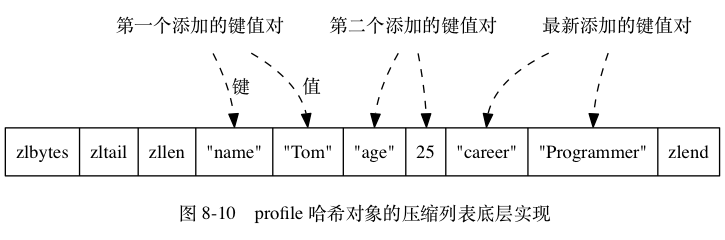

# Redis设计与实现

## Redis设计与实现

《Redis设计与实现第二版》

## 简介

- 数据结构与对象 （已读）

## 简单动态字符串

主要介绍了redis中的字符串类型实现原理，以及redis哪些内容是使用字符串类型存储的。内存空间，扩容，内存大小，已使用大小等等规则。


SDS有一套自己的扩容与内存释放规则。

- SDS的定义 （已读）
- SDS与C字符串的区别 （已读）
- SDS API （已读）

## 链表

主要介绍了redis中的链表类型实现原理list,背后是双向链表实现，且带有头节点指针和尾节点指针，节点数量等。

```cpp
// 每个链表节点使用一个adlist.h/listNode结构来表示
typedef struct listNode {
    // 前置节点
    struct listNode *prev;
    // 后置节点
    struct listNode *next;
    // 节点的值
    void *value;
} listNode;
```

```cpp
// 链表结构 adlist.h/list
typedef struct list {
    // 表头节点
    listNode *head;
    // 表尾节点
    listNode *tail;
    // 链表所包含的节点数量
    unsigned long len;
    // 节点值复制函数
    void *(*dup)(void *ptr);
    // 节点值释放函数
    void (*free)(void *ptr);
    // 节点值对比函数
    int (*match)(void *ptr, void *key);
} list;
```


- 链表和链表节点的实现 （已读）
- 链表和链表节点的API （已读）

## 字典

key-value结构，Redis 的字典使用哈希表作为底层实现， 一个哈希表里面可以有2个哈希表节点， 而每个哈希表节点就保存了字典中的一个键值对。

结构有哈希表数组（一个二维指针，数组每个元素存储的是内存地址）、哈希表大小、大小掩码总是等于哈希表大小减去1、哈希表已有的节点数量。

```cpp
// redis字典所使用的哈希表由dict.h/dictht结构定义
typedef struct dictht {
    // 哈希表数组
    dictEntry **table;
    // 哈希表大小
    unsigned long size;
    // 哈希表大小掩码，用于计算索引值
    // 总是等于 size - 1
    unsigned long sizemask;
    // 该哈希表已有节点的数量
    unsigned long used;
} dictht;
```


每个节点有key、union类型value、还有一个存储下一个节点地址的指针next，可以形成链表（解决键冲突问题）。

```cpp
typedef struct dictEntry {
    // 键
    void *key;
    // 值
    union {
        void *val;
        uint64_t u64;
        int64_t s64;
    } v;
    // 指向下个哈希表节点，形成链表
    struct dictEntry *next;
} dictEntry;
```


redis中一个字典内置有多个哈希表（可以缓解哈希冲突与单个哈希表过大的问题），dictType类型指针，私有数据void类型指针privdata,rehash索引int rehashidx，dictType内部存储了许多key相关的函数指针，如计算哈希值函数、复制键的函数、复制值得函数、对比键得函数、销毁键销毁值得函数等。

```cpp
// redis中的字典由dict.h/dict结构表示
typedef struct dict {
    // 类型特定函数
    dictType *type;
    // 私有数据
    void *privdata;
    // 哈希表
    dictht ht[2];
    // rehash 索引
    // 当 rehash 不在进行时，值为 -1
    int rehashidx; /* rehashing not in progress if rehashidx == -1 */
} dict;
typedef struct dictType {
    // 计算哈希值的函数
    unsigned int (*hashFunction)(const void *key);
    // 复制键的函数
    void *(*keyDup)(void *privdata, const void *key);
    // 复制值的函数
    void *(*valDup)(void *privdata, const void *obj);
    // 对比键的函数
    int (*keyCompare)(void *privdata, const void *key1, const void *key2);
    // 销毁键的函数
    void (*keyDestructor)(void *privdata, void *key);
    // 销毁值的函数
    void (*valDestructor)(void *privdata, void *obj);
} dictType;
```

第2个哈希表只在第一个哈希表进行rehash时使用。rehashidx记录了rehash目前得进度，目前没有进行rehash则其值为-1。


哈希算法,redis用了MurmurHash2算法来计算键得哈希值，其优点是即使输入得键是有规律的，算法仍可以给出一个很好得随机分布性。

```cpp
hash = dict->type->hashFunction(key);
index = hash & dict->ht[x].sizemask;
```

解决键冲突，两个或两个以上被分配到哈希表数组的同一个索引上面时，称这些键发生了冲突。每个哈希表节点都有一个next指针，使用单向链表连接起来解决冲突。
为了效率高，程序使用的是链表前插法。


rehash,当单个哈希表保存的键值数量太多或太少时，程序需要对哈希表的大小进行扩展或者收缩，使得负载因子维持在一个合理的范围之内。
为ht1哈希表分配空间，进行一定程度的扩展收缩策略确定ht1大小,将ht0已有的键值rehash到ht1，然后把ht1设置为ht0。


哈希表的扩展与收缩，当满足任意一个条件，程序会自动开始对哈希表执行扩展操作：

1. 服务器没有在执行BGSAVE（RDB过程）或BGREWRITEAOF（AOF过程），并且哈希表负载因子大于等于1
2. 服务器正在执行BGSAVE或BGREWRITEAOF，并且哈希表的负载因子大于等于5

哈希表的负载因子公式

```bash
# 负载因子 = 哈希表已经保存节点数量 / 哈希表大小
load_factor = ht[0].used / ht[0].size
```

当负载因子小于0.1时，程序自动开始对哈希表执行收缩操作。

在BGSAVE或BGREWRITEAOF过程中，Redis需要创建服务器进程的子进程，大多数操作系统采用写时赋值优化子进程的使用效率，所以在子进程存在
期间，服务器会提高所需的负载因子，从而避免在子进程存在期间进行哈希表的扩展操作，避免不必要的内存写入操作。

渐进式rehash，为什么，rehash过程是从ht0 中的键值rehash到ht1中去，如果ht0中的键值比较少还好这个过程需要的时间比较短，但是
如果有几十万的键值需要处理呢，可能服务都会被迫中断一会。redis中的字典rehash是循序渐进进行的。

哈希表渐进式rehash的步骤：

1. 为ht1分配空间，让字典同时持有ht0和ht1两个哈希表。
2. 在字典中维持一个索引计数器变量rehashidx，将其值设为0,标识rehash工作正式开始。
3. 在rehash进行期间，每次对字典执行添加、删除、查找、或者更新时，程序出了执行指定操作以外，会顺带将ht0哈希表在rehashidx索引上的所有键值对rehash到ht1,rehash完成后将rehashidx值加1。
4. 随着字典操作不断执行，最终在某个时间点，ht0所有键值对都会被rehash到ht1,此时将rehashidx设置为-1表示rehash操作已完成。

渐进式rehash执行期间的哈希表操作：在进行渐进式rehash过程中，字典同时有ht0和ht1两个哈希表，在此期间字典的删除 查找 更新等操作会在
两个哈希表上进行，比如说，要在字典里面查找一个键会现在ht0中查找，没找到再在ht1里面查找。
在渐进式 rehash 执行期间， 新添加到字典的键值对一律会被保存到 ht1 里面， 而 ht0 则不再进行任何添加操作：
这一措施保证了 ht0 包含的键值对数量会只减不增， 并随着 rehash 操作的执行而最终变成空表。

- 字典的实现 （已读）
- 哈希表 （已读）
- 哈希表节点 （已读）
- 字典 （已读）
- 哈希算法 （已读）
- 解决键冲突 （已读）
- rehash（已读）
- 哈希表的扩展与收缩（已读）
- 渐进式rehash（已读）
- 渐进式rehash执行期间的哈希表操作（已读）

## 跳跃表

跳跃表skiplist是一种有序数据结构，它通过在每个节点中维持多个指向其他节点的指针，从而达到快速访问节点的目的。
跳跃表支持平均 O(log N) 最坏 O(N) 复杂度的节点查找， 还可以通过顺序性操作来批量处理节点。


Redis 只在两个地方用到了跳跃表， 一个是实现有序集合键， 另一个是在集群节点中用作内部数据结构。
维护跳跃表相关基础信息的结构为zskiplist结构，其包含属性:

```cpp
// 跳跃表节点的实现由redis.h/zskiplistNode
typedef struct zskiplistNode {
    // 后退指针
    struct zskiplistNode *backward;
    // 分值
    double score;
    // 成员对象
    robj *obj;
    // 层
    struct zskiplistLevel {
        // 前进指针
        struct zskiplistNode *forward;
        // 跨度
        unsigned int span;
    } level[];
} zskiplistNode;
```

1. header 指向跳跃表的表头节点
2. tail 指向跳跃表的表尾节点
3. level 记录目前跳跃表内，层数最大的那个节点的层数（表头节点的层数不计算在内）
4. length 跳跃表的长度，跳跃表当前包含节点的数量（表头节点不计算在内）

zkiplistNode结构

1. 层 level,节点中有很多层，每层都带有两个属性，（前进指针）和（跨度），前进指针用于访问位于表尾方向的其他节点，跨度则记录前进指针所指节点和
当前节点的距离。
2. 后退指针，它指向位于当前节点的前一个节点。
3. 分值，在跳跃表中，节点按各自所保存的分值从小到大排列。
4. 成员对象，每个节点保存一个成员对象（表头节点没有成员对象）

表头节点也有后退指针、分值和成员对象，不过表头节点的这些属性都不会被用到。

层：跳跃表节点的level数组可以包含多个元素，每个元素都包含一个指向其他节点的指针，程序可以使用这些层加快访问其他节点的速度，一般来说层的数量越多，访问
其他节点的速度就越快(空间换时间没有免费的午餐)。


每次创建一个新跳跃表节点的时候， 程序都根据幂次定律 （power law，越大的数出现的概率越小）
随机生成一个介于 1 和 32 之间的值作为 level 数组的大小， 这个大小就是层的“高度”。

遍历操作只是用前进指针就可以完成了，跨度实际上是用来计算排位rank的，在查找某个节点的过程中，将沿途访问过的所有层的跨度累计
起来，得到的结果就是目标节点在跳跃表中的排位。


节点的后退指针（backward 属性）用于从表尾向表头方向访问节点： 跟可以一次跳过多个节点的前进指针不同，
因为每个节点只有一个后退指针， 所以每次只能后退至前一个节点。

节点的成员对象是一个指针，指向一个字符串对象，而字符串对象则保存着一个SDS值。


- 跳跃表（已读）
- 跳跃表的实现（已读）
- 跳跃表节点（已读）

## 整数集合

整数集合intset 是集合键底层实现之一：当一个集合只包含整数值元素，并且这个集合的元素数量不多时，redis就会使用整数集合作为集合
键的底层实现。

整数集合的实现：整数集合intset是redis用于保存整数值的集合抽象数据结构，可以保存int16_t int32_t int64_t的整数，并保证
集合中不会出现重复元素。

```cpp
typedef struct intset
{
 // 编码方式
 uint32_t encoding;
 // 集合包含的元素数量
 uint32_t length;
 // 保存元素的数组
 int8_t contents[];
} intset;
```


元素存在contents数组中，元素按值大小从小到大有序排列，并不会包含任何重复项。
contents元素类型取决于encoding属性的值

1. INTSET_ENC_INT16 int16_t -32768 ~ 32767
2. INTSET_ENC_INT32 int32_t -2147483648 ~ 2147483647
3. INTSET_ENC_INT64 int64_t -9223372036854775808 ~ 9223372036854775807

升级：将一个新元素添加到整数集合里面，并且新元素的类型比整数集合现有元素类型都要长时，整数集合需要先进行升级，然后才能
将新元素添加到整数集合里面。先申请目标大小的空间，末尾预留一个位置，然后从原有末尾一个个将元素升级处理放置到正确位置。最后将新元素
放到数组的末尾。然后更改encoding、将length属性值修改。

因为引发升级的新元素的长度总是比整数集合现有所有元素的长度都大， 所以这个新元素的值要么就大于所有现有元素， 要么就小于所有现有元素：

1. 在新元素小于所有现有元素的情况下， 新元素会被放置在底层数组的最开头（索引 0 ）；
2. 在新元素大于所有现有元素的情况下， 新元素会被放置在底层数组的最末尾（索引 length-1 ）。

升级的好处： 一个是提升整数集合的灵活性， 另一个是尽可能地节约内存。

降级：整数集合不支持降级操作，一旦对数组进行了升级，编码就会一直保持升级后的状态。

- 整数集合（已读）
- 整数集合的实现（已读）
- 升级（已读）
- 升级的好处（已读）
- 降级（已读）

## 压缩列表

压缩列表ziplist 是列表键和哈希键的底层实现之一。

当一个列表键只包含少量列表项，并且每个列表项要么是小整数值，要么是长度比较短的字符串，redis就会使用压缩列表
来做列表键的底层实现。

```cpp
redis> RPUSH lst 1 3 5 10086 "hello" "world"
(integer) 6
redis> OBJECT ENCODING lst
"ziplist"
```

另外，当一个哈希键只包含少量键值对，并且每个键值对的键和值要么就是小整数值，要么就是长度比较短的字符串，
要么redis就会使用压缩列表来做哈希键的底层实现。

```cpp
redis》 HMSET profile "name" "Jack" "age" 28 "job" "Programmer"
OK
redis> OBJECT ENCODING profile
"ziplist"
```

压缩列表的构成：

压缩列表是redis为了节约内存开发的，由一系列特殊编码的连续内存块组成的顺序型(sequential)数据结构。
一个压缩列表可以包含任意多个节点(entry),每个节点可以保存一个字节数组或者一个整数值。


```bash
属性 类型 长度 用途

zlbytes uint32_t 4 字节 记录整个压缩列表占用的内存字节数：在对压缩列表进行内存重分配， 或者计算 zlend 的位置时使用。

zltail uint32_t 4 字节 记录压缩列表表尾节点距离压缩列表的起始地址有多少字节：通过这个偏移量，程序无须遍历整个压缩列表就可以确定表尾节点的地址。

zllen uint16_t 2 字节 记录了压缩列表包含的节点数量： 当这个属性的值小于 UINT16_MAX （65535）时， 这个属性的值就是压缩列表包含节点的数量； 当这个值等于 UINT16_MAX 时， 节点的真实数量需要遍历整个压缩列表才能计算得出。

entryX 列表节点 不定 压缩列表包含的各个节点，节点的长度由节点保存的内容决定。

zlend uint8_t 1 字节 特殊值 0xFF （十进制 255 ），用于标记压缩列表的末端。
```


压缩列表节点的构成：

每个压缩列表节点可以保存一个字节数组或者一个整数值，其中字节数组可以是以下三种长度的其中一种

1. 长度小于等于63 （2^{6}-1）字节的字节数组；
2. 长度小于等于 16383 （2^{14}-1） 字节的字节数组；
3. 长度小于等于 4294967295 （2^{32}-1）字节的字节数组；

整数值则可以是以下六种长度的其中一种：

1. 4位长，介于 0 至 12 之间的无符号整数；  
2. 1 字节长的有符号整数；
3. 3 字节长的有符号整数；
4. int16_t 类型整数；
5. int32_t 类型整数；
6. int32_t 类型整数；

每个压缩列表节点都由以下三部分组成


previous_entry_length

previous_entry_length属性以字节为单位，记录了压缩列表中前一个节点的长度。previous_entry_length属性的长度可以是1字节或者5字节。

1. 前一个节点的长度小于254字节，那么previous_entry_length属性长度为1字节；前一个节点的长度存在这一字节里面。
2. 如果前一节点的长度大于等于254字节，那么previous_entry_length属性的长度为5字节：其中属性的第一字节会被设置为 0xFE（十进制值 254）， 而之后的四个字节则用于保存前一节点的长度。


程序可以通过指针运算，根据当前节点的起始地址来计算出前一个节点的起始地址。

encoding

节点的encoding属性记录了节点的content属性所保存数据的类型以及长度：

1. 一字节、两字节、五字节，值的最高位为00，01或者10的是字节数组编码：这种编码表示节点的content属性保存着字节数组，数组的长度由编码除去最高两位之后的其他位记录。
2. 一字节长，值得最高位以11开头的是整数编码：这种编码表示节点的content属性保存着整数值，整数值的类型和长度由编码除去最高两位之后的其他位记录。

content

content属性负责保存节点的值，节点值可以是一个字节数组或者整数，值的类型和长度由节点的encoding属性决定。


连锁更新

每个节点的previous_entry_length属性都记录了前一个节点的长度：前一个节点的长度小于254节点，那么previous_entry_length属性占用1字节，否则占用5字节。

如果有一个压缩列表中，有多个连续的、长度介于250字节到253字节之间的节点，如果我们将一个长度大于等于254字节的新节点new设置为压缩列表的表头节点，则需要后面扩容previous_entry_length,因为扩容导致节点又达到254及以上，这样下去后面都需要进行更新。Redis将这种在特殊情况下产生的连续多次空间扩展操作称之为 连锁更新。

除了添加新节点可能引发连锁更新之外，删除节点也可能会引发连锁更新。


因为连锁更新在最坏情况下需要对压缩列表执行 N 次空间重分配操作， 而每次空间重分配的最坏复杂度为 O(N) ， 所以连锁更新的最坏复杂度为 O(N^2) 。

尽管连锁更新的复杂度较高， 但它真正造成性能问题的几率是很低的

1. 首先，压缩列表里要恰好有多个连续的，长度介于250字节至253字节之间的节点，连锁更新才有可能被引发，在实际中，这种情况并不多见。
2. 其次，即使出现连锁更新，但只要被更新的节点数量不多，就不会对性能造成任何影响。比如 三五个节点进行连锁更新是绝对不会影响性能的。

因为以上原因,ziplistPush命令的平均复杂度为O(N)。

- 压缩列表（已读）
- 压缩列表的构成（已读）
- 压缩列表节点的构成（已读）
- 连锁更新（已读）

## 对象

对象：

前面介绍了redis中所用主要数据结构，如简单动态字符串SDS、双端链表、字典、压缩列表、整数集合，等等。

redis并没有直接使用这些数据结构实现键值对数据库，而是基于这些数据结构创建了一个对象系统，对象系统包含了5种类型的对象。

1. 字符串对象
2. 列表对象
3. 哈希对象
4. 集合对象
5. 有序集合对象

redis的对象系统还实现了基于引用技术技术的内存回收机制；还通过引用计数技术实现了对象共享机制，通过让多个数据库键共享同一个对象来节约内存。

redis的对象带有访问时间记录信息，该信息可以用于计算数据库键的空转时长，在服务器启用了maxmemory功能情况下，空转时长较大
的哪些键可能会被优先被服务器删除。

对象的类型与编码：

redis使用对象来表示数据库种的键和值，至少会创建两个对象，一个对象用作键值对的键（键对象），另一个对象用作键值对的值（值对象）。

```bash
redis> SET msg "hello world"
OK
```

每个对象都由一个redisObject结构表示，结构中有三个属性分别是type属性、encoding属性和ptr属性。

```cpp
typedef struct redisObject
{
	// 类型
	unsigned type:4;
	// 编码
	unsigned encoding:4;
	// 指向底层实现数据结构的指针
	void *ptr;
	// ...
} robj;
```

类型

```cpp
类型常量	对象的名称
REDIS_STRING	字符串对象
REDIS_LIST	列表对象
REDIS_HASH	哈希对象
REDIS_SET	集合对象
REDIS_ZSET	有序集合对象
```

type查看键对应的值对象的类型，键对象类型永远是string类型

```bash
# 字符串对象
127.0.0.1:6379> set msg "hello world"
OK
127.0.0.1:6379> keys *
1) "msg"
127.0.0.1:6379> type msg
string
# 列表对象
127.0.0.1:6379> rpush numbers 1 3 5
(integer) 3
127.0.0.1:6379> type numbers
list
# 哈希对象
127.0.0.1:6379> hmset profile name Tome age 25 career Programmer
OK
127.0.0.1:6379> type profile
hash
# 集合对象
127.0.0.1:6379> sadd fruits apple banana cherry
(integer) 3
127.0.0.1:6379> type fruits
set
# 有序集合对象
127.0.0.1:6379> zadd price 8.5 apple 5.0 banana 6.0 cherry
(integer) 3
127.0.0.1:6379> type price
zset
```

编码和底层实现：

对象的ptr指针指向对象的底层数据结构，数据结构由对象的encoding属性决定，encoding属性记录了对象使用了什么数据结构作为对象的底层实现。

```cpp
编码常量						编码所对应的底层数据结构
REDIS_ENCODING_INT			long 类型的整数 int
REDIS_ENCODING_EMBSTR		embstr 编码的简单动态字符串 embstr
REDIS_ENCODING_RAW			简单动态字符串 raw
REDIS_ENCODING_HT			字典 hashtable
REDIS_ENCODING_LINKEDLIST	双端链表 linkedlist
REDIS_ENCODING_ZIPLIST		压缩列表 ziplist
REDIS_ENCODING_INTSET		整数集合 intset
REDIS_ENCODING_SKIPLIST		跳跃表和字典 skiplist
```

每种类型的对象至少使用了两种不同的编码。下面列出了每种类型的对象可以使用的编码。

```cpp
类型	编码	对象
REDIS_STRING	REDIS_ENCODING_INT			使用整数值实现的字符串对象。
REDIS_STRING	REDIS_ENCODING_EMBSTR		使用 embstr 编码的简单动态字符串实现的字符串对象。
REDIS_STRING	REDIS_ENCODING_RAW			使用简单动态字符串实现的字符串对象。
REDIS_LIST		REDIS_ENCODING_ZIPLIST		使用压缩列表实现的列表对象。
REDIS_LIST		REDIS_ENCODING_LINKEDLIST	使用双端链表实现的列表对象。
REDIS_HASH		REDIS_ENCODING_ZIPLIST		使用压缩列表实现的哈希对象。
REDIS_HASH		REDIS_ENCODING_HT			使用字典实现的哈希对象。
REDIS_SET		REDIS_ENCODING_INTSET		使用整数集合实现的集合对象。
REDIS_SET		REDIS_ENCODING_HT			使用字典实现的集合对象。
REDIS_ZSET		REDIS_ENCODING_ZIPLIST		使用压缩列表实现的有序集合对象。
REDIS_ZSET		REDIS_ENCODING_SKIPLIST		使用跳跃表和字典实现的有序集合对象。
```

object encoding命令查看一个数据库键的值对象的编码

```bash
# embstr
127.0.0.1:6379> set msg "hello world"
OK
127.0.0.1:6379> object encoding msg
"embstr"

# raw
127.0.0.1:6379> set story "long long brfuierbvdjfkkcdnsdcnwoejowifjoirejfoeoreggtghtruuibrivndlfnvkdfnvndfkncskdjcnkdcscdscvdbgfbfgbffew"
OK
127.0.0.1:6379> object encoding story
"raw"

# intset
127.0.0.1:6379> sadd numbers 1 3 5
(integer) 3
127.0.0.1:6379> object encoding numbers
"intset"

# hashtable
127.0.0.1:6379> sadd numbers "seven"
(integer) 1
127.0.0.1:6379> object encoding numbers
"hashtable"
```

redis可以根据不同的使用场景为一个对象设置不同的编码，从而优化对象在某一个场景下的效率。如
在列表对象包含的元素比较少时，使用压缩列表作为列表对象的底层实现：

1. 因为压缩列表比双端链表更节约内存， 并且在元素数量较少时， 在内存中以连续块方式保存的压缩列表比起双端链表可以更快被载入到缓存中；
2. 随着列表对象包含的元素越来越多， 使用压缩列表来保存元素的优势逐渐消失时， 对象就会将底层实现从压缩列表转向功能更强、也更适合保存大量元素的双端链表上面；

字符串对象：

字符串编码可以是int、raw、embstr，一个字符串对象保存的是整数值， 并且这个整数值可以用 long 类型来表示， 
那么字符串对象会将整数值保存在字符串对象结构的 ptr属性里面（将 void* 转换成 long ）， 并将字符串对象的编码设置为 int 。

```cpp
127.0.0.1:6379> set number 10086
OK
127.0.0.1:6379> object encoding number
"int"

127.0.0.1:6379> set num 32948398498938493849384934394
OK
127.0.0.1:6379> object encoding num
"embstr"
```

如果字符串对象保存的是一个字符串值，并且这个字符串值的长度大于39字节，那么将使用一个`简单动态字符串SDS`保存这个字符串值，并将对象编码设置为raw。

```cpp
127.0.0.1:6379> set jack "cnf12345678901234567890123456789012345678901234567890"
OK
127.0.0.1:6379> strlen jack
(integer) 53
127.0.0.1:6379> object encoding jack
"raw"
```


如果字符串对象保存的是一个字符串值， 并且这个字符串值的长度小于等于 39 字节， 那么字符串对象将使用 `embstr` 编码的方式来保存这个字符串值。

embstr 编码是专门用于保存短字符串的一种优化编码方式， 这种编码和 raw 编码一样， 
都使用 redisObject 结构和 sdshdr 结构来表示字符串对象， 
但 raw 编码会调用两次内存分配函数来分别创建 redisObject 结构和 sdshdr 结构，
而 embstr 编码则通过调用一次内存分配函数来分配一块连续的空间，
空间中依次包含 redisObject 和 sdshdr 两个结构。


emstr的好处

1. embstr 编码将创建字符串对象所需的内存分配次数从 raw 编码的两次降低为一次。
2. 释放 embstr 编码的字符串对象只需要调用一次内存释放函数， 而释放 raw 编码的字符串对象需要调用两次内存释放函数。
3. 因为 embstr 编码的字符串对象的所有数据都保存在一块连续的内存里面， 所以这种编码的字符串对象比起 raw 编码的字符串对象能够更好地利用缓存带来的优势。


long double类型表示的浮点数在redis种也是作为字符串值来保存的， 如果我们要保存一个浮点数到字符串对象里面，
那么程序会先将这个浮点数转换成字符串值， 然后再保存起转换所得的字符串值。

```bash
127.0.0.1:6379> set pi 3.14
OK
127.0.0.1:6379> object encoding pi
"embstr"
```

在有需要的时候，程序会将字符串对象里的字符串值转换回浮点数值，执行某些操作，然后再将执行操作所得的浮点数值转换回字符串值，并继续保存在字符串对象里面。

```cpp
127.0.0.1:6379> incrbyfloat pi 2.0
"5.14"
127.0.0.1:6379> object encoding pi
"embstr"
```

字符串对象保存各类型值的编码方式

```cpp
值									编码

可以用 long 类型保存的整数。				int

可以用 long double 类型保存的浮点数。	embstr 或者 raw

字符串值， 或者因为长度太大而没办法用
long 类型表示的整数， 又或者因为长度
太大而没办法用long double 类型表示的	embstr 或者 raw
浮点数。	
```

编码的转换：

int编码的字符串对象和embstr编码的字符串对象在满足条件的情况下，会被转换为raw编码的字符串对象。

对于 int 编码的字符串对象来说， 如果我们向对象执行了一些命令， 使得这个对象保存的不再是整数值， 而是一个字符串值， 那么字符串对象的编码将从 int 变为 raw 。

```bash
127.0.0.1:6379> set number 10086
OK
127.0.0.1:6379> object encoding number
"int"
127.0.0.1:6379> append number " is a good number!"
(integer) 23
127.0.0.1:6379> get number
"10086 is a good number!"
127.0.0.1:6379> object encoding number
"raw"
```

因为redis没有为embstr编码的字符串对象编写任何相应的修改程序，只有int和raw编码的字符串对象有这些程序，对embstr操作时会将编码从
embstr转换为raw,然后再执行修改命令。

字符串命令的实现：

字符串键的值为字符串对象，用于字符串键的所有命令都是针对字符串对象来构建的。

字符串命令的实现

|命令|int编码的实现方法|embstr编码的实现方法|raw编码的实现方法|
|---|---|---|---|
|SET|使用 int 编码保存值。|使用 embstr 编码保存值。|使用 raw 编码保存值。|
|GET|拷贝对象所保存的整数值， 将这个拷贝转换成字符串值， 然后向客户端返回这个字符串值。|直接向客户端返回字符串值。|直接向客户端返回字符串值。|
|APPEND|将对象转换成 raw 编码， 然后按raw 编码的方式执行此操作。|将对象转换成 raw 编码， 然后按raw 编码的方式执行此操作。|调用 sdscatlen 函数， 将给定字符串追加到现有字符串的末尾。|
|INCRBYFLOAT|取出整数值并将其转换成 longdouble 类型的浮点数， 对这个浮点数进行加法计算， 然后将得出的浮点数结果保存起来。|取出字符串值并尝试将其转换成long double 类型的浮点数， 对这个浮点数进行加法计算， 然后将得出的浮点数结果保存起来。 如果字符串值不能被转换成浮点数， 那么向客户端返回一个错误。|取出字符串值并尝试将其转换成 longdouble 类型的浮点数， 对这个浮点数进行加法计算， 然后将得出的浮点数结果保存起来。 如果字符串值不能被转换成浮点数， 那么向客户端返回一个错误。|
|INCRBY|对整数值进行加法计算， 得出的计算结果会作为整数被保存起来。|embstr 编码不能执行此命令， 向客户端返回一个错误。|raw 编码不能执行此命令， 向客户端返回一个错误。|
|DECRBY|对整数值进行减法计算， 得出的计算结果会作为整数被保存起来。|embstr 编码不能执行此命令， 向客户端返回一个错误。|raw 编码不能执行此命令， 向客户端返回一个错误。|
|STRLEN|拷贝对象所保存的整数值， 将这个拷贝转换成字符串值， 计算并返回这个字符串值的长度。|调用 sdslen 函数， 返回字符串的长度。|调用 sdslen 函数， 返回字符串的长度。|
|SETRANGE|将对象转换成 raw 编码， 然后按raw 编码的方式执行此命令。|将对象转换成 raw 编码， 然后按raw 编码的方式执行此命令。|将字符串特定索引上的值设置为给定的字符。|
|GETRANGE|拷贝对象所保存的整数值， 将这个拷贝转换成字符串值， 然后取出并返回字符串指定索引上的字符。|直接取出并返回字符串指定索引上的字符。|直接取出并返回字符串指定索引上的字符。|

列表对象：

列表对象的编码可以是ziplist或者linkedlist。ziplist编码的列表对象使用压缩列表作为底层实现，每个压缩列表节点entry保存一个列表元素。

```bash
127.0.0.1:6379> rpush numbers 1 "three" 5
(integer) 3
```


链表节点里面存储字符串对象

完整的字符串对象表示


编码转换：

当列表对象同时满足两个条件时，列表对象使用ziplist编码。不同时满足下面两个条件的列表对象需要使用linkedlist编码。

1. 列表对象保存的所有字符串元素的长度都小于64字节
2. 列表对象保存的元素数量小于512个

条件中的上限值可以修改，配置文件 list-max-ziplist-value 与 list-max-ziplist-entries 选项说明

列表命令的实现：

列表键的值为列表对象，所以用于列表键的所有命令都是针对列表对象来构建的。

|命令|ziplist编码的实现方法|linkedlist编码的实现方法|
|---|---|---|
|LPUSH|调用 ziplistPush 函数， 将新元素推入到压缩列表的表头。|调用 listAddNodeHead 函数， 将新元素推入到双端链表的表头。|
|RPUSH|调用 ziplistPush 函数， 将新元素推入到压缩列表的表尾。|调用 listAddNodeTail 函数， 将新元素推入到双端链表的表尾。|
|LPOP|调用 ziplistIndex 函数定位压缩列表的表头节点， 在向用户返回节点所保存的元素之后， 调用ziplistDelete 函数删除表头节点。|调用 listFirst 函数定位双端链表的表头节点， 在向用户返回节点所保存的元素之后， 调用 listDelNode 函数删除表头节点。|
|RPOP|调用 ziplistIndex 函数定位压缩列表的表尾节点， 在向用户返回节点所保存的元素之后， 调用ziplistDelete 函数删除表尾节点。|调用 listLast 函数定位双端链表的表尾节点， 在向用户返回节点所保存的元素之后， 调用 listDelNode 函数删除表尾节点。|
|LINDEX|调用 ziplistIndex 函数定位压缩列表中的指定节点， 然后返回节点所保存的元素。|调用 listIndex 函数定位双端链表中的指定节点， 然后返回节点所保存的元素。|
|LLEN|调用 ziplistLen 函数返回压缩列表的长度。|调用 listLength 函数返回双端链表的长度。|
|LINSERT|插入新节点到压缩列表的表头或者表尾时， 使用ziplistPush 函数； 插入新节点到压缩列表的其他位置时， 使用 ziplistInsert 函数。|调用 listInsertNode 函数， 将新节点插入到双端链表的指定位置。|
|LREM|遍历压缩列表节点， 并调用 ziplistDelete 函数删除包含了给定元素的节点。|遍历双端链表节点， 并调用 listDelNode 函数删除包含了给定元素的节点。|
|LTRIM|调用 ziplistDeleteRange 函数， 删除压缩列表中所有不在指定索引范围内的节点。|遍历双端链表节点， 并调用 listDelNode 函数删除链表中所有不在指定索引范围内的节点。|
|LSET|调用 ziplistDelete 函数， 先删除压缩列表指定索引上的现有节点， 然后调用 ziplistInsert 函数， 将一个包含给定元素的新节点插入到相同索引上面。|调用 listIndex 函数， 定位到双端链表指定索引上的节点， 然后通过赋值操作更新节点的值。|

哈希对象：

哈希对象的编码可以是 ziplist 或者 hashtable 。

ziplist编码的哈希对象：每当有新的键值对要加入到哈希对象时， 程序会先将保存了键的压缩列表节点推入到压缩列表表尾， 然后再将保存了值的压缩列表节点推入到压缩列表表尾。

```bash
redis-18686.c290.ap-northeast-1-2.ec2.redns.redis-cloud.com:18686> HSET profile name "Tom"
(integer) 1
redis-18686.c290.ap-northeast-1-2.ec2.redns.redis-cloud.com:18686> HSET profile age 25
(integer) 1
redis-18686.c290.ap-northeast-1-2.ec2.redns.redis-cloud.com:18686> HSET profile career "Programmer"
(integer) 1
redis-18686.c290.ap-northeast-1-2.ec2.redns.redis-cloud.com:18686> HGETALL profile
1) "name"
2) "Tom"
3) "age"
4) "25"
5) "career"
6) "Programmer"
```

ziplist编码的profile哈希对象


profile哈希对象的压缩列表底层实现



hashtable编码的哈希对象

哈希对象中的每个键值对都使用一个字典键值对来保存：


哈希对象编码转换：

当哈希对象可以同时满足以下两个条件时， 哈希对象使用 ziplist 编码：

1. 哈希对象保存的所有键值对的键和值的字符串长度都小于 64 字节；（hash-max-ziplist-value配置选项可修改上限）
2. 哈希对象保存的键值对数量小于 512 个；（hash-max-ziplist-entries配置选项可修改上限）

不能同时满足这两个条件的哈希对象需要使用 hashtable 编码。

```bash
redis-18686.c290.ap-northeast-1-2.ec2.redns.redis-cloud.com:18686> HSET book name "Mastering C++ in 21 days"
(integer) 1
redis-18686.c290.ap-northeast-1-2.ec2.redns.redis-cloud.com:18686> OBJECT ENCODING book
"listpack"
redis-18686.c290.ap-northeast-1-2.ec2.redns.redis-cloud.com:18686> HSET book long_long_long_long_long_long_long_long_long_long_long_description "content"
(integer) 1
redis-18686.c290.ap-northeast-1-2.ec2.redns.redis-cloud.com:18686> OBJECT ENCODING book
"hashtable"
redis-18686.c290.ap-northeast-1-2.ec2.redns.redis-cloud.com:18686> 
```

哈希命令的实现：用于哈希键的所有命令都是针对哈希对象来构建的。

|命令|ziplist编码实现方法|hashtable编码实现方法|
|---|---|---|
|HSET|首先调用 ziplistPush 函数， 将键推入到压缩列表的表尾， 然后再次调用 ziplistPush 函数， 将值推入到压缩列表的表尾。|调用 dictAdd 函数， 将新节点添加到字典里面。|
|HGET|首先调用 ziplistFind 函数， 在压缩列表中查找指定键所对应的节点， 然后调用 ziplistNext 函数， 将指针移动到键节点旁边的值节点， 最后返回值节点。|调用 dictFind 函数， 在字典中查找给定键， 然后调用dictGetVal 函数， 返回该键所对应的值。|
|HEXISTS|调用 ziplistFind 函数， 在压缩列表中查找指定键所对应的节点， 如果找到的话说明键值对存在， 没找到的话就说明键值对不存在。|调用 dictFind 函数， 在字典中查找给定键， 如果找到的话说明键值对存在， 没找到的话就说明键值对不存在。|
|HDEL|调用 ziplistFind 函数， 在压缩列表中查找指定键所对应的节点， 然后将相应的键节点、 以及键节点旁边的值节点都删除掉。|调用 dictDelete 函数， 将指定键所对应的键值对从字典中删除掉。|
|HLEN|调用 ziplistLen 函数， 取得压缩列表包含节点的总数量， 将这个数量除以 2 ， 得出的结果就是压缩列表保存的键值对的数量。|调用 dictSize 函数， 返回字典包含的键值对数量， 这个数量就是哈希对象包含的键值对数量。|
|HGETALL|遍历整个压缩列表， 用 ziplistGet 函数返回所有键和值（都是节点）。|遍历整个字典， 用 dictGetKey 函数返回字典的键， 用dictGetVal 函数返回字典的值。|


- 对象（已读）
- 对象的类型与编码（已读）
- 字符串对象（已读）
- 列表对象（已读）
- 哈希对象（已读）
- 集合对象
- 有序集合对象
- 类型检查与命令多态
- 内存回收
- 对象共享
- 对象的空转时长

## 数据库

- 数据库键空间

## RDB持久化

- RDB文件结构

## AOF持久化

- AOF持久化的实现

## 事件

- 文件事件

## 客户端

- 客户端属性

## 服务器

- 命令请求的执行过程

## 复制

- 旧版复制功能的实现

## Sentinel

- 启动并初始化Sentinel

## 集群

- 节点

## 发布与订阅

- 频道的订阅与退订

## 事务

- 事务的实现

## Lua脚本

- 创建并修改Lua环境

## 排序

- SORT命令的实现

## 二进制位数组

- GETBIT命令的实现

## 慢查询日志

- 慢查询记录的保存
- 慢查询日志的阅览和删除
- 添加新日志

## 监视器

- 成为监视器
- 向监视器发送命令信息
