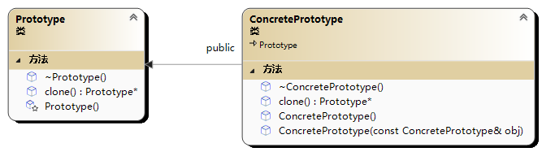

# 👾 原型模式(Prototype模式)

特点：针对被实例化的类

<figure><figcaption></figcaption></figure>

```cpp
#include<iostream>
using namespace std;

class Prototype {
public:
	virtual ~Prototype();
	virtual Prototype* clone()const = 0;
protected:
	Prototype();
};

class ConcretePrototype :public Prototype {
public:
	ConcretePrototype()=default;
	ConcretePrototype(const ConcretePrototype&obj);//拷贝构造函数
	~ConcretePrototype()=default;
	Prototype* clone()const;
};

Prototype::Prototype(){}
Prototype::~Prototype(){}

//拷贝构造函数
ConcretePrototype::ConcretePrototype(const ConcretePrototype& obj) {
	cout << "copy construct" << endl;
	//...再次进行浅拷贝或者深拷贝等操作
}

Prototype* ConcretePrototype::clone()const {
	return new ConcretePrototype(*this);
}


int main() {
	Prototype* prototype = new ConcretePrototype();
	Prototype* prototypeOther = prototype->clone();//copy construct
	delete prototype;
	delete prototypeOther;
	return 0;
}
```
