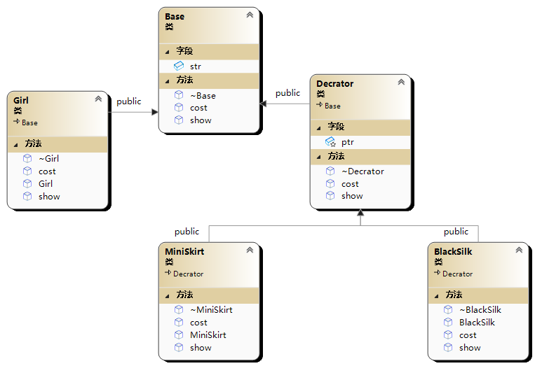

# 🤖 装饰者模式(Decrator模式)

<figure><figcaption></figcaption></figure>

```cpp
#include<iostream>
#include<string>
using namespace std;

class Base {
public:
	virtual ~Base() {};
	string str;
	virtual void show()=0;
	virtual float cost() = 0;
};

class Girl :public Base {
public:
	Girl() {
		str = "啥也没穿的女孩 ";
	}
	~Girl() {
	}
	void show() {
		cout << str ;
	}
	float cost() {
		return 200.;
	}
};

class Decrator :public Base {
protected:
	Base* ptr;
public:
	virtual void show() = 0;
	virtual float cost() = 0;
	virtual ~Decrator() {
	}
};

class MiniSkirt :public Decrator {
public:
	MiniSkirt(Base* ptr) {
		this->ptr = ptr;
	}
	void show() {
		ptr->show();
		cout << " 穿超短裙 " ;
	}
	~MiniSkirt(){}
	float cost() {
		return 50. + ptr->cost();
	}
};

class BlackSilk :public Decrator {
public:
	BlackSilk(Base* ptr) {
		this->ptr = ptr;
	}
	void show() {
		ptr->show();
		cout << " 穿黑丝 ";
	}
	float cost() {
		return 50. + ptr->cost();
	}
	~BlackSilk(){}
};

int main() {
	Base* girl = new Girl();
	girl->show();//啥也没穿的女孩 200
	cout <<girl->cost() << endl;
	Decrator* blacksilk=new BlackSilk(girl);
	Decrator* miniskirt = new MiniSkirt(blacksilk);
	miniskirt->show();
	cout << miniskirt->cost() << endl;//啥也没穿的女孩  穿黑丝  穿超短裙 300
	delete girl;
	delete blacksilk;
	delete miniskirt;
	return 0;
}
```
