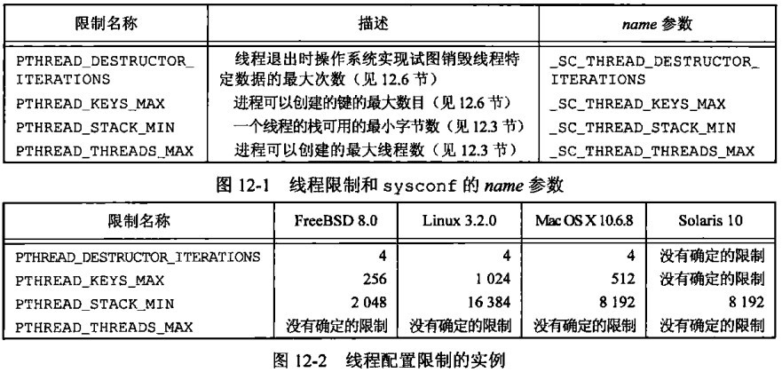
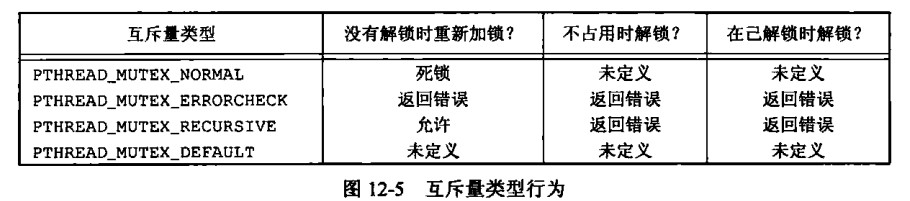
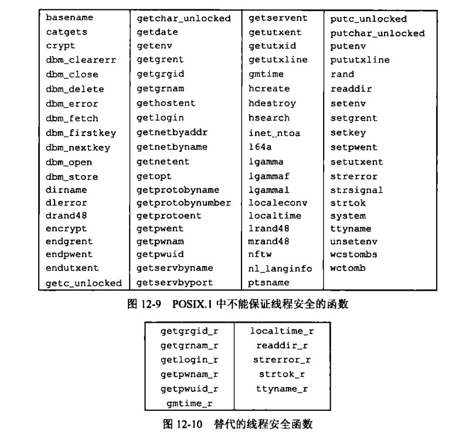

# 第 12 章 线程控制

## 线程控制

### 线程限制

Linux 系统编程中，线程限制指的是操作系统对线程的数量、资源和行为等方面进行限制的机制。以下是几个常见的线程限制：

线程数量限制：Linux 系统对单个进程的线程数量有限制，默认情况下是 1024 个。如果需要更多的线程，可以通过修改内核参数或使用线程池等方式进行处理。

线程资源限制：Linux 系统也对线程使用的资源进行限制，例如栈大小、文件描述符数量等。可以使用系统调用 setrlimit()或 ulimit 命令来设置线程资源限制。

线程行为限制：Linux 系统还可以对线程的行为进行限制，例如线程的调度策略、CPU 亲和性等。可以使用系统调用 sched_setscheduler()和 sched_setaffinity()来设置线程行为限制。

需要注意的是，线程限制是为了保证系统的稳定性和安全性而存在的。因此，合理地设置线程限制可以提高系统的性能和可靠性。

样例

```cpp
#include <iostream>
#include <unistd.h>
using namespace std;

int main(int argc, char **argv)
{
    cout << "线程退出时操作系统实现试图销毁线程特定数据的最大次数" << sysconf(_SC_THREAD_DESTRUCTOR_ITERATIONS) << endl;
    return 0;
}
```



### 线程属性

在 Linux 系统编程中，线程属性是指用来控制线程行为的参数集合，可以通过设置这些属性来影响线程的调度、优先级、栈大小等行为。

常见属性

```cpp
detachstate 线程的分离状态属性
guardsize   线程栈末尾的警戒缓冲区大小
stackaddr   线程栈的最低地址
stacksize   线程栈的最小长度(字节数)
```

线程属性结构体相关函数

```cpp
#include <pthread.h>
int pthread_attr_init(pthread_attr_t *attr);
int pthread_attr_destroy(pthread_attr_t *attr);
//两函数成功返回0，否则返回errno
```

#### 线程调度策略属性

线程调度策略属性是指用来指定线程在多个可运行状态的线程中被选中的规则。常用的调度策略包括 SCHED_FIFO、SCHED_RR、SCHED_OTHER。

```cpp
#include <pthread.h>
//set/get scheduling parameter attributes in thread attributes object
int pthread_attr_setschedparam(pthread_attr_t *attr,
                              const struct sched_param *param);
int pthread_attr_getschedparam(const pthread_attr_t *attr,
                              struct sched_param *param);
//set/get scheduling policy attribute in thread attributes object
int pthread_attr_setschedpolicy(pthread_attr_t *attr, int policy);
int pthread_attr_getschedpolicy(const pthread_attr_t *attr, int *policy);
```

#### 线程栈属性

线程栈属性是指用来指定线程栈的大小、位置和保护方式等参数。

```cpp
#include <pthread.h>
//set/get stack attributes in thread attributes object
int pthread_attr_setstack(pthread_attr_t *attr,
                         void *stackaddr, size_t stacksize);
int pthread_attr_getstack(const pthread_attr_t *attr,
                         void **stackaddr, size_t *stacksize);
//set/get stack address attribute in thread attributes object
int pthread_attr_setstackaddr(pthread_attr_t *attr, void *stackaddr);
int pthread_attr_getstackaddr(const pthread_attr_t *attr, void **stackaddr);
//set/get stack size attribute in thread attributes object
int pthread_attr_setstacksize(pthread_attr_t *attr, size_t stacksize);
int pthread_attr_getstacksize(const pthread_attr_t *attr, size_t *stacksize);
```

#### 线程栈末尾的警戒缓冲区大小

线程的守护区是在线程栈的开始和结束之间的一段内存区域，它用于检测线程栈溢出。当线程栈增长到守护区时，操作系统会向程序发送一个信号，以便它可以采取适当的措施。

```cpp
//set/get guard size attribute in thread attributes object
int pthread_attr_setguardsize(pthread_attr_t *attr, size_t guardsize);
int pthread_attr_getguardsize(const pthread_attr_t *attr, size_t *guardsize);

```

#### 线程优先级属性

线程优先级属性是指用来指定线程的优先级，影响线程在可运行状态中被选中的概率。

```cpp
#include <pthread.h>
//set/get scheduling parameter attributes in thread attributes object
int pthread_attr_setschedparam(pthread_attr_t *attr,
                              const struct sched_param *param);
int pthread_attr_getschedparam(const pthread_attr_t *attr,
                              struct sched_param *param);
struct sched_param {
   int sched_priority;     /* Scheduling priority */
};
```

#### 线程分离属性

线程分离属性是指用来指定线程在终止时是否需要调用 pthread_join() 函数来回收其资源。

```cpp
#include <pthread.h>
int pthread_attr_setdetachstate(pthread_attr_t *attr, int detachstate);
int pthread_attr_getdetachstate(const pthread_attr_t *attr, int *detachstate);
//detachstate PTHREAD_CREATE_DETACHED | PTHREAD_CREATE_JOINABLE
//set/get detach state attribute in thread attributes object
```

#### 线程亲和性属性

CPU 集合是一种数据结构，用于指定哪些 CPU 核心可以被线程使用。在 POSIX 线程库中，CPU 集合由 cpu_set_t 结构表示，其中每个比特位表示一个 CPU 核心。

pthread_attr_setaffinity_np 函数用于设置线程属性对象中的线程亲和性属性，也就是指定线程可以使用哪些 CPU 核心。

```cpp
#include <pthread.h>
// set/get CPU affinity attribute in thread attributes object
// 用于设置线程属性对象中的线程亲和性属性
int pthread_attr_setaffinity_np(pthread_attr_t *attr,
                                size_t cpusetsize, const cpu_set_t *cpuset);
int pthread_attr_getaffinity_np(const pthread_attr_t *attr,
                                size_t cpusetsize, cpu_set_t *cpuset);

```

样例

```cpp
#include <pthread.h>
#include <sched.h>
#include <stdio.h>

int main() {
    pthread_attr_t attr;
    cpu_set_t cpuset;

    // 初始化线程属性对象
    pthread_attr_init(&attr);

    // 设置 CPU 集合
    CPU_ZERO(&cpuset);
    CPU_SET(0, &cpuset);    // 仅使用第一个 CPU 核心
    pthread_attr_setaffinity_np(&attr, sizeof(cpuset), &cpuset);

    // 销毁线程属性对象
    pthread_attr_destroy(&attr);

    return 0;
}

```

#### 继承调度属性

调度策略是指操作系统在多个线程之间分配处理器时间的算法。在 POSIX 线程库中，调度策略有多种，例如 SCHED_FIFO、SCHED_RR、SCHED_OTHER 等。当一个线程被创建时，它会继承创建它的线程的调度策略和参数。如果继承调度属性被设置为 PTHREAD_INHERIT_SCHED，那么新线程将继承创建它的线程的调度策略和参数，否则将使用它自己的调度策略和参数。

```cpp
#include <pthread.h>
// set/get inherit-scheduler attribute in thread attributes object
// 它用于设置线程属性对象中的继承调度属性
int pthread_attr_setinheritsched(pthread_attr_t *attr,
                                 int inheritsched);
int pthread_attr_getinheritsched(const pthread_attr_t *attr,
                                 int *inheritsched);
/*
inheritsched：指定线程是否继承创建它的线程的调度策略和参数，可选值为 PTHREAD_INHERIT_SCHED 或 PTHREAD_EXPLICIT_SCHED。
*/
```

#### 线程作用域属性

线程作用域是指线程所能访问的内存范围。在 POSIX 线程库中，线程作用域有两种：系统级作用域和进程级作用域。系统级作用域的线程可以访问进程中的所有内存，而进程级作用域的线程只能访问在其创建时已经存在的内存。

```cpp
#include <pthread.h>
// set/get contention scope attribute in thread attributes object
int pthread_attr_setscope(pthread_attr_t *attr, int scope);
int pthread_attr_getscope(const pthread_attr_t *attr, int *scope);
/*PTHREAD_SCOPE_PROCESS 该线程与同一进程中的所有其他线程争用资源，这些线程也是使用PTHREAD_SCOPE_PROCESS竞争范围创建的
PTHREAD_SCOPE_SYSTEM 线程与系统上所有进程中位于同一调度分配域(一组一个或多个处理器)中的所有其他线程竞争资源*/
```

#### 属性相关函数

用于获取已有线程属性、获取设置默认属性

```cpp
#include <pthread.h>
// get attributes of created thread
int pthread_getattr_np(pthread_t thread, pthread_attr_t *attr);
// get or set default thread-creation attributes
int pthread_getattr_default_np(pthread_attr_t *attr);
int pthread_setattr_default_np(pthread_attr_t *attr);

```

### 互斥量属性

相关数据结构初始化

```cpp
#include <pthread.h>
int pthread_mutexattr_destroy(pthread_mutexattr_t *attr);
int pthread_mutexattr_init(pthread_mutexattr_t *attr);
```

#### 互斥量进程共享属性

都知道 fork 后文件描述符数值虽然一样，但是背后的文件表拷贝了。但是有个函数叫 clone 支持创建子进程后子进程与父进程共享某些东西，比如文件描述符、互斥锁

互斥锁属性对象是一个不透明对象，用于在初始化互斥锁对象之前设置和检索互斥锁对象的属性。可以为互斥锁属性对象设置的属性之一是进程共享属性。这个属性决定了在哪些进程中可以共享互斥锁对象。该函数用于检索互斥锁属性对象的进程共享属性值。

```cpp
#include <pthread.h>
//get/set process-shared mutex attribute
int pthread_mutexattr_getpshared(const pthread_mutexattr_t *attr,int *pshared);
int pthread_mutexattr_setpshared(pthread_mutexattr_t *attr,
                                        int pshared);
```

其中，attr 是指向互斥锁属性对象的指针，pshared 是指向一个 int 类型的变量的指针，用于存储进程共享属性值。如果成功，该函数返回 0，否则返回一个非 0 的错误代码。

#### 鲁棒性属性值

如果互斥量的鲁棒性属性被设置为 PTHREAD_MUTEX_ROBUST，那么在互斥量拥有者线程终止但没有解锁互斥量的情况下，其他线程尝试对该互斥量加锁时将返回特定的错误码。如果互斥量的鲁棒性属性未被设置为 PTHREAD_MUTEX_ROBUST，则在互斥量拥有者线程终止但未解锁互斥量的情况下，其他线程尝试对该互斥量加锁时将导致未定义的行为。

```cpp
#include <pthread.h>
int pthread_mutexattr_getrobust(const pthread_mutexattr_t *attr,
                                int *robustness);
int pthread_mutexattr_setrobust(const pthread_mutexattr_t *attr,
                                int robustness);
```

#### 标记互斥量的状态为"一致的"

在使用带有鲁棒性属性的互斥量时，如果互斥量的持有者线程在拥有该互斥量的同时异常终止，那么该互斥量就会被标记为"破坏的"。当其他线程尝试获取该互斥量时，它们将会收到 EOWNERDEAD 错误，表明互斥量已经被破坏了。

在这种情况下，如果其他线程想要使用这个互斥量，就需要采取一些措施来使互斥量重新变得可用。在这种情况下，可以调用 pthread_mutex_consistent 函数来标记互斥量的状态为"一致的"。这个函数的原型如下：

```cpp
#include <pthread.h>
// make a robust mutex consistent
int pthread_mutex_consistent(pthread_mutex_t *mutex);
```

#### 互斥量类型

POSIX 线程库提供了多种类型的互斥量，包括普通互斥量、递归互斥量和读写互斥量等。

```cpp
#include <pthread.h>
//get and set the mutex type attribute
int pthread_mutexattr_gettype(const pthread_mutexattr_t *restrict attr,
                              int *restrict type);
int pthread_mutexattr_settype(pthread_mutexattr_t *attr, int type);
```



### 读写锁属性

属性数据结构初始化

```cpp
#include <pthread.h>
int pthread_rwlockattr_destroy(pthread_rwlockattr_t *attr);
int pthread_rwlockattr_init(pthread_rwlockattr_t *attr);
```

#### 读写锁进程共享属性

可以参考 互斥量属性/进程共享属性

```cpp
#include <pthread.h>
int pthread_rwlockattr_getpshared(const pthread_rwlockattr_t
                                      *restrict attr,
                                  int *restrict pshared);
int pthread_rwlockattr_setpshared(pthread_rwlockattr_t *attr,
                                  int pshared);
```

### 条件变量属性

数据结构初始化与销毁

```cpp
#include <pthread.h>
int pthread_condattr_destroy(pthread_condattr_t *attr);
int pthread_condattr_init(pthread_condattr_t *attr);
```

#### 条件变量进程共享属性

可以参考 互斥量属性/进程共享属性

```cpp
#include <pthread.h>
int pthread_condattr_getpshared(const pthread_condattr_t *restrict attr,
                                int *restrict pshared);
int pthread_condattr_setpshared(pthread_condattr_t *attr,
                                int pshared);
```

#### 条件变量时钟类型属性

在使用条件变量之前，需要先创建一个条件变量属性对象，并在该对象中设置时钟类型属性

POSIX 线程库支持两种时钟类型：CLOCK_REALTIME 和 CLOCK_MONOTONIC。

```cpp
#include <pthread.h>
int pthread_condattr_getclock(const pthread_condattr_t *restrict attr,
                              clockid_t *restrict clock_id);
int pthread_condattr_setclock(pthread_condattr_t *attr,
                              clockid_t clock_id);
```

### 屏障属性

初始化与销毁

```cpp
#include <pthread.h>

int pthread_barrierattr_destroy(pthread_barrierattr_t *attr);
int pthread_barrierattr_init(pthread_barrierattr_t *attr);
```

#### 屏障属性进程共享属性

可以参考 互斥量属性/进程共享属性

```cpp
#include <pthread.h>
int pthread_barrierattr_getpshared(const pthread_barrierattr_t
                                       *restrict attr,
                                   int *restrict pshared);
int pthread_barrierattr_setpshared(pthread_barrierattr_t *attr,
                                   int pshared);
```

### 线程重入

线程重入（thread reentrancy）是指一个线程在执行某个函数时，如果又被调用执行该函数，那么这个线程可以安全地在执行该函数的过程中，被再次调用执行该函数，而不会出现数据竞争或其他的异常情况。

简单来说，一个可重入函数可以被多个线程同时调用而不会出现问题。这是因为可重入函数会使用局部变量和参数，而不会使用全局变量或静态变量等共享资源。因此，当一个线程在执行该函数时，它不会干扰其他线程对该函数的调用。

一个函数是否可重入取决于函数内部是否存在共享资源。如果一个函数使用了全局变量或静态变量等共享资源，那么它就不是可重入的。因此，在编写多线程程序时，应尽可能使用可重入函数，以避免出现数据竞争等问题。

重点：常见常用的 IO 操作默认支持多线程并发



#### 文件锁

flockfile() 是一个 C 语言标准库函数，用于实现文件锁定，确保文件同一时刻只能被一个进程访问，以避免并发访问时产生数据竞争和不确定的结果。这个函数在多线程和多进程编程中被广泛使用。

```cpp
//lock FILE for stdio
#include <stdio.h>
void flockfile(FILE *filehandle);
int ftrylockfile(FILE *filehandle);
void funlockfile(FILE *filehandle);
```

#### 线程不安全的 IO 相关函数

以下默认不加锁，可能会竞争，不安全一般不使用

```cpp
#include <stdio.h>
int getc_unlocked(FILE *stream);
int getchar_unlocked(void);
int putc_unlocked(int c, FILE *stream);
int putchar_unlocked(int c);
void clearerr_unlocked(FILE *stream);
int feof_unlocked(FILE *stream);
int ferror_unlocked(FILE *stream);
int fileno_unlocked(FILE *stream);
int fflush_unlocked(FILE *stream);
int fgetc_unlocked(FILE *stream);
int fputc_unlocked(int c, FILE *stream);
size_t fread_unlocked(void *ptr, size_t size, size_t n,
                      FILE *stream);
size_t fwrite_unlocked(const void *ptr, size_t size, size_t n,
                       FILE *stream);
char *fgets_unlocked(char *s, int n, FILE *stream);
int fputs_unlocked(const char *s, FILE *stream);
//宽字符
#include <wchar.h>
wint_t getwc_unlocked(FILE *stream);
wint_t getwchar_unlocked(void);
wint_t fgetwc_unlocked(FILE *stream);
wint_t fputwc_unlocked(wchar_t wc, FILE *stream);
wint_t putwc_unlocked(wchar_t wc, FILE *stream);
wint_t putwchar_unlocked(wchar_t wc);
wchar_t *fgetws_unlocked(wchar_t *ws, int n, FILE *stream);
int fputws_unlocked(const wchar_t *ws, FILE *stream);
```

### 线程特定数据

pthread_key_create()函数是一个 POSIX 线程库函数，用于创建一个线程特定数据（Thread-Specific Data，TSD）的键（key）。

在多线程编程中，全局变量是被多个线程共享的。如果不同线程访问全局变量的值是相互独立的，那么就需要使用 TSD 来保存线程本地数据。

使用 pthread_key_create()函数创建一个 TSD 键后，可以使用 pthread_setspecific()函数将 TSD 键值与线程关联起来，并使用 pthread_getspecific()函数获取 TSD 键值。

```cpp
#include <pthread.h>
int pthread_key_create(pthread_key_t *key, void (*destructor)(void *));
int pthread_key_delete(pthread_key_t key);
```

pthread_key_create()函数的第一个参数是一个指向 pthread_key_t 类型的指针，用于存储创建的 TSD 键的标识符。

pthread_key_create()函数的第二个参数是一个函数指针，该函数用于在线程退出时销毁 TSD 数据。如果不需要在线程退出时释放 TSD 数据，则可以将该参数设置为 NULL。

pthread_key_create()函数返回值为 0 表示成功，否则表示错误，可以使用 errno 变量获取错误代码。

```cpp
#include <pthread.h>
void *pthread_getspecific(pthread_key_t key);
int pthread_setspecific(pthread_key_t key, const void *value);
```

使用实例 计数器

```cpp
#include <stdio.h>
#include <pthread.h>
#include <cstdlib>

// 定义线程特定数据的键值
static pthread_key_t counter_key;

// 线程函数
void *thread_function(void *arg)
{
    int *counter = (int *)pthread_getspecific(counter_key);

    // 如果当前线程没有分配计数器，分配一个新的计数器
    if (counter == NULL)
    {
        counter = (int *)malloc(sizeof(int));
        *counter = 0;
        pthread_setspecific(counter_key, counter);
    }

    // 增加计数器的值
    for (int i = 0; i < 3; i++)
    {
        ++(*counter);
        // 输出计数器的值
        printf("Thread %ld: %d\n", pthread_self(), *counter);
    }

    return NULL;
}

void destructor(void *ptr)
{
    printf("destructor\n");
    free(ptr);
}

int main()
{
    pthread_t threads[10];

    // 初始化线程特定数据的键值
    pthread_key_create(&counter_key, destructor);

    // 创建10个线程
    for (int i = 0; i < 10; ++i)
    {
        pthread_create(&threads[i], NULL, thread_function, NULL);
    }

    // 等待所有线程结束
    for (int i = 0; i < 10; ++i)
    {
        pthread_join(threads[i], NULL);
    }

    // 删除键值
    pthread_key_delete(counter_key);
    return 0;
}

/*
gaowanlu@DESKTOP-QDLGRDB:/$ ./main
Thread 139646464952064: 1
Thread 139646464952064: 2
Thread 139646464952064: 3
Thread 139646365271808: 1
Thread 139646365271808: 2
Thread 139646365271808: 3
destructor
Thread 139646348363520: 1
Thread 139646348363520: 2
Thread 139646348363520: 3
Thread 139646323001088: 1
Thread 139646323001088: 2
Thread 139646323001088: 3
destructor
destructor
Thread 139646331455232: 1
Thread 139646331455232: 2
Thread 139646331455232: 3
destructor
Thread 139646314546944: 1
Thread 139646314546944: 2
Thread 139646314546944: 3
destructor
Thread 139646339909376: 1
Thread 139646339909376: 2
Thread 139646339909376: 3
destructor
Thread 139646356817664: 1
Thread 139646356817664: 2
Thread 139646356817664: 3
destructor
*/

```

### 线程和信号

每个线程都有自己的 mask 与 pending 位图，以进程为单位只有 pending 没有 mask

`重点`：在 Linux 中，进程收到一个信号后，内核会将该信号发送给该进程中的所有线程。然而，只有一个线程可以处理该信号。这个处理信号的线程是由内核决定的，且该决定是不可预测的。

在多线程编程中，使用信号时需要注意信号的发送对象，以及信号处理函数的执行环境。如果信号是发送给进程的，那么所有线程都会接收到该信号；如果信号是发送给某个线程的，那么只有该线程会接收到该信号。另外，在信号处理函数中，不应该进行一些可能会引起竞态条件的操作，比如 malloc、free 等。

#### pthread_sigmask

设置进程 mask

```cpp
#include <signal.h>
int pthread_sigmask(int how, const sigset_t *set, sigset_t *oldset);
```

#### sigwait

线程级别等待信号

函数是一个同步函数，它用于等待一个或多个信号的到来

```cpp
#include <signal.h>
int sigwait(const sigset_t *set, int *sig);
```

sigwait() 函数用于阻塞进程，等待在 set 信号集合中设置的任何一个信号到来。当该函数返回时，被捕获的信号编号将存储在 sig 指向的整型变量中。如果 set 中有多个信号都被触发了，那么 sig 只存储其中一个信号的编号，而其他信号的状态将被忽略。

注意，调用 sigwait() 函数前必须先使用 sigemptyset() 和 sigaddset() 函数对信号集合 set 进行初始化和设置，否则将返回错误。在信号集合中指定的信号必须是合法的信号编号。

sigwait() 函数返回 0 表示成功，返回 -1 表示出错，错误原因存储在 errno 中。常见的错误包括：EINVAL（无效的信号集合）和 EINTR（被中断）。

#### pthread_kill

线程级发信号

```cpp
//send a signal to a thread
#include <signal.h>
int pthread_kill(pthread_t thread, int sig);
```

### 线程和 fork

在 POSIX 标准中，fork() 函数调用成功后，子进程会复制父进程的地址空间和所有内存映像、打开的文件描述符、信号处理函数、进程组、会话、资源限制等信息，但是子进程并不会复制父进程的线程。因此，在子进程中，只有一个执行流，即一个单线程进程。

`重点`：如果在父进程调用 fork() 之前有多个线程在执行，那么在子进程中只会有一个线程，它是调用 fork() 的那个线程的副本。其他线程不会被复制到子进程中。（不同的线程标准中可能不同）

需要注意的是，由于子进程是父进程的完整副本，因此子进程会继承父进程的所有锁状态，包括那些被父进程的其他线程所持有的锁。如果子进程继续执行原先由父进程的其他线程持有的锁，那么就有可能出现死锁等问题。因此，在多线程程序中使用 fork() 函数时，必须保证所有线程都处于安全状态，即没有任何线程持有锁。

#### pthread_atfork

pthread_atfork() 函数是 POSIX 线程库（pthread）中的一个函数，用于在父进程调用 fork() 时对子进程进行处理。

该函数可以设置三个回调函数，分别在 fork() 调用之前、父进程中、子进程中被调用。这些回调函数可以用来解决在多线程程序中使用 fork() 函数可能会遇到的一些问题，比如死锁、竞态条件等。

```cpp
#include <pthread.h>
int pthread_atfork(void (*prepare)(void), void (*parent)(void),
           void (*child)(void));
// prepare 回调函数：在父进程调用 fork() 之前被调用，用于锁住或解锁某些资源，以避免在子进程中发生死锁或竞态条件。
// parent 回调函数：在父进程中，在 fork() 返回之前被调用，用于重置某些资源的状态，使得子进程中这些资源处于正确的状态。
// child 回调函数：在子进程中，在 fork() 返回之前被调用，用于重置某些资源的状态，使得子进程中这些资源处于正确的状态。
```

使用样例

```cpp
#include <stdio.h>
#include <stdlib.h>
#include <unistd.h>
#include <pthread.h>

static pthread_mutex_t mutex = PTHREAD_MUTEX_INITIALIZER;

void prepare(void)
{
    printf("Preparing to fork...\n");
    pthread_mutex_lock(&mutex);
}

void parent(void)
{
    printf("Parent unlocking mutex...\n");
    pthread_mutex_unlock(&mutex);
}

void child(void)
{
    printf("Child unlocking mutex...\n");
    pthread_mutex_unlock(&mutex);
}

void *thread_func(void *arg)
{
    printf("executing fork\n");
    fork();
    sleep(2);
    printf("Thread running...\n");
    return NULL;
}

int main()
{
    pthread_t thread;
    int result;

    // Register fork handlers
    pthread_atfork(prepare, parent, child);

    // Create a thread
    result = pthread_create(&thread, NULL, thread_func, NULL);
    if (result != 0)
    {
        perror("pthread_create");
        exit(EXIT_FAILURE);
    }

    // Wait for the thread to finish
    result = pthread_join(thread, NULL);
    if (result != 0)
    {
        perror("pthread_join");
        exit(EXIT_FAILURE);
    }

    printf("Main thread exiting...\n");
    return 0;
}

/*
gaowanlu@DESKTOP-QDLGRDB:/$ ./main
executing fork
Preparing to fork...
Parent unlocking mutex...
Child unlocking mutex...
Thread running...
Main thread exiting...
Thread running... //因为fork后子进程只有一个线程就是执行fork的那个线程，原父进程的主线程不会被fork
*/
```

### 线程和 I/O pread 与 pwrite

可知同进程的不同线程共享文件描述符

```cpp
thread a                        thread b
lseek(fd,300,SEEK_SET)      lseek(fd,700,SEEK_SET)
read(fd,buf1,100)           read(fd,buf2,100)
```

可能会出现问题，因为 lseek 与 read 不是原子操作

```cpp
#include <unistd.h>
ssize_t pread(int fd, void *buf, size_t count, off_t offset);
ssize_t pwrite(int fd, const void *buf, size_t count, off_t offset);
```

更改后

```cpp
thread a                        thread b
pread(fd,buf1,100,300)          pread(fd,buf2,100,700)
```

### 其他线程标准

https://www.openmp.org/ openmp 是基于预处理命令的并发编程
