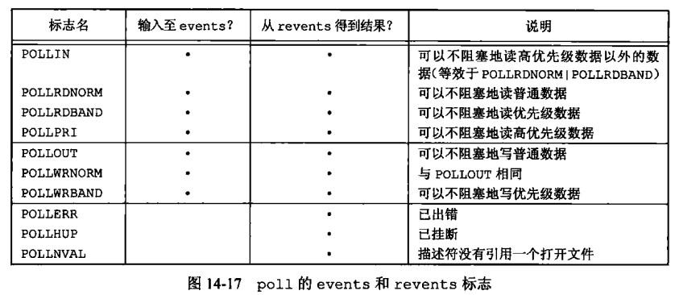

# 第 14 章 高级 IO

## 高级 IO

### 非阻塞 IO

在 Linux 系统编程中，非阻塞 I/O 是一种编程模型，它允许程序在执行 I/O 操作时不被阻塞。相比于传统的阻塞 I/O 模型，在非阻塞 I/O 模型中，I/O 操作会立即返回，而不需要等待 I/O 操作完成。这使得程序可以同时处理多个 I/O 操作或者执行其他计算任务，提高了程序的并发性能。

在 Linux 中，可以使用 fcntl 系统调用或者使用套接字选项来设置非阻塞 I/O。通过将文件描述符设置为非阻塞模式，当读写操作无法立即完成时，系统调用会立即返回一个错误码，而不是一直等待直到操作完成。程序可以根据错误码判断是否需要重新尝试 I/O 操作，或者切换到处理其他任务。

需要注意的是，在非阻塞 I/O 模型中，应用程序需要不断轮询文件描述符，以便及时发现 I/O 操作的完成。可以使用轮询函数（如 select、poll、epoll）来实现这一点。同时，由于非阻塞 I/O 模型中涉及到并发访问文件描述符，因此需要考虑线程安全等问题。

总的来说，非阻塞 I/O 是 Linux 系统编程中常用的一种编程模型，它可以提高程序的并发性能，但也需要程序员考虑一些额外的问题。

#### fcntl 函数

复制文件描述符：cmd 取值为 F_DUPFD，arg 为目标文件描述符的最小值，表示将 fd 复制到一个新的文件描述符，该文件描述符的值不小于 arg。

获取/设置文件描述符标记：cmd 取值为 F_GETFD/F_SETFD，arg 为要获取/设置的标记。标记可以是 FD_CLOEXEC（表示在调用 exec 系列函数时关闭文件描述符）、FD_NONBLOCK（表示将文件描述符设置为非阻塞模式）等。

获取/设置文件状态标志：cmd 取值为 F_GETFL/F_SETFL，arg 为要获取/设置的状态标志。状态标志可以是 O_NONBLOCK（与 FD_NONBLOCK 作用相同）、O_APPEND（表示在写入文件时追加而不是覆盖）等。

获取/设置记录锁：cmd 取值为 F_GETLK/F_SETLK/F_SETLKW，arg 为要获取/设置的锁结构体。锁结构体包含锁的起始偏移量、长度、锁的类型等信息。

```cpp
#include <unistd.h>
#include <fcntl.h>
int fcntl(int fd, int cmd, ... /* arg */ );
```

### 数据中继案例

实现

```cpp
      >--read--->(buf)>---write-->
                FSM1
(tty1)                           (tty2)
                FSM2
      <--write--<(buf)<---read---<
```

代码样例

```cpp
#include <iostream>
#include <stdio.h>
#include <sys/types.h>
#include <sys/stat.h>
#include <fcntl.h>
#include <string>
#include <unistd.h>
#include <errno.h>

#define TTY1 "/dev/tty2"
#define TTY2 "/dev/tty3"
#define BUFFSIZE 1024

using namespace std;

// 状态机状态
enum
{
    STATE_R = 1, // 读态
    STATE_W,     // 写态
    STATE_EX,
    STATE_T // 终止状态
};

// 有限状态机
struct fdm_t
{
    int state;
    int sfd;
    int dfd;
    int len;
    int pos;
    string str;
    char buf[BUFFSIZE];
};

void fsm_driver(struct fdm_t *fsm)
{
    int res;
    // 从源写到目标
    switch (fsm->state)
    {
    case STATE_R: // 读
        fsm->len = read(fsm->sfd, fsm->buf, BUFFSIZE);
        if (fsm->len == 0)
        {
            fsm->state = STATE_T; // 结束
        }
        else if (fsm->len < 0)
        {
            if (errno == EAGAIN) // 非阻塞读失败
            {
                fsm->state = STATE_R;
            }
            else // 真错
            {
                fsm->str = "读出错";
                fsm->state = STATE_EX; // 结束
            }
        }
        else // 下一步前往写状态
        {
            fsm->state = STATE_W;
            fsm->pos = 0;
        }
        break;
    case STATE_W: // 写
        res = write(fsm->dfd, (fsm->buf + fsm->pos), fsm->len);
        if (res < 0)
        {
            if (errno == EAGAIN)
            {
                fsm->state = STATE_W;
            }
            else
            {
                fsm->str = "写出错";
                fsm->state = STATE_EX; // 写出错
            }
        }
        else
        {
            fsm->len -= res;
            fsm->pos += res;
            if (fsm->len == 0) // 写完了
            {
                fsm->state = STATE_R; // 去读
            }
            else // 没写完
            {
                fsm->state = STATE_W; // 仍旧去写
            }
        }
        break;
    case STATE_EX: // 写出错
        cerr << fsm->str << endl;
        fsm->state = STATE_T;
        break;
    case STATE_T: // 结束
        break;
    default:
        break;
    }
}

void relay(int fd1, int fd2)
{
    // 将两个文件描述符改为以非阻塞打开
    int fd1_save = fcntl(fd1, F_GETFL);
    int fd2_save = fcntl(fd2, F_GETFL);
    int res1 = fcntl(fd1, F_SETFL, fd1_save | O_NONBLOCK);
    int res2 = fcntl(fd2, F_SETFL, fd2_save | O_NONBLOCK);
    cout << "设置非阻塞成功 " << res1 << " " << res2 << endl;
    struct fdm_t fsm1, fsm2;

    fsm1.state = STATE_R;
    fsm1.sfd = fd1; // 源
    fsm1.dfd = fd2; // 目标

    fsm2.state = STATE_R;
    fsm2.sfd = fd2;
    fsm2.dfd = fd1;

    //       fsm1
    // fd1----buf---->fd2
    //       fsm2
    // fd2----buf---->fd1

    while (fsm1.state != STATE_T || fsm2.state != STATE_T)
    {
        fsm_driver(&fsm1);
        fsm_driver(&fsm2);
    }

    // 恢复原来文件状态
    fcntl(fd1, F_SETFL, fd1_save);
    fcntl(fd2, F_SETFL, fd2_save);
}

int main(int argc, char **argv)
{
    int fd1, fd2;
    fd1 = open(TTY1, O_RDWR);
    if (fd1 == -1)
    {
        cerr << "fd1 open() error" << endl;
    }
    fd2 = open(TTY2, O_RDWR | O_NONBLOCK);
    if (fd2 == -1)
    {
        cerr << "fd2 open() error" << endl;
    }
    relay(fd1, fd2);

    close(fd1);
    close(fd2);
    return 0;
}
```

### IO 多路复用

Linux 系统编程中的 IO 多路复用技术可以帮助解决以下问题：

同时处理多个 I/O 事件：在传统的阻塞式 I/O 模型中，每个 I/O 操作都会阻塞进程，只有当 I/O 操作完成后，进程才会继续执行。这种模型在同时处理多个 I/O 事件时效率很低。而 IO 多路复用可以同时监听多个 I/O 事件，当任意一个 I/O 事件就绪时，进程可以及时处理，从而提高了系统的并发处理能力。

避免无限循环等待：在传统的非阻塞式 I/O 模型中，如果一个文件描述符没有数据可读，进程会不断地轮询，这会浪费 CPU 资源。而 IO 多路复用通过监听多个文件描述符，可以有效避免无限循环等待的问题。

节省资源：在传统的多线程模型中，每个线程都需要占用一定的内存和 CPU 资源。而 IO 多路复用可以在一个线程内同时处理多个 I/O 事件，从而节省了系统资源，提高了系统的性能。

### select

select 函数是 Linux 系统编程中常用的一种 I/O 多路复用机制，它可以让程序同时监听多个文件描述符，一旦其中任何一个文件描述符有数据可读或可写，就会通知程序进行相应的处理。

函数原型

```cpp
/* According to POSIX.1-2001, POSIX.1-2008 */
#include <sys/select.h>
/* According to earlier standards */
#include <sys/time.h>
#include <sys/types.h>
#include <unistd.h>
int select(int nfds, fd_set *readfds, fd_set *writefds,
          fd_set *exceptfds, struct timeval *timeout);
//该函数的返回值是就绪的文件描述符数量,当set全为null时设置timeout可以被用作安全休眠返回值为0
struct timeval {
   long    tv_sec;         /* seconds */
   long    tv_usec;        /* microseconds */
};

/*
nfds：要监听的最大文件描述符值加1。
readfds：读文件描述符集合。
writefds：写文件描述符集合。
exceptfds：异常文件描述符集合。
timeout：超时时间。
*/
```

监听集合操作

```cpp
//从set中删除fd
void FD_CLR(int fd, fd_set *set);
//判断fd是否在set中
int  FD_ISSET(int fd, fd_set *set);
//将fd加入到set中
void FD_SET(int fd, fd_set *set);
//清空set
void FD_ZERO(fd_set *set);
```

将数据中继实例改为 select 版本

```cpp
#include <iostream>
#include <stdio.h>
#include <sys/types.h>
#include <sys/stat.h>
#include <sys/time.h>
#include <sys/select.h>
#include <fcntl.h>
#include <string>
#include <unistd.h>
#include <errno.h>

#define TTY1 "./temp1.o"
#define TTY2 "./temp2.o"
#define BUFFSIZE 1024

using namespace std;

// 状态机状态
enum
{
    STATE_R = 1, // 读态
    STATE_W,     // 写态
    STATE_EX,
    STATE_T // 终止状态
};

// 有限状态机
struct fdm_t
{
    int state;
    int sfd;
    int dfd;
    int len;
    int pos;
    string str;
    char buf[BUFFSIZE];
};

void fsm_driver(struct fdm_t *fsm)
{
    int res;
    // 从源写到目标
    switch (fsm->state)
    {
    case STATE_R: // 读
        fsm->len = read(fsm->sfd, fsm->buf, BUFFSIZE);
        if (fsm->len == 0)
        {
            fsm->state = STATE_T; // 结束
        }
        else if (fsm->len < 0)
        {
            if (errno == EAGAIN) // 非阻塞读失败
            {
                fsm->state = STATE_R;
            }
            else // 真错
            {
                fsm->str = "读出错";
                fsm->state = STATE_EX; // 结束
            }
        }
        else // 下一步前往写状态
        {
            fsm->state = STATE_W;
            fsm->pos = 0;
        }
        break;
    case STATE_W: // 写
        res = write(fsm->dfd, (fsm->buf + fsm->pos), fsm->len);
        if (res < 0)
        {
            if (errno == EAGAIN)
            {
                fsm->state = STATE_W;
            }
            else
            {
                fsm->str = "写出错";
                fsm->state = STATE_EX; // 写出错
            }
        }
        else
        {
            fsm->len -= res;
            fsm->pos += res;
            if (fsm->len == 0) // 写完了
            {
                fsm->state = STATE_R; // 去读
            }
            else // 没写完
            {
                fsm->state = STATE_W; // 仍旧去写
            }
        }
        break;
    case STATE_EX: // 写出错
        cerr << fsm->str << endl;
        fsm->state = STATE_T;
        break;
    case STATE_T: // 结束
        break;
    default:
        break;
    }
}

void relay(int fd1, int fd2)
{
    // 将两个文件描述符改为以非阻塞打开
    int fd1_save = fcntl(fd1, F_GETFL);
    int fd2_save = fcntl(fd2, F_GETFL);
    int res1 = fcntl(fd1, F_SETFL, fd1_save | O_NONBLOCK);
    int res2 = fcntl(fd2, F_SETFL, fd2_save | O_NONBLOCK);
    cout << "设置非阻塞成功 " << res1 << " " << res2 << endl;
    struct fdm_t fsm1, fsm2;
    fd_set rset, wset, eset;
    fsm1.state = STATE_R;
    fsm1.sfd = fd1; // 源
    fsm1.dfd = fd2; // 目标

    fsm2.state = STATE_R;
    fsm2.sfd = fd2;
    fsm2.dfd = fd1;

    //       fsm1
    // fd1----buf---->fd2
    //       fsm2
    // fd2----buf---->fd1
    while (fsm1.state != STATE_T || fsm2.state != STATE_T)
    {
        // 布置监视任务
        FD_ZERO(&rset);
        FD_ZERO(&wset);
        FD_ZERO(&eset);
        if (fsm1.state == STATE_R)
        {
            FD_SET(fsm1.sfd, &rset);
            FD_SET(fsm1.sfd, &eset);
        }
        else if (fsm1.state == STATE_W)
        {
            FD_SET(fsm1.dfd, &wset);
            FD_SET(fsm1.dfd, &eset);
        }
        if (fsm2.state == STATE_R)
        {
            FD_SET(fsm2.sfd, &rset);
            FD_SET(fsm2.sfd, &eset);
        }
        else if (fsm2.state == STATE_W)
        {
            FD_SET(fsm2.dfd, &wset);
            FD_SET(fsm2.dfd, &eset);
        }
        // 监视
        int select_res; // 状态机为W R状态时才进行select监听
        if (fsm1.state < STATE_EX && fsm2.state < STATE_EX && (select_res = select(std::max(fsm1.sfd, fsm1.dfd) + 1, &rset, &wset, &eset, nullptr)) < 0)
        {
            if (errno == EINTR) // 被信号打断
            {
                continue; // 重新监视
            }
            cerr << "select error" << endl;
            break;
        }
        // 监视结果
        if (FD_ISSET(fsm1.sfd, &eset) || FD_ISSET(fsm1.dfd, &eset))
        {
            cerr << "fd in eset" << endl;
            fsm1.state = STATE_EX;
            fsm2.state = STATE_EX;
        }
        if (fsm1.state >= STATE_EX || FD_ISSET(fsm1.sfd, &rset) || FD_ISSET(fsm2.dfd, &wset))
        {
            fsm_driver(&fsm1);
        }
        if (fsm2.state >= STATE_EX || FD_ISSET(fsm2.sfd, &rset) || FD_ISSET(fsm1.dfd, &wset))
        {
            fsm_driver(&fsm2);
        }
    }
    // 恢复原来文件状态
    fcntl(fd1, F_SETFL, fd1_save);
    fcntl(fd2, F_SETFL, fd2_save);
}

int main(int argc, char **argv)
{
    int fd1, fd2;
    fd1 = open(TTY1, O_RDWR | O_CREAT);
    if (fd1 == -1)
    {
        cerr << "fd1 open() error" << endl;
    }
    fd2 = open(TTY2, O_RDWR | O_NONBLOCK | O_CREAT);
    if (fd2 == -1)
    {
        cerr << "fd2 open() error" << endl;
    }
    relay(fd1, fd2);
    close(fd1);
    close(fd2);
    return 0;
}
```

### pselect

函数原型

```cpp
#include <sys/select.h>
int pselect(int nfds, fd_set *readfds, fd_set *writefds,
           fd_set *exceptfds, const struct timespec *timeout,
            const sigset_t *sigmask);
//pselect提供信号屏蔽,可以在pselect前进行信号屏蔽，在阻塞pselect时使用sigmask指定的信号屏蔽，pselect返回后恢复原来的信号屏蔽
struct timespec {
   long    tv_sec;         /* seconds */
   long    tv_nsec;        /* nanoseconds */
};
```

### select 监听个数限制

在 Linux 系统中，select 函数能够监听的文件描述符数量是有限制的，具体的限制取决于操作系统实现和内存限制.

在早期的 Linux 内核中，select 函数可以监听的最大文件描述符数量是 1024，这是由文件描述符集合的数据结构实现决定的。文件描述符集合通常是一个位图，位图中的每一位表示一个文件描述符，因此，一个 32 位的整数可以表示 32 个文件描述符。因此，文件描述符集合通常的实现是一个数组，数组中的每个元素都是一个 32 位的整数，能够表示 32 个文件描述符。

在早期的 Unix 系统中，文件描述符集合通常是一个长度为 32 的数组，能够监听的最大文件描述符数量就是 32 \* 32 = 1024

随着 Linux 内核的不断升级和优化，select 函数可以监听的最大文件描述符数量已经得到了很大的提高，例如在现代的 Linux 内核中，可以通过修改 FD_SETSIZE 宏定义来扩大文件描述符集合的大小，从而提高 select 函数能够监听的最大文件描述符数量。通常，FD_SETSIZE 宏定义的默认值是 1024 或者更大，可以在编译时通过修改宏定义的方式来改变文件描述符集合的大小。

总的来说，select 函数能够监听的最大文件描述符数量是有限制的，但可以通过修改操作系统配置和内存限制来提高其能力。另外，随着 I/O 多路复用技术的发展和操作系统内核的优化，还有其他更高效的 I/O 多路复用机制可以用来替代 select 函数，例如 poll、epoll 等，它们可以更加高效地处理大量的文件描述符。

### poll

poll 函数是 Linux 系统中用于 I/O 多路复用的一种机制，可以同时监视多个文件描述符的读写事件，从而避免了使用多个线程或进程来处理大量的 I/O 操作。

函数原型

```cpp
#include <poll.h>
int poll(struct pollfd *fds, nfds_t nfds, int timeout);//timeout ms
// fds：为结构体数组指针
// nfs：为数组的长度
// timeout < 0：poll函数一直阻塞，直到有事件发生。
// timeout == 0：poll函数立即返回，不阻塞，用于查询所有监视的文件描述符的状态。
// timeout > 0：poll函数等待timeout毫秒后返回，即使没有事件发生。

struct pollfd {
    int   fd;         /* file descriptor 要监视的文件描述符 */
    short events;     /* requested events 要监视的事件类型*/
    short revents;    /* returned events 实际发生的事件类型*/
};
```

关于 event 的选项



简单使用样例

```cpp
#include <iostream>
#include <stdio.h>
#include <sys/types.h>
#include <sys/stat.h>
#include <sys/time.h>
#include <fcntl.h>
#include <string>
#include <unistd.h>
#include <poll.h>
#include <errno.h>

#define TTY1 "./temp1.o"
#define TTY2 "./temp2.o"
#define MAX 1024

using namespace std;

int main(int argc, char **argv)
{
    int fd1, fd2;
    fd1 = open(TTY1, O_RDWR | O_CREAT);
    if (fd1 == -1)
    {
        cerr << "fd1 open() error" << endl;
    }
    fd2 = open(TTY2, O_RDWR | O_NONBLOCK | O_CREAT);
    if (fd2 == -1)
    {
        cerr << "fd2 open() error" << endl;
    }
    { // 非阻塞设置
        int fd1_save = fcntl(fd1, F_GETFL);
        int fd2_save = fcntl(fd2, F_GETFL);
        int res1 = fcntl(fd1, F_SETFL, fd1_save | O_NONBLOCK);
        int res2 = fcntl(fd2, F_SETFL, fd2_save | O_NONBLOCK);
        cout << "设置非阻塞成功 " << res1 << " " << res2 << endl;
    }
    // poll使用
    struct pollfd pfds[MAX];
    // 数组初始化
    for (int i = 0; i < MAX; i++)
    {
        pfds[i].fd = -1;
    }
    pfds[0].fd = fd1;
    pfds[0].events = 0;
    pfds[0].events = POLLIN | POLLOUT;
    pfds[1].fd = fd2;
    pfds[1].events = 0;
    pfds[1].events = POLLIN | POLLOUT;
    // poll监听
    int res;
    while (1)
    {
        if ((res = poll(pfds, 2, -1)) < 0)
        {
            if (errno == EINTR)
            {
                continue;
            }
            break;
        }
        for (int i = 0; i < MAX; i++)
        {
            if (pfds[i].fd != -1)
            {
                if (pfds[i].revents & POLLIN)
                {
                    cout << pfds[i].fd << "可读" << endl;
                    // 进行非阻塞IO相关操作
                }
                if (pfds[i].revents & POLLOUT)
                {
                    cout << pfds[i].fd << "可写" << endl;
                    // 进行非阻塞IO相关操作
                }
            }
        }
    }
    // poll返回0表示超时 -1表示错误
    // 调用poll后pfds数组不会被清空
    close(fd1);
    close(fd2);
    return 0;
}
```

#### poll 与 select 对比

相对于 select 函数，poll 函数的优点在于能够监听更多的文件描述符，并且对于大量文件描述符的情况下效率更高，因为 poll 函数不需要轮询所有文件描述符，而是使用内核事件通知机制来实现。另外，poll 函数还支持更细粒度的事件类型，例如 POLLPRI 表示有紧急数据可读，这是 select 函数不支持的。

select 是以事件组织描述符，得事件->检测描述符  
poll 是以描述符组织事件，得描述符->判断事件

### ppoll

函数原型

```cpp
#define _GNU_SOURCE         /* See feature_test_macros(7) */
#include <signal.h>
#include <poll.h>
int ppoll(struct pollfd *fds, nfds_t nfds,
    const struct timespec *tmo_p, const sigset_t *sigmask);
```

### epoll

函数原型

#### epoll_create

参数 size 指定了创建的 epoll 实例中能够同时处理的文件描述符的数量，这个值并不是实际限制，而只是一个提示，内核会根据系统的实际情况调整这个值。当 size 被设置为 0 时，epoll_create 函数会自动选择一个合适的值。

函数返回一个文件描述符，如果创建失败，则返回-1，并设置 errno 为相应的错误码。

在使用 epoll 前，必须先调用 epoll_create 创建一个 epoll 实例，并将返回的文件描述符保存下来，以便后续的操作。每个 epoll 实例在内核中都有一个相应的事件表，用于存储所有注册在该 epoll 实例中的文件描述符及其对应的事件。

```cpp
#include <sys/epoll.h>
int epoll_create(int size);
```

#### epoll_ctl

```cpp
int epoll_ctl(int epfd, int op, int fd, struct epoll_event *event);
/*op:
EPOLL_CTL_ADD 将文件描述符fd添加到epoll实例中，event参数指定了fd关注的事件类型。
EPOLL_CTL_MOD 修改文件描述符fd在epoll实例中的关注事件，event参数指定了修改后的事件类型。
EPOLL_CTL_DEL 将文件描述符fd从epoll实例中删除。
*/

//参数event是一个指向epoll_event结构体的指针，
//该结构体用于指定文件描述符关注的事件类型，它的定义如下：
struct epoll_event {
    uint32_t events; /* 关注的事件类型 */
    epoll_data_t data; /* 用户数据 */
};
/*events成员表示关注的事件类型，可以是以下值的组合：
EPOLLIN：可读事件。
EPOLLOUT：可写事件。
EPOLLRDHUP：TCP连接被对端关闭，或者对端关闭了写操作。
EPOLLERR：错误事件。
EPOLLHUP：挂起事件，通常是由于连接重置或者文件描述符被关闭导致的。*/

//data成员是一个epoll_data_t类型的联合体，
//用于存储与文件描述符相关的用户数据，它的定义如下：
typedef union epoll_data {
    void *ptr;
    int fd;
    uint32_t u32;
    uint64_t u64;
} epoll_data_t;
```

epoll_ctl 函数注意事项

1、要添加或删除的文件描述符必须是已经打开的、合法的文件描述符。
2、在将文件描述符添加到 epoll 实例中之前，需要先将其设置为非阻塞模式。
3、event 参数中的 events 成员应该是需要关注的事件类型的组合，例如，如果希望关注可读事件和挂起事件，则可以设置 events 成员为 EPOLLIN | EPOLLHUP。

#### epoll_wait

```cpp
int epoll_wait(int epfd, struct epoll_event *events,
               int maxevents, int timeout);
int epoll_pwait(int epfd, struct epoll_event *events,
                int maxevents, int timeout,
                const sigset_t *sigmask);
```

简单样例

```cpp
#include <iostream>
#include <stdio.h>
#include <sys/types.h>
#include <sys/stat.h>
#include <sys/time.h>
#include <fcntl.h>
#include <string>
#include <unistd.h>
#include <sys/epoll.h>
#include <errno.h>

#define TTY1 "./temp1.o"
#define TTY2 "./temp2.o"
#define MAX 1024

using namespace std;

int main(int argc, char **argv)
{
    int fd1, fd2;
    fd1 = open(TTY1, O_RDWR | O_CREAT);
    if (fd1 == -1)
    {
        cerr << "fd1 open() error" << endl;
    }
    fd2 = open(TTY2, O_RDWR | O_NONBLOCK | O_CREAT);
    if (fd2 == -1)
    {
        cerr << "fd2 open() error" << endl;
    }
    { // 非阻塞设置
        int fd1_save = fcntl(fd1, F_GETFL);
        int fd2_save = fcntl(fd2, F_GETFL);
        int res1 = fcntl(fd1, F_SETFL, fd1_save | O_NONBLOCK);
        int res2 = fcntl(fd2, F_SETFL, fd2_save | O_NONBLOCK);
        cout << "设置非阻塞成功 " << res1 << " " << res2 << endl;
    }
    // epoll
    int epfd = epoll_create(2);
    if (epfd < 0)
    {
        cerr << "epoll create error" << endl;
        exit(1);
    }
    struct epoll_event ev, events[1024];
    ev.events = EPOLLIN | EPOLLET; // ET模式
    ev.data.fd = fd1;
    epoll_ctl(epfd, EPOLL_CTL_ADD, fd1, &ev);
    ev.events = EPOLLOUT;
    ev.data.fd = fd2;
    epoll_ctl(epfd, EPOLL_CTL_ADD, fd2, &ev);
    // 添加监听事项
    int ret;
    while (1)
    {
        if ((ret = epoll_wait(epfd, events, 1024, -1)) < 0)
        {
            if (errno == EINTR)
            {
                continue;
            }
            break;
        }
        else
        {
            for (int i = 0; i < ret; i++) // 遍历就绪集合
            {
                int fd = events[i].data.fd;
                if (fd == fd1)
                {
                    if (events[i].events & EPOLLIN)
                    {
                        cout << fd << "EPOLLIN" << endl;
                        // epoll_ctl...
                    }
                    else if (events[i].events & EPOLLOUT)
                    {
                        cout << fd << "EPOLLOUT" << endl;
                        // epoll_ctl...
                    }
                }
                else if (fd == fd2)
                {
                    if (events[i].events & EPOLLIN)
                    {
                        cout << fd << "EPOLLIN" << endl;
                        // epoll_ctl...
                    }
                    else if (events[i].events & EPOLLOUT)
                    {
                        cout << fd << "EPOLLOUT" << endl;
                        // epoll_ctl...
                    }
                }
            }
        }
    }
    close(fd1);
    close(fd2);
    return 0;
}
// fd1 的 EPOLLIN只会触发一次 因为是EPOLLET模式
// fd2 的 EPOLLOUT会一直触发
```

### select、poll、epoll 对比

I/O 触发方式

- 水平触发 LT，当一个文件描述符就绪时，会不断地通知应用程序，直到应用程序处理完这个文件描述符上的所有可读或可写数据。这种事件通知机制比较简单，但当文件描述符数量较大时，效率会有所下降。

- 边缘触发 ET，当一个文件描述符从未就绪变为就绪时，才会通知应用程序。这种事件通知机制能够有效减少通知次数，提高效率。ET 模式需要使用系统调用（如 read、write、recv、send 等）来处理所有可读或可写数据，否则可能会导致缓冲区中剩余的数据未能被处理。

- 单次触发 EPOLLONESHOT，可以在文件描述符就绪后只通知一次，需要应用程序再次调用 epoll_ctl 函数来重新将该文件描述符加入监听队列。

使用 ET 要注意的点

1、ET 模式下，每个就绪事件只会通知一次，如果应用程序没有及时处理，可能会造成事件丢失。
2、ET 模式下，应用程序需要读取所有可读或可写数据，直到 read 或 write 等系统调用返回 EAGAIN 或 EWOULDBLOCK，否则可能会导致阻塞或者缓冲区溢出。
3、ET 模式通常适用于大量连接、高并发的场景，可以减少通知次数，提高效率。

|              | select                                         | poll                                           | epoll                                                                                                  |
| ------------ | ---------------------------------------------- | ---------------------------------------------- | ------------------------------------------------------------------------------------------------------ |
| 操作方式     | 遍历                                           | 遍历                                           | 回调                                                                                                   |
| 底层实现     | 数组                                           | 链表                                           | 红黑树                                                                                                 |
| IO 效率      | 每次调用进行线性遍历 O(n)                      | 每次调用进行线性遍历 O(n)                      | 事件通知方式，每当 fd 就绪，系统注册的回调函数就会被调用，将就绪 fd 放到 rdllist 中，事件复杂度为 O(1) |
| 最大连接数   | 1024（x86）或 2048（x64）                      | 无上限                                         | 无上限                                                                                                 |
| fd 拷贝      | 每次调用，都需要把 fd 集合从用户态拷贝到内核态 | 每次调用，都需要把 fd 集合从用户态拷贝到内核态 | 调用 epoll_ctl 时拷贝进内核并保存，值后每次 epoll_wait 不拷贝                                          |
| I/O 触发方式 | 水平触发 LT                                    | 水平触发 LT                                    | LT（水平触发）、ET（边缘触发 默认）和 EPOLLONESHOT（单次触发）                                         |

### readv 和 writev

二者是一对 Linux/Unix 系统调用，它们可以在单个系统调用中读取或写入多个非连续的缓冲区

readv 用于从文件描述符中读取数据，并将数据分散到多个缓冲区中  
writev 用于将多个缓冲区的数据连续写入到文件描述符中  
优点：  
可以避免在用户空间和内核空间之间多次复制数据，从而提高数据传输的效率，同时还可以避免因为多次系统调用而导致的上下文切换开销

```cpp
#include <sys/uio.h>
ssize_t readv(int fd, const struct iovec *iov, int iovcnt);
ssize_t writev(int fd, const struct iovec *iov, int iovcnt);
//iov数组地址 iovcnt iov长度
struct iovec {
   void  *iov_base;    /* Starting address */
   size_t iov_len;     /* Number of bytes to transfer */
};
```

简单样例

```cpp
#include <iostream>
#include <sys/uio.h>
#include <errno.h>
#include <unistd.h>
#include <sys/types.h>
#include <sys/stat.h>
#include <fcntl.h>
#include <cstring>

#define TTY1 "./temp1.o"
using namespace std;

int main(int argc, char **argv)
{
    int fd1;
    fd1 = open(TTY1, O_RDWR | O_CREAT | O_TRUNC);
    if (fd1 == -1)
    {
        cerr << "fd1 open() error" << endl;
        exit(1);
    }
    char buffer[2][10];
    struct iovec iovecs[2];
    iovecs[0].iov_base = (void *)(&buffer[0][0]);
    iovecs[0].iov_len = 9;
    iovecs[1].iov_base = (void *)(&buffer[1][0]);
    iovecs[1].iov_len = 9;
    strcpy(&buffer[0][0], "12345678\n");
    strcpy(&buffer[1][0], "12345678\n");
    int ret = writev(fd1, iovecs, 2);
    if (ret == 18)
    {
        cout << ret << endl;
    }
    else if (ret < 0)
    {
        cerr << "writen  error" << endl;
    }
    lseek(fd1, 0, SEEK_SET);
    buffer[0][0] = 0;
    buffer[1][0] = 0;
    ret = readv(fd1, iovecs, 2);
    cout << ret << endl;
    cout << buffer[0];
    cout << buffer[1];
    close(fd1);
    return 0;
}
/*
18
18
12345678
12345678
*/
```

### readn 和 writen

在 Linux 系统编程中，read 与 write 进行 IO 操作时并没有提供保证数据完整性的机制，可能导致一次 I/O 操作并没有读取或写入全部数据，对于某些应用程序是不可接受的  
可以自己实现 readn 与 writen 函数

#### readn

样例

```cpp
#include <unistd.h>
#include <errno.h>
ssize_t readn(int fd, void *buf, size_t n)
{
    size_t nleft = n; // 还需要读nleft个
    ssize_t nread;
    char *ptr = (char *)buf;
    while (nleft > 0)
    {
        if ((nread = read(fd, ptr, nleft)) < 0)
        {
            if (errno == EINTR) // 被信号中断
            {
                nread = 0;
            }
            else
            {
                return -1;
            }
        }
        else if (nread == 0)
        {
            break;
        }
        nleft -= nread;
        ptr += nread;
    }
    return (n - nleft); // 返回实际读出的字节数
}
```

#### writen

样例

```cpp
#include <unistd.h>
#include <errno.h>
ssize_t writen(int fd, void *buf, size_t n)
{
    size_t nleft = n; // 还需要写nleft个
    ssize_t nwriten;
    char *ptr = (char *)buf;
    while (nleft > 0)
    {
        if ((nwriten = write(fd, ptr, nleft)) < 0)
        {
            if (errno == EINTR) // 被信号中断
            {
                nwriten = 0;
            }
            else
            {
                return -1;
            }
        }
        nleft -= nwriten;
        ptr += nwriten;
    }
    return n;
}
```

### 存储映射 mmap

存储映射 IO（Memory-mapped IO）,该技术允许将文件的内容映射到进程的地址空间中，从而使进程能够像访问内存一样访问文件内容。存储映射 IO 有助于提高文件 IO 的性能，因为它避免了系统调用的开销，同时还可以减少数据的复制。

```cpp
                        进程内存空间
|------------|************|---------------------|
             |<----len--->|
                存储映射IO
             |<----len--->|
|------------|************|------------|
                  文件
```

相关函数

#### mmap

```cpp
#include <sys/mman.h>
void *mmap(void *addr, size_t length, int prot, int flags,
            int fd, off_t offset);
//addr：指定映射区域的起始地址，通常设置为NULL，由系统自动分配。
//length：指定映射区域的长度，一般设置为文件的大小。
//prot：指定映射区域的保护模式，例如PROT_READ表示只读，PROT_WRITE表示可写,PROT_EXEC 可执行、PROT_NONE不可访问。
//flags：指定映射区域的标志，例如MAP_SHARED表示共享映射（写影响原文件），MAP_PRIVATE表示私有映射（写不影响原文件）等(可以看man手册)。
//fd：指定要映射的文件描述符。
//offset：指定从文件的哪个位置开始映射。
```

使用 mmap()函数映射文件后，可以通过访问映射区域的指针来访问文件的内容。当进程访问映射区域的指针时，操作系统会自动将数据从文件中读取到内存中，并且还可以将修改的数据写回到文件中。

#### mprotect

mprotect() 函数是一个 POSIX 标准的系统调用，它用于更改指定内存区域的访问权限。该函数需要指定内存区域的地址、大小和新的访问权限，它可以将内存区域设置为只读、可写或不可访问。通常情况下，该函数用于实现内存保护机制，以确保程序不会意外地访问或修改其它程序的内存。

```cpp
#include <sys/mman.h>
int mprotect(void *addr, size_t len, int prot);
//prot:
//PROT_NONE：表示内存区域不可访问；
//PROT_READ：表示内存区域可读；
//PROT_WRITE：表示内存区域可写；
//PROT_EXEC：表示内存区域可执行。
//          函数返回值为 0 表示成功，返回 -1 表示失败，错误码存储在 errno 变量中。
```

#### msync

msync() 函数是一个 POSIX 标准的系统调用，它用于将内存中修改过的部分同步到文件中，以确保数据的持久性。该函数通常用于实现内存映射文件（mmap）的机制，以确保数据在内存中的修改能够正确地同步到磁盘上的文件中。

```cpp
#include <sys/mman.h>
int msync(void *addr, size_t length, int flags);
```

参数 addr 表示要同步到文件中的内存区域的起始地址；参数 length 表示内存区域的大小；参数 flags 可以取如下几个值之一：

MS_ASYNC：表示异步同步，即不等待同步完成就立即返回；  
MS_SYNC：表示同步，即等待同步完成后再返回；  
MS_INVALIDATE：表示在同步之前将内存区域的内容标记为无效，以强制从文件中重新加载数据。

msync() 函数返回值为 0 表示成功，返回 -1 表示失败，错误码存储在 errno 变量中。

#### munmap

munmap() 函数是一个 POSIX 标准的系统调用，它用于释放通过 mmap() 函数映射到进程地址空间中的内存区域。该函数可以释放单个或多个内存区域，并且可以指定释放的内存区域的大小和起始地址。

```cpp
#include <sys/mman.h>
int munmap(void *addr, size_t length);
```

其中，参数 addr 表示要释放的内存区域的起始地址；参数 length 表示要释放的内存区域的大小。如果参数 length 是 0，则表示释放从参数 addr 开始的整个内存区域。

munmap() 函数返回值为 0 表示成功，返回 -1 表示失败，错误码存储在 errno 变量中。注意，使用 munmap() 函数释放内存区域会使该区域不再可用，应该在释放前确保不再需要该内存区域，否则可能导致程序崩溃或者内存泄漏。

#### mmap 样例

简单样例

```cpp
#include <iostream>
#include <errno.h>
#include <unistd.h>
#include <sys/types.h>
#include <sys/stat.h>
#include <fcntl.h>
#include <sys/mman.h>
#include <cstring>

#define TTY1 "./temp1.o"
using namespace std;

int main(int argc, char **argv)
{
    int fd1;
    fd1 = open(TTY1, O_RDWR | O_CREAT | O_TRUNC);
    if (fd1 == -1)
    {
        cerr << "fd1 open() error" << endl;
        exit(1);
    }
    write(fd1, "hello world", 11);
    lseek(fd1, 0, SEEK_SET);
    char *m_map = (char *)mmap(nullptr, 11, PROT_READ | PROT_WRITE, MAP_SHARED, fd1, 0);
    for (int i = 0; i < 11; i++)
    {
        cout << m_map[i] << flush;
    }
    cout << endl;
    // 输出hello world
    mprotect(m_map, 11, PROT_READ | PROT_WRITE);
    strcpy(m_map, "vbclo rorld"); // 此时文件对应内容为vbclo rorld
    // 还可以手动释放
    munmap(m_map, 0);
    close(fd1);
    return 0;
}
```

### 记录锁

文件锁有很多种实现的方式、常见的有 fcntl、lockf、flock 等

```cpp
    fd映射
进程|0 | |
    |1| |
 fd |2| |   必要控制信息    inode
    |3|----->|---|        |----|
    | | |    |   |------->|    |
             |---|        |----|

```

文件锁是体现在 inode 层面的

1、什么是文件锁？

文件锁是一种用于协调多个进程对同一文件的访问的机制。文件锁可以让一个进程在操作文件时将其锁定，以避免其他进程对该文件的并发访问。

2、文件锁的种类有哪些?

Linux 系统中的文件锁主要有两种类型：共享锁和排他锁。共享锁允许多个进程同时对文件进行读取操作，但阻止其他进程对该文件进行写入操作。排他锁则阻止其他进程对文件进行读取和写入操作。

3、文件锁在哪些情况下会失效？

当进程终止时，该进程持有的所有文件锁都会被释放。  
当文件描述符被关闭时，与该文件描述符相关的所有文件锁都会被释放。  
当进程向另一个进程发送信号并且信号处理程序不忽略该信号时，该进程持有的所有文件锁都会被释放。

4、文件锁是如何实现的？

Linux 系统中的文件锁是通过内核中的记录锁机制来实现的。在内核中，每个打开的文件都有一个文件表项，文件表项中包含有关文件的信息，包括文件锁的信息。当进程使用 fcntl()系统调用来获取文件锁时，内核会在文件表项中记录相应的锁信息，防止其他进程对文件的并发访问。

#### fcntl 文件锁

函数原型

```cpp
#include <unistd.h>
#include <fcntl.h>
int fcntl(int fd, int cmd, ... /* arg */ );
/*
cmd:
F_DUPFD：复制文件描述符，返回一个新的文件描述符，它指向与原文件描述符相同的文件。
F_GETFD：获取文件描述符标志，可以用来判断文件描述符是否被设置了close-on-exec标志。
F_SETFD：设置文件描述符标志，可以用来设置或清除close-on-exec标志。
F_GETFL：获取文件状态标志，可以用来获取文件的读、写、追加等属性。
F_SETFL：设置文件状态标志，可以用来设置文件的读、写、追加等属性。
F_GETLK：获取指定范围内的文件锁信息，可以用来检查文件是否已经被其他进程锁定。
F_SETLK：设置指定范围内的文件锁，可以用来给文件加锁。
F_SETLKW：与F_SETLK类似，但是如果文件已经被其他进程锁定，则该函数将会等待锁被释放后再进行加锁操作。
*/

struct flock {
    ...
    short l_type;    /* Type of lock: F_RDLCK（读锁）,
                        F_WRLCK（写锁）, F_UNLCK（解锁） */
    short l_whence;  /* How to interpret l_start:
                        SEEK_SET（从文件头开始）, SEEK_CUR（从当前位置开始）, SEEK_END（从文件末尾开始） */
    off_t l_start;   /* Starting offset for lock 锁的起始偏移量，从l_whence指定的位置开始计算*/
    off_t l_len;     /* Number of bytes to lock 锁的长度，从l_start开始计算的长度*/
    pid_t l_pid;     /* PID of process blocking our lock 锁定文件的进程ID，可以设置为0表示当前进程
                        (set by F_GETLK and F_OFD_GETLK) */
    ...
};
```

fcntl 函数的返回值根据所执行的命令不同而有所不同，一般有以下几种情况：

F_DUPFD：返回一个新的文件描述符，指向与原文件描述符相同的文件。  
F_GETFD 和 F_GETFL：返回当前的文件描述符标志或文件状态标志，可以通过返回值来判断文件的读、写、追加等属性。  
F_SETFD 和 F_SETFL：返回 0 表示操作成功，否则返回-1，并设置 errno 变量来指示错误类型。
F_GETLK：如果指定范围内的锁定状态与要设置的锁定状态相冲突，则返回一个描述冲突锁定的 flock 结构体，否则返回 0。  
F_SETLK 和 F_SETLKW：如果操作成功，则返回 0，否则返回-1，并设置 errno 变量来指示错误类型。  
需要注意的是，如果 F_SETLK 或 F_SETLKW 命令无法设置锁定，则返回-1，并设置 errno 变量来指示错误类型。例如，如果锁定的区域与现有锁定的区域冲突，则会返回 EAGAIN 或 EACCES 错误；如果锁定的区域超出了文件的范围，则会返回 EINVAL 错误。因此，在使用 fcntl 函数时，需要检查返回值以及 errno 变量来判断是否出现了错误情况。

简单样例

```cpp
#include <fcntl.h>
#include <unistd.h>
#include <stdio.h>

int main() {
    int fd = open("file.txt", O_WRONLY);
    if (fd == -1) {
        perror("open");
        return -1;
    }
    struct flock fl = {
        .l_type = F_WRLCK,
        .l_whence = SEEK_SET,
        .l_start = 0,
        .l_len = 0,
        .l_pid = 0,
    };
    if (fcntl(fd, F_SETLK, &fl) == -1) {
        perror("fcntl");
        close(fd);
        return -1;
    }
    printf("Lock acquired!\n");
    // Do something with the locked file
    close(fd);
    return 0;
}

```

#### lockf 文件锁

lockf 函数只能对整个文件进行锁定，而不能对文件的一部分进行锁定

```cpp
#include <unistd.h>
int lockf(int fd, int cmd, off_t len);
//lockf函数的返回值为0表示成功，-1表示失败，并设置errno变量来指示错误类型。
//如果在非阻塞模式下，文件当前被其他进程锁定，则返回-1并设置errno变量为EAGAIN或EACCES错误。
```

参数 fd 表示要锁定的文件描述符，cmd 表示要执行的操作，len 表示要锁定的字节数。

lockf 函数的 len 参数用于指定锁定文件的长度。如果 len 参数的值为 0，则表示锁定整个文件；否则，锁定文件的前 len 个字节。需要注意的是，如果 len 参数的值超过文件的实际长度，则只锁定文件的实际长度。如果 len 参数的值为负数，则 lockf 函数的行为是未定义的。

F_LOCK：锁定整个文件，如果文件当前被其他进程锁定，则阻塞等待锁定。  
F_TLOCK：锁定整个文件，如果文件当前被其他进程锁定，则立即返回失败。  
F_ULOCK：解锁整个文件。  
F_TEST：测试文件是否可以被锁定，如果文件当前被其他进程锁定，则返回-1 并设置 errno 变量为 EAGAIN 或 EACCES 错误，否则返回 0。

样例

```cpp
#include <unistd.h>
#include <fcntl.h>
#include <stdio.h>

int main() {
    int fd = open("file.txt", O_RDWR);
    if (fd == -1) {
        perror("open");
        return -1;
    }
    if (lockf(fd, F_LOCK, 10) == -1) { // 锁定文件前10个字节
        perror("lockf");
        close(fd);
        return -1;
    }
    printf("Lock acquired!\n");
    // Do something with the locked part of the file
    lockf(fd, F_ULOCK, 10); // 解锁文件前10个字节
    close(fd);
    return 0;
}

```

#### flock 文件锁

函数原型

```cpp
#include <sys/file.h>
int flock(int fd, int operation);
// operation:
// LOCK_SH：共享锁定，其他进程仍可对文件加共享锁定，但不能对文件加排他锁定。
// LOCK_EX：排他锁定，其他进程不能对文件加任何类型的锁定，只有释放了当前进程的排他锁定，其他进程才能对文件进行任何类型的锁定。
// LOCK_UN：解锁。
// LOCK_NB：非阻塞模式，如果文件当前被其他进程锁定，则返回-1并设置errno变量为EWOULDBLOCK错误。
// flock函数的返回值为0表示成功，-1表示失败，并设置errno变量来指示错误类型。
// 如果在非阻塞模式下，文件当前被其他进程锁定，则返回-1并设置errno变量为EWOULDBLOCK错误。
```

样例

```cpp
#include <sys/file.h>
#include <unistd.h>
#include <stdio.h>

int main() {
    int fd = open("file.txt", O_RDONLY);
    if (fd == -1) {
        perror("open");
        return -1;
    }
    if (flock(fd, LOCK_SH) == -1) {
        perror("flock");
        close(fd);
        return -1;
    }
    printf("Lock acquired!\n");
    // Do something with the locked file
    close(fd);
    return 0;
}
```

### 异步 IO

主要有 System V 异步 IO、BSD 异步 IO、POSIX 异步 IO，我们主要研究 POSIX 异步 IO

POSIX 异步 I/O（也称为 AIO）是一种用于实现异步 I/O 操作的 API，它允许应用程序发起 I/O 操作而不需要等待操作完成。相比于传统的阻塞 I/O，它可以提高应用程序的并发性和吞吐量，因为应用程序可以在等待 I/O 操作完成的同时继续执行其他任务。

在 POSIX 标准中，AIO 由 aio\_ 系列函数组成，这些函数包括 aio_read、aio_write、aio_error 等等。使用 AIO API，应用程序可以将 I/O 操作请求添加到一个队列中，并在 I/O 操作完成时获得通知。这可以通过信号、回调函数或轮询来实现。

需要注意的是，使用 AIO API 需要操作系统支持 AIO 功能。在 Linux 系统中，需要启用 AIO 支持，并且需要使用适当的 I/O 操作和文件描述符类型才能使用 AIO。

#### 结构体 aiocb

aio_fildes：指向要进行 I/O 操作的文件的文件描述符。  
aio_offset：表示 I/O 操作在文件中的偏移量。  
aio_buf：指向用于 I/O 操作的缓冲区的指针。  
aio_nbytes：表示要进行 I/O 操作的字节数。  
aio_reqprio：用于设置请求的优先级，通常可以忽略。  
aio_sigevent：用于指定 I/O 操作完成时通知的方式，可以是信号、回调函数等。  
aio_lio_opcode：指定要执行的 I/O 操作类型，可以是读取、写入等等。

```cpp
struct aiocb {
    int aio_fildes;     // 文件描述符
    off_t aio_offset;   // I/O 操作在文件中的偏移量
    volatile void* aio_buf;   // I/O 操作缓冲区的地址
    size_t aio_nbytes;  // I/O 操作的字节数
    int aio_reqprio;    // 请求优先级
    struct sigevent aio_sigevent; // I/O 完成时的通知方式
    int aio_lio_opcode; // I/O 操作的类型
};
```

#### 结构体 sigevent

sigev_notify：指定通知方式，可以是以下值之一：  
SIGEV_NONE：不使用任何通知方式。  
SIGEV_SIGNAL：使用信号通知。  
SIGEV_THREAD：使用线程通知。  
sigev_signo：当 sigev_notify 指定为 SIGEV_SIGNAL 时，表示要发送的信号编号。  
sigev_value：用于传递数据到通知接收方。  
sigev_notify_function：当 sigev_notify 指定为 SIGEV_THREAD 时，表示要执行的回调函数。  
sigev_notify_attributes：用于指定线程属性，通常可以忽略。  
通过设置 sigevent 结构体的字段，可以指定异步 I/O 操作完成时的通知方式。通知可以是信号、回调函数或线程等，应用程序可以根据需要选择合适的通知方式。

```cpp
union sigval {
    int sival_int;
    void *sival_ptr;
};

struct sigevent {
    int sigev_notify;              // 通知类型
    int sigev_signo;               // 信号编号
    union sigval sigev_value;      // 传递的数据
    void (*sigev_notify_function) (union sigval);  // 回调函数
    pthread_attr_t *sigev_notify_attributes;      // 线程属性
};
```

#### aio_read 与 aio_write

aio_read 和 aio_write 是 POSIX 异步 I/O API 中用于执行异步读取和写入操作的函数。

aio_read

```cpp
#include <aio.h>
int aio_read(struct aiocb *aiocbp);
//0 success,-1 -> errno
```

aio_write

```cpp
#include <aio.h>
int aio_write(struct aiocb *aiocbp);
```

#### aio_fsync

aio_fsync 函数用于发起异步同步写入操作，即将内核缓冲区中的数据写入到磁盘中，使数据持久化。这个过程需要等待磁盘完成写入操作后，才能返回结果。

```cpp
#include <aio.h>
int aio_fsync(int op, struct aiocb *aiocbp);
```

它的参数 op 是指定要执行的同步操作类型，可以取以下值：

O_SYNC：执行同步写入操作。  
O_DSYNC：执行数据同步写入操作。  
O_RSYNC：执行同步读取操作。

#### aio_error

获取异步 IO 操作状态

```cpp
#include <aio.h>
#include <errno.h>
int aio_error(const struct aiocb *aiocbp);
```

返回值：

如果异步 I/O 操作已经完成，则返回异步 I/O 操作的错误代码；  
如果异步 I/O 操作还未完成，则返回 EINPROGRESS。

#### aio_return

aio_return 函数是异步 I/O 库提供的一个函数，用于获取一个异步 I/O 操作的返回值。

```cpp
#include <aio.h>
ssize_t aio_return(struct aiocb *aiocbp);
返回值说明：
如果异步 I/O 操作还没有完成，或者操作失败，返回 -1。
如果异步 I/O 操作已经成功完成，返回操作的字节数。
```

#### aio 样例

```cpp
#include <stdio.h>
#include <stdlib.h>
#include <aio.h>
#include <cstring>
#include <fcntl.h>
#include <unistd.h>
#include <errno.h>

#define BUFSIZE 1024

int main()
{
    int fd;
    struct aiocb aio;
    char buf[BUFSIZE] = "Hello, world!";

    fd = open("test.txt", O_CREAT | O_RDWR | O_TRUNC, 0644);
    if (fd < 0)
    {
        perror("open");
        exit(1);
    }

    aio.aio_fildes = fd;
    aio.aio_offset = 0;
    aio.aio_buf = buf;
    aio.aio_nbytes = strlen(buf);
    aio.aio_reqprio = 0;

    aio_setup();

    /* 发起异步写入操作 */
    if (aio_write(&aio) < 0)
    {
        perror("aio_write");
        exit(1);
    }

    /* 等待异步写入操作完成 */
    while (aio_error(&aio) == EINPROGRESS)
        ;
    printf("aio_return: %ld\n", aio_return(&aio)); // 13

    /* 发起异步同步写入操作 */
    if (aio_fsync(O_SYNC, &aio) < 0)
    {
        perror("aio_fsync");
        exit(1);
    }
    close(fd);
    return 0;
}
```

#### aio_suspend

aio_suspend 是一个函数，用于挂起（阻塞）调用进程，直到一组异步 I/O 操作完成为止。

```cpp
#include <aio.h>
int aio_suspend(const struct aiocb *const list[], int nent, const struct timespec *const timeout);
/*
list 是一个指向 aiocb 结构体的指针数组，每个 aiocb 结构体代表一个异步 I/O 操作。
nent 是 list 数组中的元素数量。
timeout 是一个指向 timespec 结构体的指针，表示等待操作完成的时间。如果 timeout 是 NULL，则 aio_suspend 将一直等待，直到所有操作完成。
*/
```

aio_suspend 函数会阻塞调用进程，直到 list 数组中的所有操作都完成。如果 timeout 不为 NULL，则最多等待指定时间，时间到期后，aio_suspend 将返回 -1 并设置 errno 为 ETIMEDOUT。

aio_suspend 返回 0 表示所有操作都已经完成，否则返回 -1 并设置 errno 指示错误的原因，常见的错误码包括 EINTR（操作被信号中断）、EINVAL（无效的参数）、EAGAIN（资源暂时不可用）等。

需要注意的是，aio_suspend 函数只能等待调用进程自己提交的异步 I/O 操作，对于其他进程提交的操作，aio_suspend 无法等待。此外，调用 aio_suspend 函数并不会启动任何异步 I/O 操作，它只是等待已经提交的操作完成。

#### aio_cancel

aio_cancel 是一个函数，用于取消一个异步 I/O 操作

```cpp
#include <aio.h>
int aio_cancel(int fd, struct aiocb *aiocbp);
/*
fd 是异步 I/O 操作使用的文件描述符。
aiocbp 是指向 aiocb 结构体的指针，代表要取消的异步 I/O 操作。如果 aiocbp 是 NULL，则取消指定文件描述符上的所有操作。
*/
```

aio_cancel 函数用于取消一个异步 I/O 操作。如果操作尚未完成，则它将被终止。如果操作已经完成，则取消操作将失败，并且 aio_cancel 将返回一个错误码。

aio_cancel 的返回值为 0 表示成功，否则返回一个非零值表示错误的原因，常见的错误码包括 EINPROGRESS（操作正在进行中，无法取消）、EINVAL（无效的参数）、EBADF（无效的文件描述符）、ENOSYS（不支持的操作）等。

需要注意的是，aio_cancel 只能取消当前进程提交的异步 I/O 操作。对于其他进程提交的操作，aio_cancel 无法取消。此外，aio_cancel 取消操作后，不会自动释放 aiocb 结构体占用的内存空间，需要调用者手动释放。

#### lio_listio

lio_listio 是一个函数，用于启动一个由多个异步 I/O 操作组成的列表，等待它们全部完成，并按照指定的顺序通知应用程序

```cpp
#include <aio.h>
int lio_listio(int mode, struct aiocb *const aiocb_list[],
          int nitems, struct sigevent *sevp);
```

mode 指定了异步 I/O 操作的执行方式，取值为 LIO_WAIT 或 LIO_NOWAIT。LIO_WAIT 表示等待所有操作完成后再返回，LIO_NOWAIT 表示启动所有操作后立即返回

list 是一个指向 aiocb 结构体的指针数组，每个 aiocb 结构体代表一个异步 I/O 操作。

nent 是 list 数组中的元素数量。

sig 是一个指向 sigevent 结构体的指针，表示操作完成后的通知方式。如果 sig 是 NULL，则 lio_listio 将使用默认的通知方式。

`注意`：lio_listio 的返回值为 0 表示启动操作成功，否则返回一个非零值表示错误的原因，常见的错误码包括 EINVAL（无效的参数）、EBADF（无效的文件描述符）、ENOMEM（内存不足）等。需要注意的是，lio_listio 的返回值并不能用来判断操作是否成功完成，而应该通过检查每个操作的 aiocb 结构体中的返回值来确定操作的状态。

样例

```cpp
#include <stdio.h>
#include <stdlib.h>
#include <fcntl.h>
#include <aio.h>
#include <errno.h>
#include <string.h>
#include <unistd.h>

#define BUF_SIZE 1024

int main(int argc, char *argv[])
{
    int i, fd[3], ret;
    struct aiocb cb[3];
    char buf[3][BUF_SIZE];

    if (argc < 4) {
        printf("Usage: %s <file1> <file2> <file3>\n", argv[0]);
        exit(EXIT_FAILURE);
    }

    // 打开三个文件并初始化aiocb结构体
    for (i = 0; i < 3; i++) {
        fd[i] = open(argv[i + 1], O_RDONLY);
        if (fd[i] == -1) {
            perror("open");
            exit(EXIT_FAILURE);
        }

        memset(&cb[i], 0, sizeof(cb[i]));
        cb[i].aio_fildes = fd[i];
        cb[i].aio_offset = 0;
        cb[i].aio_buf = buf[i];
        cb[i].aio_nbytes = BUF_SIZE;
        cb[i].aio_sigevent.sigev_notify = SIGEV_NONE; // 使用lio_listio时需要禁用回调通知
    }

    // 执行异步读取操作
    ret = lio_listio(LIO_WAIT, cb, 3, NULL);
    if (ret == -1) {
        perror("lio_listio");
        exit(EXIT_FAILURE);
    }

    // 输出结果并关闭文件
    for (i = 0; i < 3; i++) {
        printf("%s", buf[i]);
        close(fd[i]);
    }

    return 0;
}

```

### 高级 IO 展望

IO 是高性能编程中的重中之重，而且在面试中出现的机率非常高，不仅仅要学习应用技术的使用而且要经常学习理论知识，才能在合适的场景下做出更好的选择方案，还有新的 io_uring 等新的技术
