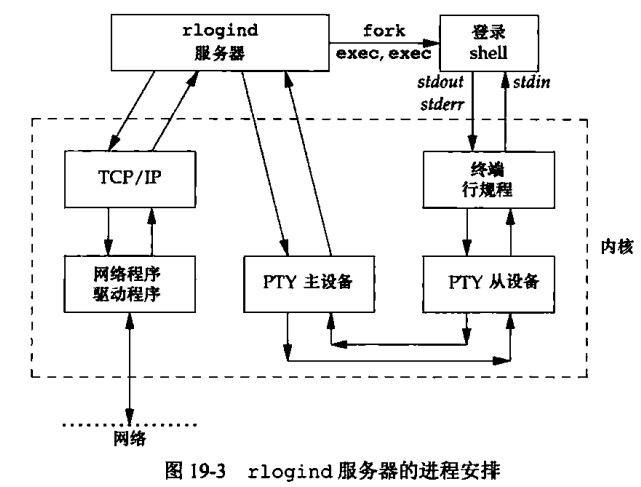
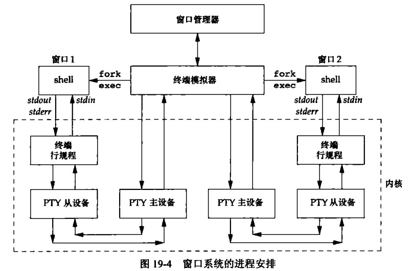

# 第 17 章 伪终端

## 伪终端

当你在 Linux 系统上打开一个终端窗口时，你会看到一个命令提示符，你可以在这个提示符下输入命令并执行它们。在 Linux 中，终端窗口与终端设备相关联，并且由一个伪终端（pseudo-terminal，简称 pty）控制。

伪终端是一种在进程间通信中使用的特殊设备，用于模拟一个真实的终端设备。在 Unix/Linux 系统中，伪终端通常由一个 master 端和一个 slave 端组成。Master 端连接到一个应用程序，而 Slave 端则连接到一个终端窗口。当用户在终端窗口中输入命令时，Slave 端会将输入数据发送到 Master 端，Master 端再将数据发送到应用程序中进行处理。应用程序处理完毕后，Master 端将结果发送回 Slave 端，Slave 端再将结果显示在终端窗口中。

伪终端在很多情况下都很有用，比如在远程登录、虚拟终端、串口通信等场景下。在 Linux 系统编程中，我们可以使用伪终端来实现进程间通信，或者在程序中创建一个虚拟终端窗口。

在使用伪终端进行进程间通信时，我们可以使用管道（pipe）来将 Master 端和 Slave 端连接起来。管道是一种进程间通信的方式，它可以在两个进程之间传递数据。在使用伪终端时，我们需要创建一个管道，并将 Master 端的标准输入（stdin）和标准输出（stdout）重定向到管道的读写端，Slave 端的标准输入和标准输出也需要做相应的重定向。这样，在 Master 端和 Slave 端之间就可以通过管道进行数据交换了。

### 概述

伪终端是指，对于一个应用程序而言，它看上去像一个终端，但事实上它并不是一个真正的终端

```cpp
             fork
    用户进程------>用户进程
       /|\   exec   /|\
        |            |  stdin,stdout,stderr
       \|/          \|/
    -----------------------------------
 |   读、写函数     读写函数              |
 |     |   /|\       |   /|\            |
 |     |    |        |    |             |
 |     |    |        |    |             |
 |    \|/  \|/      \|/   |             |
 |   伪终端主设备    终端行规程           | 内核
 |     |    |        |    |             |
 |     |    |       伪终端从设备         |
 |    \|/   |--------|     |            |
 |     |-------------------|            |
 |                                      |
 |                                      |
 ----------------------------------- ---
```

rlogind 服务器的进程安排



窗口系统的进程安排



### 打开伪终端设备

伪终端设备是为了解决在一些特殊场景下，需要进行远程登录和数据传输的问题。在传统的终端模式下，只能通过物理终端进行输入和输出操作。但是，在一些场景下，比如需要进行远程登录或在进程间进行通信时，物理终端无法满足需求。此时，就需要一种虚拟的终端设备，来模拟物理终端的输入输出行为。这就是伪终端设备的作用。

伪终端设备有两个设备文件，一个是 Master 设备，另一个是 Slave 设备。Master 设备模拟了物理终端，可以接受用户输入，并将输入数据传输到 Slave 设备中。Slave 设备可以模拟远程终端，接受来自 Master 设备的输入，并将数据传输到相应的程序中。

伪终端设备在进程间通信、远程登录和数据传输等方面都有广泛的应用。比如，我们可以使用伪终端设备来实现 SSH 和 Telnet 等远程登录协议，还可以在编写一些网络程序时使用伪终端设备进行进程间通信，以及在编写一些 Shell 脚本时使用伪终端设备来模拟用户的输入。

#### posix_openpt

posix_openpt 函数是一个 POSIX 标准的函数，用于打开一个伪终端设备的主设备文件，也就是 Master 设备。该函数定义在 fcntl.h 头文件中。

```cpp
#include <stdlib.h>
#include <fcntl.h>
int posix_openpt(int flags);
```

参数 flags 指定了打开伪终端设备的方式，可以是以下三种值之一：

O_RDWR：以读写方式打开伪终端设备。  
O_RDONLY：以只读方式打开伪终端设备。  
O_WRONLY：以只写方式打开伪终端设备。  
函数返回值是一个非负整数，表示打开的文件描述符。如果返回值为负数，则表示出现了错误，错误码可以通过 errno 变量获取。

样例

```cpp
#include <iostream>
#include <cstdlib>
#include <fcntl.h>
#include <cstring>
#include <errno.h>
using namespace std;

int main(int argc, char **argv)
{
    if (-1 == posix_openpt(O_RDWR))
    {
        cerr << strerror(errno) << endl;
        exit(EXIT_FAILURE);
    }
    else
    {
        cout << "open pty successful" << endl;
    }
    return 0;
}
```

#### grantpt

grantpt() 是一个用于在伪终端设备上设置访问权限的函数。伪终端是一种虚拟设备，可以用于模拟终端的行为，例如在一个程序中打开一个伪终端设备作为其标准输入或输出。grantpt() 函数会将伪终端的主设备号设置为当前进程的有效用户 ID，并将访问权限设置为可读写模式。这使得进程可以打开并使用伪终端设备。

```cpp
//grant access to the slave pseudoterminal
#include <stdlib.h>
int grantpt(int fd);
```

参数 fd 是打开的伪终端从设备的文件描述符。如果成功，函数返回 0。否则，返回-1，并设置 errno 来指示错误原因。

#### unlockpt

unlockpt() 是一个用于解锁伪终端从设备的函数。在使用伪终端设备之前，必须先解锁伪终端从设备，以便可以打开并使用它。当调用 unlockpt() 函数时，伪终端的从设备将被解锁并准备好供其他进程使用。

```cpp
#include <stdlib.h>
int unlockpt(int fd);
```

参数 fd 是打开的伪终端从设备的文件描述符。如果成功，函数返回 0。否则，返回-1，并设置 errno 来指示错误原因。

一般情况下，grantpt() 和 unlockpt() 两个函数会被一起使用。先使用 grantpt() 来设置伪终端主设备的访问权限，然后再使用 unlockpt() 来解锁伪终端从设备，最后使用打开的伪终端从设备文件描述符进行输入和输出。

样例

```cpp
#include <iostream>
#include <cstdlib>
#include <fcntl.h>
#include <cstring>
#include <errno.h>
#include <unistd.h>
using namespace std;

int main(int argc, char **argv)
{
    int fd;
    if ((fd = posix_openpt(O_RDWR)) == -1)
    {
        cerr << strerror(errno) << endl;
        exit(EXIT_FAILURE);
    }
    else
    {
        cout << "open pty successful" << endl;
    }
    grantpt(fd);
    unlockpt(fd);//解锁从设备
    return 0;
}
```

#### ptsname

ptsname() 是一个用于获取伪终端从设备名的函数。在打开伪终端设备后，可以使用 ptsname() 函数来获取从设备的路径名，然后使用这个路径名来打开从设备并进行读写操作。

```cpp
#include <stdlib.h>
char *ptsname(int fd);
int ptsname_r(int fd, char *buf, size_t buflen);
```

参数 fd 是已打开的伪终端主设备的文件描述符。如果成功，函数返回从设备的路径名，否则返回 NULL，并设置 errno 来指示错误原因。

请注意，ptsname() 函数返回的路径名只在当前进程的上下文中有效。如果需要在另一个进程中打开从设备，必须使用 ioctl() 系统调用来获取从设备的路径名。

样例

```cpp
#include <iostream>
#include <cstdlib>
#include <fcntl.h>
#include <cstring>
#include <errno.h>
#include <unistd.h>
using namespace std;

int main(int argc, char **argv)
{
    int fd;
    if ((fd = posix_openpt(O_RDWR)) == -1)
    {
        cerr << strerror(errno) << endl;
        exit(EXIT_FAILURE);
    }
    else
    {
        cout << "open pty successful" << endl; // open pty successful
    }
    grantpt(fd);
    unlockpt(fd);
    cout << ptsname(fd) << endl; /// dev/pts/6 从设备名
    return 0;
}
```

### 关于伪终端属性设置

仍旧使用上一章节的相关函数进行设置

### pty fork

父子进程伪终端样例

```cpp
#include <iostream>
#include <cstdlib>
#include <fcntl.h>
#include <cstring>
#include <errno.h>
#include <unistd.h>
#include <sys/types.h>
#include <sys/wait.h>
using namespace std;

int main(int argc, char **argv)
{
    int fdm;
    if ((fdm = posix_openpt(O_RDWR)) == -1)
    {
        cerr << strerror(errno) << endl;
        exit(EXIT_FAILURE);
    }
    else
    {
        cout << "open pty successful" << endl; // open pty successful
    }
    grantpt(fdm);
    unlockpt(fdm);
    char sname[20] = {0};
    ptsname_r(fdm, sname, 20);
    int pid;
    if ((pid = fork()) < 0)
    {
        close(fdm);
        exit(1);
    }
    else if (pid == 0)
    { // 子进程
        // 打开从设备
        int fds;
        if ((fds = open(sname, O_RDWR)) == -1)
        {
            exit(1);
        }
        if (dup2(fds, STDIN_FILENO) < 0)
        {
            exit(1);
        }
        if (dup2(fds, STDOUT_FILENO) < 0)
        {
            exit(1);
        }
        if (dup2(fds, STDERR_FILENO) < 0)
        {
            exit(1);
        }
        /*在下面编程完全可以忽略什么伪终端 正常的使用输入输出即可 标准输入输出已经由伪终端接管了*/
        cout << "hello world" << endl;
        exit(0);
    }
    // 父进程
    char buffer[1024];
    int len = read(fdm, buffer, 1024);
    if (len > 0)
    {
        cout << buffer;
    }
    int ret_pid = wait(nullptr);
    return 0;
}
/*
程序输出
open pty successful
hello world
*/
```

### 高级特性

- 打包模式：能够使 PTY 主设备了解到 PTY 从设备的状态变化
- 远程模式：PTY 主设备可以用 TIOCREMOTE ioctl 命令将 PTY 从设备设置为远程模式。当 PTY 主设备将 PTY 从设备设置成远程模式时，它通知 PTY 从设备上的行规程模块对从主设备接收到的任何数据都不进行任何处理。不管从设备 termios 结构中的规范或非规范标识是什么，都是这样。
- 窗口大小变化：PTY 主设备上的进程可以用 TIOCSWINSZ ioctl 命令来设置从设备的窗口大小，如果新的大小和当前大小不同，SIGWINCH 信号将被发送到 PTY 从设备的前台进程组。
- 信号发生：读、写 PTY 主设备的进程可以向 PTY 从设备的进程组发送信号

### 总结

看得懂看不懂，总之都有有些收获。温故而知新，在实践中磨炼成长。
