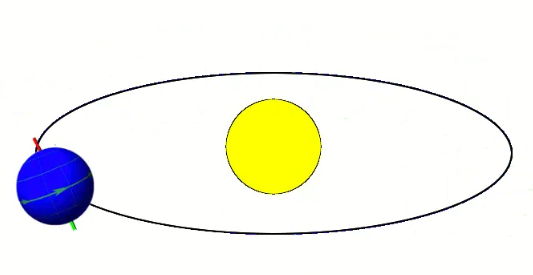

# 😎 正确认识时间

### 正确认识时间

推荐来自知乎大佬的文章 https://zhuanlan.zhihu.com/p/345516942

日期、时间的处理是平时开发中非常常见的场景，若只是简单的格式化场景那就还好，一旦涉及到时区、跨地域跨时区时间转换场景， 甚至当还有GMT时间、UTC时间等一堆概念堆上来的时候，总是心理发虚，招架不住。

跨国企业、跨国生意的公司越来越多，程序员遇到不同时区之间的日期、时间转换、显示的概率大大增加。 如电商平台商品下单时间，给国内用户显示北京时间是没问题，但总不能给美国人展示北京时间。

#### GMT:格林威治时间

格林威治(也称格林尼治)时间，也叫世界时(Universal Time),也叫世界标准时间，是指位于英国伦敦郊区的皇家格林尼治天文台的标准时间， 是本初子午线上的地方时，是0时区的区时。

<figure><figcaption><p>本初子午线</p></figcaption></figure>

中国统一用的北京时间是位于东8区(+8)与标准时间相差8小时。\
如果GMT(英国伦敦的格林威治)现在是上午11点，那么中国北京时间现在就是11+8=19点(下午7点)。

```bash
北京时间 = GMT时间 + 8小时
```

公式再抽象下，可以表示为

```bash
本地时间 = GMT时间 + 时区差N
```

北京位于东8区，则时区差`N=+8`,美国纽约位于西五区，则时区差`N=-5`,这么算，北京时间为晚上23点，美国纽约时间就是当天上午10点`(23-8-5=10)。`

#### 凭什么用GMT作标准时间

19世纪开始，世界各国来往开始频繁，而欧洲大陆、美洲大陆和亚洲大陆都有各自的时区，为提高沟通效率避免混乱，各国的代表1884年在美国华盛顿召开了国际大会，选出英国伦敦的格林威治作为全球时间的中心点，并由它负责维护和计算，从1924年开始，格林威治天文台每小时就会向全世界播报时间（截止到1979年）。

其实选择英国格林威治最主要原因是：当时大部分的船只都已经以格林威治子午线做为参考标准，毕竟曾经的英国可是日不落帝国，大航海时代末便开始称霸世界，拳头里面出政权。

格林威治天文台在计时领域的权威是非常大的，譬如离我们最近的一次“时间风波”：在即将跨世纪的时候，世界各国对21世纪到底应该从2000年开始还是从2001年开始争论不休，最终还是格林威治天文台出面平息了争论，开新闻发布会宣布21世纪始于2001年。

#### 地球自转

地球绕自转轴自西向东的转动（太阳东起西落），所以东时区的人会比西时区的人早一些看到太阳，从而时间上会早一点。有一点很明显，北京天亮时新疆西藏地区还是黑夜。

<figure><figcaption><p>地球自转</p></figcaption></figure>

以本初子午线为中心，按照地球自转方向，每隔经度15划分一个时区，全球则划分为24个时区:东1区至东12区，西1区至西12区，其中东12区西12区跨度都是7.5也叫半时区，GMT所在区称为中时区。

<figure><figcaption><p>世界时区表</p></figcaption></figure>

#### 中国有哪几个时区

1个，这是一个错得比较合理的答案。合理是因为中国虽然幅员辽阔，但全国使用统一的北京时间，所以很容易被误以为只有一个时区。错是因为拍脑袋想一想就知道，中国东西横跨5000+公里，怎么可能只躺在一个时区呢？正确答案是：中国大陆共横跨5个时区，没错，仅就因为北京在东八区，即使地图上只有弹丸大小，但就是这么豪横。

中国用统一时间在沟通上确实方便得多，减少了很多不必要的麻烦。但是也带来一些“小问题”，比如新疆的朋友（位于东5/6区）实际比东八区的北京时间晚了 2-3个小时，我们正常7点天黑准备吃完饭的时候，新疆那边还太阳当空照呢，还蛮有意思的。

#### 美国有哪几个时区

说到时区，就不得不提及计划再次伟大的美国了。美国同样的幅员辽阔，横跨了4个时区：

<figure><figcaption><p>美国时区</p></figcaption></figure>

如图所示共有四个时区时间，按照图中颜色划分开（并非严格划分，不然出现同一小区隔壁时间比你晚1小时就尴尬了），从右到左依次为：

1. 东部时区（ET）：西5区，代表城市：华盛顿特区、纽约、迈阿密等，也称纽约时间。北京时间 = ET + 13h。
2. 中部时区（CT）：西6区，代表城市：芝加哥、休斯顿等。北京时间 = CT + 14h。
3. 山地时区（MT）：西7区，代表城市：丹佛、凤凰城等。北京时间 = MT + 15h。
4. 太平洋时区（PST）：西8区，代表城市：洛杉矶、拉斯维加斯、西雅图等。北京时间 = PST + 16h。

#### GMT和HTTP协议

Http 1.1协议对日期时间传输格式是有严格规定的，支持如下三种格式：

```bash
RFC 822,updated by RFC 1123
    Sun, 06 Nov 1994 08:49:37 GMT
RFC 850, obsoleted by RFC 1036
    Sunday, 06-Nov-94 08:49:37 GMT
ANSI C's asctime() format
    Sun Nov 6 08:49:37 1994
```

其中第一种格式是互联网传输的标准格式，也是现行的标准。2、3种纯是为了兼容Http 1.0而设计，现在基本已经淘汰没人再会使用，所以事实上的格式只有第一种这1种，作为一个有经验的程序员对这种格式应该不陌生。

所有HTTP日期/时间戳都必须用格林威治标准时间(GMT)表示，没有例外。对于HTTP来说，GMT完全等于UTC(协调世界时)。

#### UTC世界标准时间

Coordinated Universal Time直译为 世界协调时间。它是以原子时作为计量单位的时间，计算结果极其严谨和精密。它比GMT时间更来得精准，误差值必须保持在0.9秒以内，倘若大于0.9秒就会通过闰秒来“解决”。

原子时：物质的原子内部发射的电磁振荡频率为基准的时间计量系统。美国的物理实验市在2014年造出了人类历史上最精确的原子钟，50亿年误差1s，可谓相当靠谱了。中国的铯原子钟也能确保2000万年误差不超过1s。

大事记：1979年12月初内瓦举行的世界无线电行政大会通过决议，确定用“世界协调时间（UTC时间）”取代“格林威治时间（GMT时间）”，作为无线电通信领域内的国际标准时间。

#### UTC与GMT区别

GMT：老的时间计量标准，根据地球的自转和公转来计算时间的，自转一圈是一天，公转一圈是一年。但是呢，地球公转的轨道是椭圆形的：

<figure><figcaption><p>地球公转</p></figcaption></figure>

并且后来人们发现地球的自转时间也并不是恒定的，这么一来就会造成有一天时间长一些，有一天时间短一些的情况，误差较大给人感觉时间不那么“精准”了，因此迫切需要一个更加精准的方案来计时，UTC诞生了。

UTC：1967年人类制作出原子钟，从而“发明”了UTC时间正式投入使用。它是真正意义上的标准时间，以原子钟所定义的秒长为基础，UTC时间认为一个太阳日（一天）总是恒定的86400秒（24小时）。

UTC是协调时间，含义为：一切以我为基准，全部想我看齐。所以称它为世界标准时间是没毛病的，而把GMT称作格林威治当地时间更为合适（也叫旧的标准时间）。

#### UTC和GMT的联系

由于在大多数情况下，UTC时间能与GMT时间互换。对此很多同学就丈二和尚摸不着头脑了，他俩这不就一样的吗？

由于在大多数情况下，UTC时间能与GMT时间互换。对此很多同学就丈二和尚摸不着头脑了，他俩这不就一样的吗？

其实非也。这里用通俗易懂的一句话来告知它俩的联系：UTC是标准时间参照，像GMT（格林威治时间）、ET（美国东部时间）、PST（太平洋时间）、CST（北京时间）等等都是具体的时区时间。GMT能和UTC直接转换，仅仅是因为碰巧GMT是0时区时间，数值上刚好和UTC是相等的（不需要精确到秒的情况下，二者可以视为相等），看起来一样，但是概念含义上请务必区分开来哈。

#### UTC与偏移量

在日常生活中，我们所使用的时间肯定是本地时间。在只有GMT的时候，本地时间是通过时区计算出来的，而现在UTC才是标准参考，因此采用UTC和偏移量（Offset）的方式来表示本地时间：

```bash
本地时间 = UTC标准时间 + 偏移量
```

这个偏移量可表示为：UTC -或UTC +，后面接小时数,分钟数。如：UTC +9:30表示澳大利亚中央标准时间，UTC +8表示中国标准时间。偏移量常见的表示形式有：±\[hh]:\[mm]、±\[hh]\[mm]、±\[hh]这三种方式均可

举个例子：现在UTC时间是10:30z（z表示偏移量=0），那么北京时间现在若是1630 +0800（下午4点半），对应的纽约时间就是0530 -0500（早上5点半）

> 注意：在UTC的世界里并无时区的概念，而是偏移量（时间点跟上偏移量才是一个正规的UTC时间），它和时区并无直接关系

可以看到偏移量可以精确到分钟级别控制，非常精细化。全球只有24个时区（只能精确到小时），但偏移量有“无数个”。当然喽为了方便沟通，时间日期联盟组织把世界主要国家/城市的偏移量汇总起来且都给取了个Time zone name名称用于沟通，共好几百个，可以看

https://www.timeanddate.com/time/zones/

中国的就是

```
CST	| China Standard Time | Asia | UTC +8
```

#### CST

CST这个缩写比较尴尬的是它可以同时代表四个不同的时间：

* CST (China Standard Time) ：中国标准时间 UTC+8:00
* Central Standard Time (USA) UTC-6:00
* Central Standard Time (Australia) UTC+9:30
* Cuba Standard Time UTC-4:00

CST到底啥意思就看如何翻译喽，所以需要根据上下文语境自行抉择哈。

#### ISO

在时间日期上它全称是ISO 8601，是一种日期/时间表示方法的规范。规定了一种明确的、国际上都能理解的日历和时钟格式。

这一ISO标准有助于消除各种日-日惯例、文化和时区对全球业务产生的影响。它提供了一种显示日期和时间的方式，这种方式是明确定义的，对人和机器都是可以理解的。当日期用数字表示时，它们可以以不同的方式进行解释。例如，01/05/12可以表示2012年1月5日或2012年5月1日。在个人层面上，这种不确定性可能非常令人沮丧，在商业环境中，它可能非常昂贵。在日期不明确的情况下，组织会议和交付、书写合同和购买机票都是非常困难的。

ISO 8601通过制定一种国际公认的日期表示方式来解决这种不确定性：YYYY-MM-DD。例如 September 27, 2012就会被表示为2012-09-27。

很多开发语言内置了一些常用的ISO标准日期/时间格式.

#### 夏令时

DST（Daylight Saving Time），夏令时又称夏季时间（可没有冬令时哦）。它是为节约能源而人为规定地方时间的制度（鼓励人们早睡早起，不要浪费电，夏天日照时间长尽量多用自然资源），全球约40%的国家在夏季使用夏令时，其他国家则全年只使用标准时间。正在使用夏令时的代表国家：美国、欧盟、俄罗斯等等。

每年的夏令时时间段还不一样（一般在3月的第2个周日开始），比如美国2020年夏令时时间是：2020年3月8日 - 2020年11月1日。具体做法是：在3.8号这天将时钟往前拨拨1个小时，11.1号这天还原回来。

中国在1986 - 1992年短暂搞过一段时间，但太麻烦就“废弃”了

大事记：目前全世界有近110个国家每年要实行夏令时。 自2011年3月27日开始俄罗斯永久使用夏令时，把时间拨快一小时，不再调回。 但是在2014年俄罗斯又拨慢一小时，并称永久不再进行夏令时调整，永久冬令时。还真挺扯淡的。

#### 时间戳

现实生活的世界里，时间是不断向前的，如果向前追溯时间的起点，可能是宇宙出生时，又或是是宇宙出现之前，但肯定是我们目前无法找到的，我们不知道现在距离时间原点的精确距离。所以我们要表示时间， 就需要人为定义一个原点。它就是：格林威治时间(GMT)1970年1月1日的午夜0点0分0秒。

时间戳一般指的UNIX时间，或类UNIX系统（比如Linux、MacOS等）使用的时间表示方式。定义为：从UTC时间的1970-1-1 0:0:0起到现在的总秒数（秒是毫秒、微妙、纳秒的总称）。

但是不可忽略的一个case：由于闰秒的存在，那么当闰秒发生时，就极有可能出现同一个时间戳表示两个时刻的情况（类似时钟回拨），而且闰秒还没规律所以无法程序式的避免，怎么破？

这个时候就需要一种专门的对时协议来保证了，它就是：网络时间协议。

#### 网络时间协议NTP

网络时间协议 Network Time Protocol（NTP）是用来使计算机时间同步化的一种协议，它可以使计算机对其服务器或时钟源（如石英钟，GPS等等)做同步化，它可以提供高精准度的时间校正（LAN上与标准间差小于1毫秒，WAN上几十毫秒），且可介由加密确认的方式来防止恶毒的协议攻击。

NTP的目的是在无序的Internet环境中提供精确和健壮的时间服务，各大操作系统（windows/Linux）对NTP都有实现。

简单地讲呢，GMT格林威治时间可认为是以前的标准时间，而UTC时间是现在在使用的世界时间标准；时区是以本初子午线为中心来划分的，东为正西为负，本处子午线就位于英国伦敦的格林威治；夏令时是地方的时间制度（并非全球标准），施行夏令时的地方，每年有2天很特殊，即一天只有23个小时，另一天则有25个小时。
